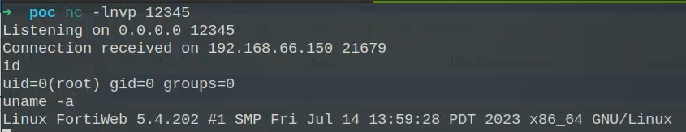

#  【已复现】Fortinet FortiWeb存在SQL注入漏洞（CVE-2025-25257）  

<!-- article-review:devices:begin -->
## 技术校订与证据边界（2026-10-02）

- 产品/组件：FortiWeb
- 本文讨论：CVE-2025-25257
- 版本、权限与配置前提：预认证SQL；7.0≤.10/7.2≤.10/7.4≤.7/7.6≤.3及对应修复
- 资料类型：厂商研究机构通告；本次仅核对归档正文，未执行 PoC、未请求目标，未把原作者的“复现成功”继承为本库验证结果

### 逐项校订

- 已复现仅机构声明/截图，无请求或复现实验配置，应归通告而非完整PoC
- 评分9.8与104的9.6来源差异需保留评分机构而非强改
- 编号DM-202502与7月发布需核验是否内部编号格式，非直接判错

### 操作风险与恢复

- 本篇未提供足以确认无副作用的完整验证流程；应依正文所述配置、权限与交互前提评估，不能把通告或截图当成可直接运行的检测脚本

### 待核与来源

- 截图实验与评分归属待核验
- 引用图片未查看，截图内容及有效性待核验
- 文内原始链接和图片引用继续保留；未检查图片像素、未下载或执行外部附件。版本边界、修复/在野状态及厂商归属若缺一手依据，均不能视为本次已确认
- 下方保留原技术正文与载荷；其中历史时间表述和成功主张应按本节限定阅读
<!-- article-review:devices:end -->

安恒研究院  安恒信息CERT   2025-07-15 11:20  
  
  
  
<table><tbody><tr style="-webkit-tap-highlight-color:transparent;"><td colspan="4" data-colwidth="100.0000%" width="100.0000%" style="-webkit-tap-highlight-color:transparent;word-break:break-all;hyphens:auto;border-color:#4577da;background-color:#4577da;"><section style="-webkit-tap-highlight-color:transparent;margin:5px 0px;"><section style="-webkit-tap-highlight-color:transparent;margin-top:0px;margin-right:0px;margin-bottom:unset;margin-left:0px;padding:0px 5px;font-size:14px;color:rgb(255, 255, 255);box-sizing:border-box;">
<strong style="-webkit-tap-highlight-color:transparent;">漏洞概述</strong>
</section></section></td></tr><tr style="-webkit-tap-highlight-color:transparent;"><td data-colwidth="25.0000%" width="25.0000%" style="-webkit-tap-highlight-color:transparent;word-break:break-all;hyphens:auto;border-color:#4577da;"><section style="-webkit-tap-highlight-color:transparent;margin:5px 0px;"><section style="-webkit-tap-highlight-color:transparent;margin-top:0px;margin-right:0px;margin-bottom:unset;margin-left:0px;padding:0px 5px;font-size:14px;box-sizing:border-box;">
<strong style="-webkit-tap-highlight-color:transparent;">漏洞名称</strong>
</section></section></td><td colspan="3" data-colwidth="75.0000%" width="75.0000%" style="-webkit-tap-highlight-color:transparent;word-break:break-all;hyphens:auto;border-color:#4577da;"><section style="-webkit-tap-highlight-color:transparent;margin:5px 0px;"><section style="-webkit-tap-highlight-color:transparent;margin-top:0px;margin-right:0px;margin-bottom:unset;margin-left:0px;padding:0px 5px;font-size:14px;box-sizing:border-box;">
Fortinet FortiWeb存在SQL注入漏洞（CVE-2025-25257）
</section></section></td></tr><tr style="-webkit-tap-highlight-color:transparent;"><td data-colwidth="25.0000%" width="25.0000%" style="-webkit-tap-highlight-color:transparent;word-break:break-all;hyphens:auto;border-color:#4577da;"><section style="-webkit-tap-highlight-color:transparent;margin:5px 0px;"><section style="-webkit-tap-highlight-color:transparent;margin-top:0px;margin-right:0px;margin-bottom:unset;margin-left:0px;padding:0px 5px;font-size:14px;box-sizing:border-box;">
<strong style="-webkit-tap-highlight-color:transparent;">安恒CERT评级</strong>
</section></section></td><td data-colwidth="25.0000%" width="25.0000%" style="-webkit-tap-highlight-color:transparent;word-break:break-all;hyphens:auto;border-color:#4577da;"><section style="-webkit-tap-highlight-color:transparent;margin:5px 0px;"><section style="-webkit-tap-highlight-color:transparent;margin-top:0px;margin-right:0px;margin-bottom:unset;margin-left:0px;padding:0px 5px;font-size:14px;box-sizing:border-box;">
1级
</section></section></td><td data-colwidth="25.0000%" width="25.0000%" style="-webkit-tap-highlight-color:transparent;word-break:break-all;hyphens:auto;border-color:#4577da;"><section style="-webkit-tap-highlight-color:transparent;margin:5px 0px;"><section style="-webkit-tap-highlight-color:transparent;margin-top:0px;margin-right:0px;margin-bottom:unset;margin-left:0px;padding:0px 5px;font-size:14px;box-sizing:border-box;">
<strong style="-webkit-tap-highlight-color:transparent;">CVSS3.1评分</strong>
</section></section></td><td data-colwidth="25.0000%" width="25.0000%" style="-webkit-tap-highlight-color:transparent;word-break:break-all;hyphens:auto;border-color:#4577da;"><section style="-webkit-tap-highlight-color:transparent;margin:5px 0px;"><section style="-webkit-tap-highlight-color:transparent;margin-top:0px;margin-right:0px;margin-bottom:unset;margin-left:0px;padding:0px 5px;font-size:14px;box-sizing:border-box;">
9.8
</section></section></td></tr><tr style="-webkit-tap-highlight-color:transparent;"><td data-colwidth="25.0000%" width="25.0000%" style="-webkit-tap-highlight-color:transparent;word-break:break-all;hyphens:auto;border-color:#4577da;"><section style="-webkit-tap-highlight-color:transparent;margin:5px 0px;"><section style="-webkit-tap-highlight-color:transparent;margin-top:0px;margin-right:0px;margin-bottom:unset;margin-left:0px;padding:0px 5px;font-size:14px;box-sizing:border-box;">
<strong style="-webkit-tap-highlight-color:transparent;">CVE编号</strong>
</section></section></td><td data-colwidth="25.0000%" width="25.0000%" style="-webkit-tap-highlight-color:transparent;word-break:break-all;hyphens:auto;border-color:#4577da;"><section style="-webkit-tap-highlight-color:transparent;margin:5px 0px;">
CVE-2025-25257
<section style="-webkit-tap-highlight-color:transparent;margin-top:0px;margin-right:0px;margin-bottom:unset;margin-left:0px;padding:0px 5px;font-size:14px;overflow:hidden;line-height:0;box-sizing:border-box;"> </section></section></td><td data-colwidth="25.0000%" width="25.0000%" style="-webkit-tap-highlight-color:transparent;word-break:break-all;hyphens:auto;border-color:#4577da;"><section style="-webkit-tap-highlight-color:transparent;margin:5px 0px;"><section style="-webkit-tap-highlight-color:transparent;margin-top:0px;margin-right:0px;margin-bottom:unset;margin-left:0px;padding:0px 5px;font-size:14px;box-sizing:border-box;">
<strong style="-webkit-tap-highlight-color:transparent;">CNVD编号</strong>
</section></section></td><td data-colwidth="25.0000%" width="25.0000%" style="-webkit-tap-highlight-color:transparent;word-break:break-all;hyphens:auto;border-color:#4577da;"><section style="-webkit-tap-highlight-color:transparent;margin:5px 0px;"><section style="-webkit-tap-highlight-color:transparent;margin-top:0px;margin-right:0px;margin-bottom:unset;margin-left:0px;padding:0px 5px;font-size:14px;box-sizing:border-box;">
未分配
</section></section></td></tr><tr style="-webkit-tap-highlight-color:transparent;"><td data-colwidth="25.0000%" width="25.0000%" style="-webkit-tap-highlight-color:transparent;word-break:break-all;hyphens:auto;border-color:#4577da;"><section style="-webkit-tap-highlight-color:transparent;margin:5px 0px;"><section style="-webkit-tap-highlight-color:transparent;margin-top:0px;margin-right:0px;margin-bottom:unset;margin-left:0px;padding:0px 5px;font-size:14px;box-sizing:border-box;">
<strong style="-webkit-tap-highlight-color:transparent;">CNNVD编号</strong>
</section></section></td><td data-colwidth="25.0000%" width="25.0000%" style="-webkit-tap-highlight-color:transparent;word-break:break-all;hyphens:auto;border-color:#4577da;"><section style="-webkit-tap-highlight-color:transparent;margin:5px 0px;"><section style="-webkit-tap-highlight-color:transparent;margin-top:0px;margin-right:0px;margin-bottom:unset;margin-left:0px;padding:0px 5px;font-size:14px;box-sizing:border-box;">
未分配
</section></section></td><td data-colwidth="25.0000%" width="25.0000%" style="-webkit-tap-highlight-color:transparent;word-break:break-all;hyphens:auto;border-color:#4577da;"><section style="-webkit-tap-highlight-color:transparent;margin:5px 0px;"><section style="-webkit-tap-highlight-color:transparent;margin-top:0px;margin-right:0px;margin-bottom:unset;margin-left:0px;padding:0px 5px;font-size:14px;box-sizing:border-box;">
<strong style="-webkit-tap-highlight-color:transparent;">安恒CERT编号</strong>
</section></section></td><td data-colwidth="25.0000%" width="25.0000%" style="-webkit-tap-highlight-color:transparent;word-break:break-all;hyphens:auto;border-color:#4577da;"><section style="-webkit-tap-highlight-color:transparent;margin:5px 0px;"><section style="-webkit-tap-highlight-color:transparent;margin-top:0px;margin-right:0px;margin-bottom:unset;margin-left:0px;padding:0px 5px;font-size:14px;box-sizing:border-box;">
DM-202502-000429
</section></section></td></tr><tr style="-webkit-tap-highlight-color:transparent;"><td data-colwidth="25.0000%" width="25.0000%" style="-webkit-tap-highlight-color:transparent;word-break:break-all;hyphens:auto;border-color:#4577da;"><section style="-webkit-tap-highlight-color:transparent;margin:5px 0px;"><section style="-webkit-tap-highlight-color:transparent;margin-top:0px;margin-right:0px;margin-bottom:unset;margin-left:0px;padding:0px 5px;font-size:14px;box-sizing:border-box;">
<strong style="-webkit-tap-highlight-color:transparent;">POC情况</strong>
</section></section></td><td data-colwidth="25.0000%" width="25.0000%" style="-webkit-tap-highlight-color:transparent;word-break:break-all;hyphens:auto;border-color:#4577da;"><section style="-webkit-tap-highlight-color:transparent;margin:5px 0px;"><section style="-webkit-tap-highlight-color:transparent;margin-top:0px;margin-right:0px;margin-bottom:unset;margin-left:0px;padding:0px 5px;font-size:14px;box-sizing:border-box;">
已发现
</section></section></td><td data-colwidth="25.0000%" width="25.0000%" style="-webkit-tap-highlight-color:transparent;word-break:break-all;hyphens:auto;border-color:#4577da;"><section style="-webkit-tap-highlight-color:transparent;margin:5px 0px;"><section style="-webkit-tap-highlight-color:transparent;margin-top:0px;margin-right:0px;margin-bottom:unset;margin-left:0px;padding:0px 5px;font-size:14px;box-sizing:border-box;">
<strong style="-webkit-tap-highlight-color:transparent;">EXP情况</strong>
</section></section></td><td data-colwidth="25.0000%" width="25.0000%" style="-webkit-tap-highlight-color:transparent;word-break:break-all;hyphens:auto;border-color:#4577da;"><section style="-webkit-tap-highlight-color:transparent;margin:5px 0px;"><section style="-webkit-tap-highlight-color:transparent;margin-top:0px;margin-right:0px;margin-bottom:unset;margin-left:0px;padding:0px 5px;font-size:14px;box-sizing:border-box;">
已发现
</section></section></td></tr><tr style="-webkit-tap-highlight-color:transparent;"><td data-colwidth="25.0000%" width="25.0000%" style="-webkit-tap-highlight-color:transparent;word-break:break-all;hyphens:auto;border-color:#4577da;"><section style="-webkit-tap-highlight-color:transparent;margin:5px 0px;"><section style="-webkit-tap-highlight-color:transparent;margin-top:0px;margin-right:0px;margin-bottom:unset;margin-left:0px;padding:0px 5px;font-size:14px;box-sizing:border-box;">
<strong style="-webkit-tap-highlight-color:transparent;">在野利用</strong>
</section></section></td><td data-colwidth="25.0000%" width="25.0000%" style="-webkit-tap-highlight-color:transparent;word-break:break-all;hyphens:auto;border-color:#4577da;"><section style="-webkit-tap-highlight-color:transparent;margin:5px 0px;"><section style="-webkit-tap-highlight-color:transparent;margin-top:0px;margin-right:0px;margin-bottom:unset;margin-left:0px;padding:0px 5px;font-size:14px;box-sizing:border-box;">
未发现
</section></section></td><td data-colwidth="25.0000%" width="25.0000%" style="-webkit-tap-highlight-color:transparent;word-break:break-all;hyphens:auto;border-color:#4577da;"><section style="-webkit-tap-highlight-color:transparent;margin:5px 0px;"><section style="-webkit-tap-highlight-color:transparent;margin-top:0px;margin-right:0px;margin-bottom:unset;margin-left:0px;padding:0px 5px;font-size:14px;box-sizing:border-box;">
<strong style="-webkit-tap-highlight-color:transparent;">研究情况</strong>
</section></section></td><td data-colwidth="25.0000%" width="25.0000%" style="-webkit-tap-highlight-color:transparent;word-break:break-all;hyphens:auto;border-color:#4577da;"><section style="-webkit-tap-highlight-color:transparent;margin:5px 0px;"><section style="-webkit-tap-highlight-color:transparent;margin-top:0px;margin-right:0px;margin-bottom:unset;margin-left:0px;padding:0px 5px;font-size:14px;box-sizing:border-box;">
已复现
</section></section></td></tr><tr style="-webkit-tap-highlight-color:transparent;"><td data-colwidth="25.0000%" width="25.0000%" style="-webkit-tap-highlight-color:transparent;word-break:break-all;hyphens:auto;border-color:#4577da;"><section style="-webkit-tap-highlight-color:transparent;margin:5px 0px;"><section style="-webkit-tap-highlight-color:transparent;margin-top:0px;margin-right:0px;margin-bottom:unset;margin-left:0px;padding:0px 5px;font-size:14px;box-sizing:border-box;">
<strong style="-webkit-tap-highlight-color:transparent;">危害描述</strong>
</section></section></td><td colspan="3" data-colwidth="75.0000%" width="75.0000%" style="-webkit-tap-highlight-color:transparent;word-break:break-all;hyphens:auto;border-color:#4577da;"><section style="-webkit-tap-highlight-color:transparent;margin:5px 0px;"><section style="-webkit-tap-highlight-color:transparent;margin-top:0px;margin-right:0px;margin-bottom:unset;margin-left:0px;padding:0px 5px;font-size:14px;overflow:hidden;line-height:0;box-sizing:border-box;"> </section>
在受影响的版本中，未经身份验证的攻击者可以通过精心设计的HTTP/S请求执行未经授权的SQL命令，对机密性、完整性和可用性造成重大影响。
<section style="-webkit-tap-highlight-color:transparent;margin-top:0px;margin-right:0px;margin-bottom:unset;margin-left:0px;padding:0px 5px;font-size:14px;overflow:hidden;line-height:0;box-sizing:border-box;"> </section></section></td></tr></tbody></table>  
  
该产品主要使用客户行业分布广泛，漏洞危害性高，建议客户尽快做好自查及防护。  
  
**安恒研究院卫兵实验室已复现此漏洞。**  
  
  
  
  
  
**漏洞信息**  
  
  
  
  
Fortinet FortiWeb是Fortinet的Web应用程序防火墙，属于Fortinet安全产品线中的  
重要组成部分  
。  
  
  
**漏洞描述**  
  
**漏洞危害等级：**  
严重  
  
**漏洞类型：**  
SQL注入  
  
  
**影响范围**  
  
**影响版本：**  
  
7.0.0 <= FortiWeb <= 7.0.10  
  
7.2.0 <= FortiWeb <= 7.2.10  
  
7.4.0 <= FortiWeb <= 7.4.7  
  
7.6.0 <= FortiWeb <= 7.6.3  
  
**安全版本：**  
  
FortiWeb 7.0.* >= 7.0.11  
  
FortiWeb 7.2.* >= 7.2.11  
  
FortiWeb 7.4.* >= 7.4.8  
  
FortiWeb 7.6.* >= 7.6.4  
  
  
**CVSS向量**  
  
访问途径（AV）：网络  
  
攻击复杂度（AC）：低  
  
所需权限（PR）：无  
  
用户交互（UI）：无  
  
影响范围 （S）：不变  
  
机密性影响 （C）：高  
  
完整性影响 （l）：高  
  
可用性影响 （A）：高  
  
  
  
**修复方案**  
  
  
  
  
**官方修复方案：**  
  
官方已发布修复方案，受影响的用户建议及时升级至对应安全版本。  
  
  
**参考资料**  
  
  
  
  
  
https://fortiguard.fortinet.com/psirt/FG-IR-25-151  
  
  
  
**技术支持**  
  
  
  
  
如有漏洞相关需求支持请联系400-6059-110获取相关能力支撑。  
  
  

---

> 来源：gelusus/wxvl（微信公众号漏洞文章自动归档，原文见文首链接）
