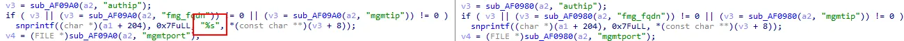

# （CVE-2024-23113）Fortinet FortiOS fgfmd 格式化字符串远程代码执行漏洞

一、漏洞简介
------------

2024 年 2 月 9 日，Fortinet 发布安全公告 FG-IR-24-029，披露 FortiOS
fgfmd 守护进程的格式化字符串漏洞 CVE-2024-23113。watchTowr Labs 通过
补丁对比（patch diff）定位该漏洞并逆向了 FGFM 私有协议，给出完整利用
思路；CISA 将其列入 KEV 目录，确认在野利用。

fgfmd 是 FortiGate 与 FortiManager 之间的管理通信守护进程，监听
**TCP 541（FGFM 协议）**。攻击者**无需认证**，向该端口发送
`request=auth` 且 `authip` 字段携带格式化字符串载荷的特制请求，即可
触发格式化字符串漏洞，进而执行任意命令。CVSS 3.1 评分为 **9.8**。

*上图：公开 PoC 仓库中的利用示意（来源：PoC 作者复现博客，已本地化保存）。*

二、漏洞影响
------------

-   产品：Fortinet FortiOS（FortiGate），另影响 FortiProxy、FortiPAM、
    FortiSwitchManager
-   版本：**FortiOS 7.0.0–7.0.13 / 7.2.0–7.2.6 / 7.4.0–7.4.2**
    （修复版：7.0.14+ / 7.2.7+ / 7.4.3+，以 Fortinet 官方公告为准）
-   组件/攻击向量：远程，fgfmd（TCP 541）FGFM 协议 `authip` 字段
    格式化字符串注入
-   前提条件：无，攻击者无需任何凭证；FGFM 端口需网络可达

三、复现过程
------------

### 漏洞分析

fgfmd 在处理 FGFM 协议认证请求时，将攻击者可控的 `authip` 参数直接
作为格式化字符串函数的格式串使用（CWE-134）。攻击者通过精心构造的
`%n` 写入原语，可实现任意内存写，最终劫持控制流执行任意命令。
watchTowr 的文章《Fortinet FortiGate CVE-2024-23113: A Super Complex
Vulnerability》完整记录了从补丁对比、协议逆向到构造利用的全过程，
是理解该漏洞的首选资料。

### PoC（来源：https://github.com/MinhPham123456789/PoC-CVE-2024-23113，仅限授权测试）

仓库 README 已实际打开验证（HTTP 200）。需要如实说明：**该公开脚本
是检测 PoC，而非完整 RCE exploit**——它基于 TLS 握手行为判断目标
是否满足可利用条件：

    1. 将脚本中 hostname 变量替换为目标 IP
    2. 运行脚本，观察 TLS 报错：
       - 若连接被中断、且报错不是 TLSV1_ALERT_UNKNOWN_CA，则目标可能存在漏洞
       - 若报错为 unknown_ca 且服务端无 certificate_authorities 扩展，则可能存在漏洞
       - 其他情况视为不受影响

完整 RCE 利用需结合 watchTowr 文章中的协议细节自行构造，本条目附
利用链分析；请勿将检测脚本误作武器化 exploit。

四、修复建议
------------

1.  升级到修复版本（7.0.14+ / 7.2.7+ / 7.4.3+）；
2.  在边界防火墙上限制 TCP 541（FGFM）仅允许可信 FortiManager 访问，
    不要暴露在互联网；
3.  排查 fgfmd 日志中的异常 `request=auth` 请求，按 Fortinet 公告的
    IoC 检查是否已被探测或利用。

### 附录

参考链接：

-   Fortinet 公告 FG-IR-24-029：https://www.fortiguard.com/psirt/FG-IR-24-029
-   watchTowr 技术分析：https://labs.watchtowr.com/fortinet-fortigate-cve-2024-23113-a-super-complex-vulnerability-in-a-super-secure-appliance-in-2024/
-   检测 PoC：https://github.com/MinhPham123456789/PoC-CVE-2024-23113
