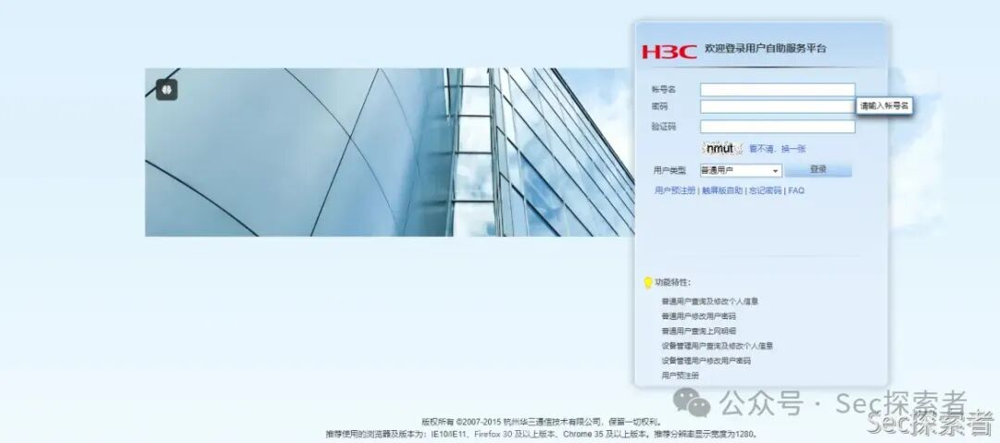
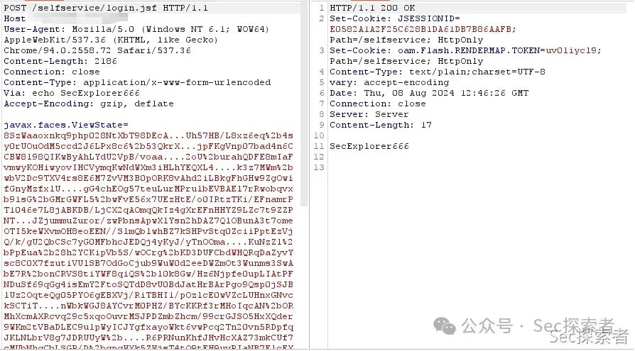
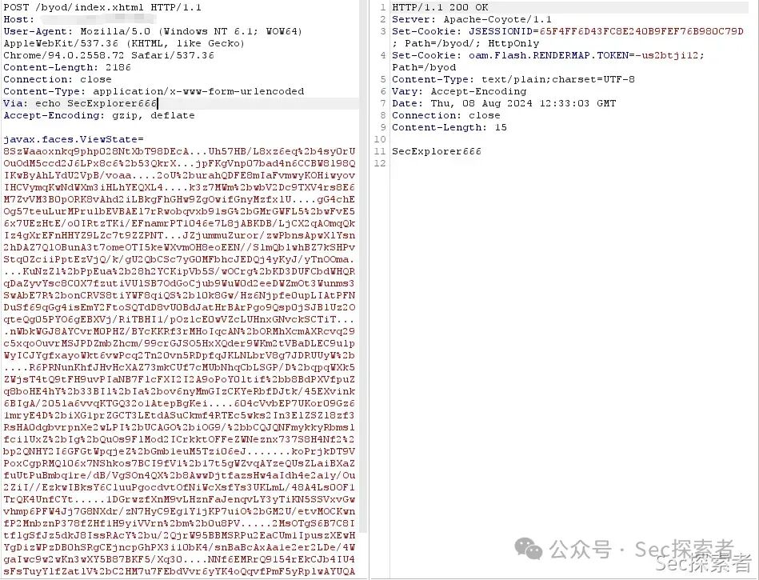
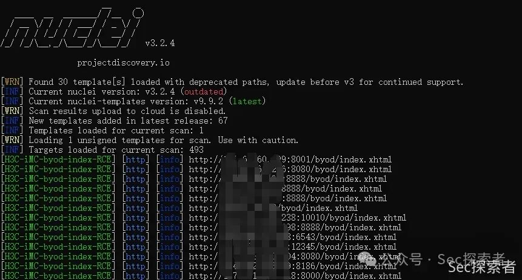
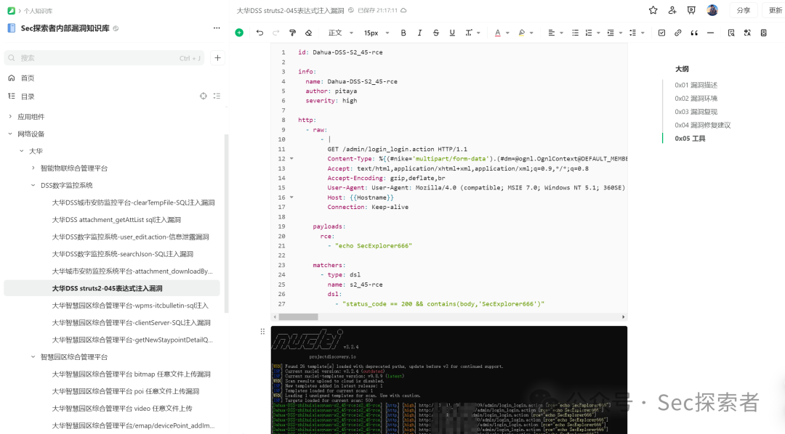
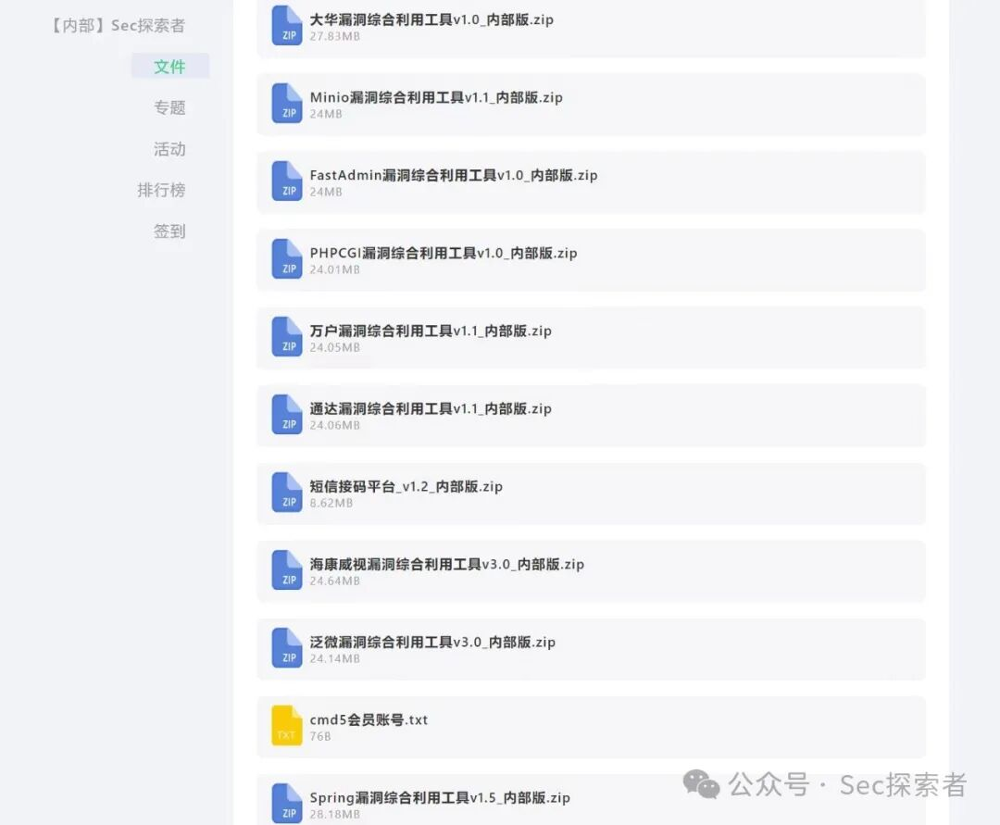
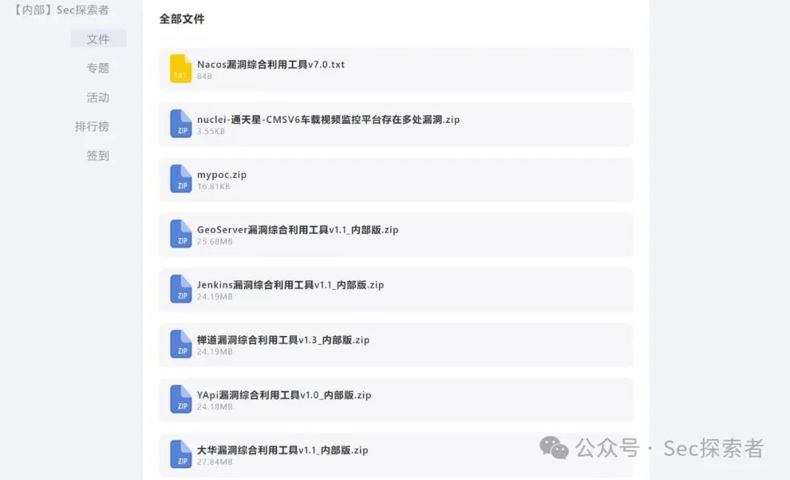

# H3C iMC 智能管理中心 多接口 RCE

> 指纹字段校订（2026-10-04）：按原归档正文的明确平台标签及完整表达式恢复当前查询，旧误填或截取字段逐字保存在 `previous_*`；后文对此旧字段的诊断按当前字段阅读。仅经过本库保守语法与原字面核对，未在线运行查询，不把指纹命中视为漏洞存在。

<!-- article-review:devices:begin -->
## 技术校订与证据边界（2026-10-02）

- 产品/组件：H3C iMC EIA候选
- 本文讨论：selfservice/byod RCE
- 版本、权限与配置前提：声称未认证，无版本
- 资料类型：图片型多入口PoC；本次仅核对归档正文，未执行 PoC、未请求目标，未把原作者的“复现成功”继承为本库验证结果

### 逐项校订

- 完整请求/检测模板均为图片，机制无法由文字确定
- fofa元数据截断；无厂商公告和修复号，推广大量
- 与132同入口，应核验ViewState同源关系，不能当PrimeFaces动态资源同漏洞
- 已落实的文本修订：残缺指纹退出可执行索引并保留原值。上列仍描述旧文问题时，以此落实项及下列限定为准；修订不代表运行验证

### 操作风险与恢复

- 执行文中载荷可能以目标进程权限启动命令或加载代码；权限受认证角色、操作系统账户及依赖版本约束，不能把 root/200 等通用字符串当成功证据

### 待核与来源

- 图片中payload/机制/版本待核验
- 引用图片未查看，截图内容及有效性待核验
- 文内原始链接和图片引用继续保留；未检查图片像素、未下载或执行外部附件。版本边界、修复/在野状态及厂商归属若缺一手依据，均不能视为本次已确认
- 下方保留原技术正文与载荷；其中历史时间表述和成功主张应按本节限定阅读
<!-- article-review:devices:end -->

<meta name="referrer" content="no-referrer"/>

> 本文由 [简悦 SimpRead](http://ksria.com/simpread/) 转码， 原文地址 [mp.weixin.qq.com](https://mp.weixin.qq.com/s/OHmxFRSWgj4QyMS29JoI9Q)

点击蓝字，关注 Sec 探索者，一起探索网络安全技术

  

请勿利用文章内的相关技术从事非法测试，由于传播、利用此文所提供的信息而造成的任何直接或者间接的后果及损失，均由使用者本人负责，作者不为此承担任何责任。如有侵权烦请告知，我们会立即删除并致歉。谢谢！

**01**

**漏洞描述  
**

H3C iMC 智能管理中心 /byod/index.xhtml，

/selfservice/login.jsf

等多个接口处存在远程代码执行漏洞，未经身份攻击者可通过该漏洞在服务器端任意执行代码，写入后门，获取服务器权限，进而控制整个 web 服务器。该漏洞利用难度较低，建议受影响的用户尽快修复。

**02**

**漏洞环境  
**

FOFA 语法：(title="用户自助服务" && body="/selfservice/javax.faces.resource/") || body="/selfservice/index.xhtml"  

**03**

**漏洞复现  
**

1. /selfservice/login.jsf 接口

  

2./byod/index.xhtml 接口

  

**04**

**漏洞修复建议  
**

建议联系厂商进行处理

  

**05**

**nuclei 批量检测  
**

  

**06**

**圈子服务介绍  
**

无论你是新手还是行业老手，我们都致力于为你提供最新、最优质的安全资源和交流平台。立即加入 Sec 探索者专属的内部圈子，与我们一起探索安全领域的无尽可能性！以下是我们圈子为内部成员提供的核心服务：

**1、最新漏洞情报：**提供最新的漏洞情报，第一时间复现和分析互联网暴露的重点高危漏洞，确保大家能第一时间掌握最新的漏洞动态

**2、内部漏洞知识库：**漏洞知识库正在持续建设中，我们将会提供详细的漏洞复现教程和 poc，帮助大家深入理解漏洞的工作原理和利用方式。所有漏洞都是我们自己成功复现才会添加到知识库中，减少大家试错时间成本，我们将收集相对完整的漏洞信息、漏洞描述、分析以及针对每个漏洞的利用方法和防护建议，致力于打造一个全面且专业的漏洞知识库。 

**3、漏洞综合利用工具：**提供多种漏洞利用工具，这些工具经过内部严格测试和大家的反馈，确保其有效性和安全性。无论大家是在进行渗透测试、漏洞验证，还是其他安全研究，这些工具都能为大家提供强有力的支持。

工具持续开发：https://www.yuque.com/charonlight/sec_explorer_tools

  

---

> 来源：MrWQ/vulnerability-paper（https://github.com/MrWQ/vulnerability-paper）
