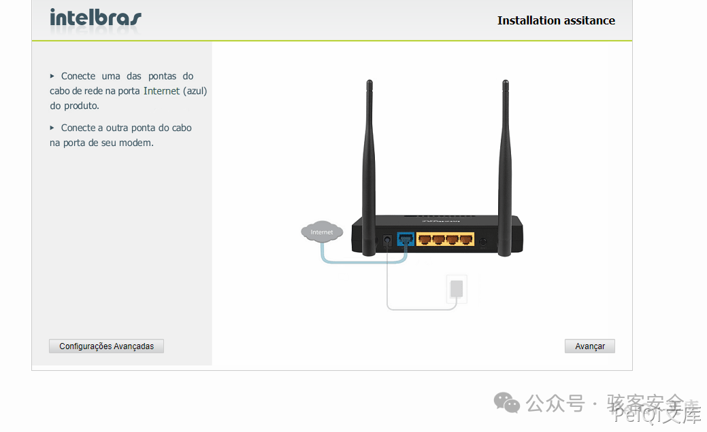
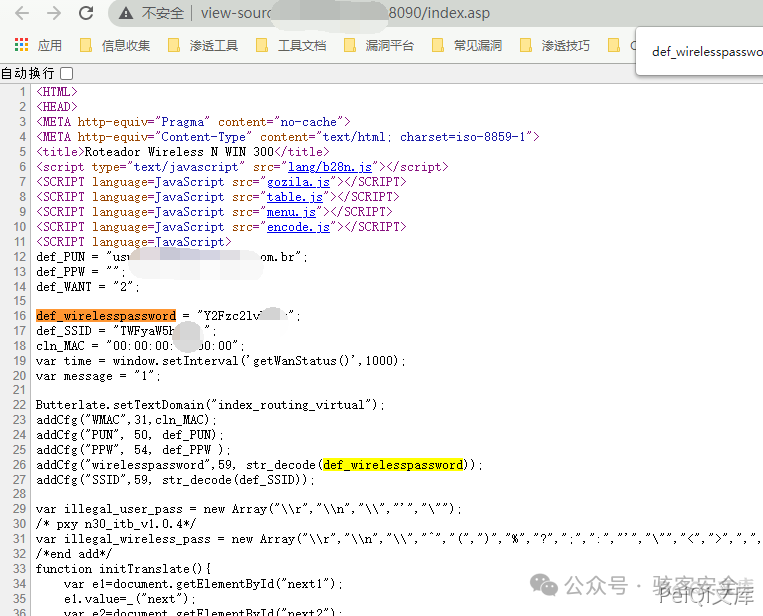
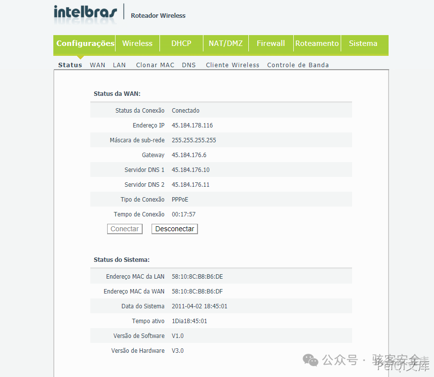

#  Intelbras-Wireless-未授权与密码泄露-CVE-2021-3017   

<!-- article-review:devices:begin -->
## 技术校订与证据边界（2026-10-02）

- 产品/组件：Intelbras WIN300/WRN342（另提IWR3000N）
- 本文讨论：CVE-2021-3017
- 版本、权限与配置前提：2021-01-04以前概括；配置页源代码泄露Wi-Fi密钥
- 资料类型：图片型PoC；本次仅核对归档正文，未执行 PoC、未请求目标，未把原作者的“复现成功”继承为本库验证结果

### 逐项校订

- 公司国别波兰疑误，型号IWR3000N与WIN300/WRN342范围混杂
- 无线密码泄露不能直接推出后台管理权限；配置页是否无需认证未示文本
- 无明确请求路径/固件/原始来源/修复

### 操作风险与恢复

- 本篇未提供足以确认无副作用的完整验证流程；应依正文所述配置、权限与交互前提评估，不能把通告或截图当成可直接运行的检测脚本

### 待核与来源

- 公司与型号、认证条件及截图待核验
- 引用图片未查看，截图内容及有效性待核验
- 文内原始链接和图片引用继续保留；未检查图片像素、未下载或执行外部附件。版本边界、修复/在野状态及厂商归属若缺一手依据，均不能视为本次已确认
- 下方保留原技术正文与载荷；其中历史时间表述和成功主张应按本节限定阅读
<!-- article-review:devices:end -->

原创 骇客安全  骇客安全   2025-03-16 22:05  
  
## 漏洞描述  
  
Intelbras IWR 3000N是波兰Intelbras公司的一款无线路由器。 Intelbras WIN 300 and WRN 342 devices 2021-01-04版本及之前版本存在安全漏洞，该漏洞允许远程攻击者通过读取HTML源代码中的def wireless spassword行来发现凭据。  
  
## 漏洞影响  
```
win_300_firmware 等
```  
  
## FOFA  
```
body="def_wirelesspassword"
```  
  
## 漏洞复现  
  
登录页面如下  
  
  
  
  
  
查看网页源代码，泄露了配置密码  
  
  
  
  
  
测试了一下其他的，发现出现账号密码的原因为访问的是路由的配置页面，配置后获取后台权限  
  
  
  
  
  


---

> 来源：gelusus/wxvl（微信公众号漏洞文章自动归档，原文见文首链接）
