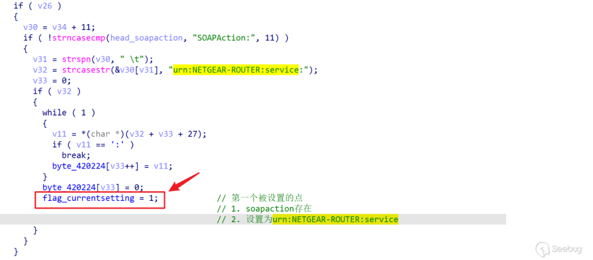
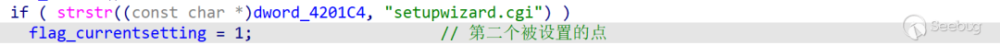
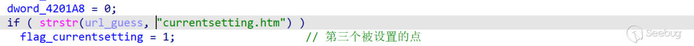
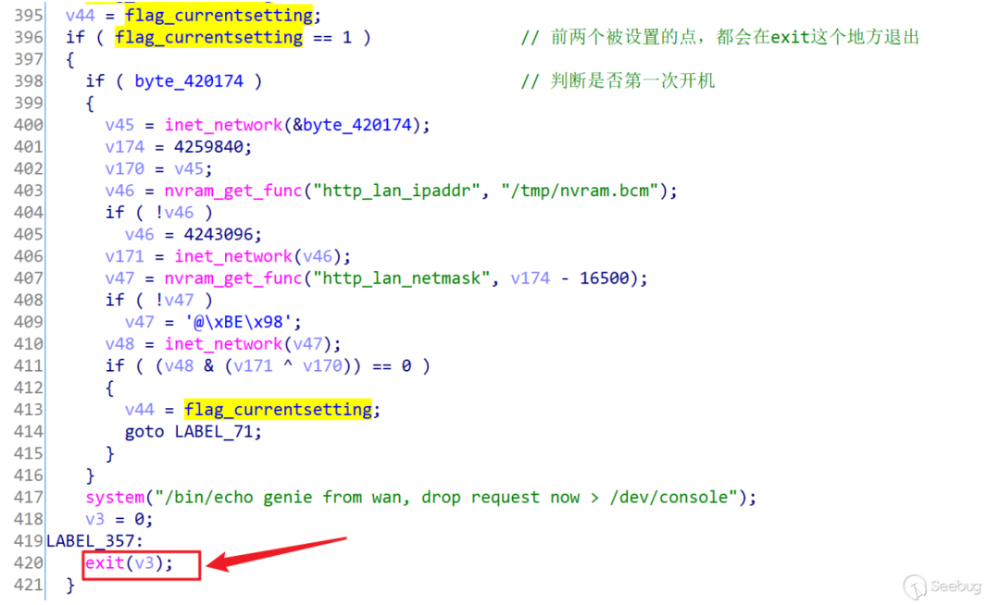
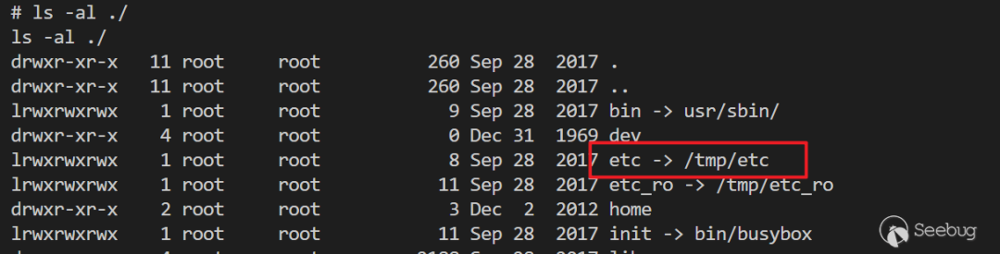
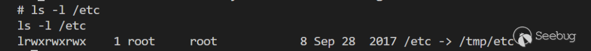
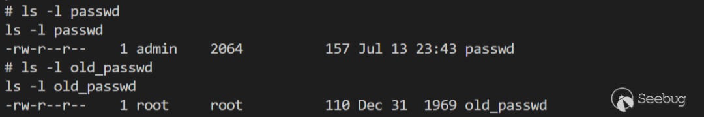
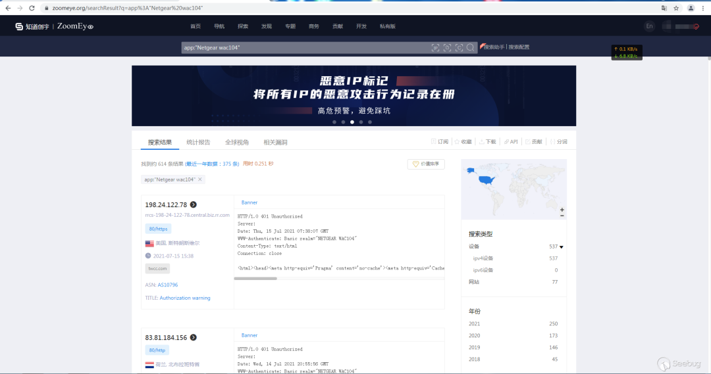
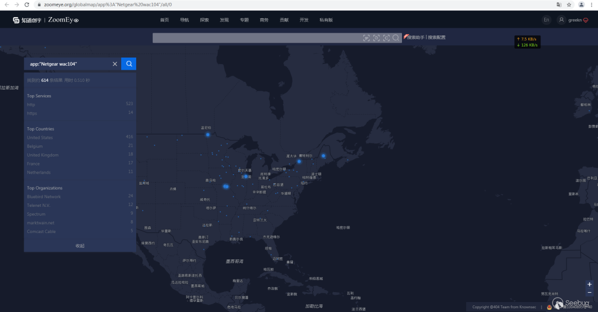

# CVE-2021-35973：Netgear wac104 身份认证绕过

## 编号角色补核（2026-10-04）

本次只确认编号在本文主题中的主编号／引用角色；版本、修复、截图及其他技术主张仍按下方具体待核说明阅读。旧字段和归档正文保持原值，较早的角色待核说明保留为历史记录。

核对依据：[CNA 记录](https://cveawg.mitre.org/api/cve/CVE-2021-35973)。这些记录支持编号／产品对应关系或编号状态，不替代本篇原始出处。

<!-- article-review:devices:begin -->
## 技术校订与证据边界（2026-10-02）

- 产品/组件：NETGEAR WAC104
- 本文讨论：CVE-2021-35973
- 版本、权限与配置前提：URL NUL绕过→setup session0→改密/Telnet→可写目录root；无固件号
- 资料类型：多阶段认证绕过/提权研究；本次仅核对归档正文，未执行 PoC、未请求目标，未把原作者的“复现成功”继承为本库验证结果

### 逐项校订

- cnvd元数据CNVD-2021-30167来自页尾用友NC推荐文，非此漏洞；fofa元数据也是推荐文链接碎片
- 单CVE覆盖多个session/密码/权限问题，需逐漏洞映射
- snprintf占位参数不全、File/fscan为伪代码非可编译C
- 暂无具体影响固件/安全版，真实硬件结论范围未给
- 已落实的文本修订：HTTP 报文围栏改为 http；残缺指纹退出可执行索引并保留原值。上列仍描述旧文问题时，以此落实项及下列限定为准；修订不代表运行验证

### 操作风险与恢复

- 本篇未提供足以确认无副作用的完整验证流程；应依正文所述配置、权限与交互前提评估，不能把通告或截图当成可直接运行的检测脚本

### 待核与来源

- 多阶段是否同CVE、固件与原披露待核验
- 引用图片未查看，截图内容及有效性待核验
- 文内原始链接和图片引用继续保留；未检查图片像素、未下载或执行外部附件。版本边界、修复/在野状态及厂商归属若缺一手依据，均不能视为本次已确认
- 下方保留原技术正文与载荷；其中历史时间表述和成功主张应按本节限定阅读
<!-- article-review:devices:end -->


<meta name="referrer" content="no-referrer"/>

> 本文由 [简悦 SimpRead](http://ksria.com/simpread/) 转码， 原文地址 [mp.weixin.qq.com](https://mp.weixin.qq.com/s/3FRLAHBP1PN97dXDhY0-xQ)


**作者：OneShell@知道创宇 404 实验室  
时间：2021 年 7 月 15 日**

 **0x01 漏洞分析** 

最直观的方式，是先看 POC，得到大概利用思路，再进行静态分析，然后拿真实设备调试（咸鱼）。

### http 认证绕过

使用的后端是 mini_httpd，一个小型的嵌入式后端服务器，常见的还有 lighthttpd、httpd 等等，或者直接通过一些脚本例如 lua 来充当后端也是存在的。

通过在 URL 中附加`%00currentsetting.htm`来达到身份认证绕过，本来一开始以为是类似于之前的 Netgear 的一个身份认证绕过，通过`strstr()`此类函数直接判定 URL 中包含一些全局资源，然后无条件返回请求的资源，但是，并不是这样的，而是`currentsetting.htm`字段会触发一个判定标志，这个标志 = 1 会直接使判定通过。这个标志在 http 解析流程中一共有三个被赋值的地方，分别是：

1. 在从`00407A28`开始的函数，也就是 http 的处理流程，当 header 的解析时，当`SOAPAction`字段包含特定的字符串`urn:NETGEAR-ROUTER:service`



2. 在函数从`00407A28`地址开始，同样在 http 解析流程中，当请求 URL 中包含字符串`setupwizard.cgi`



3. 还是在这个 http 处理的函数中



但是前两个产生的标志位，出现在函数的比较靠前位置，都会导致程序的提前中止，就不能达到绕过的效果，第三个则相对靠后，不会退出。



因此可以通过构造如下的请求，对任意页面进行未授权访问：

```http
GET /file-to-access%00currentsetting.htm HTTP/1.1
```

### 发生在 setup.cgi 中的 sesstion id 认证绕过

在 main 函数的代码开头，如果是 POST 方法，紧接下来就是对于`/tmp/SessionFile`文件的读取。先从 POST 请求中获取 id 字段的值，然后通过一个子函数`sub_403F04`从`/tmp/SessionFile`中读取存在系统中的 id，二者进行比较。如果相同则通过了 id 的校验。验证逻辑关键代码如下：

```
id_loc = strstr(post_data, "id=");
if (id_loc) {
    id_from_post = strtol(id_loc + 3, &v19, 16);     // 字符串转换成长整数, v19指向处理完id后的字符串
    if(v19 && strstr(v19, "sp="))                     // 根据id和sp字段寻找session_file
        snprintf(session_file, 128, "%s%s", session_file)
    if (id_from_post == sub_403F04(session_file))
        goto verify_success_label;
}
```

但是在子函数`sub_403F04`中存在逻辑上的问题，如果`session_file`不存在，`id_from_file`会直接返回 0。那么，就可以通过构造`id=0&sp=ABC`这种肯定找不到`session_file`的字段，从而达到`id_from_post == id_from_file == 0`验证通过。

```
int sub_403F04(char* session_file) {
    id_from_file = 0;
    File* f = fopen(session_file, "r");
    if (f) {
        fscan(f, "%x", &id_from_file);
        fclose(f);
    }
    return id_from_file;
}
```

### setup.cgi 未检验密码修改

整个 cgi 的处理流程大概是，当用户通 mini_httpd 登录，mini_httpd 会将请求方式和请求附加参数写入到环境变量中，cgi 读取环境变量`REQUEST_METHOD`获取请求方式，例如 GET 或 POST；读取`QUERY_STRING`获取请求参数；然后通过写入能唯一标识会话的一些参数到文件中，用于会话管理。最后就是具体的对用户发送的数据进行处理。这个流程可以在 setup.cgi 文件逆向的`main`函数中查看，还是比较清晰明了。

在 CVE 作者的分析文章里面，有提到是通过 cgi 的哪一个接口直接修改密码的，我也定位到了这个函数`sub_40808`。但是，这个函数在 cgi 中没有被调用过？那么作者是如何得到这个接口的呢，直接通过抓包么。先直接给出 payload，通过构造如下的方式可以重新设置密码。

```http
GET /setup.cgi?todo=con_save_passwd&sysNewPasswd=ABC&sysConfirmPasswd=ABC%00currentsetting.htm HTTP/1.1
Host: aplogin
```

对于`sub_40808`的逆向，流程也很简单，检查两次输入的新密码是否相同，如果相同，就写入到 NVRAM 中的 http_password 中。但是如果要永久更改 admin 账号的密码到 / etc/passwd 和 / etc/htpasswd 中，可以通过如下两种方式之一：

1. 重启设备，可以通过调用接口 / setup.cgi?todo=reboot，将密码写入到 / etc/passwd 和 / etc/htpasswd 中

2. 调用接口 / setup.cgi?todo=save_passwd 将密码写入到文件中

猜测这两个接口，是因为有路由器真实设备，在初始化的时候，第一次设置密码，通过分析交互 http 数据包得到的。

### /tmp/etc 目录权限管理

可以通过 setup.cgi 开启路由器的 telnet，结合之前的 mini_httpd 和 setup.cgi 的认证绕过，请求`/setup.cgi?todo=debug`。此时通过 telnet 登录得到的权限是 admin 权限，而不是 root 权限。但是因为 / tmp/etc 目录权限管理的问题，可以在 / tmp/etc/passwd 中添加一个 root 权限的账号。操作如下：

```
cd /tmp/etc
cp passwd passwdx
echo toor:scEOyDvMLIlp6:0:0::scRY.aIzztZFk:/sbin/sh >> passwdx
mv passwd old_passwd
mv passwdx passwd
```

出现问题的原因是分析如下，/etc / 目录通过软链接到了 / tmp/etc / 目录，而 / tmp/etc / 目录的权限是 777。





那么 admin 权限的用户不能更改 / etc/passwd 文件，因为这是被 root 拥有的且权限为 644（rw-r--r--)。但是 admin 权限的用户可以创建一个新的 passwd 文件，然后通过如上的方式，添加 root 权限账号。

这是执行了添加 root 权限操作后的文件属性



 **0x02 小结** 

通过如上一系列的攻击链，先通过 http 的认证绕过，可以访问到 setup.cgi；但是 setup.cgi 的操作也是存在 sessionID 认证，于是再次进行认证绕过；而且通过分析 setup.cgi 提供的接口，发现可以任意修改 admin 权限的登录密码，还可以开启调试模式的 telnet；虽然这个时候通过 telnet 登录上去的是一个 admin 权限（非 root），但是恰好由于 / etc / 里面的文件权限管理的问题，可以添加 root 权限的账号和密码。

那么这一系列的操作下来，就达到了一个未授权 RCE 漏洞。太强了太强了。

 **0x03 漏洞影响面** 

通过 ZoomEye 网络空间搜索引擎，搜索 ZoomEye dork 数据挖掘语法查看漏洞公网资产影响面。

**zoomeye dork 关键词：app:"Netgear wac104"**

https://www.zoomeye.org/searchResult?q=app%3A%22Netgear%20wac104%22

也可以搜索漏洞编号会关联出 zoomeye dork 关键词：CVE-2021-35973



漏洞影响面全球视角可视化：

https://www.zoomeye.org/globalmap/app%3A%22Netgear%20wac104%22/all/0



参考链接：

https://www.seebug.org/vuldb/ssvid-99295

****【往期推荐】****  

[【内网渗透】内网信息收集命令汇总](http://mp.weixin.qq.com/s?__biz=MzI1NTM4ODIxMw==&mid=2247485796&idx=1&sn=8e78cb0c7779307b1ae4bd1aac47c1f1&chksm=ea37f63edd407f2838e730cd958be213f995b7020ce1c5f96109216d52fa4c86780f3f34c194&scene=21#wechat_redirect)  

[【内网渗透】域内信息收集命令汇总](http://mp.weixin.qq.com/s?__biz=MzI1NTM4ODIxMw==&mid=2247485855&idx=1&sn=3730e1a1e851b299537db7f49050d483&chksm=ea37f6c5dd407fd353d848cbc5da09beee11bc41fb3482cc01d22cbc0bec7032a5e493a6bed7&scene=21#wechat_redirect)

[【超详细 | Python】CS 免杀 - Shellcode Loader 原理 (python)](http://mp.weixin.qq.com/s?__biz=MzI1NTM4ODIxMw==&mid=2247486582&idx=1&sn=572fbe4a921366c009365c4a37f52836&chksm=ea37f32cdd407a3aea2d4c100fdc0a9941b78b3c5d6f46ba6f71e946f2c82b5118bf1829d2dc&scene=21#wechat_redirect)

[【超详细 | Python】CS 免杀 - 分离 + 混淆免杀思路](http://mp.weixin.qq.com/s?__biz=MzI1NTM4ODIxMw==&mid=2247486638&idx=1&sn=99ce07c365acec41b6c8da07692ffca9&chksm=ea37f3f4dd407ae28611d23b31c39ff1c8bc79762bfe2535f12d1b9d7a6991777b178a89b308&scene=21#wechat_redirect)  

[【超详细】CVE-2020-14882 | Weblogic 未授权命令执行漏洞复现](http://mp.weixin.qq.com/s?__biz=MzI1NTM4ODIxMw==&mid=2247485550&idx=1&sn=921b100fd0a7cc183e92a5d3dd07185e&chksm=ea37f734dd407e22cfee57538d53a2d3f2ebb00014c8027d0b7b80591bcf30bc5647bfaf42f8&scene=21#wechat_redirect)

[【超详细 | 附 PoC】CVE-2021-2109 | Weblogic Server 远程代码执行漏洞复现](http://mp.weixin.qq.com/s?__biz=MzI1NTM4ODIxMw==&mid=2247486517&idx=1&sn=34d494bd453a9472d2b2ebf42dc7e21b&chksm=ea37f36fdd407a7977b19d7fdd74acd44862517aac91dd51a28b8debe492d54f53b6bee07aa8&scene=21#wechat_redirect)

[【漏洞分析 | 附 EXP】CVE-2021-21985 VMware vCenter Server 远程代码执行漏洞](http://mp.weixin.qq.com/s?__biz=MzI1NTM4ODIxMw==&mid=2247487906&idx=1&sn=e35998115108336f8b7c6679e16d1d0a&chksm=ea37eef8dd4067ee13470391ded0f1c8e269f01bcdee4273e9f57ca8924797447f72eb2656b2&scene=21#wechat_redirect)

[【CNVD-2021-30167 | 附 PoC】用友 NC BeanShell 远程代码执行漏洞复现](http://mp.weixin.qq.com/s?__biz=MzI1NTM4ODIxMw==&mid=2247487897&idx=1&sn=6ab1eb2c83f164ff65084f8ba015ad60&chksm=ea37eec3dd4067d56adcb89a27478f7dbbb83b5077af14e108eca0c82168ae53ce4d1fbffabf&scene=21#wechat_redirect)  

[【奇淫巧技】如何成为一个合格的 “FOFA” 工程师](http://mp.weixin.qq.com/s?__biz=MzI1NTM4ODIxMw==&mid=2247485135&idx=1&sn=f872054b31429e244a6e56385698404a&chksm=ea37f995dd40708367700fc53cca4ce8cb490bc1fe23dd1f167d86c0d2014a0c03005af99b89&scene=21#wechat_redirect)
---------------------------------------------------------------------------------------------------------------------------------------------------------------------------------------------------------------------------------------------------

[记一次 HW 实战笔记 | 艰难的提权爬坑](http://mp.weixin.qq.com/s?__biz=MzI1NTM4ODIxMw==&mid=2247484991&idx=2&sn=5368b636aed77ce455a1e095c63651e4&chksm=ea37f965dd407073edbf27256c022645fe2c0bf8b57b38a6000e5aeb75733e10815a4028eb03&scene=21#wechat_redirect)

[【超详细】Microsoft Exchange 远程代码执行漏洞复现【CVE-2020-17144】](http://mp.weixin.qq.com/s?__biz=MzI1NTM4ODIxMw==&mid=2247485992&idx=1&sn=18741504243d11833aae7791f1acda25&chksm=ea37f572dd407c64894777bdf77e07bdfbb3ada0639ff3a19e9717e70f96b300ab437a8ed254&scene=21#wechat_redirect)

[【超详细】Fastjson1.2.24 反序列化漏洞复现](http://mp.weixin.qq.com/s?__biz=MzI1NTM4ODIxMw==&mid=2247484991&idx=1&sn=1178e571dcb60adb67f00e3837da69a3&chksm=ea37f965dd4070732b9bbfa2fe51a5fe9030e116983a84cd10657aec7a310b01090512439079&scene=21#wechat_redirect)

_**走过路过的大佬们留个关注再走呗**_

**往期文章有彩蛋哦******  


一如既往的学习，一如既往的整理，一如即往的分享。  

“**如侵权请私聊公众号删文**”

公众号

---

> 来源：MrWQ/vulnerability-paper（https://github.com/MrWQ/vulnerability-paper）
