# Netgear R6220 认证绕过漏洞分析

<!-- article-review:devices:begin -->
## 技术校订与证据边界（2026-10-02）

- 产品/组件：NETGEAR R6220
- 本文讨论：CVE-2019-17137 / PSV-2019-0109
- 版本、权限与配置前提：邻接、未认证；实机1.1.0.68，对比.86与.92Beta
- 资料类型：补丁对比研究；本次仅核对归档正文，未执行 PoC、未请求目标，未把原作者的“复现成功”继承为本库验证结果

### 逐项校订

- 相关工具节实际放HTTP PoC，结构误位；currentsetting.htm/.html混写
- 简介把1.1.0.86扩大到所有以前版本仅有.68实验支撑，需官方范围
- 结尾LAN/WAN扩大攻击面应说明远程管理启用条件
- 已落实的文本修订：HTTP 报文围栏改为 http。上列仍描述旧文问题时，以此落实项及下列限定为准；修订不代表运行验证

### 操作风险与恢复

- 本篇未提供足以确认无副作用的完整验证流程；应依正文所述配置、权限与交互前提评估，不能把通告或截图当成可直接运行的检测脚本

### 待核与来源

- .92Beta与正式修复关系、WAN配置及图证待核验
- 引用图片未查看，截图内容及有效性待核验
- 文内原始链接和图片引用继续保留；未检查图片像素、未下载或执行外部附件。版本边界、修复/在野状态及厂商归属若缺一手依据，均不能视为本次已确认
- 下方保留原技术正文与载荷；其中历史时间表述和成功主张应按本节限定阅读
<!-- article-review:devices:end -->


<meta name="referrer" content="no-referrer"/>

> 本文由 [简悦 SimpRead](http://ksria.com/simpread/) 转码， 原文地址 [mp.weixin.qq.com](https://mp.weixin.qq.com/s/AQINciJ9i9IOsZ2F11r_Bw)


**前言**

依据 cve/zdi 等平台发布的漏洞信息，借助补丁对比技术，对 Netgear r6220 认证绕过漏洞进行研究，涉及漏洞的发现过程、成因分析、POC 编写。

**简介**

1、漏洞描述：https://cve.mitre.org/cgi-bin/cvename.cgi?name=CVE-2019-17137

  

  

  

This vulnerability allows network-adjacent attackers to bypass authentication on affected installations of NETGEAR AC1200 R6220 Firmware version 1.1.0.86 Smart WiFi Router. Authentication is not required to exploit this vulnerability. The specific flaw exists within the processing of path strings. By inserting a null byte into the path, the user can skip most authentication checks. An attacker can leverage this vulnerability to bypass authentication on the system.

  

  

  

2、关键点：netgear r6220、版本 1.1.0.86 及之前、认证绕过、路径字符串中 null 字节  

3、通过认证绕过，可访问一些受限页面，会造成敏感信息泄漏，扩大被攻击面

**准备**

1、确定待比较版本：netgear 中国站点存在 1.1.0.86 和 1.1.0.92 这两个版本（以下简称 86 版和 92 版），由上述漏洞描述可知 86 版是有漏洞版本，而 92 版的版本说明中提及修复了 PSV-2019-0109（netgear 自家的漏洞编号），综合上述信息，选择 86 与 92 为对比版本

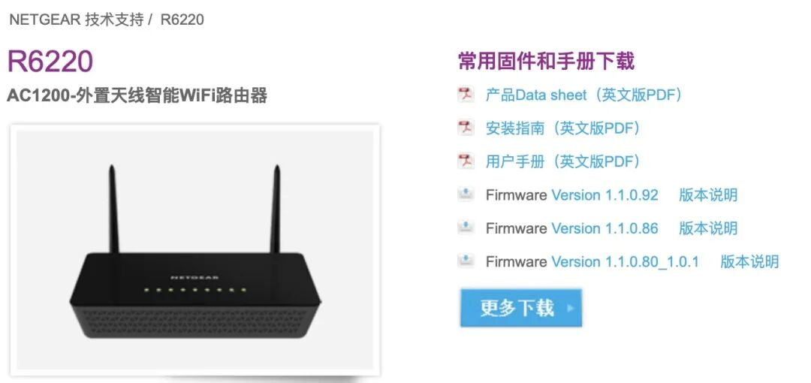

2、固件下载：

Version 1.1.0.86（有漏洞）：http://support.netgear.cn/Upfilepath/R6220-V1.1.0.86.img  
Version 1.1.0.92（已修复）：http://support.netgear.cn/Upfilepath/R6220-V1.1.0.92_1.0.1_BETA.img

3、相关工具

```http
GET /index.htm%00currentsetting.htm HTTP/1.1
Host: 192.168.1.1
User-Agent: Mozilla/5.0 (Macintosh; Intel Mac OS X 10.15; rv:78.0) Gecko/20100101 Firefox/78.0
Accept: */*
Accept-Language: zh-CN,zh;q=0.8,zh-TW;q=0.7,zh-HK;q=0.5,en-US;q=0.3,en;q=0.2
Accept-Encoding: gzip, deflate
Connection: close

```

4、ps：因手头正好有一台 1.1.0.68（86 之前）的 netgear r6220，因此省去了固件模拟的步骤

**补丁对比**

> bindiff 的用法自行学习，本文不再赘述

1、按相似度不为 1，从上到下依次看，略过库函数，重点看 sub_xxx 这种未命名函数

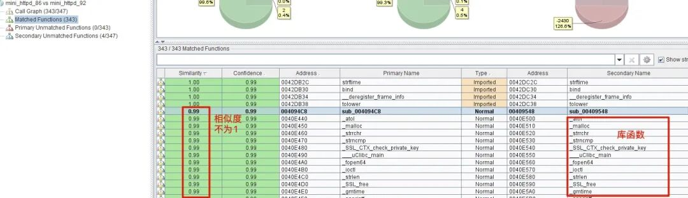

2、运气比较好，看了第一个 sub_4094c8 vs sub_409548 就找到了敏感位置，这两个函数代码块比较多（500+），故 bindiff 中并未完全展开，如下所示：二者有 6 处不同，右 - 92 版比左 - 86 版多了两个代码块，重点看这两种

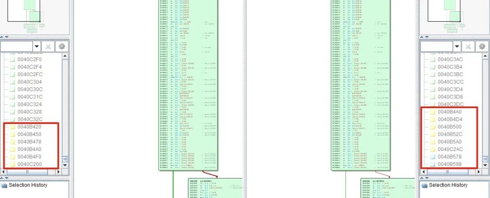

3、依次查看黄色代码块（即有变化的），直到发现如下：右侧出现了 a00，即 00 字符串。

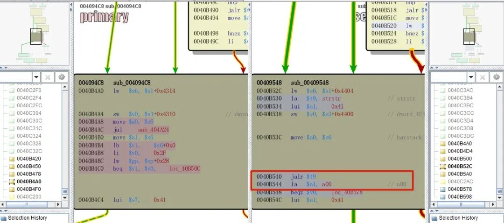

4、联想漏洞描述中 “By inserting a null byte into the path……”，此处比较可疑，ida 中重点看一下（已修复的 92 版）

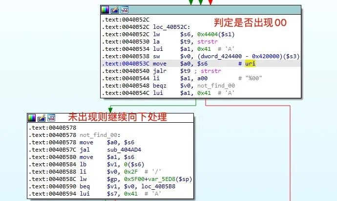

向上追溯，可推断 strstr 的参数 1 为 uri，若发现 00 字符，则最终跳往如下：明显进入了处理错误的流程

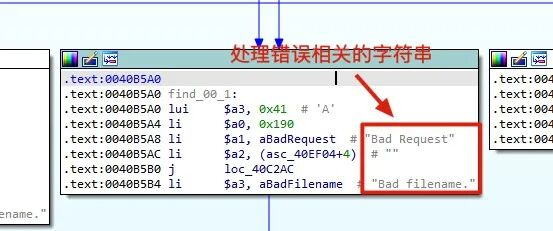

5、经过如上分析，可基本断定补丁所修补的地方，接下来需进一步分析程序，来看漏洞如何出现，又该如何触发

6、PS：补丁对比本身也是要看运气的，首先要从众多函数中找到已修改且敏感的函数，再找函数中修改过的代码块，再结合漏洞信息来判定，如果不是，则周而复始再看其他的，也比较耗时

**简单测试**

1、binwalk 从固件中提取出文件系统，其 web 根目录有如下文件，随手测试几个

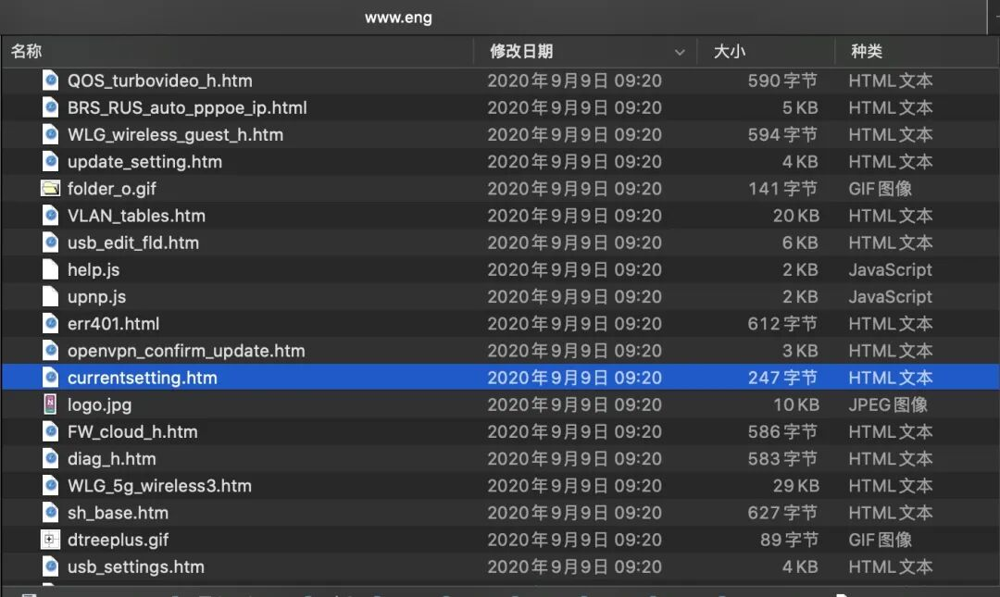

2、/currentsetting.htm 可直接访问，无需经过认证

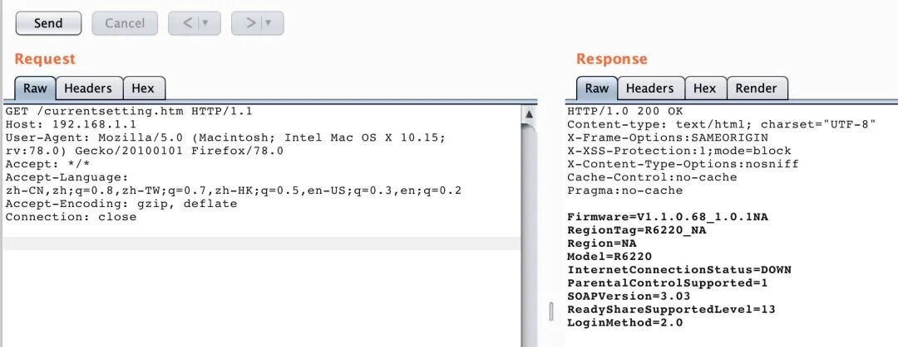

3、/index.htm 则需要经过认证

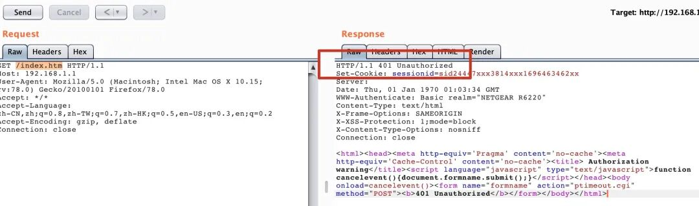

4、联系漏洞描述 “The specific flaw exists within the processing of path strings. By inserting a null byte into the path, the user can skip most authentication checks.”，漏洞可能发生在此处对 uri 的处理中。

**漏洞分析**

> 基于 92 已修复版本的 web 程序，其位于文件系统下 / usr/sbin/mini_httpd

1、通过 bindiff 定位到大概位置（上述步骤 4）：92 版 sub_409548 函数中 strstr 检测 %00 处

2、向上回溯，如下：j 跳转到一个循环，将某标志置为 0（mips 的流水线效应），并取了一堆字符串的首地址

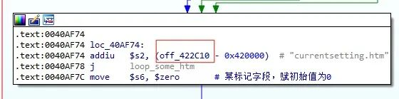

3、off_422c10 处是字符串数组，这些 html 无需认证就可访问

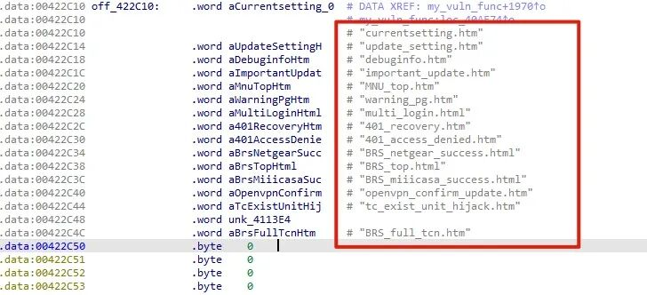

4、循环中遍历 uri 中是否出现这个 html 文件，若出现，则将标志置 1

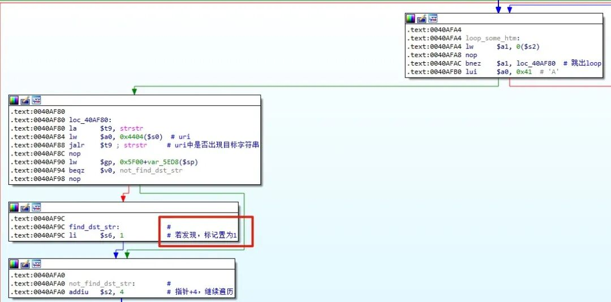

5、上述补丁对比时，发现有一个 strstr 来判断 uri 中是否出现 %00，若没发现，则继续调用 sub_404ad4 并传参 uri

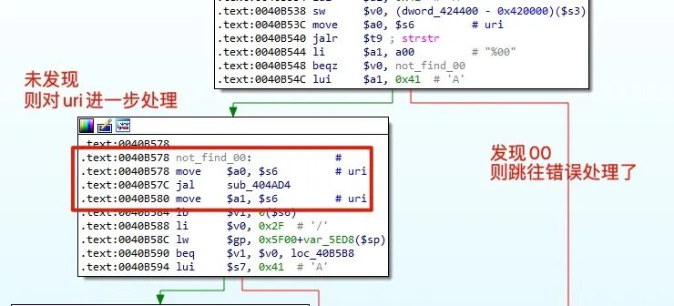

6、sub_404ad4 中，逐个字符来检测 uri 中是否出现 %，并对其后的两个字符作进一步处理，大概可推测是 URL 解码的操作，查看处理函数 sub_404a80 可验证上述猜想

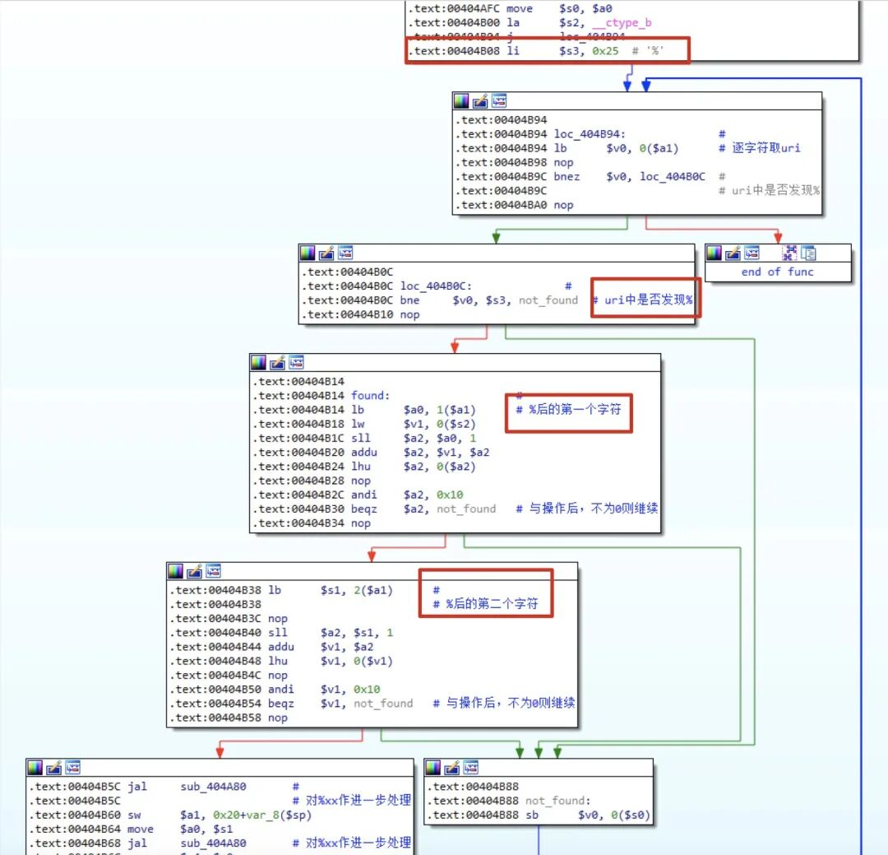

7、注意，上述分析都是基于 92 版即已修复版本的，在 86 有漏洞版本中，并没有 strstr 对 %00 的过滤，如上述 bindiff 截图所示


**构造 POC**

1、有漏洞版本中：没有验证 %00 是否存在，直接进行了 URL 的解码处理，因此 %00 可以导致字符串的截断，结合成因分析步骤 3/4 中循环检测 currentsetting.html 等字符串的操作，可构造如下 poc

2、认证绕过的逻辑

```
1. uri为：`/index.htm%00currentsetting.htm`
2. 程序先检测uri，确实存在`currentsetting.html`这种无需认证就可访问web文件
3. 随后未检测%00便进行URL解码，产生00截断，此时uri为：`/index.htm`，前面已经经过了检测，故正常进行访问
4. %00前是真正要访问的web文件，%00后是为了绕过认证而特意添加的“合法后缀”，程序处理逻辑有误，故造成认证绕过


```

3、如 burp 测试时，直接访问 / index.htm 会提示 401，而通过 poc 可绕过认证

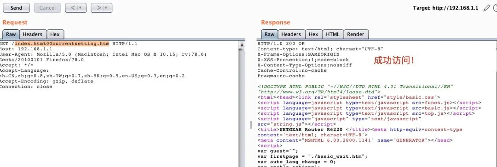

**小结**

这个漏洞原理比较简单，简单捋一下  
1、认证时逻辑有误，导致认证绕过  
2、读取受限文件，若文件中包含密码等信息则造成敏感信息泄漏  
3、不管在 LAN 端还是 WAN 端，都扩大了被攻击面

官方的修复看起来有些草率，既然是 null byte 的截断漏洞，就直接 strstr 检测 %00，有种 “黑名单” 的思想，但换一种角度想，代码更新迭代至今，这种修复方式也是无可奈何

**参考**

1、ZDI 漏洞通告：https://www.zerodayinitiative.com/advisories/ZDI-19-866/  
2、官方补丁说明：https://kb.netgear.com/000061516/Security-Advisory-for-HTTP-Authentication-Bypass-on-the-R6220-PSV-2019-0109

From 新概念研究中心

（点击 “阅读原文” 查看链接）


----------------------------------------------------------------------------------------------------------------------------------------------

  

- End -  

精彩推荐

[垂死挣扎？拯救你的 Meterpreter session](http://mp.weixin.qq.com/s?__biz=MzA5ODA0NDE2MA==&mid=2649738409&idx=3&sn=fcb6f3d8b3f7af582b984d5a028ec8e2&chksm=888cfcc6bffb75d0ff7db9759fbaab68865dc2e129151a5f9a286cdea7747c723a8a2f736462&scene=21#wechat_redirect)  

[chrome issue 1051017 v8 逃逸](http://mp.weixin.qq.com/s?__biz=MzA5ODA0NDE2MA==&mid=2649738334&idx=3&sn=ea6886bab09dbc974976c3ef8885a41f&chksm=888cfc31bffb75270e41209fbe43dbb0d50a5b9f8318dcda541dcf134f234fe047a045e8ae13&scene=21#wechat_redirect)  

[hackme：2 靶机攻略](http://mp.weixin.qq.com/s?__biz=MzA5ODA0NDE2MA==&mid=2649738236&idx=2&sn=1d09a31521c174a164015c0c96b588f5&chksm=888cfb93bffb7285bd57bd63cf17667600da8075b5cdccdf8aff24725a8956d4dba0c6048cc4&scene=21#wechat_redirect)

  

------------------------------------------------------------------------------------------------------------------------------------------------

**戳 “阅读原文” 查看更多内容**

---

> 来源：MrWQ/vulnerability-paper（https://github.com/MrWQ/vulnerability-paper）
