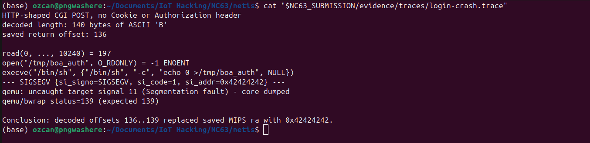

# （CVE-2026-76070）Netis NC63登录栈溢出RCE漏洞

<!-- article-review:devices:begin -->
## 技术校订与证据边界（2026-10-02）

- 产品/组件：Netis NC63
- 本文讨论：CVE-2026-76070 login.cgi栈溢出
- 版本、权限与配置前提：研究V3.0.0.3327，声称≤此版本；无认证；MIPS固件/QEMU实验
- 资料类型：二进制漏洞研究摘要；本次仅核对归档正文，未执行 PoC、未请求目标，未把原作者的“复现成功”继承为本库验证结果

### 逐项校订

- 小于等于版本范围超过正文单固件实验依据
- 原始二进制哈希和完整QEMU配置未在正文给出

### 操作风险与恢复

- 畸形输入可能使进程/内核崩溃、设备重启或服务不可用；本文崩溃线索不自动证明稳定代码执行，需隔离环境和可恢复配置
- 回连样例可能向外部地址发送网络请求或建立会话；应使用自己的隔离回连服务，DNS/LDAP 到达只能证明相应交互，不能单独证明 RCE

### 待核与来源

- CVE/披露日期/评分及官方版本范围待原始链接核验；未运行默认dry-run或发送模式
- 引用图片未查看，截图内容及有效性待核验
- 文内原始链接和图片引用继续保留；未检查图片像素、未下载或执行外部附件。版本边界、修复/在野状态及厂商归属若缺一手依据，均不能视为本次已确认
- 下方保留原技术正文与载荷；其中历史时间表述和成功主张应按本节限定阅读
<!-- article-review:devices:end -->


一、漏洞简介
------------

2026年8月20日公开披露的 Netis NC63 无线路由器未认证栈溢出漏洞
（CVE-2026-76070，CVSS 3.1 9.8 Critical），固件至 V3.0.0.3327 受影响。公开的
登录处理器从 `POST /cgi-bin/login.cgi` 取出攻击者可控的 `password` 参数，
用自研 Base64 解码函数 `FUN_00402bd4` 解码：调用方只给了 64 字节栈缓冲区，
却没有把容量传给解码器，解码器按编码输入推导工作量、写解码字节时不检查
目标末端。解码后的 saved MIPS 返回地址距缓冲区起点 136 字节，攻击者可覆盖
并控制程序计数器。研究者在隔离的 QEMU 用户态运行时对原哈希生产 CGI 做了
动态验证：140 字节解码 `B` 串使 fault 落在 `0x42424242`；把 saved `ra` 换成
`0x0041a2e0` 观察到登录处理器被第二次进入；隔离的观察性测试还让原二进制
的直接 `system()` 调用以攻击者选定的 MIPS `a0` 值被到达（被看守的 `/bin/sh`
只记录参数不执行）。生产 Boa 以 root 跑 CGI，成功利用可在路由器管理上下文
执行任意代码/命令。



*上图：140 字节解码输入覆盖 saved 返回地址，fault 落在攻击者选定的
`0x42424242`（来源：ozcanpng/CVE-2026-76070 披露包，已本地化保存）。*

二、漏洞影响
------------

-   产品：Netis Systems — NC63 Wireless AC1200 Router
-   版本：**固件至 V3.0.0.3327（含）**；修复版本未确认（以厂商为准）
-   组件/攻击向量：`/bin/netis.cgi`，`POST /cgi-bin/login.cgi` 的 Base64 编码
    `password` 参数；MIPS32r2 小端，uClibc
-   前提条件：无；解码发生在凭据比对之前，无需有效会话、Cookie、Authorization
    头或正确密码

三、复现过程
------------

### 漏洞分析（来源：https://github.com/ozcanpng/CVE-2026-76070 披露包，以下为忠实翻译）

Executive summary（执行摘要）：公开登录处理器取出攻击者可控的 `password`
参数，用自研 Base64 函数 `FUN_00402bd4` 解码。调用方提供 64 字节局部栈缓冲
区，但不把容量传给解码器；解码器按编码输入推导工作量，写解码字节时不检查
目标末端。saved MIPS 返回地址距解码缓冲区起点 136 字节。针对原哈希生产 CGI
的动态测试确认：

1.  解码后 140 字节 `B` 串使 fault 落在 `0x42424242`；
2.  把 saved `ra` 换成 `0x0041a2e0` 导致观察到登录处理器第二次进入，证明
    程序计数器可控；
3.  隔离的仅观察测试以攻击者选定的 MIPS `a0` 值到达原二进制的直接 `system()`
    调用。替换的 `/bin/sh` 记录了 `/bin/sh -c NC63_RCE_PROOF` 且未执行任何命令。

Source-to-sink trace（污点流向）：

```text
Unauthenticated HTTP client
  |
  | POST /cgi-bin/login.cgi
  | password=<attacker-controlled Base64>
  v
/bin/netis.cgi: FUN_0041a2e0
  |
  | get_request_param("password")
  v
FUN_00402bd4(decoded_stack_buffer, encoded_password)
  |
  | no destination-capacity argument
  | decoded output exceeds 64 bytes
  v
saved s8 at decoded offset 132
saved ra at decoded offset 136
  |
  v
attacker-selected MIPS PC
```

Vulnerable code（Ghidra 伪代码，名称已规整）：

```c
int login_cgi(void *request)
{
    char decoded[64];
    char stored[68];
    char *password;

    memset(decoded, 0, 64);
    memset(stored, 0, 64);
    password = get_request_param(request, "password");
    if (password != NULL)
        FUN_00402bd4(decoded, password); /* no capacity argument */

    apmib_get(0x15e, stored);
    if (strcmp(decoded, stored) == 0)
        printf("[\"SUCCESS\"]");
    else {
        system("echo 0 >/tmp/boa_auth");
        printf("[\"%d\"]", 0x15);
    }
    return 0;
}
```

Stack corruption analysis（栈破坏分析）：`FUN_0041a2e0` 起始于 `0x0041a2e0`，
建 `0xa8` 字节栈帧；解码目标始于 `s8+0x1c`，saved `s8`/`ra` 分别在
`s8+0xa0`/`s8+0xa4`。返回地址精确距离为 `0xa4 - 0x1c = 0x88` = 136 字节。

Privilege and binary-hardening context：原厂 Boa 配置 `User root`，CGI 以 root
运行；生产可执行文件为固定基址（`0x00400000`），无栈 canary、无 RELRO，
GNU stack 可执行、段 RWX。

### PoC（来源：https://github.com/ozcanpng/CVE-2026-76070，仅限授权测试）

公开 PoC 脚本默认 dry-run，只生成解码后含 140 个 `B` 字节的 Base64 表单体，
刻意止步于 crash 形态，不含返回链、shellcode、命令、反弹 shell 或持久化：

```bash
python3 poc/poc.py
```

向已授权目标实际发送需显式指定 `--send`：

```bash
python3 poc/poc.py --target http://192.168.1.1 --send
```

仓库另有为 Exploit-DB 投稿准备的 RCE 脚本（`poc/exploit-db/CVE-2026-76070.py`，
接受命令参数，仅限已授权测试环境）：

```bash
python3 poc/exploit-db/CVE-2026-76070.py <target> "id"
```

注意：发送超长模式可能使 CGI 进程崩溃，请只在已授权的一次性环境使用。

### 相关条目

-   同设备的另一未认证栈溢出：CVE-2026-76071（`ipFilterList` 的 `destHost`
    参数经无宽度 `sscanf` 拷贝溢出），见本目录对应条目。

### 附录

参考链接：

-   披露包（含 PoC）：https://github.com/ozcanpng/CVE-2026-76070
-   技术博客：https://ozcanpng.dev/blog/cve-2026-76070-netis-nc63-login-stack-buffer-overflow/
-   VulnCheck 顾问页：https://www.vulncheck.com/advisories/netis-nc63-stack-buffer-overflow-via-login-password-parameter
-   NVD：https://nvd.nist.gov/vuln/detail/CVE-2026-76070

四、修复建议
------------

1.  把自研解码器换成接受目标容量的 API；
2.  拒绝解码后长度超过 63 字节的输入（为终止符留空间）；
3.  解码前先在服务端校验长度与 Base64 语法；
4.  审计 `FUN_00402bd4` 的所有调用方；
5.  用栈 canary、PIE、NX、RELRO 重新构建，并以最小权限运行 CGI 进程。
