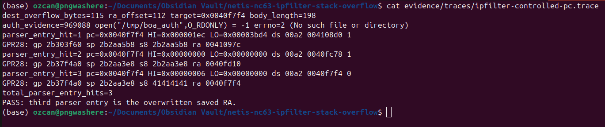

# （CVE-2026-76071）Netis NC63 ipFilterList栈溢出RCE漏洞

<!-- article-review:devices:begin -->
## 技术校订与证据边界（2026-10-02）

- 产品/组件：Netis NC63
- 本文讨论：CVE-2026-76071 ipFilterList栈溢出
- 版本、权限与配置前提：研究V3.0.0.3327，称≤；动态实验目标未见认证阻挡，静态其他路径另述
- 资料类型：二进制漏洞研究摘要；本次仅核对归档正文，未执行 PoC、未请求目标，未把原作者的“复现成功”继承为本库验证结果

### 逐项校订

- 小于等于版本范围无更多固件依据
- 未附固件哈希及完整QEMU环境；系统PLT探针不同于完整RCE

### 操作风险与恢复

- 畸形输入可能使进程/内核崩溃、设备重启或服务不可用；本文崩溃线索不自动证明稳定代码执行，需隔离环境和可恢复配置
- 回连样例可能向外部地址发送网络请求或建立会话；应使用自己的隔离回连服务，DNS/LDAP 到达只能证明相应交互，不能单独证明 RCE

### 待核与来源

- CVE及原始固件、认证状态、受影响范围需外部确认；PoC未执行
- 引用图片未查看，截图内容及有效性待核验
- 文内原始链接和图片引用继续保留；未检查图片像素、未下载或执行外部附件。版本边界、修复/在野状态及厂商归属若缺一手依据，均不能视为本次已确认
- 下方保留原技术正文与载荷；其中历史时间表述和成功主张应按本节限定阅读
<!-- article-review:devices:end -->


一、漏洞简介
------------

2026年8月20日公开披露的 Netis NC63 无线路由器未认证栈溢出漏洞
（CVE-2026-76071，CVSS 3.1 9.8 Critical），固件至 V3.0.0.3327 受影响，与
CVE-2026-76070 为同设备、同研究者的姊妹漏洞（76070 见本目录对应条目）。
通用 MIB/value 解析器用两个 `%[^,]` scanset 解析 `ipFilterList` 的 `destHost`
字段，却不设最大字段宽度；每次转换写向 16 字节局部栈缓冲区。直接用 HTTP
客户端提交超长无逗号分量即可覆盖函数的 saved 控制数据。对动态测试的第二个
`destHost` 分量，saved `ra` 距局部缓冲区恰好 112 字节；针对原哈希 CGI 的
QEMU 追踪确认攻击者选定的第三次进入落在 `0x0040f7f4`。另一项仅观察的测试
把返回重定向到原二进制的 `system()` PLT 路径 `0x00423ab0`，攻击者可控的请求
数据作为精确的 MIPS `a0` 参数保留，被看守的 `/bin/sh` 记录标记后未执行。
更广泛的 CGI 鉴权缺失使这个特权处理器在认证前就暴露。本缺陷的内存破坏点是
`FUN_0040f7f4` 中的无宽度 scanset。



*上图：QEMU 观察到被覆盖的返回地址触发第三次解析器进入，
`pc=0x0040f7f4`（来源：ozcanpng/CVE-2026-76071 披露包，已本地化保存）。*

二、漏洞影响
------------

-   产品：Netis Systems — NC63 AC1200 Wireless Dual Band Gigabit MU-MIMO Router
-   版本：**固件至 V3.0.0.3327（含）**；修复版本未确认（以厂商为准）
-   组件/攻击向量：`/bin/netis.cgi`，`POST /cgi-bin/skk_set.cgi`，
    触发 `ipFilterList=mod`，动态确认参数为 `destHost`（`srcHost` 走同一解析器，
    为静态同覆盖）；MIPS32r2 小端，uClibc
-   前提条件：在已验证路径上未观察到鉴权要求；CGI 请求无需 Cookie/Authorization
    头，`/tmp/boa_auth` 不存在仍进入解析

三、复现过程
------------

### 漏洞分析（来源：https://github.com/ozcanpng/CVE-2026-76071 披露包，以下为忠实翻译）

Executive summary（执行摘要）：Netis NC63 固件 `V3.0.0.3327` 的通用 MIB/value
解析器用两个 `%[^,]` scanset 解析 `ipFilterList` 的 `destHost` 字段，无最大
字段宽度。每次转换写向 16 字节局部栈缓冲区，直接 HTTP 客户端提交超长无逗号
分量即可覆盖函数的 saved 控制数据。对动态测试的第二个 `destHost` 分量，
saved `ra` 距局部缓冲区恰好 112 字节。针对原哈希 CGI 的 QEMU 追踪确认攻击者
选定的第三次进入在 `0x0040f7f4`。另一项仅观察测试把返回重定向到原二进制的
`system()` PLT 路径 `0x00423ab0`，同时攻击者可控的请求数据作为精确的 MIPS
`a0` 参数保留；看守的 `/bin/sh` 记录标记、未执行命令。

公开 PoC 刻意只含超长 `B` 模式，不含私有控制转移值与命令边界构造。为
Exploit-DB 投稿单独维护的 RCE 脚本在 `poc/exploit-db/`，仅限已授权测试。

Source-to-sink trace（污点流向）：

```text
Unauthenticated HTTP client
  |
  | POST /cgi-bin/skk_set.cgi
  | ipFilterList=mod
  | destHost=1,0.0.0.0,<long comma-free component>
  v
FUN_004138a0
  v
FUN_004134c8 (ipFilterList trigger row)
  v
FUN_00410898(request, "ipFilterList")
  v
FUN_0040f7f4(request, trigger, mib_table, pMib)
  |
  | get_request_param("destHost")
  v
sscanf(value, "%d,%[^,],%[^,]", ...)
  |
  | second destination: char[16]
  | no maximum scanset width
  v
saved fp overwrite -> saved ra overwrite -> controlled PC
```

Vulnerable code（Ghidra 规整伪代码）：

```c
case 0x0c:
    value = get_request_param(request, metadata_name);
    sscanf(value,
           "%d,%[^,],%[^,]",
           &selector,
           first_ip_component,   /* char[16] */
           second_ip_component); /* char[16] */

    *(char *)(destination + field_offset) = selector;
    inet_aton(first_ip_component, destination + field_offset + 1);
    inet_aton(second_ip_component, destination + field_offset + 5);
    break;
```

`sscanf()` 本身不是漏洞；缺陷在于 `%[^,]` 没有最大字段宽度，`sscanf` 不知道
每个目标只有 16 字节。容量感知的写法应用 `%15[^,]`、要求三次转换全部成功、
再校验解析出的地址值（此为示例缓解，非厂商补丁）。

Stack corruption analysis（栈破坏分析）：`FUN_0040f7f4` 起始 `0x0040f7f4`，
建 `0x1d0` 字节栈帧；类型 `0x0c` 的两个目标在 `fp+0x14c` 与 `fp+0x15c`，
saved `ra` 在 `fp+0x1cc`，距第二个缓冲区的精确距离为
`0x1cc - 0x15c = 0x70` = 112 字节。

Program-counter control（程序计数器控制）：隔离验证用 112 字节填充接
`0x0040f7f4` 的三个低位小端字节，`sscanf` 的终止符补第四个零字节。QEMU
观察到两次普通解析器进入，随后是被覆盖返回地址导致的第三次进入：

```text
parser_entry_hit=3 pc=0x0040f7f4
GPR28: ... s8 41414141 ra 0040f7f4
total_parser_entry_hits=3
PASS: third parser entry is the overwritten saved RA.
```

原可执行文件为固定基址，无栈 canary、无 RELRO，栈可执行、段 RWX——这些性质
支撑可利用性分析，但不能替代动态 PC 与看守边界测试。

### PoC（来源：https://github.com/ozcanpng/CVE-2026-76071，仅限授权测试）

dry-run 生成 URL 编码请求体：

```bash
python3 poc/poc.py
```

向已授权的一次性目标实际发送：

```bash
python3 poc/poc.py --target http://192.168.1.1 --send
```

为 Exploit-DB 投稿准备的 RCE 脚本（`poc/exploit-db/CVE-2026-76071.py`），
针对已记录的未认证 `ipFilterList` 漏洞，接受命令参数，仅限已授权测试目标：

```bash
python3 poc/exploit-db/CVE-2026-76071.py <target> "id"
```

公开脚本用 115 字节 `B` 分量演示溢出条件，不含命令串、shellcode、
return-to-`system` 地址、反弹 shell 或持久化；发送可能使 CGI 进程崩溃。

### 相关条目

-   同设备的另一未认证栈溢出：CVE-2026-76070（登录接口 Base64 `password`
    参数解码溢出），见本目录对应条目。

### 附录

参考链接：

-   披露包（含 PoC）：https://github.com/ozcanpng/CVE-2026-76071
-   技术博客：https://ozcanpng.dev/blog/cve-2026-76071-netis-nc63-ipfilter-stack-buffer-overflow/
-   VulnCheck 顾问页：https://www.vulncheck.com/advisories/netis-nc63-stack-buffer-overflow-via-desthost-parameter
-   NVD：https://nvd.nist.gov/vuln/detail/CVE-2026-76071

四、修复建议
------------

1.  每个 16 字节目标使用 `%15[^,]`，并要求三次转换全部成功；
2.  解析前拒绝超长的序列化 host 值；
3.  入库前在服务端校验两个 IP 值；
4.  特权 CGI 分发前强制管理员鉴权；
5.  审计每个元数据解析器分支的无宽度 `%s` 与 `%[...]`；
6.  用栈 canary、PIE、NX、RELRO 重新构建。
