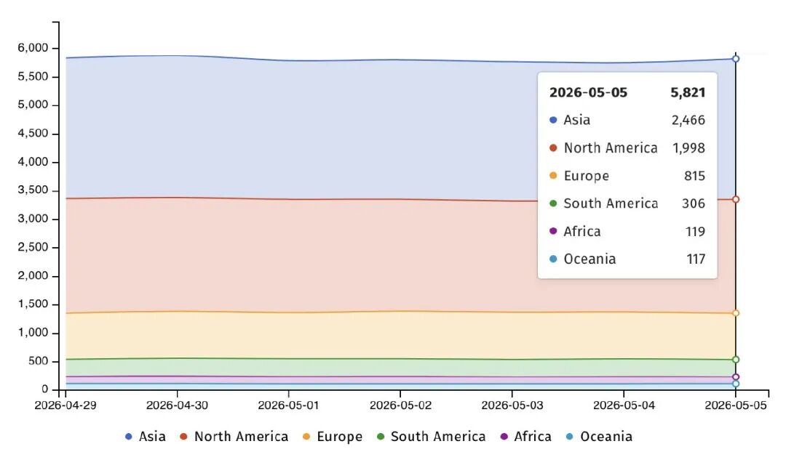

#  利用正当时！Palo Alto防火墙今年首爆0day漏洞  

<!-- article-review:devices:begin -->
## 技术校订与证据边界（2026-10-02）

- 产品/组件：PAN-OS Captive/Authentication Portal
- 本文讨论：CVE-2026-0300；其他九个CVE为历史引用
- 版本、权限与配置前提：PA/VM系列、认证门户启用且攻击者可达；补丁是2026-05-07报道时计划
- 资料类型：零日新闻；本次仅核对归档正文，未执行 PoC、未请求目标，未把原作者的“复现成功”继承为本库验证结果

### 逐项校订

- 标题“首爆”及有限利用推断国家级组织缺直接归因依据
- 历史CVE清单、数千台/48小时下线等高强度叙述未逐项来源
- 未列具体版本，暴露数量不等于已确认易受影响数量

### 操作风险与恢复

- 本篇未提供足以确认无副作用的完整验证流程；应依正文所述配置、权限与交互前提评估，不能把通告或截图当成可直接运行的检测脚本

### 待核与来源

- 官方补丁实际发布情况、KEV时点和历史攻击数据需核验
- 引用图片未查看，截图内容及有效性待核验
- 文内原始链接和图片引用继续保留；未检查图片像素、未下载或执行外部附件。版本边界、修复/在野状态及厂商归属若缺一手依据，均不能视为本次已确认
- 下方保留原技术正文与载荷；其中历史时间表述和成功主张应按本节限定阅读
<!-- article-review:devices:end -->

原创 网空闲话
                    网空闲话  网空闲话plus   2026-05-07 03:28  
  
综合5月6日安全周刊和B  
leepingcomputer的消息，全  
球网络安全巨头Palo Alto Networks近日发布紧急通告，确认其PAN-OS软件中存在一个已被野外利用的零日漏洞。该漏洞编号为CVE-2026-0300，目前已针对部分防火墙型号展开有限攻击，厂商计划于5月13日起分批推送补丁。Palo Alto Networks产品服务于全球超过7万家客户，涵盖90%的财富10强企业及大多数美国大型银行。  
  
  
  
缓冲区溢出可致完全接管  
  
根据官方披露的技术细节，CVE-2026-0300属于缓冲区溢出类型漏洞，位于PAN-OS的用户身份认证门户组件——即Captive Portal服务中。该服务通常用于企业网络中对未授权用户进行身份拦截与认证。  
  
攻击者无需任何身份凭证，只需向目标防火墙的认证门户发送特制数据包，即可触发溢出并执行恶意代码，且代码将以root最高权限运行。这意味着成功利用该漏洞的攻击者能够完全控制受影响的防火墙设备，进而横向渗透内部网络，或关闭安全策略以掩盖后续恶意行为。  
  
受影响的设备涵盖PA系列和VM系列防火墙。凡是启用了用户身份认证门户功能且将该服务暴露于不可信网络（包括直接连接公网）的设备，均处于高风险状态。  
  
据Shadowserver监测，目前有超过5,800台VM系列防火墙暴露于公网，其中亚洲约2,466台，北美约1,998台。  
  
  
  
监测到全球各地在线暴露的vm系列防火墙数量  
  
有限利用指向高度组织化攻击  
  
Palo Alto Networks在公告中明确表示，已观测到“有限的利用行为”。安全行业通常以此描述针对特定高价值目标的国家级黑客组织或顶级商业间谍软件厂商发起的精准攻击。  
  
厂商补充声明称，该漏洞仅影响少数将认证门户暴露于公网或不信任IP的客户，厂商已观测到有限利用，并优先向客户提供缓解指引。  
  
尽管厂商未披露攻击活动的具体细节，但考虑到Palo Alto防火墙广泛应用于全球大型企业、政府机构、关键基础设施及金融系统，此类零日漏洞一旦落入高级威胁行为者手中，往往会成为突破边界防御的关键跳板。  
  
目前美国CISA的已知被利用漏洞目录中尚未收录CVE-2026-0300，但鉴于已出现野外利用，预计近期将被正式纳入，并要求联邦机构限期修复。  
  
缓解措施与补丁时间表  
  
自查路径：管理员可通过 Device > User Identification > Authentication Portal Settings -> Enable Authentication Portal 检查是否启用了该漏洞服务。  
  
对于暂时无法立即应用补丁的用户，Palo Alto Networks提供了明确的临时缓解方案：严格限制用户身份认证门户的访问来源，仅允许受信任的内部IP地址连接。厂商强调，若该服务未暴露于不信任网络或公网，利用风险将大幅降低。  
  
此外，Prisma Access、Cloud NGFW以及Panorama管理设备不受此漏洞影响。  
  
补丁发布方面，首轮修复预计于5月13日释出，第二轮补充修复计划在5月28日完成。建议使用受影响型号和配置的企业，在补丁可用后第一时间安排变更窗口进行升级。  
  
防火墙已成国家级攻击重点目标  
  
回顾Palo Alto产品漏洞的野外利用历史，防火墙已成为国家级攻击的重点目标。仅2024至2025两年间，就有至少9个漏洞被发现在野利用，其中2024年共7个：CVE-2024-3400、CVE-2024-0012、CVE-2024-9474、CVE-2024-5910、CVE-2024-2553、CVE-2024-3387、CVE-2024-7879；2025年（截至本次通报前）共2个：CVE-2025-0108、CVE-2025-0110。在这9个漏洞中，影响最严重、后果最典型的案例当属CVE-2024-3400——该漏洞于2024年4月被披露，是一个PAN-OS GlobalProtect网关中的命令注入漏洞，无需任何权限即可远程执行任意命令。国家级黑客组织利用该漏洞对全球数千台未打补丁的防火墙实施了后门植入，进而横向渗透至多个政府、国防和金融服务机构的内部网络，迫使美国CISA发布紧急指令要求联邦机构在48小时内强制下线受影响设备。这一事件充分说明：防火墙自身的安全防线一旦失守，企业内网将面临灾难性风险。  
  
  
参考来源  
  
1.https://www.securityweek.com/palo-alto-networks-to-patch-zero-day-exploited-to-hack-firewalls/  
  
2.https://www.bleepingcomputer.com/news/security/palo-alto-networks-warns-of-actively-exploited-firewall-zero-day/  
  

---

> 来源：gelusus/wxvl（微信公众号漏洞文章自动归档，原文见文首链接）
