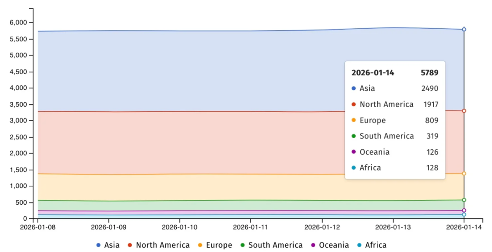
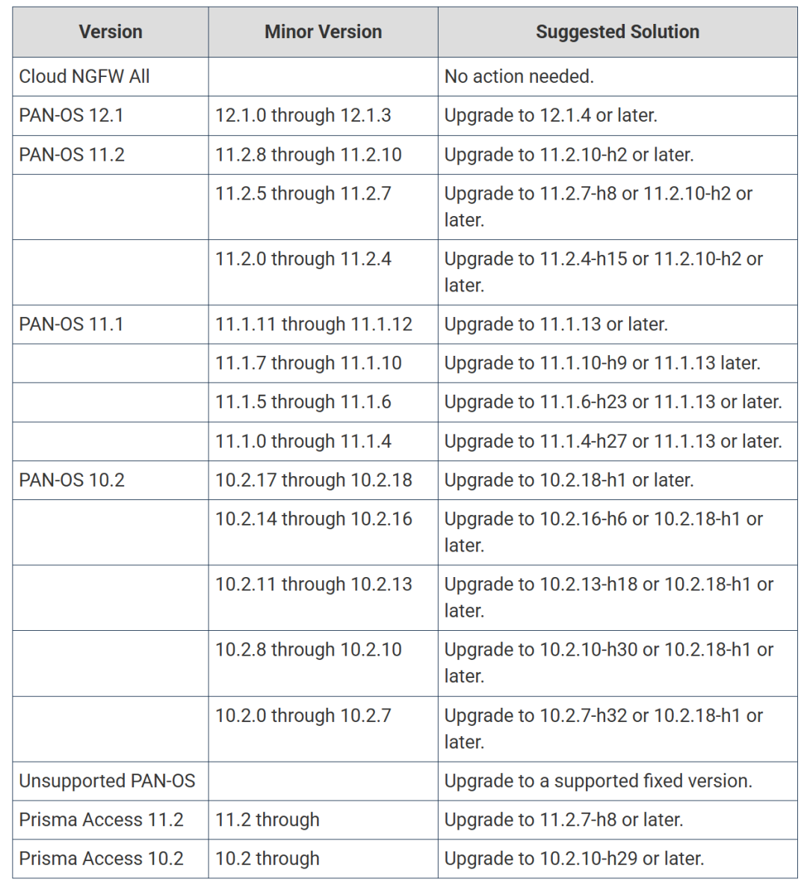

#  Palo Alto Networks 紧急修复高危漏洞，攻击者可致防火墙瘫痪  

<!-- article-review:devices:begin -->
## 技术校订与证据边界（2026-10-02）

- 产品/组件：PAN-OS GlobalProtect及Prisma Access
- 本文讨论：CVE-2026-0227；3393为历史引用
- 版本、权限与配置前提：GlobalProtect网关/门户启用；笼统PANOS10.1+
- 资料类型：DoS新闻预警；本次仅核对归档正文，未执行 PoC、未请求目标，未把原作者的“复现成功”继承为本库验证结果

### 逐项校订

- 具体受影响/安全版本缺失；来源只写BleepingComputer名称无链接
- 已说明6000暴露设备是否易受影响未知，索引不可把数量当漏洞数量

### 操作风险与恢复

- 本篇未提供足以确认无副作用的完整验证流程；应依正文所述配置、权限与交互前提评估，不能把通告或截图当成可直接运行的检测脚本

### 待核与来源

- 修复状态、版本和无在野利用时间点待原源确认
- 引用图片未查看，截图内容及有效性待核验
- 文内原始链接和图片引用继续保留；未检查图片像素、未下载或执行外部附件。版本边界、修复/在野状态及厂商归属若缺一手依据，均不能视为本次已确认
- 下方保留原技术正文与载荷；其中历史时间表述和成功主张应按本节限定阅读
<!-- article-review:devices:end -->

看雪学苑
                    看雪学苑  看雪学苑   2026-01-15 09:59  
  
Palo Alto Networks 近日修补了一个高危漏洞，该漏洞可能允许未经身份验证的攻击者通过拒绝服务（DoS）攻击禁用防火墙防护功能。  
  
  
该漏洞编号为 CVE-2026-0227，影响到运行 PAN-OS 10.1 或更高版本的下一代防火墙，以及在启用 GlobalProtect 网关或门户功能时的 Prisma Access 配置。该公司解释称，该漏洞可使攻击者导致防火墙进入维护模式，从而造成服务中断。  
  
  
  
  
Palo Alto Networks 表示，已为所有受影响版本发布了安全更新，并建议管理员立即升级至最新版本以防范潜在攻击。根据其安全公告，大多数基于云的 Prisma Access 实例已完成修补，剩余实例的升级也已列入计划。该公司强调，目前尚未发现该漏洞在攻击中被利用的证据。  
  
  
然而，威胁依然存在。互联网安全监测机构 Shadowserver 目前跟踪到近 6000 台 Palo Alto Networks 防火墙暴露在互联网上，尽管其中多少存在易受攻击配置或已打补丁尚不清楚。  
  
  
Palo Alto Networks 防火墙经常成为攻击目标，攻击者常利用未公开或未修补的零日漏洞。例如，2024年11月，该公司曾修补两个被积极利用的 PAN-OS 零日漏洞，攻击者可借此获得 root 权限。随后，美国网络安全和基础设施安全局（CISA）曾下令联邦机构在三周内完成设备加固。同年12月，该公司又警告称，攻击者正在利用另一个 PAN-OS DoS 漏洞（CVE-2024-3393）攻击特定系列防火墙，导致其重启并禁用防护。  
  
  
近期，威胁情报公司 GreyNoise 还警告了一场针对 Palo Alto GlobalProtect 门户的自动化攻击活动，涉及超过 7000 个 IP 地址进行暴力破解和登录尝试。GlobalProtect 是 PAN-OS 防火墙的 VPN 和远程访问组件，被众多政府机构、服务提供商和大企业使用。  
  
  
  
  
Palo Alto Networks 的产品和服务被全球超过 7 万客户使用，包括美国多数大型银行和 90% 的财富 10 强公司。因此，及时应用安全更新对于保障全球网络安全态势至关重要。  
  
  
根据提供的版本建议，受影响用户应参照官方指南，尽快将 PAN-OS 或 Prisma Access 升级至指定的安全版本。  
  
  
  
资讯来源  
：  
bleepingcomputer  
  
转载请注明出处和本文链接  
  
  
  
﹀  
  
﹀  
  
﹀  
  
  
  
  
  
  
**球分享**  
  
  
  
**球点赞**  
  
  
  
**球在看**  
  

---

> 来源：gelusus/wxvl（微信公众号漏洞文章自动归档，原文见文首链接）
