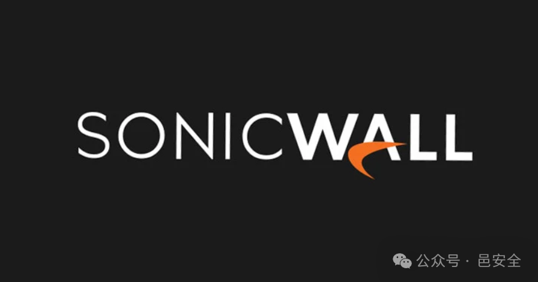

#  SonicWall 呼吁立即修补可能被利用的严重 CVE-2025-23006 缺陷   

<!-- article-review:devices:begin -->
## 技术校订与证据边界（2026-10-02）

- 产品/组件：SonicWall SMA1000 AMC/CMC
- 本文讨论：CVE-2025-23006
- 版本、权限与配置前提：未认证反序列化；修复12.4.3-02854；明确不含SMA100及Firewall
- 资料类型：零日预警；本次仅核对归档正文，未执行 PoC、未请求目标，未把原作者的“复现成功”继承为本库验证结果

### 逐项校订

- 正文“可能主动利用”与小标题“已遭野外利用”确定性不同
- 限制可信来源访问译句容易读成限制可信用户，应表述仅允许可信来源
- 缺厂商直链及受影响版本下界

### 操作风险与恢复

- 本篇未提供足以确认无副作用的完整验证流程；应依正文所述配置、权限与交互前提评估，不能把通告或截图当成可直接运行的检测脚本

### 待核与来源

- 官方利用状态及完整版本矩阵待核验
- 引用图片未查看，截图内容及有效性待核验
- 文内原始链接和图片引用继续保留；未检查图片像素、未下载或执行外部附件。版本边界、修复/在野状态及厂商归属若缺一手依据，均不能视为本次已确认
- 下方保留原技术正文与载荷；其中历史时间表述和成功主张应按本节限定阅读
<!-- article-review:devices:end -->

邑安科技  邑安全   2025-01-24 07:43  
  
更多全球网络安全资讯尽在邑安全  
  
  
  
  
SonicWall 提醒客户注意一个影响其安全移动访问 （SMA） 1000 系列设备的严重安全漏洞，它表示该漏洞可能已被作为零日漏洞在野外利用。该漏洞被跟踪为 CVE-2025-23006，在 CVSS 评分系统上被评为 9.8 分（满分 10.0 分）。  
  
**漏洞详情与影响范围**  
  
该公司在一份公告中表示：“已在 SMA1000 设备管理控制台 （AMC） 和中央管理控制台 （CMC） 中发现了不受信任数据的身份验证前反序列化漏洞，在特定情况下，该漏洞可能使未经身份验证的远程攻击者能够执行任意操作系统命令。  
  
值得注意的是，CVE-2025-23006 不会影响其 Firewall 和 SMA 100 系列产品。该漏洞已在版本 12.4.3-02854（平台修补程序）中得到解决。  
  
**漏洞已遭野外利用，用户需立即修复**  
  
SonicWall 还表示，它已收到未指明威胁行为者“可能主动利用”的通知，因此客户必须尽快应用修复程序以防止潜在的攻击尝试。  
该公司  
表示  
 Microsoft 威胁情报中心 （MSTIC） 发现并报告了安全漏洞。  
  
该公司建议“为了最大限度地减少漏洞的潜在影响，请确保限制对设备管理控制台 （AMC） 和中央管理控制台 （CMC） 的可信来源的访问”。  
  
**总结**  
  
CVE-2025-23006漏洞的严重性不容忽视，企业应该及时采取措施，更新设备，并加强访问控制，以保护网络安全。  
  
原文来自:   
thehackernews.com  
  
原文链接: https://thehackernews.com/2025/01/sonicwall-urges-immediate-patch-for.html  
  
欢迎收藏并分享朋友圈，让五邑人网络更安全  
  
  
  
欢迎扫描关注我们，及时了解最新安全动态、学习最潮流的安全姿势！  
  
推荐文章  
  
1  
  
[新永恒之蓝？微软SMBv3高危漏洞（CVE-2020-0796）分析复现](http://mp.weixin.qq.com/s?__biz=MzUyMzczNzUyNQ==&mid=2247488913&idx=1&sn=acbf595a4a80dcaba647c7a32fe5e06b&chksm=fa39554bcd4edc5dc90019f33746404ab7593dd9d90109b1076a4a73f2be0cb6fa90e8743b50&scene=21#wechat_redirect)  
  
  
2  
  
[重大漏洞预警：ubuntu最新版本存在本地提权漏洞（已有EXP）　](http://mp.weixin.qq.com/s?__biz=MzUyMzczNzUyNQ==&mid=2247483652&idx=1&sn=b2f2ec90db499e23cfa252e9ee743265&chksm=fa3941decd4ec8c83a268c3480c354a621d515262bcbb5f35e1a2dde8c828bdc7b9011cb5072&scene=21#wechat_redirect)  
  
  
  
  

---

> 来源：gelusus/wxvl（微信公众号漏洞文章自动归档，原文见文首链接）
