#  原创 Paper | Zyxel Telnet 漏洞分析(CVE-2025-0890、CVE‑2024‑40891)   

<!-- article-review:devices:begin -->
## 技术校订与证据边界（2026-10-02）

- 产品/组件：Zyxel旧DSL CPE多个型号
- 本文讨论：CVE-2025-0890默认凭据 + CVE-2024-40891认证后Telnet命令注入
- 版本、权限与配置前提：Telnet启用；WAN攻击需另启WAN，默认关闭；测试VMG1312/4325 1.00固件
- 资料类型：双漏洞固件静态研究；本次仅核对归档正文，未执行 PoC、未请求目标，未把原作者的“复现成功”继承为本库验证结果

### 逐项校订

- 元数据仅0890；凭据黏行；default.cfg多处误写defaulf.cfg
- 把允许WAN作为全局必要条件忽略LAN攻击；supervisor受限shell是否预期功能需明确
- 作者明确仿真认证失败，不能把静态调用链及ifconfig||sh当成功动态复现；逻辑或是否执行sh取决于前命令状态

### 操作风险与恢复

- 执行文中载荷可能以目标进程权限启动命令或加载代码；权限受认证角色、操作系统账户及依赖版本约束，不能把 root/200 等通用字符串当成功证据
- 读取内容可能包含配置、账户或个人数据；应只保存授权环境中最小必要的响应，不能由接口可达推定敏感内容已泄露

### 待核与来源

- 命令白名单绕过动态效果及各型号固件范围待确认
- 引用图片未查看，截图内容及有效性待核验
- 文内原始链接和图片引用继续保留；未检查图片像素、未下载或执行外部附件。版本边界、修复/在野状态及厂商归属若缺一手依据，均不能视为本次已确认
- 下方保留原技术正文与载荷；其中历史时间表述和成功主张应按本节限定阅读
<!-- article-review:devices:end -->

原创 404实验室  知道创宇404实验室   2025-02-17 07:25  
  
**作者：fan@****知道创宇404实验室**  
  
**时间：2025年2月14日**  
  
**1.前言**  
  
  
参考资料  
  
这是2025年开年分析的第一个洞。2月4日 Zyxel 发布安全公告，旗下部分旧款 DSL 客户终端设备(CPE)存在严重的安全漏洞[1]，包括 默认凭证不安全问题 和 命令注入漏洞 ，攻击者可通过默认凭证登录 Telnet 并利用此漏洞在受影响的设备上执行任意命令。  
  
**2.产品介绍**  
  
  
参考资料  
  
Zyxel DSL CPE 是 Zyxel 公司生产的一种网络设备，用于通过电话线（DSL 技术）连接互联网。它集成了调制解调器和路由器功能，可将电话线的宽带信号转换为网络信号，供用户上网、使用 Wi-Fi 或打电话。这类设备广泛应用于家庭和小型企业，适合通过 DSL 或 VDSL 技术接入互联网的场景。  
  
简单来说，这是一种用电话线上网的设备，既能提供网络，又能支持无线连接和语音通话。  
  
**3.漏洞分析**  
  
  
参考资料  
#### 固件下载地址[2]  
  
安全公告里提到的受影响型号包括：  
```
VMG1312-B10A、VMG1312-B10B、VMG1312-B10E、VMG3312-B10A、VMG3313-B10A、VMG3926-B10B、VMG4325-B10A、VMG4380-B10A、VMG8324-B10A、VMG8924-B10A、SBG3300、SBG3500
```  
  
CVE-2025-0890  
 涉及以上设备存在默认凭证，攻击者可能利用这些弱凭据直接登录设备管理界面。CVE-2024-40891  
 是一个需要认证的命令注入漏洞，攻击者可以通过 Telnet  
 在受影响设备上执行操作系统命令。两个漏洞的结合使得攻击者可以先通过 CVE-2025-0890  
 使用默认凭证登录设备，然后利用 CVE-2024-40891  
 实现任意命令注入，最终完全控制目标设备。  
### 3.1 CVE-2025-0890  
  
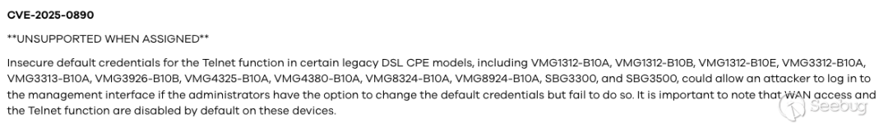  
CVE-2025-0890 漏洞描述  
漏洞描述：Telnet  
 功能存在默认凭证不安全的问题。如果管理员没有更改默认凭证，攻击者可能会利用这些默认凭证登录管理界面。需要注意的是，默认情况下已禁用 WAN  
 访问和 Telnet  
 功能。  
  
首先，分析 CVE-2025-0890  
 寻找默认凭证。  
  
默认凭证保存在 /etc/default.cfg  
 文件中，我们来分析一下这个文件。  
  
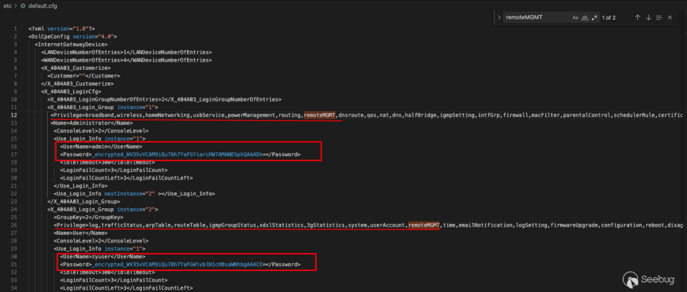  
/etc/default.cfg  
default.cfg  
 包含了两个用户 admin  
 和 zyuser  
 以及权限范围。其中 admin  
 zyuser  
 两者均拥有 remoteMGMT  
 远程管理功能，可以通过 Telnet  
 登录设备。  
  
这里遇到一个问题，我下载的固件是 VMG1312-B10A_1.00  
，其中 Password  
 是经过加密并 base64  
 编码的。通过 base64  
 解码后的结果是乱码，说明还需要进行解密。于是我通过搜索关键字 grep -rni "etc/defaulf.cfg"  
 ，试图找到处理 default.cfg  
 的方式。  
  
  
grep -rni "etc/defaulf.cfg"  
以上三个二进制文件对 etc/defaulf.cfg  
 进行操作，但是我并没有找到有关解密的相关逻辑。于是我尝试转变思路，换个固件试试，于是在 VMG4325-B10A_1.00  
 中找到仅仅被 base64  
 编码，并没有加密的账户密码。  
  
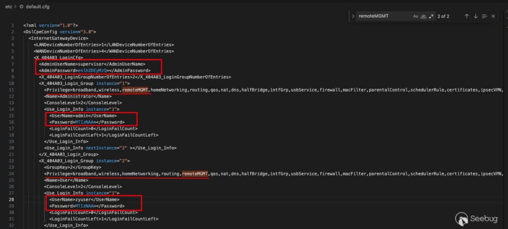  
/etc/default.cfg  
default.cfg  
 包含了三个用户 supervisor  
 admin  
 和 zyuser  
 以及权限范围。其中 supervisor  
 admin  
 zyuser  
 均拥有 remoteMGMT  
 远程管理功能，可以通过 Telnet  
 登录设备。  
```
supervisor:zyad1234admin:1234zyuser:1234
```  
### 3.2 CVE-2024-40891  
  
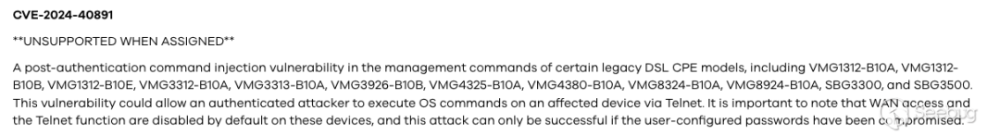  
CVE-2024-40891 漏洞描述  
漏洞描述：存在身份验证后命令注入漏洞。该漏洞可能允许经过身份验证的攻击者通过 Telnet  
 在受影响的设备上执行操作系统命令。需要注意的是，默认情况下已禁用 WAN  
 访问和 Telnet  
 功能。  
  
当成功登录 Telnet  
 后，我们接下来分析 CVE-2024-40891  
 如何触发命令注入漏洞，  
  
先分析入口 telnetd  
 。  
  
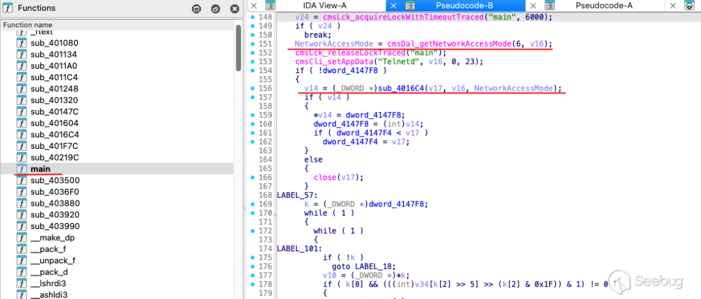  
telnetd main函数  
main  
 通过 cmsDal_getNetworkAccessMode  
 检查客户端的网络访问权限， sub_4016C4  
 判断是否创建 Telnet  
 会话。  
  
分析 cmsDal_getNetworkAccessMode  
，函数被定义在 lib/private/libcms_dal.so  
。  
  
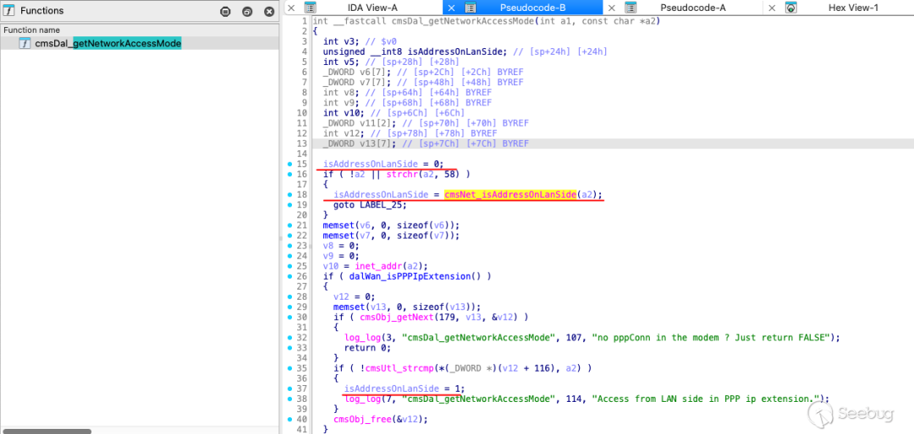  
libcms_dal.so cmsDal_getNetworkAccessMode函数  
这段代码的功能是判断客户端 IP  
 地址是通过 lan  
 侧访问还是 wan  
 侧访问，并返回访问网络访问模式。漏洞情报说明默认情况下禁止 wan  
 访问，所以漏洞利用前提是设备允许 wan  
 访问。  
  
接着回到 telnetd  
 的 sub_4016C4  
 分析后续操作。  
  
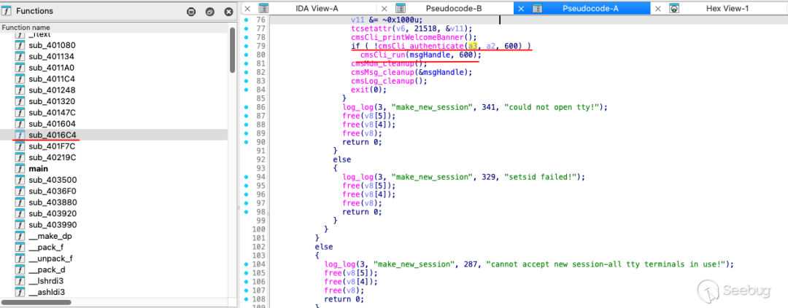  
telnet sub_4016C4函数  
sub_4016C4  
 的功能是为新的 Telnet  
 会话分配资源并创建子进程来处理客户端连接。会通过 cmsCli_authen  
 进行客户端身份认证。  
  
通过验证后 cmsCli_run  
 函数会启动一个命令行交互环境，该函数被定义在 lib/libcms_cli.so  
。  
  
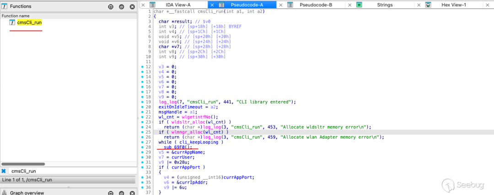  
libcmd_cli.so cmsCli_run函数  
cmsCli_run  
 会启动命令行交互环境后，通过不断调用 sub_69F0  
 处理用户的输入和命令执行。  
  
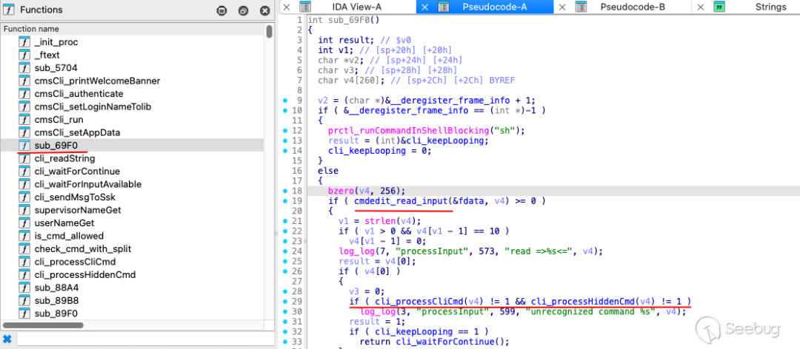  
libcmd_cli.so sub_69F0函数  
sub_69F0  
 通过 cmdedit_read_input  
 获取用户输入，再通过 cli_processCliCmd  
 和 cli_processHiddenCmd  
 分别处理常规命令和隐藏命令。cli_processHiddenCmd  
 可能需要管理员权限才能调用，我们先看 cli_processCliCmd  
。  
  
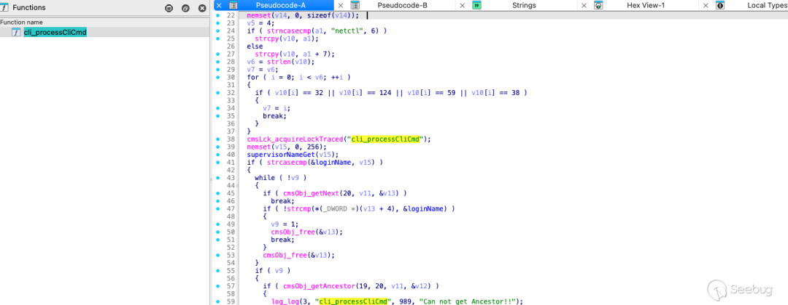  
  
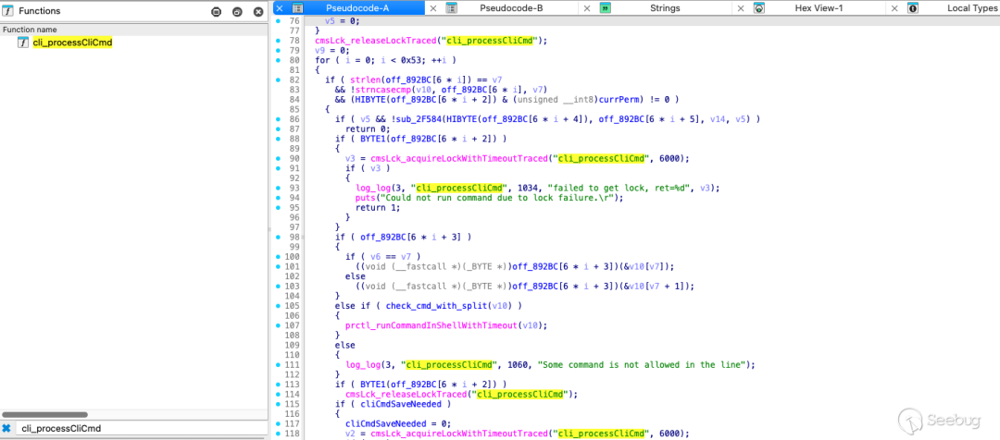  
libcms_cli.so cli_processCliCmd函数  
首先提取命令名称，当遇到空格、管道符、分号或者逻辑运算符是认为命令名称结束。接着获取用户权限，supervisorNameGet  
 判断是否为超级用户，如果不是超级用户则遍历配置查看当前用户权限。命令存储在 off_892BC  
 中，遍历匹配命令。  
  
执行命令的逻辑为，如果命令有对应的处理函数 off_892BC[6 * i + 3]  
 ，调用处理函数执行命令。如果没有处理函数，但包含分隔符（如 |  
 或 ;  
），则会调用 prctl_runCommandInShellWithTimeout  
 在 Shell  
 中运行命令。这个地方就是触发命令注入漏洞的关键了，所以我们现在要做的就是判断 check_cmd_with_split  
 和寻找没有处理函数的命令。  
  
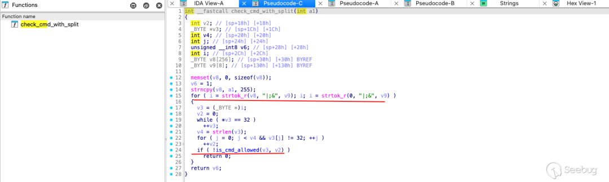  
libcms_cli.so check_cmd_with_split函数  
check_cmd_with_split  
 首先调用 strtok_r  
 按照分隔符 |  
、;  
 和 &  
 将命令字符串分割成多个子命令。再通过 is_cmd_allowed  
 检查是否运行被执行。  
  
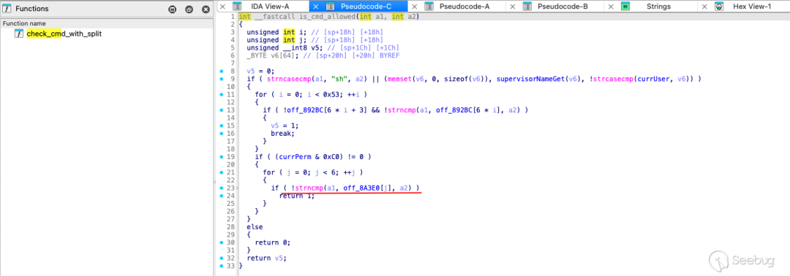  
livcms_cli.so is_cmd_allowed函数  
is_cmd_allowed  
 会先判断是否为特殊命令 sh  
 ，如果是 sh  
 进一步判断是否为超级用户(这个地方应该是给超级用户留的后门)。  
  
接着会再次判断权限，然后遍历另一个命令表 off_8A3E0  
 检查当前子命令是否在其中。  
  
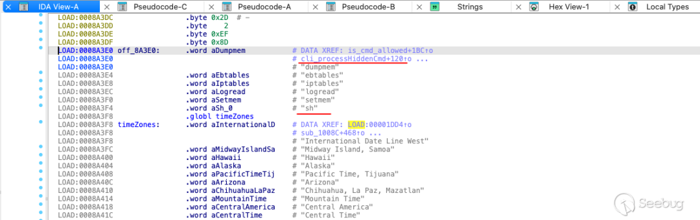  
off_8A3E0 命令表  
结果发现，命令表 off_8A3E0  
 中包含隐藏命令 sh  
。  
  
那么下一步只要在 off_892BC  
 找到没有处理函数的命令，即可触发命令注入。  
  
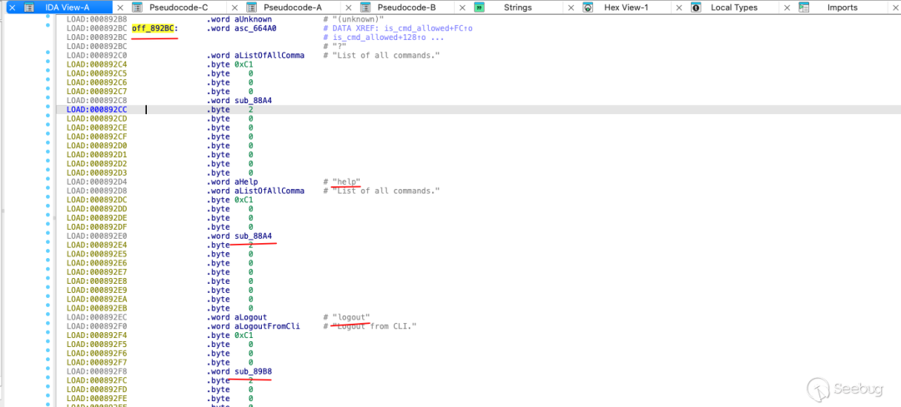  
  
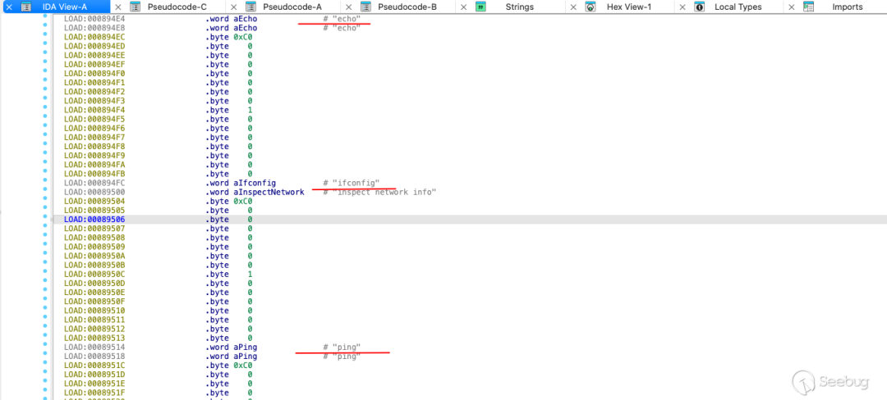  
off_892BC 命令表  
命令表 off_892Bc  
 中，类似 help  
 logout  
 会直接调用对应的处理函数（如 sub_F31C  
、sub_E9B8  
 ），但是 ping  
 ifconfig  
 ps  
 等没有处理函数，因此会调用 prctl_runCommandInShellWithTimeout  
 执行命令。  
  
prctl_runCommandInShellWithTimeout  
 被定义在 libcms_util.so  
。  
  
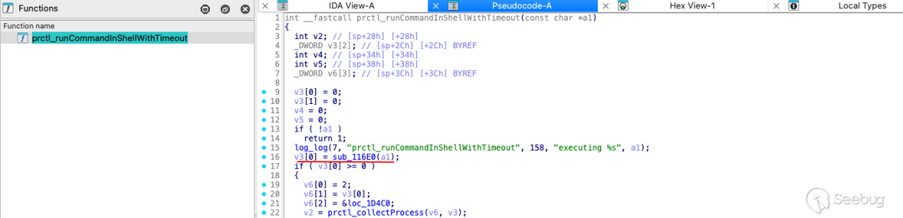  
libcms_cli.so prctl_runCommandInShellWithTimeout函数  
prctl_runCommandInShellWithTimeout  
 再调用 sub_116E0  
 执行命令。  
  
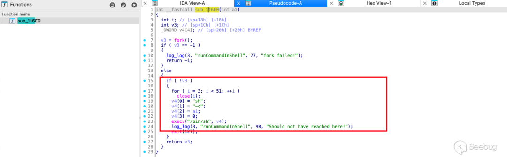  
libcms_cli.so sub_116E0函数  
sub_116E0  
 通过 fork  
 和 execv  
 在子进程中执行用户提供的命令。  
  
最后，我们构造了一个 poc  
```
ifconfig || sh
```  
  
  
**4.环境问题**  
  
  
参考资料  
###   
  
分析过程中，我们使用 QEMU  
 模拟环境，telnet  
 服务有问题导致一直是未授权访问，具体情况如下。  
  
先找到相关文件 telnetd  
。  
  
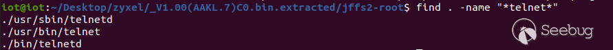  
find . -name "telnet"  
/usr/sbin/telnetd  
 能成功启动 Telnet  
 服务，但是存在认证问题导致未授权访问且没有权限。  
  
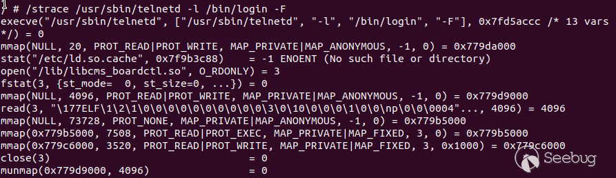  
  
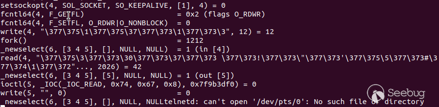  
/strace /usr/sbin/telnetd -l /bin/login -F  
strace  
 看了一下存在子进程无法打开 /dev/pts/0  
 和配置文件缺失问题(无法启动 IPv6  
 支持)。  
  
后续，我们尝试运行 /bin/telnetd  
 ，同样存在内核无法启动 IPv6  
 问题，因为整体不影响漏洞分析，所以我们没有进一步深入研究。  
  
  
**5.相关链接**  
  
  
参考资料  
###   
  
[1] 安全公告  
  
https://www.zyxel.com/global/en/support/security-advisories/zyxel-security-advisory-for-command-injection-and-insecure-default-credentials-vulnerabilities-in-certain-legacy-dsl-cpe-02-04-2025  
  
[2] 固件下载  
  
https://drivers.softpedia.com/get/Router-Switch-Access-Point/Zyxel/  
  
  
  
  
  
**作者名片******  
  
  
  
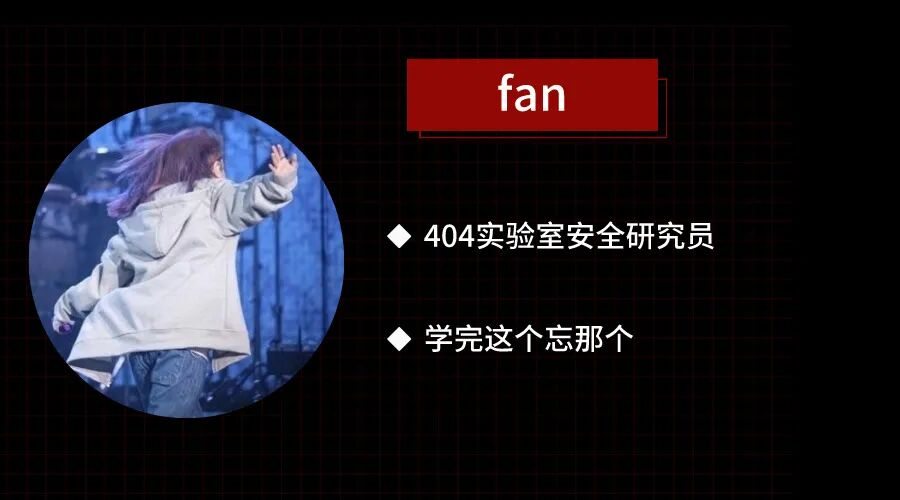  
  
  
  
**往 期 热 门******  
  
(点击图片跳转）  
  
[](https://mp.weixin.qq.com/s?__biz=MzAxNDY2MTQ2OQ==&mid=2650990418&idx=1&sn=405bbaf00d5b589ebc3756c200afd631&scene=21#wechat_redirect)  
[](https://mp.weixin.qq.com/s?__biz=MzAxNDY2MTQ2OQ==&mid=2650990273&idx=1&sn=a92ca5b57db3c7b2b93ae24d958d4396&scene=21#wechat_redirect)  
[](https://mp.weixin.qq.com/s?__biz=MzAxNDY2MTQ2OQ==&mid=2650990259&idx=1&sn=b4d341016fe7340aab15767f5c7a78c1&scene=21#wechat_redirect)  
  
  
[](http://mp.weixin.qq.com/s?__biz=MzAxNDY2MTQ2OQ==&mid=2650983547&idx=1&sn=11b495e0560d63b885d206bbb88a9803&chksm=80798e49b70e075f669f6db892034bc0ea5fbca188095b7a5e16c4c5c1fefd70bdc3eea66396&scene=21#wechat_redirect)  
  
  
  
戳  
“阅读原文”  
更多精彩内容!  
  
  


---

> 来源：gelusus/wxvl（微信公众号漏洞文章自动归档，原文见文首链接）
