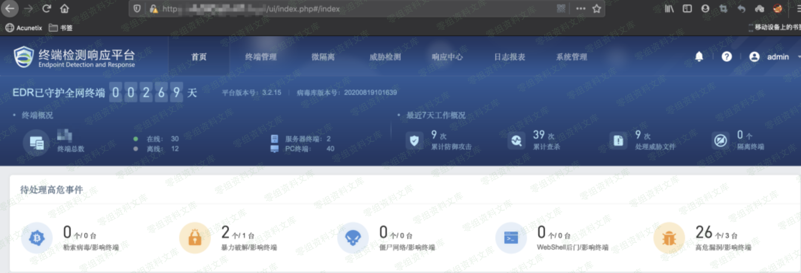

# 深信服 终端检测相应平台（EDR） 任意用户登陆漏洞

<!-- article-review:devices:begin -->
## 技术校订与证据边界（2026-10-02）

- 产品/组件：Sangfor EDR管理平台
- 本文讨论：ui/login.php user认证绕过
- 版本、权限与配置前提：声称≤3.2.19，user任意填
- 资料类型：EDR任意用户登录短摘要；本次仅核对归档正文，未执行 PoC、未请求目标，未把原作者的“复现成功”继承为本库验证结果

### 逐项校订

- 任意用户名均可与342要求用户名必须存在冲突
- 仅URL+截图无权限验证；图片引用后重复路径尾巴，简介为空

### 操作风险与恢复

- 本篇未提供足以确认无副作用的完整验证流程；应依正文所述配置、权限与交互前提评估，不能把通告或截图当成可直接运行的检测脚本

### 待核与来源

- 用户名存在性与版本上界/服务器授权待核验
- 引用图片未查看，截图内容及有效性待核验
- 文内原始链接和图片引用继续保留；未检查图片像素、未下载或执行外部附件。版本边界、修复/在野状态及厂商归属若缺一手依据，均不能视为本次已确认
- 下方保留原技术正文与载荷；其中历史时间表述和成功主张应按本节限定阅读
<!-- article-review:devices:end -->

一、漏洞简介
------------

二、漏洞影响
------------

EDR \<= v3.2.19

三、复现过程
------------

payload：user后面任意填写都ok

    https://www.0-sec.org:443/ui/login.php?user=admin

任意用户登陆漏洞/media/rId24.png)
