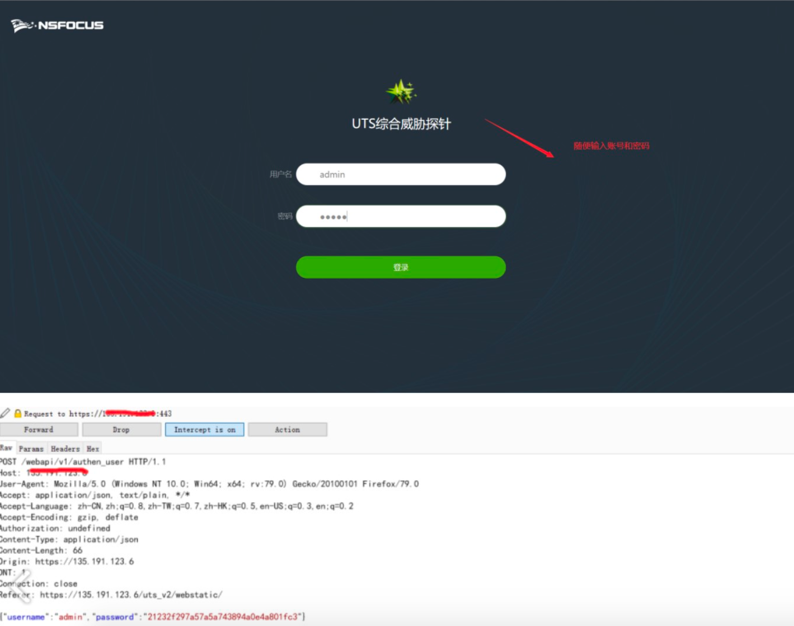
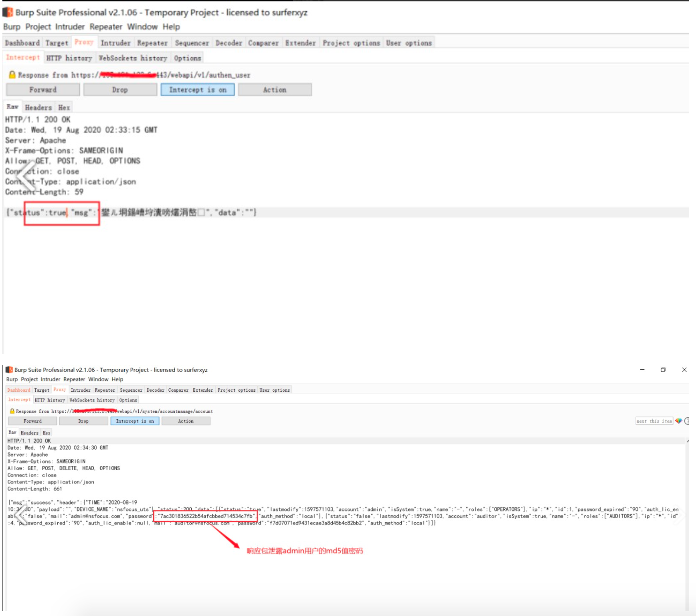

# 绿盟UTS绕过登录

随便输密码->修改返回包为True->放行->等待第二次拦截包->内含管理员MD5->替换MD5登录

直接请求接口：/webapi/v1/system/accountmanage/account

---

逻辑漏洞,利用方式参考:https://www.hackbug.net/archives/112.html
1、修改登录数据包 {"status":false,"mag":""} -> {"status":true,"mag":""} 

2、/webapi/v1/system/accountmanage/account接口逻辑错误泄漏了管理员的账户信息包括密码(md5) 

3、再次登录,替换密码上个数据包中md5密码

4、登录成功

对响应包进行修改，将false更改为true的时候可以泄露管理用户的md5值密码

