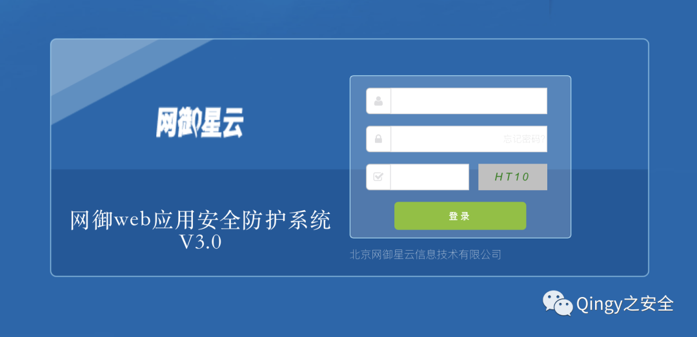
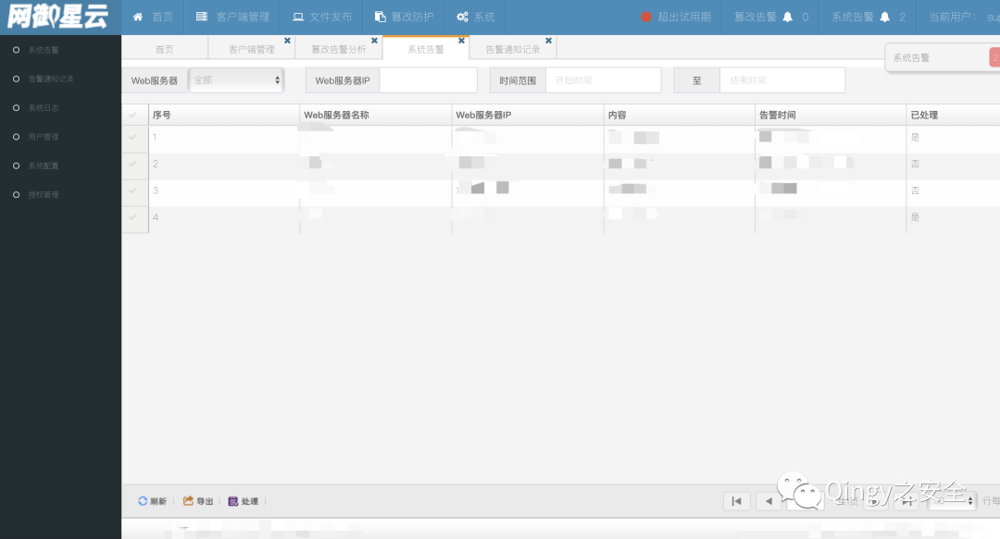
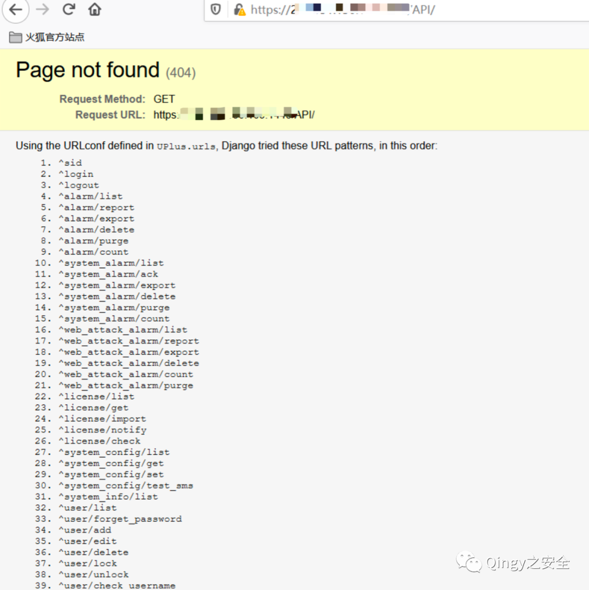
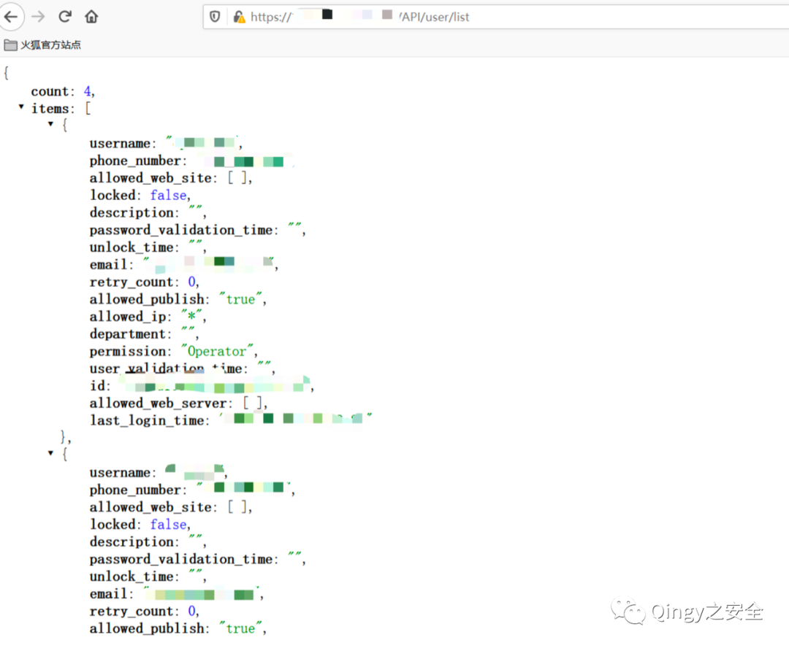
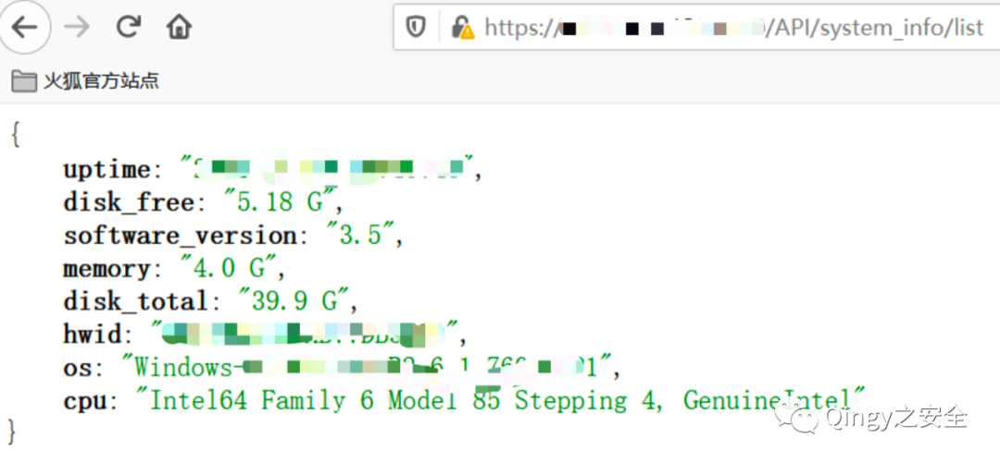
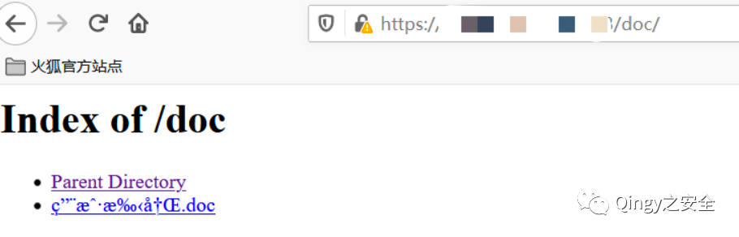
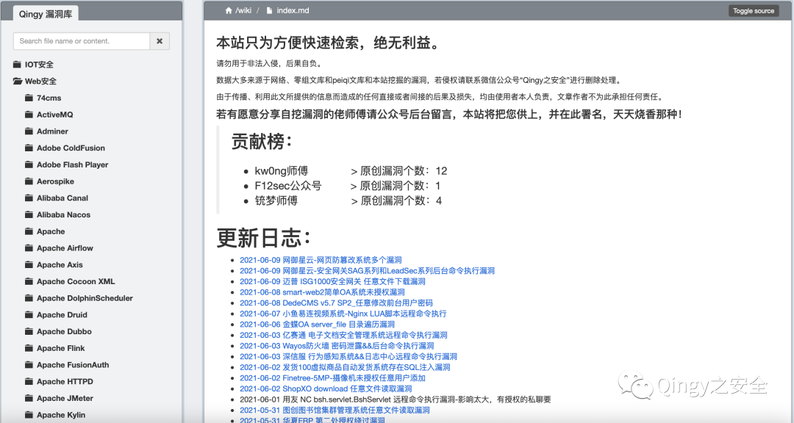
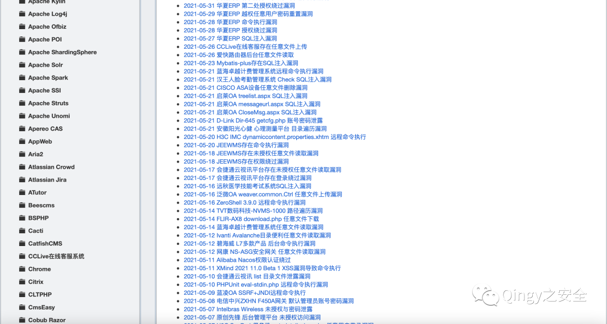
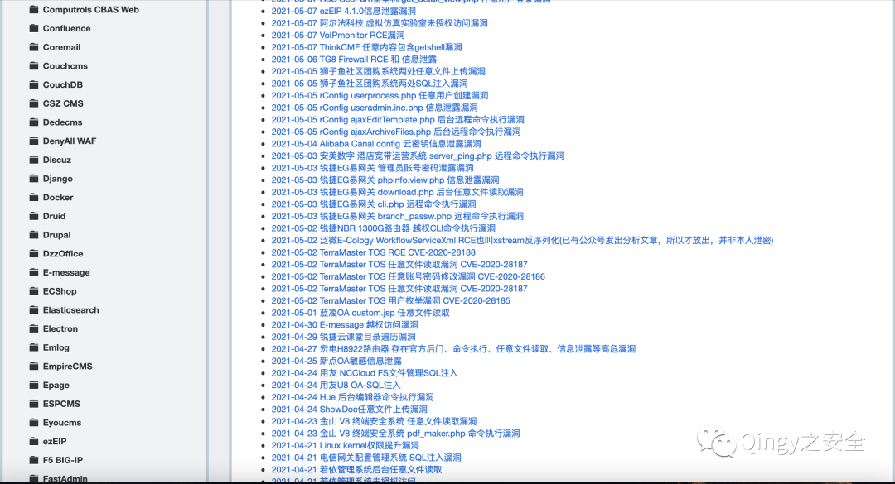

# 网御星云 - 网页防篡改系统古老版本多个漏洞

<!-- article-review:devices:begin -->
## 技术校订与证据边界（2026-10-02）

- 产品/组件：网御星云网页防篡改/Web应用安全防护系统
- 本文讨论：API/user/list、system_info/list泄露；默认凭据；目录索引
- 版本、权限与配置前提：称古老版本，指纹v3.0但无build
- 资料类型：默认口令/未授权API/目录列表聚合；本次仅核对归档正文，未执行 PoC、未请求目标，未把原作者的“复现成功”继承为本库验证结果

### 逐项校订

- /doc/images/audio/fonts只是目录列表，无越界路径，不支持路径遍历定性
- 弱口令及四角色范围未给厂商依据；具体泄露字段仅截图
- 长授权推广掩盖正文，无修复版本

### 操作风险与恢复

- 读取内容可能包含配置、账户或个人数据；应只保存授权环境中最小必要的响应，不能由接口可达推定敏感内容已泄露

### 待核与来源

- 产品精确名称、版本、API权限及目录敏感性待确认
- 引用图片未查看，截图内容及有效性待核验
- 文内原始链接和图片引用继续保留；未检查图片像素、未下载或执行外部附件。版本边界、修复/在野状态及厂商归属若缺一手依据，均不能视为本次已确认
- 下方保留原技术正文与载荷；其中历史时间表述和成功主张应按本节限定阅读
<!-- article-review:devices:end -->


<meta name="referrer" content="no-referrer"/>

> 本文由 [简悦 SimpRead](http://ksria.com/simpread/) 转码， 原文地址 [mp.weixin.qq.com](https://mp.weixin.qq.com/s/WUW3jMQdOWOqvZj2gC7lYQ)

**1、描述**

  

网御星云网页防篡改系统，没啥好介绍的都懂，就是网页被篡改后能自动恢复的设备，存在弱口令，未授权信息泄露，遍历等漏洞。

  

  

  

  

  

**2、影响范围**

  

网御星云网页防篡改系统较古老的版本

  

  

  

  

  

**3、FOFA**

  

title = "网御 web 应用安全防护系统 v3.0"

title = "网页防篡改系统"

  

  

  

  

  

漏洞复现

登录页面如下：



弱口令：

```
super(超级管理员)
admin(系统管理员)
operator(操作员)
viewer(审查员)
密码都是：Admin%100
```



### 未授权信息泄露：

#### 报错界面暴露接口地址

```
URL+/API/
```

#### 

账号信息泄露

```
URL+/API/user/list
```



系统信息泄露

```
URL+/API/system_info/list
```



还可以进行目录遍历：

```
URL+/doc/
URL+/images/
URL+/audio/
URL+/fonts/
```



最后再说一下漏洞文库已经添加授权访问，地址:wiki.xypbk.com

获取授权方式为公众号后台回复：文库授权  

    为防止黑产份子的非法利用漏洞，不给国家安全添麻烦，本站从此开启授权访问，形式以每人单独授权发放，限量 1000 人，请勿分享您获取的账号密码，账号密码具都采用随机生成的 32 位 MD5，还请牢记。

    如若因漏洞利用产生重大影响，会根据登录 IP、请求内容、申请授权等信息进行查证，查证后将对号主进行追责，故不要分享账号，终害己身。  

    虽然比较麻烦了些，但会稍微对黑产份子有一些限制，保证了本站安全，也保证国家安全。同时有些敏感东西也能第一时间放出来了，还请大家谅解。

    同时本站承诺永远不会出现买卖账号等利益相关的事情，本站永不割韭菜，永久免费检索，坚决抵制安全圈的歪风邪气。

    最后，若大家对此有意见请后台留言，本站将及时改正，若内容有侵犯您的权益，请及时提出，进行删除处理。  

    本站能坚持多久全看大家是否滥用，内容若更新较慢也请谅解，本人有工作有生活，会尽量坚持更新的。







本站不开源，因为想控制影响范围，若因某些人乱搞，造成了严重后果，本站将即刻关闭。

漏洞库内容来源于互联网 && 零组文库 &&peiqi 文库 && 自挖漏洞 && 乐于分享的师傅，供大家方便检索，绝无任何利益。  

由于传播、利用此文所提供的信息而造成的任何直接或者间接的后果及损失，均由使用者本人负责，文章作者不为此承担任何责任。

若有愿意分享自挖漏洞的佬师傅请公众号后台留言，本站将把您供上，并在此署名，天天烧香那种！

  


扫取二维码获取

更多精彩


Qingy 之安全  


点个在看你最好看

---

> 来源：MrWQ/vulnerability-paper（https://github.com/MrWQ/vulnerability-paper）
